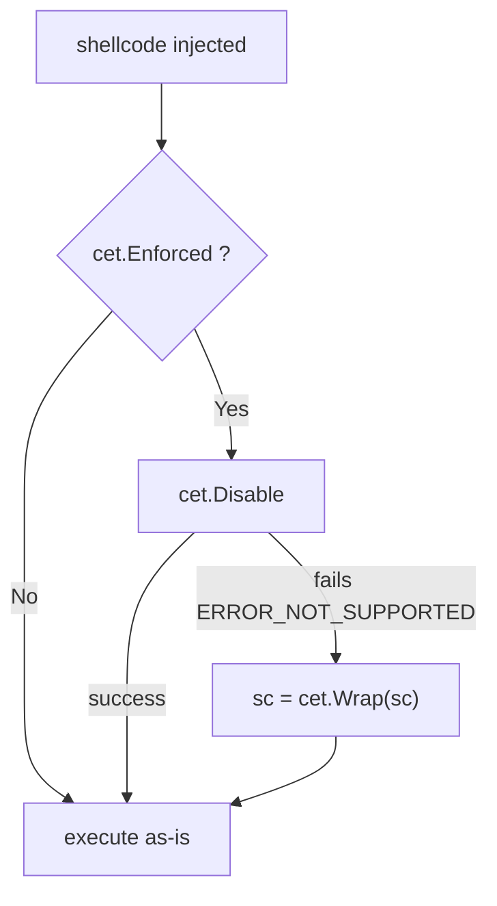

# Intel CET shadow-stack opt-out

[← evasion index](README.md) · [docs/index](../../index.md)

## TL;DR

On Intel CET-capable Windows 11+ hosts, indirect call/return targets
must begin with the ENDBR64 instruction (`F3 0F 1E FA`). Code that
violates this is killed with `STATUS_STACK_BUFFER_OVERRUN` (0xC000070A).
This package: detect (`Enforced`), opt out (`Disable`), or marker-
prefix shellcode (`Wrap`) so it survives CET-enforced indirect dispatch.

## Primer

Control-flow Enforcement Technology is Intel's hardware-level mitigation
against ROP / JOP / COP attacks. The shadow stack tracks legitimate call
return addresses; the indirect-branch tracker requires ENDBR64 at every
indirect call destination. Both are enabled per-process via the
`ProcessUserShadowStackPolicy` mitigation.

For maldev, the most-impactful CET site is `KiUserApcDispatcher`. APC-
delivered shellcode (used by injection methods like
`NtNotifyChangeDirectory`-callback, fiber callback, etc.) executes via
indirect dispatch. If the shellcode doesn't start with ENDBR64, CET
kills the process.

Three complementary tools:

- `Enforced()` reports whether the policy is active. **Cheap; call this
  first** before deciding between Disable and Wrap.
- `Disable()` is best-effort relax — fails when the image was compiled
  with `/CETCOMPAT` (the Go runtime currently is NOT, but
  `/CETCOMPAT`-compiled DLLs you might host can opt the process in).
- `Wrap(sc)` prepends the ENDBR64 marker if not present. Side-effect-
  free, idempotent. Safe to call unconditionally.

## How it works



Disable issues `SetProcessMitigationPolicy(ProcessUserShadowStackPolicy,
{Enable: 0, ...})`. The kernel rejects the relax if any module in the
process has `IMAGE_DLLCHARACTERISTICS_EX_CET_COMPAT` set.

Wrap is a pure byte-level operation: prepend `F3 0F 1E FA` to the
shellcode buffer if the first 4 bytes don't already match.

## API → godoc

[`pkg.go.dev/github.com/oioio-space/maldev/evasion/cet`](https://pkg.go.dev/github.com/oioio-space/maldev/evasion/cet) is the authoritative
reference for every exported symbol. This page teaches the
*concepts*; the godoc is the *specification*.

## Examples

### Simple

```go
sc := []byte{0x90, 0x90, 0xc3} // nop nop ret
sc = cet.Wrap(sc)              // now 7 bytes: F3 0F 1E FA 90 90 C3
```

### Composed — runtime decision

```go
if cet.Enforced() {
    if err := cet.Disable(); err != nil {
        sc = cet.Wrap(sc)
    }
}
```

### Advanced (chain into APC injection)

```go
sc := loadShellcode()
if cet.Enforced() {
    if err := cet.Disable(); err != nil {
        sc = cet.Wrap(sc)
    }
}
// CallbackNtNotifyChangeDirectory invokes the shellcode via
// KiUserApcDispatcher — without the marker on a CET host, this would
// die with STATUS_STACK_BUFFER_OVERRUN.
_ = inject.ExecuteCallback(sc, inject.CallbackNtNotifyChangeDirectory)
```

## OPSEC & Detection

| Artefact | Where defenders look |
|---|---|
| `SetProcessMitigationPolicy(ProcessUserShadowStackPolicy)` call | ETW TI Threat Intelligence + Defender ASR provider events |
| Process began with policy enforced, ended without | ETW per-process mitigation lifecycle |
| ENDBR64-prefixed shellcode in injected memory | EDR memory scanner — distinctive 4-byte pattern at RWX page starts |

**D3FEND counter:** [D3-PSEP](https://d3fend.mitre.org/technique/d3f:ProcessSelfModification/).

**Hardening:** treat `SetProcessMitigationPolicy` calls as high-fidelity
signal in process-spawn telemetry. The ENDBR64 prefix on injected
memory is a reasonable secondary heuristic.

## MITRE ATT&CK

| T-ID | Name | Sub-coverage | D3FEND counter |
|---|---|---|---|
| [T1562.001](https://attack.mitre.org/techniques/T1562/001/) | Impair Defenses: Disable or Modify Tools | shadow-stack policy relax + marker prefix | D3-PSEP |

## Limitations

- **`Disable` fails on `/CETCOMPAT` images.** The Go runtime today is
  not, but a `/CETCOMPAT` DLL loaded into the process locks the policy
  on. `Wrap` is the always-available fallback.
- **`Wrap` doesn't help with shadow-stack misalignment.** Only the
  indirect-branch tracker is bypassed by ENDBR64. The shadow stack
  catches return-address mismatches; if your callback returns to a
  non-pristine RSP, CET still kills the process.
- **Pre-Win11 hosts have no CET.** `Enforced()` returns `false`; both
  `Disable` and `Wrap` are no-ops. Calling them is harmless.
- **Non-Intel-CET CPUs** (older Intel Skylake/Cascade Lake, all AMD
  before Zen 4) have no CET hardware. `Enforced()` returns `false`.

## See also

- [`inject`](../injection/README.md) — APC paths require Marker on
  Win11+CET hosts.
- [Microsoft — CET shadow-stack overview](https://learn.microsoft.com/windows-hardware/drivers/devtest/control-flow-enforcement-technology).
- [Intel — CET specification](https://software.intel.com/sites/default/files/managed/4d/2a/control-flow-enforcement-technology-preview.pdf).
- [Connor McGarr — CET internals](https://connormcgarr.github.io/cet/).
