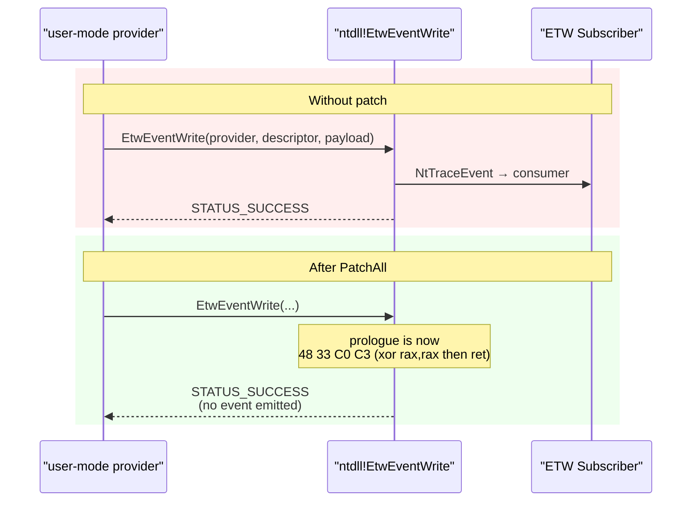

# ETW patching

[← evasion index](README.md) · [docs/index](../../index.md)

## TL;DR

Overwrite the prologue of `ntdll.dll`'s ETW write helpers
(`EtwEventWrite`, `EtwEventWriteEx`, `EtwEventWriteFull`,
`EtwEventWriteString`, `EtwEventWriteTransfer`) with
`xor rax,rax; ret`. Any ETW provider in the process emits zero events
while still receiving STATUS_SUCCESS.

## Primer

Event Tracing for Windows is the primary telemetry pipeline of the
Windows kernel — every EDR, every audit policy, every Defender
real-time component subscribes to it. User-mode providers in the
current process route their events through the five `EtwEvent*` write
functions in `ntdll.dll`. Patching those five functions to be no-ops
silences ETW for the process: no provider can publish, regardless of
what `EventRegister` returned.

The `NtTraceEvent` syscall sits one layer below the user-mode helpers.
A few EDRs direct-call it to bypass the user-mode patch — hence the
companion `PatchNtTraceEvent` for the kernel-call layer.

> [!NOTE]
> ETW Threat Intelligence (`Microsoft-Windows-Threat-Intelligence`) is
> a kernel-side ETW channel that this patch does NOT silence —
> kernel-mode events emitted by `EtwTraceEvent` (kernel form) still
> reach subscribers. The patch covers user-mode emission only.

## How it works



For each of the five functions:

1. `GetProcAddress(ntdll, "EtwEventWrite*")`.
2. `NtProtectVirtualMemory(addr, 4, PAGE_EXECUTE_READWRITE)` via the
   supplied `*Caller`.
3. memcpy `48 33 C0 C3` (xor rax, rax; ret).
4. `NtProtectVirtualMemory(addr, 4, original)`.

`PatchNtTraceEvent` does the same for `NtTraceEvent` with a single RET.

## API → godoc

[`pkg.go.dev/github.com/oioio-space/maldev/evasion/etw`](https://pkg.go.dev/github.com/oioio-space/maldev/evasion/etw) is the authoritative
reference for every exported symbol. This page teaches the
*concepts*; the godoc is the *specification*.

## Examples

### Simple

```go
caller := wsyscall.New(wsyscall.MethodIndirect, nil)
if err := etw.PatchAll(caller); err != nil {
    log.Fatal(err)
}
// User-mode ETW providers in this process emit nothing now.
```

### Composed (with `evasion.amsi`)

```go
caller := wsyscall.New(wsyscall.MethodIndirect, nil)
_ = evasion.ApplyAll([]evasion.Technique{
    amsi.All(),
    etw.All(),
}, caller)
```

### Advanced (NtTraceEvent for stubborn EDRs)

```go
caller := wsyscall.New(wsyscall.MethodIndirect, nil)
_ = etw.PatchAll(caller)            // user-mode helpers
_ = etw.PatchNtTraceEvent(caller)   // kernel-call layer
```

## OPSEC & Detection

| Artefact | Where defenders look |
|---|---|
| 5 × `NtProtectVirtualMemory(ntdll, RWX)` | ETW TI `EVENT_TI_NTPROTECT` — same channel as AMSI patch detection |
| 4 bytes of each `EtwEvent*` differ from on-disk image | EDR memory-integrity scanning |
| Process registered an ETW provider but emits zero events | Kernel-side ETW provider-volume monitoring |
| Per-provider event-count drops to zero mid-process | Process-lifecycle ETW analytics |

**D3FEND counter:** [D3-PMC](https://d3fend.mitre.org/technique/d3f:ProcessModuleCodeManipulation/).

**Hardening:** subscribe to ETW Threat Intelligence in user-mode SIEM
collection — even if the patched process emits nothing, the
`NtProtectVirtualMemory` flips that installed the patch are visible in
TI.

## MITRE ATT&CK

| T-ID | Name | Sub-coverage | D3FEND counter |
|---|---|---|---|
| [T1562.001](https://attack.mitre.org/techniques/T1562/001/) | Impair Defenses: Disable or Modify Tools | user-mode ETW write functions + optional NtTraceEvent | D3-PMC |

## Limitations

- **Per-process only.** Other processes still emit events normally.
- **Doesn't silence kernel-side ETW providers** (Microsoft-Windows-
  Threat-Intelligence, Microsoft-Windows-Kernel-Process). Those emit
  from kernel mode regardless of user-mode patches.
- **EDR may rescan `ntdll.dll`** every N seconds; the patch is detectable
  if rescans are on.
- **The four-byte prologue overwrite assumes x86_64.** ARM64 ntdll has
  different prologues; the package's current code is amd64-only.

## See also

- [`evasion/amsi`](amsi-bypass.md) — sibling defence-impair.
- [`evasion/unhook`](ntdll-unhooking.md) — restore ntdll first.
- [modexp — Disabling ETW](https://www.modexp.wtf/2020/04/disabling-etw-tracelogging.html) — original reference.
- [Microsoft — Event Tracing for Windows](https://learn.microsoft.com/windows/win32/etw/event-tracing-portal).
