---
---

# ntdll Unhooking

> **MITRE ATT&CK:** T1562.001 -- Impair Defenses: Disable or Modify Tools | **D3FEND:** D3-HBPI -- Hook-Based Process Instrumentation | **Detection:** High

## TL;DR

EDR products patch the first bytes of NTAPI functions in
`ntdll.dll` so they can intercept your syscalls. Unhooking
restores the original bytes from a clean source so your calls
go straight to the kernel without EDR interception.

Three methods, increasing footprint and stealth:

| Method | What it does | Cost | When to pick |
|---|---|---|---|
| [`ClassicUnhook`](#classicunhookname-string-opener-stealthopenopener-caller-wsyscallcaller-error) | Restores 5 bytes of ONE named function from on-disk `ntdll.dll` | Smallest. ~3 reads + 1 write per function. | You know exactly which API the EDR hooked (e.g., `NtAllocateVirtualMemory`). Good with [`unhook.CommonClassic`](#commonclassic-technique) (10 known-hooked functions). |
| [`FullUnhook`](#fullunhookopener-stealthopenopener-caller-wsyscallcaller-error) | Replaces the entire `.text` section of `ntdll.dll` from disk | Larger. One big write. | You don't know which functions are hooked, or you want all of them clean at once. |
| [`PerunUnhook`](#perununhookcaller-wsyscallcaller-error) | Reads a clean `.text` from a freshly-spawned suspended process | Largest. Spawns a child process. | You can't read `ntdll.dll` from disk (path-blocking minifilter, EDR catches the open). |

What this DOES achieve:

- Your subsequent NTAPI calls go straight to `syscall` without
  EDR's hook code running.
- For Classic / Full, paired with a `stealthopen.Opener`,
  even the on-disk read of `ntdll.dll` bypasses path-keyed
  filters.

What this does NOT achieve:

- **Doesn't unhook every defender** — kernel-mode callbacks
  (`PsSetCreateProcessNotifyRoutine` family) still fire. See
  [`evasion/kernel-callback-removal`](kernel-callback-removal.md).
- **Doesn't survive re-hooking** — some EDRs install a periodic
  re-hook timer. Unhook then act fast; don't expect persistence.
- **Detectable**: the unhook write itself is observable. EDR
  agents that hash their own hooks alert when the bytes change.

## Primer — vocabulary

Five terms recur on this page:

> **Hook** — an inline patch (typically a `JMP rel32`) the EDR
> writes at the start of a target function so that calls to it
> divert into the EDR's monitoring code first. The original
> bytes are saved in a "trampoline" the EDR uses to call through
> after logging.
>
> **Prologue** — the first few bytes of a function's machine
> code. EDR hooks rewrite these bytes; unhooking restores them.
> Typical hook patch is 5 bytes (one `JMP rel32`); some advanced
> EDRs use 14-byte absolute jumps.
>
> **`.text` section** — the executable code section of a PE.
> Contains the bytes for every function in the module. Full
> unhooking replaces this entire section in the in-memory image.
>
> **`stealthopen.Opener`** — interface from
> [`evasion/stealthopen`](stealthopen.md) that opens a file by
> NTFS Object ID instead of by path. Pass to Classic/Full
> unhook to make the on-disk read of `ntdll.dll` invisible to
> path-keyed minifilters.
>
> **ASLR** — Address Space Layout Randomization. Most modules
> get randomised base addresses, but `ntdll.dll`'s base is set
> ONCE per boot and shared across all processes. That's why
> Perun works: the suspended child's `ntdll` lives at the same
> address as your own, byte-for-byte clean.

## Primer — the analogy

When a security guard is worried about a specific door, they install a tripwire across it. Anyone who walks through triggers an alarm, and the guard knows exactly who passed and when. The door still works normally -- it just has an invisible wire that reports activity.

EDR products do the same thing to Windows API functions. When your process starts, the EDR modifies the first few bytes of critical functions in `ntdll.dll` (the lowest-level user-mode library) to redirect them through the EDR's own monitoring code. This is called "hooking." When you call `NtAllocateVirtualMemory`, the hook intercepts the call, logs it, decides whether to allow it, and then either passes it through to the real function or blocks it.

Unhooking is finding the original blueprints for the door (the clean `ntdll.dll` from disk or from another process) and rebuilding the door without the tripwire. Once the hooks are removed, your API calls go directly to the kernel without EDR interception.

maldev provides three unhooking methods with increasing sophistication:

1. **Classic** -- Restore just the first 5 bytes of a specific function from the on-disk copy.
2. **Full** -- Replace the entire `.text` section of ntdll from the disk copy, removing ALL hooks at once.
3. **Perun** -- Read a pristine ntdll from a freshly-spawned suspended process (avoids reading from disk entirely).

## How It Works

```mermaid
flowchart TD
    subgraph Classic["Classic Unhook"]
        C1[Read ntdll.dll from disk] --> C2[Parse PE exports]
        C2 --> C3[Find target function offset]
        C3 --> C4[Read first 5 clean bytes]
        C4 --> C5[Overwrite hooked bytes in memory]
    end

    subgraph Full["Full Unhook"]
        F1[Read ntdll.dll from disk] --> F2[Parse PE sections]
        F2 --> F3[Extract entire .text section]
        F3 --> F4[VirtualProtect .text → RWX]
        F4 --> F5[Overwrite entire .text in memory]
        F5 --> F6[Restore .text protection]
    end

    subgraph Perun["Perun Unhook"]
        P1[CreateProcess notepad.exe SUSPENDED] --> P2[Read child's ntdll .text via ReadProcessMemory]
        P2 --> P3[Overwrite our .text with child's clean copy]
        P3 --> P4[TerminateProcess child]
    end

    style C5 fill:#2d5016,color:#fff
    style F5 fill:#2d5016,color:#fff
    style P3 fill:#2d5016,color:#fff
```



**Classic Unhook** -- Targeted, surgical:
1. Read `ntdll.dll` from `System32` on disk (never hooked).
2. Parse the PE export directory to find the target function's file offset.
3. Read the first 5 bytes (the typical hook trampoline size).
4. Overwrite the hooked in-memory bytes with the clean disk copy via `PatchMemoryWithCaller`.

**Full Unhook** -- Scorched earth:
1. Read `ntdll.dll` from disk and parse the PE to find the `.text` section.
2. Extract the entire `.text` section bytes.
3. `VirtualProtect` the in-memory `.text` to `PAGE_EXECUTE_READWRITE`.
4. `WriteProcessMemory` (or `NtWriteVirtualMemory` via Caller) to overwrite the entire section.
5. Restore original protection.

**Perun Unhook** -- Disk-free:
1. Spawn `notepad.exe` (or configurable target) in `CREATE_SUSPENDED | CREATE_NO_WINDOW` state.
2. ntdll is loaded at the same base address in all processes (ASLR is per-boot). Read the child's pristine `.text` via `ReadProcessMemory`.
3. Overwrite the local hooked `.text` with the clean copy.
4. Terminate the child process.

## Usage

```go
package main

import (
    "log"

    "github.com/oioio-space/maldev/evasion/unhook"
)

func main() {
    // Classic: unhook a single function. 3rd arg is an optional
    // stealthopen.Opener — nil = path-based read of ntdll.dll; pass a
    // *stealthopen.Stealth to bypass path-based EDR hooks on that open.
    if err := unhook.ClassicUnhook("NtAllocateVirtualMemory", nil, nil); err != nil {
        log.Fatal(err)
    }

    // Full: unhook ALL ntdll functions at once. Same Opener semantics.
    if err := unhook.FullUnhook(nil, nil); err != nil {
        log.Fatal(err)
    }

    // Perun: unhook from a child process (no disk read).
    if err := unhook.PerunUnhook(nil); err != nil {
        log.Fatal(err)
    }

    // Perun with custom host process.
    if err := unhook.PerunUnhookTarget("svchost.exe", nil); err != nil {
        log.Fatal(err)
    }
}
```

## Combined Example

```go
package main

import (
    "log"

    "github.com/oioio-space/maldev/evasion"
    "github.com/oioio-space/maldev/evasion/amsi"
    "github.com/oioio-space/maldev/evasion/etw"
    "github.com/oioio-space/maldev/evasion/unhook"
    "github.com/oioio-space/maldev/inject"
    wsyscall "github.com/oioio-space/maldev/win/syscall"
)

func main() {
    shellcode := []byte{0x90, 0x90, 0xCC}

    // Use indirect syscalls for the unhooking itself.
    caller := wsyscall.New(wsyscall.MethodIndirect,
        wsyscall.Chain(wsyscall.NewHellsGate(), wsyscall.NewHalosGate()))

    // Layer evasion: blind telemetry first, THEN unhook.
    // Order matters: ETW patch prevents logging of the unhook operation.
    techniques := []evasion.Technique{
        amsi.ScanBufferPatch(),
        etw.All(),
        unhook.Full(),  // or unhook.CommonClassic()... for selective
    }
    if errs := evasion.ApplyAll(techniques, caller); errs != nil {
        for name, err := range errs {
            log.Printf("%s: %v", name, err)
        }
    }

    // After unhooking, all NT calls go directly to kernel.
    injector, err := inject.Build().
        Method(inject.MethodCreateRemoteThread).
        TargetPID(1234).
        Create()
    if err != nil {
        log.Fatal(err)
    }
    injector.Inject(shellcode)
}
```

## Advantages & Limitations

| Aspect | Detail |
|--------|--------|
| Stealth (Classic) | Medium -- only touches one function. Minimal disk I/O. |
| Stealth (Full) | Low -- reads entire ntdll from disk, massive memory write. Very visible. |
| Stealth (Perun) | Medium-High -- no disk read, but spawning a child process is logged. |
| Effectiveness | High -- completely removes userland hooks. After unhooking, EDR loses visibility into hooked APIs. |
| Caller routing | All three methods support `*wsyscall.Caller` for the protection/write phase, bypassing potential hooks on VirtualProtect and WriteProcessMemory themselves. |
| Detection vectors | Disk read of ntdll.dll (Full/Classic), child process spawn (Perun), memory integrity checks before/after, ETW events for VirtualProtect on ntdll pages. |
| Limitations | Does not affect kernel-level hooks (minifilters, callbacks). Does not remove hooks set after the unhook operation. Some EDRs re-hook periodically. |

## API → godoc

[`pkg.go.dev/github.com/oioio-space/maldev/evasion/unhook`](https://pkg.go.dev/github.com/oioio-space/maldev/evasion/unhook) is the authoritative
reference for every exported symbol. This page teaches the
*concepts*; the godoc is the *specification*.

## See also

- [Evasion area README](README.md)
- [`evasion/hook`](inline-hook.md) — symmetric primitive: install your own hooks once EDR's are removed
- [`evasion/preset`](preset.md) — Stealth preset includes `unhook.FullUnhook` as the first step
- [`win/syscall`](../syscalls/direct-indirect.md) — direct/indirect syscalls bypass hooks without restoring them
