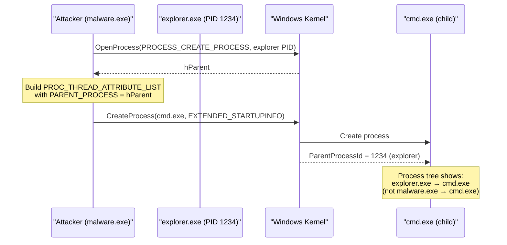

---
---

# PPID Spoofing

> **MITRE ATT&CK:** T1134.004 -- Access Token Manipulation: Parent PID Spoofing | **Detection:** Medium -- Process tree anomalies are detectable but require behavioral analysis

## TL;DR

When you spawn a child process, Windows records WHO spawned it
(`ParentProcessId` field). EDRs use this for detection: `cmd.exe`
spawned by `explorer.exe` looks normal; `cmd.exe` spawned by
`excel.exe` triggers a macro-attack alert.

PPID spoofing lies about the parent. The child appears in
Process Hacker / Sysmon / EDR telemetry as if a chosen
"benign" process spawned it.

| You want… | Use | Cost |
|---|---|---|
| Spoof PPID using the Go-1.24+ syscall.SysProcAttr.ParentProcess field | [`shell.NewPPIDSpoofer`](#shellnewppidspoofer) + `FindTargetProcess` + `SysProcAttr` | One `OpenProcess(PROCESS_CREATE_PROCESS)` call to the target parent |
| Use a specific parent PID (you already have one in mind) | `spoofer.SetTargetPID(pid)` then proceed as above | Same cost |

What this DOES achieve:

- Process tree shown in Process Hacker / Sysmon EID 1 /
  Get-Process tree all show the spoofed parent.
- Pattern-matching detections (`excel.exe → cmd.exe`,
  `winword.exe → powershell.exe`) miss your child entirely.
- Token, working directory, environment all unaffected — the
  child runs as YOUR user, not the spoofed parent's user. The
  lie is purely cosmetic on the parent field.

What this does NOT achieve:

- **Doesn't elevate** — your `OpenProcess` to the spoofed
  parent must succeed. You can only spoof to parents you can
  open with `PROCESS_CREATE_PROCESS`. Same-integrity targets
  (other Medium IL processes) work; SYSTEM targets need
  SeDebugPrivilege.
- **Doesn't fool stack walking** — EDRs that walk the calling
  thread's stack on `NtCreateUserProcess` see YOUR process
  doing the spawn. Pair with [`evasion/callstack-spoof`](callstack-spoof.md)
  for that.
- **Doesn't fool ETW Provider Microsoft-Windows-Kernel-Process** —
  this provider logs the actual creator (the process that
  called `NtCreateUserProcess`), not the recorded parent. EDRs
  subscribed to it cross-check.
- **Doesn't survive deep telemetry** — Sysmon's `ParentProcessGuid`
  field can be cross-referenced; sophisticated detection
  notices when the spoofed-parent's known children profile
  doesn't match.

## Primer — vocabulary

Five terms recur on this page:

> **PPID (Parent Process ID)** — the PID stored in a child
> process's `EPROCESS.InheritedFromUniqueProcessId` field. Set
> by the kernel from `PROC_THREAD_ATTRIBUTE_PARENT_PROCESS`
> at process-create time, OR (default) from the calling
> process's PID.
>
> **`PROC_THREAD_ATTRIBUTE_PARENT_PROCESS`** — the Win32
> `STARTUPINFOEX.lpAttributeList` slot that overrides PPID
> for a `CreateProcess` call. Legitimate API — Microsoft uses
> it for service hosting. The presence of this attribute is
> NOT itself suspicious.
>
> **`PROCESS_CREATE_PROCESS` access right** — the minimum
> handle right needed on the spoofed parent. Less than
> `PROCESS_ALL_ACCESS` (so the OpenProcess audit signal is
> weaker). Most user-mode processes grant this to the same
> user.
>
> **Process tree** — the hierarchical view Process Hacker /
> Process Explorer / Sysmon EID 1 reconstruct from PPIDs.
> Spoofing rewrites where your child appears in this view.
>
> **`SysProcAttr.ParentProcess`** — Go 1.24+ field on
> `syscall.SysProcAttr` that handles all the
> `PROC_THREAD_ATTRIBUTE_LIST` plumbing. Pre-1.24 you had to
> roll the attribute list manually.

## Primer

When a process creates a child process on Windows, the child inherits its parent's identity in the process tree. Security tools use this parent-child relationship as a key detection signal. For example, if `cmd.exe` is spawned by `explorer.exe`, that looks normal -- the user opened a command prompt. But if `cmd.exe` is spawned by `excel.exe`, that is highly suspicious and likely indicates a macro-based attack.

PPID spoofing breaks this detection by lying about the parent. When creating a child process, we use the `PROC_THREAD_ATTRIBUTE_PARENT_PROCESS` attribute to specify a different parent process handle. The child process appears in the process tree as if it was spawned by the chosen parent (e.g., `explorer.exe` or `svchost.exe`), even though our process actually created it.

This is a legitimate Windows API feature -- Go 1.24+ even added native support via `syscall.SysProcAttr.ParentProcess`.

## How It Works



**Step-by-step:**

1. **Find target parent** -- Enumerate running processes to find a suitable legitimate parent (e.g., `explorer.exe`, `svchost.exe`).
2. **OpenProcess(PROCESS_CREATE_PROCESS)** -- Open the target with the minimum right needed for PPID spoofing.
3. **Build SysProcAttr** -- Set `ParentProcess` to the opened handle. Go 1.24+ handles the `PROC_THREAD_ATTRIBUTE_LIST` plumbing automatically.
4. **CreateProcess** -- Spawn the child process. Windows sets the child's `ParentProcessId` to the target, not the actual creator.

## Default Targets

maldev searches for these processes in order (first match wins):

| Process | Why |
|---------|-----|
| `explorer.exe` | Every interactive session has one. Most natural parent for user-facing apps. |
| `svchost.exe` | Dozens of instances. Services spawning children is normal. |
| `sihost.exe` | Shell Infrastructure Host. Present in every session. |
| `RuntimeBroker.exe` | UWP broker. Common, low-profile parent. |

## Usage

```go
package main

import (
    "fmt"
    "os/exec"

    "golang.org/x/sys/windows"

    "github.com/oioio-space/maldev/c2/shell"
)

func main() {
    spoofer := shell.NewPPIDSpoofer()

    if err := spoofer.FindTargetProcess(); err != nil {
        panic(err)
    }
    fmt.Printf("Spoofing parent to PID %d\n", spoofer.TargetPID())

    attr, parentHandle, err := spoofer.SysProcAttr()
    if err != nil {
        panic(err)
    }
    defer windows.CloseHandle(parentHandle)

    cmd := exec.Command("cmd.exe", "/c", "whoami")
    cmd.SysProcAttr = attr
    out, err := cmd.Output()
    if err != nil {
        panic(err)
    }
    fmt.Printf("Output: %s\n", out)
}
```

## Custom Targets

```go
// Target a specific process
spoofer := shell.NewPPIDSpooferWithTargets([]string{"winlogon.exe"})

if err := spoofer.FindTargetProcess(); err != nil {
    // winlogon.exe requires SeDebugPrivilege to open
    panic(err)
}
```

## Integration with Reverse Shell

The PPID spoofer integrates naturally with `c2/shell` for reverse shell scenarios:

```go
// The reverse shell can spawn under a spoofed parent,
// making the shell process appear as a child of explorer.exe
// in EDR process trees.
spoofer := shell.NewPPIDSpoofer()
spoofer.FindTargetProcess()
attr, handle, _ := spoofer.SysProcAttr()
defer windows.CloseHandle(handle)

cmd := exec.Command("cmd.exe")
cmd.SysProcAttr = attr
// ... bind to transport
```

## Advantages & Limitations

| Aspect | Detail |
|--------|--------|
| Stealth | Medium -- fools basic process tree analysis, but advanced EDR can correlate the real creator via ETW `ProcessStart` events or kernel callbacks. |
| Compatibility | Windows Vista+ (PROC_THREAD_ATTRIBUTE_PARENT_PROCESS). Go 1.24+ for native `SysProcAttr.ParentProcess`. |
| Privileges | `PROCESS_CREATE_PROCESS` on the target parent. For system processes (`winlogon.exe`, `lsass.exe`), `SeDebugPrivilege` is required. |
| Exploit Guard | Windows Exploit Guard / ASR rules can block PPID spoofing on hardened systems (Windows 10 22H2+). The test SKIPs in this case. |
| Scope | Only affects the parent PID in the process tree. The child still inherits the *creator's* token unless explicit token manipulation is also performed. |
| Go 1.24+ | Uses native `syscall.SysProcAttr.ParentProcess` -- no CGO, no manual attribute list management. |

## Detection

Defenders can detect PPID spoofing via:

1. **ETW ProcessStart events** -- The `CreatingProcessId` field in the kernel event shows the real creator, not the spoofed parent.
2. **Handle table analysis** -- The creator must have an open handle to the target parent with `PROCESS_CREATE_PROCESS`.
3. **Behavioral anomalies** -- A child process's token/session doesn't match the supposed parent's session.
4. **Sysmon Event ID 1** -- `ParentProcessId` vs `ParentProcessGuid` can reveal mismatches.

## API → godoc

[`pkg.go.dev/github.com/oioio-space/maldev/process/spawn`](https://pkg.go.dev/github.com/oioio-space/maldev/process/spawn) is the authoritative
reference for every exported symbol. This page teaches the
*concepts*; the godoc is the *specification*.

## See also

- [Evasion area README](README.md)
- [`process` techniques (index)](../process/README.md) — sibling process-tampering primitives
- [`process/tamper/fakecmd`](../process/fakecmd.md) — companion lineage-spoof: pretty up the spawned child's CommandLine
