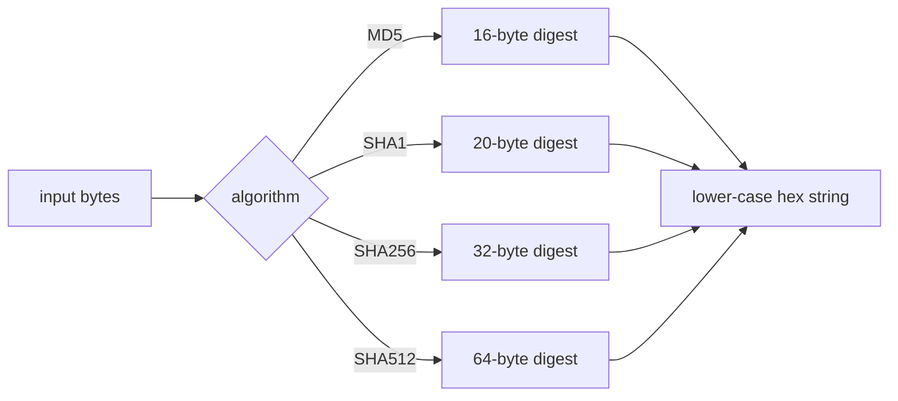
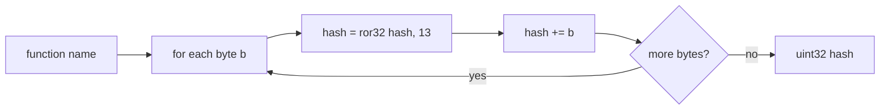

# Cryptographic hashes & ROR13

[← hash index](README.md) · [docs/index](../../index.md)

## TL;DR

Two distinct use cases under one roof:

| You want to… | Use | Output |
|---|---|---|
| Fingerprint a buffer (integrity, identifier) | [`SHA256`](#sha256), [`SHA512`](#sha512), [`MD5`](#md5), [`SHA1`](#sha1) | hex string |
| Compute a Win32 API name hash for a shellcode resolver | [`ROR13`](#ror13) | uint32 — match against `pe/imports.List` outputs |
| Compute a module-name hash matching PEB-walk shellcode | [`ROR13Module`](#ror13module) | uint32 — pre-uppercased + UTF-16LE per shellcode convention |

What this DOES achieve:

- One-shot calls — `hash.SHA256(data)` returns the hex string
  directly. No `hex.EncodeToString(h.Sum(nil))` chaining.
- ROR13 matches the canonical shellcode algorithm — your
  pre-computed constants work with public reflective loaders.

What this does NOT achieve:

- **Doesn't replace the crypto library** — for HMAC, streaming
  hash, KDF, use `crypto/*` directly.
- **MD5 / SHA1 are not collision-resistant** — use SHA256+
  for any integrity assertion that matters.
- **Doesn't compute fuzzy hashes** — see [`fuzzy-hashing`](fuzzy-hashing.md)
  for ssdeep / TLSH (variant detection).

## Primer

Two distinct use cases share this file:

The **cryptographic** wrappers (`MD5`, `SHA1`, `SHA256`, `SHA512`)
exist because Go's stdlib returns `[N]byte` arrays — convenient for
machines, awkward for logs, command-line output, and string-keyed maps.
The wrappers compress the boilerplate to one call and produce
lower-case hex strings.

**ROR13** is the canonical shellcode hash. Implants resolve Win32 APIs
without keeping plaintext function names in the binary by walking the
PE export directory of a loaded module and comparing each export name's
ROR13 hash against precomputed targets. The trailing-null variant
`ROR13Module` matches the convention used to hash module names from
`LDR_DATA_TABLE_ENTRY.BaseDllName.Buffer`. `win/api.ResolveByHash`
consumes both.

The fuzzy hashes (ssdeep, TLSH) live in a separate page —
[fuzzy-hashing.md](fuzzy-hashing.md).

## How it works

### Cryptographic hashes



### ROR13



`ROR13Module` adds a trailing null byte to the input, then hashes —
mirroring the wide-string traversal a PEB-walk shellcode performs over
the unicode `BaseDllName`.

The arithmetic per byte:

$$
\text{hash}_{i+1} = \big(\text{hash}_i \mathbin{\text{ror}} 13\big) + b_i \mod 2^{32}
$$

starting at $\text{hash}_0 = 0$. Pure 32-bit unsigned arithmetic, easy
to encode in a few shellcode bytes.

## API → godoc

[`pkg.go.dev/github.com/oioio-space/maldev/hash`](https://pkg.go.dev/github.com/oioio-space/maldev/hash) is the authoritative
reference for every exported symbol. This page teaches the
*concepts*; the godoc is the *specification*.

## Examples

### Simple

```go
fmt.Println(hash.SHA256([]byte("payload")))
// 239f59ed55e737c77147cf55ad0c1b030b6d7ee748a7426952f9b852d5a935e5

fmt.Printf("%#x\n", hash.ROR13("LoadLibraryA"))
// 0xec0e4e8e
```

See `ExampleSHA256`, `ExampleROR13`, `ExampleROR13Module` in
[`hash_example_test.go`](../../../hash/hash_example_test.go).

### Composed (precompute API hashes for a resolver)

```go
import "github.com/oioio-space/maldev/hash"

// Precomputed table for the resolver to consume.
var apiHashes = map[string]uint32{
    "LoadLibraryA":    hash.ROR13("LoadLibraryA"),
    "GetProcAddress":  hash.ROR13("GetProcAddress"),
    "VirtualAlloc":    hash.ROR13("VirtualAlloc"),
    "VirtualProtect":  hash.ROR13("VirtualProtect"),
}
```

### Advanced (`hash` + `win/api.ResolveByHash`)

```go
import (
    "github.com/oioio-space/maldev/hash"
    "github.com/oioio-space/maldev/win/api"
)

// At runtime — no plaintext "VirtualAlloc" string in the binary.
addr, err := api.ResolveByHash(
    hash.ROR13Module("kernel32.dll"),
    hash.ROR13("VirtualAlloc"),
)
```

### Complex (full resolver bootstrap pipeline)

```go
import (
    "github.com/oioio-space/maldev/hash"
    "github.com/oioio-space/maldev/win/api"
)

type Resolver struct {
    handle uintptr
}

func NewResolver(moduleHash uint32) (*Resolver, error) {
    h, err := api.GetModuleHandleByHash(moduleHash)
    if err != nil { return nil, err }
    return &Resolver{handle: h}, nil
}

func (r *Resolver) Resolve(funcName string) (uintptr, error) {
    return api.GetProcAddressByHash(r.handle, hash.ROR13(funcName))
}

func main() {
    k32, _ := NewResolver(hash.ROR13Module("kernel32.dll"))
    valloc, _ := k32.Resolve("VirtualAlloc")
    _ = valloc
}
```

## OPSEC & Detection

| Artefact | Where defenders look |
|---|---|
| Hex strings (especially SHA-256-shaped 64-char) in process memory | YARA over RW pages — hash strings are themselves a tell |
| Constant `0xec0e4e8e`-class 32-bit values stored in `.rdata` | Static analysis: known-API ROR13 hash tables are publicly catalogued (e.g. `ror13_hashes.csv` from various reversing tools) |
| Absence of `LoadLibraryA` / `GetProcAddress` plaintext in IAT despite using the APIs | Defenders flag "no IAT entries for `kernel32` but a `kernel32` handle is held" |
| ROR13 resolution loop signature (`ror eax, 13; add eax, ebx`) in `.text` | Capa, IDA signature plugins, MAEC ML classifiers |

**D3FEND counters:**

- [D3-SEA](https://d3fend.mitre.org/technique/d3f:StaticExecutableAnalysis/)
  — static EXE analysis catches the hash table or the ROR13 loop.
- [D3-PSA](https://d3fend.mitre.org/technique/d3f:ProcessSpawnAnalysis/)
  — flags processes that resolve APIs after a delay (typical of
  packers).

**Hardening:** spread API resolution across the binary's lifetime
rather than batching at startup; randomise hash constants per build (a
salt fed into `ROR13`'s initial state); pair with sleep-masking so the
resolved-address table does not sit decrypted in heap.

## MITRE ATT&CK

| T-ID | Name | Sub-coverage | D3FEND counter |
|---|---|---|---|
| [T1027](https://attack.mitre.org/techniques/T1027/) | Obfuscated Files or Information | ROR13 API hashing — no plaintext API names | D3-SEA |
| [T1027.007](https://attack.mitre.org/techniques/T1027/007/) | Dynamic API Resolution | ROR13 resolver pattern | D3-SEA |

The cryptographic hash wrappers themselves are utility — no MITRE
mapping.

## Limitations

- **MD5 and SHA-1 are broken.** Avoid for any integrity / signature use
  case. The package keeps them only because some legacy formats (e.g.
  PE Authenticode V1, NTLM) require MD5/SHA-1.
- **ROR13 is case-sensitive.** Hash mismatches between
  `LoadLibraryA` and `loadlibrarya` are silent — you'll fail to
  resolve and the call returns `nil`. Use `ROR13Module` for module
  names where Windows is case-insensitive (the function takes care of
  the null suffix; case still matters).
- **No streaming API.** Every wrapper takes the whole buffer. For
  multi-GB inputs, use `crypto/sha256.New()` directly and `io.Copy`
  into it.

## See also

- [API hashing technique page](../syscalls/api-hashing.md) — full
  walkthrough of the shellcode-side use of ROR13.
- [`fuzzy-hashing.md`](fuzzy-hashing.md) — ssdeep + TLSH for variant
  detection.
- [`win/api.ResolveByHash`](../syscalls/api-hashing.md) — primary
  consumer of `ROR13`.
- [`pe/morph`](../pe/morph.md) — uses fuzzy hashing internally to
  verify post-morph similarity.
