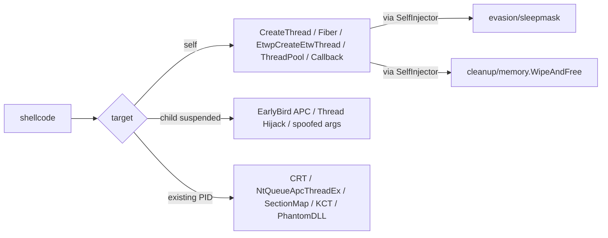
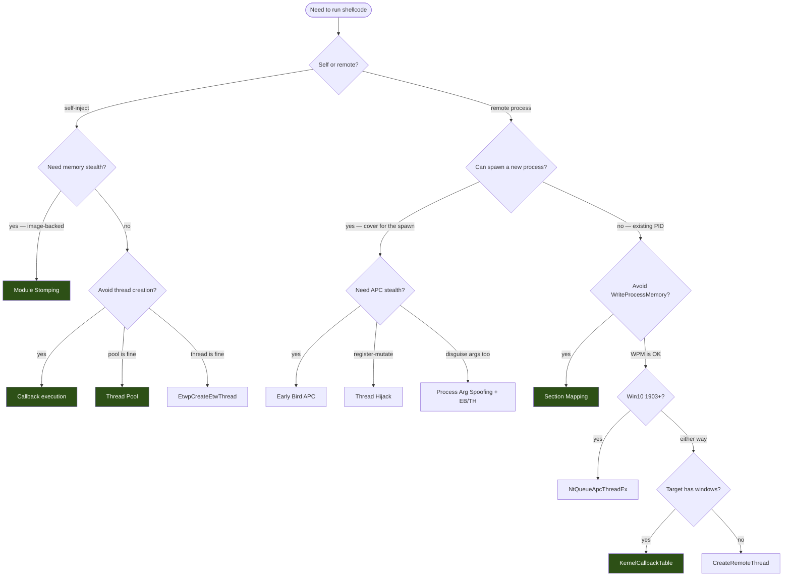

---
---

# Injection techniques

[← maldev README](../../../README.md) · [docs/index](../../index.md)

The `inject/` package supplies a unified Windows + Linux injection
surface: 16 Windows methods, 3 Linux methods, plus a Pipeline pattern
for custom memory + executor combinations. Every method implements
[`Injector`](https://pkg.go.dev/github.com/oioio-space/maldev/inject#Injector);
self-process methods additionally implement
[`SelfInjector`](https://pkg.go.dev/github.com/oioio-space/maldev/inject#SelfInjector)
so the freshly-allocated region can be wired into
[`evasion/sleepmask`](../evasion/sleep-mask.md) or
[`cleanup/memory.WipeAndFree`](../cleanup/memory-wipe.md) without
re-deriving address and size.

## TL;DR



## Primer — vocabulary

Seven terms recur across this page and the per-method docs:

> **Self / Local / Remote / Child** — the four "target" classes
> any injection method falls into. Driven entirely by where the
> shellcode ends up running. See the table below for the
> per-class API surface.
>
> **`Injector`** — interface every method implements:
> `Inject(shellcode []byte) error`. The constructor
> (`NewWindowsInjector(cfg)` or `NewLinuxInjector(cfg)`) wires
> the right method based on `Config.Method`.
>
> **`SelfInjector`** — extension interface for self-process
> methods: `Region() (addr, size uintptr)`. Lets downstream
> consumers (sleepmask, WipeAndFree) recover the allocation
> without re-deriving it.
>
> **`*wsyscall.Caller`** — optional knob (`SyscallMethod`)
> selecting how every NTAPI call resolves: WinAPI proc table
> (default) / direct syscall (asm stub) / indirect syscall
> (resolve SSN at runtime). `nil` = WinAPI fallback. See
> [`win/syscall`](../syscalls/README.md).
>
> **APC (Asynchronous Procedure Call)** — Windows queue every
> thread carries; functions enqueued fire when the thread next
> enters an alertable wait. Several methods (Early Bird,
> NtQueueApcThreadEx) use the APC delivery path to avoid
> creating a new thread.
>
> **`CREATE_SUSPENDED`** — `CreateProcess` flag that spawns
> the child in the suspended state. Threads are created but
> never resumed until the implant finishes mutating memory.
> Used by Early Bird, Thread Hijack, and Process Arg Spoofing.
>
> **Stealth tier** — qualitative ranking column in the index
> below. Combines target class + thread creation + WPM use:
> low (loud, easy to detect), medium (loses one of the three
> tells), high (avoids cross-process or thread creation
> entirely). Not a guarantee against any specific EDR.

## Target categories

The **target** column drives the OPSEC trade-off and the API surface
the implant pays for.

| Target | Meaning | Who pays the cost | Typical syscalls |
|---|---|---|---|
| **Self** | Shellcode runs in the current `maldev`-built process. | Implant's own process | none cross-process — `VirtualAlloc` + exec |
| **Local** | Same as Self, but the technique deliberately avoids spawning a new thread (callback abuse, pool work, module stomping). | Implant's own process | `VirtualAlloc` + `EnumWindows` / `TpPostWork` / stomp |
| **Remote** | Existing PID supplied by the caller. | Target PID | `OpenProcess` + `VirtualAllocEx` + `WriteProcessMemory` (or a section variant) + thread trigger |
| **Child (suspended)** | Implant spawns a process in `CREATE_SUSPENDED`, mutates state, resumes. | Newly-created child | `CreateProcess(SUSPENDED)` + write + resume / APC / hijack |

Stealth ranking by target (general): Local > Child (suspended) > Remote.
Local avoids cross-process primitives; Child is acceptable because the
process tree is predictable; Remote is the loudest — `WriteProcessMemory`
into an unrelated running process is a textbook EDR trigger.

## Per-method index

| Technique | Method constant | Target | Creates thread? | Uses `WriteProcessMemory`? | Stealth tier |
|---|---|---|---|---|---|
| [CreateRemoteThread](create-remote-thread.md) | `MethodCreateRemoteThread` | Remote | yes | yes | low |
| [Early Bird APC](early-bird-apc.md) | `MethodEarlyBirdAPC` | Child (suspended) | no (APC) | yes | medium |
| [Thread Hijack](thread-hijack.md) | `MethodThreadHijack` | Child (suspended) | no | yes | medium |
| [NtQueueApcThreadEx](nt-queue-apc-thread-ex.md) | `MethodNtQueueApcThreadEx` | Remote | no (special APC) | yes | medium |
| [Callback execution](callback-execution.md) | `ExecuteCallback` | Local | no | no | high |
| [Thread Pool](thread-pool.md) | `ThreadPoolExec` | Local | no (pool worker) | no | high |
| [Module Stomping](module-stomping.md) | `ModuleStomp` | Local | caller decides | no | high |
| [Section Mapping](section-mapping.md) | `SectionMapInject` | Remote | yes | **no** | high |
| [Phantom DLL](phantom-dll.md) | `PhantomDLLInject` | Remote (placement only) | no (caller) | yes | very high |
| [Kernel Callback Table](kernel-callback-table.md) | `KernelCallbackExec` | Remote | no | yes | high |
| [EtwpCreateEtwThread](etwp-create-etw-thread.md) | `MethodEtwpCreateEtwThread` | Self | yes (internal) | no | high |
| [Process Argument Spoofing](process-arg-spoofing.md) | `SpawnWithSpoofedArgs` | Child (suspended) | n/a — disguise | yes | medium |

## Decision flow



## Quick decision tree

| You want to… | Use |
|---|---|
| …self-inject without spawning a thread | [callback-execution.md](callback-execution.md) |
| …self-inject through a thread-pool worker | [thread-pool.md](thread-pool.md) |
| …self-inject image-backed (memory looks like a normal module) | [module-stomping.md](module-stomping.md) |
| …spawn a clean new process and queue shellcode pre-init | [early-bird-apc.md](early-bird-apc.md) |
| …inject into an existing PID with WPM allowed | [create-remote-thread.md](create-remote-thread.md) |
| …inject into an existing PID without WriteProcessMemory | [section-mapping.md](section-mapping.md) |
| …blend with a mapped DLL on disk (path-spoof) | [phantom-dll.md](phantom-dll.md) |
| …land in the GUI message-loop callback table | [kernel-callback-table.md](kernel-callback-table.md) |
| …pivot via a hijacked existing thread | [thread-hijack.md](thread-hijack.md) |
| …queue a Win10-1903+ APC (special) | [nt-queue-apc-thread-ex.md](nt-queue-apc-thread-ex.md) |
| …disguise the spawned child's argv | [process-arg-spoofing.md](process-arg-spoofing.md) |
| …land via the EtwpCreateEtwThread trampoline | [etwp-create-etw-thread.md](etwp-create-etw-thread.md) |

## Architecture

All methods implement `Injector`:

```go
type Injector interface {
    Inject(shellcode []byte) error
}
```

`Build()` returns a fluent
[`*InjectorBuilder`](https://pkg.go.dev/github.com/oioio-space/maldev/inject#InjectorBuilder)
that selects syscall mode (WinAPI / NativeAPI / direct / indirect with
arbitrary [`SSNResolver`](../syscalls/ssn-resolvers.md)), pins target,
stacks middleware (`WithValidation`, `WithCPUDelay`, `WithXOR`), and
emits an `Injector`.

```go
inj, err := inject.Build().
    Method(inject.MethodEarlyBirdAPC).
    ProcessPath(`C:\Windows\System32\svchost.exe`).
    IndirectSyscalls().
    Use(inject.WithCPUDelayConfig(inject.CPUDelayConfig{MaxIterations: 10_000_000})).
    Create()
```

The
[`Pipeline`](https://pkg.go.dev/github.com/oioio-space/maldev/inject#Pipeline)
pattern separates memory setup from execution, allowing mix-and-match
combinations the named methods do not cover:

```go
p := inject.NewPipeline(
    inject.RemoteMemory(hProcess, caller),
    inject.CreateRemoteThreadExecutor(hProcess, caller),
)
return p.Inject(shellcode)
```

## SelfInjector — recovering the region

Self-process injectors (`MethodCreateThread`, `MethodCreateFiber`,
`MethodEtwpCreateEtwThread` on Windows; `MethodProcMem` on Linux) place
the shellcode inside the current process. The base `Injector` interface
throws the address away. The optional `SelfInjector` interface exposes
it:

```go
type Region struct {
    Addr uintptr
    Size uintptr
}

type SelfInjector interface {
    Injector
    InjectedRegion() (Region, bool)
}
```

Type-assert and feed the region directly into `evasion/sleepmask`:

```go
inj, _ := inject.NewWindowsInjector(&inject.WindowsConfig{
    Config:        inject.Config{Method: inject.MethodCreateThread},
    SyscallMethod: wsyscall.MethodIndirect,
})
if err := inj.Inject(shellcode); err != nil { return err }

if self, ok := inj.(inject.SelfInjector); ok {
    if r, ok := self.InjectedRegion(); ok {
        mask := sleepmask.New(sleepmask.Region{Addr: r.Addr, Size: r.Size})
        for {
            mask.Sleep(30 * time.Second)
        }
    }
}
```

Contract:

- Returns `(Region{}, false)` before the first successful `Inject`.
- Returns `(Region{}, false)` on cross-process methods (CRT, APC,
  EarlyBird, ThreadHijack, Rtl, NtQueueApcThreadEx) — the region
  lives in the target, not the implant.
- A failed `Inject` does **not** clobber a previously-published
  region.
- Decorators (`WithValidation`, `WithCPUDelay`, `WithXOR`) and
  `Pipeline` forward `InjectedRegion` transparently.

> [!WARNING]
> **`MethodCreateFiber` notice** — `ConvertThreadToFiber` permanently
> transforms the calling OS thread; Go's M:N scheduler is unaware of
> fibers, and any goroutine multiplexed onto that thread observes
> fiber state instead of goroutine state. Real shellcode that calls
> `ExitThread` kills the host runtime. Spawn a true OS thread via
> `kernel32!CreateThread` (not `go func()` — `runtime.LockOSThread`
> is not enough), let it run the fiber dance, let it die when the
> shellcode exits. The matrix test `TestFiber_RealShellcode` is
> permanently skipped — see the comment in
> [`inject/realsc_windows_test.go`](../../../inject/realsc_windows_test.go).

## Syscall modes

Every Windows injection method routes through one of the four modes
on the configured `*wsyscall.Caller`:

| Mode | Constant | Bypasses | Use when |
|---|---|---|---|
| WinAPI | `wsyscall.MethodWinAPI` | nothing | testing / no EDR |
| Native API | `wsyscall.MethodNativeAPI` | `kernel32` hooks | light EDR |
| Direct syscall | `wsyscall.MethodDirect` | all userland hooks | medium EDR |
| Indirect syscall | `wsyscall.MethodIndirect` | userland hooks + CFG check | heavy EDR |

Pair with [`evasion/unhook`](../evasion/ntdll-unhooking.md) to defeat
ntdll inline hooks before the inject fires.

## MITRE ATT&CK

| T-ID | Name | Methods | D3FEND counter |
|---|---|---|---|
| [T1055](https://attack.mitre.org/techniques/T1055/) | Process Injection | umbrella | D3-PSA |
| [T1055.001](https://attack.mitre.org/techniques/T1055/001/) | DLL Injection | CRT, KCT, ModuleStomp, PhantomDLL, SectionMap, ThreadPool, Callback | D3-PSA / D3-PCSV |
| [T1055.003](https://attack.mitre.org/techniques/T1055/003/) | Thread Execution Hijacking | ThreadHijack | D3-PSA |
| [T1055.004](https://attack.mitre.org/techniques/T1055/004/) | Asynchronous Procedure Call | EarlyBird, NtQueueApcThreadEx | D3-PSA |
| [T1055.015](https://attack.mitre.org/techniques/T1055/015/) | ListPlanting | Callback (`CreateTimerQueueTimer`) | D3-PCSV |
| [T1564.010](https://attack.mitre.org/techniques/T1564/010/) | Process Argument Spoofing | `SpawnWithSpoofedArgs` | D3-PSA |
| [T1036.005](https://attack.mitre.org/techniques/T1036/005/) | Match Legitimate Name or Location | combine with arg spoofing | D3-PSA |

## See also

- [Operator path: deciding the injection method](../../by-role/operator.md)
- [Researcher path: per-method primitives](../../by-role/researcher.md)
- [Detection eng path: injection telemetry](../../by-role/detection-eng.md)
- [`win/syscall`](../syscalls/direct-indirect.md) — `Caller` interface
  and SSN resolvers.
- [`evasion/sleepmask`](../evasion/sleep-mask.md) — pair with
  `SelfInjector` to mask the region during sleep.
- [`cleanup/memory`](../cleanup/memory-wipe.md) — pair to wipe the
  region on exit.
