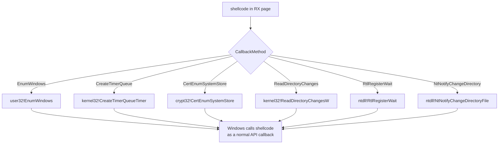

# Callback-based execution

[← injection index](README.md) · [docs/index](../../index.md)

> **New to maldev injection?** Read the [injection/README.md
> vocabulary callout](README.md#primer--vocabulary) first
> (Self/Local/Remote/Child, Injector, *wsyscall.Caller, APC,
> stealth tier).

## TL;DR

Run shellcode by handing its address to a Windows API that **already**
takes a function pointer as part of its normal contract — `EnumWindows`,
`CreateTimerQueueTimer`, `CertEnumSystemStore`, `ReadDirectoryChangesW`,
`RtlRegisterWait`, `NtNotifyChangeDirectoryFile`. The OS calls the
shellcode through its own dispatcher, so no `Create*Thread*` event
fires. Local technique only — pair with a separate primitive that places
the shellcode in executable memory.

| Trait | Value |
|---|---|
| **Target class** | Local (current process) |
| **Creates a new thread?** | No — shellcode runs on an existing thread the OS already owns |
| **Uses `WriteProcessMemory`?** | No — caller pre-allocates RX in their own process |
| **Stealth tier** | High — no Create*Thread / Queue*APC / SetContext call enters EDR's view |
| **CET-affected variants** | `CallbackRtlRegisterWait` + `CallbackNtNotifyChangeDirectory` need `cet.Wrap` on Win11 24H2+. Use [`inject.ExecuteCallbackBytes`](#executecallbackbytesshellcode-callbackmethod) for auto-wrapping. |

When to pick a different method:

- Need to inject into a **different** process? → Local-only by
  definition. See [CreateRemoteThread](create-remote-thread.md),
  [Section Mapping](section-mapping.md), or
  [Kernel Callback Table](kernel-callback-table.md).
- Want a thread you control end-to-end? → [Thread Pool](thread-pool.md)
  (still avoids Create*Thread but you own the work item).
- Want shellcode running from a known-DLL image? → [Module Stomping](module-stomping.md).

## Primer

Many Windows APIs accept callbacks as routine parameters: `EnumWindows`
calls a function for every top-level window, `CreateTimerQueueTimer`
fires one after a delay, `CertEnumSystemStore` invokes one per
certificate store, `RtlRegisterWait` triggers one when a kernel object
signals, and so on. If the implant aims any of those callbacks at its
shellcode, **Windows itself executes the shellcode** as part of a
documented API call.

The advantage is the absence of any thread-creation or APC-queue
syscall. EDRs that monitor `NtCreateThreadEx`, `NtQueueApcThread`, or
`SetThreadContext` see nothing. The shellcode runs on a thread that
already exists (the calling thread for `EnumWindows`/`CertEnum`, the
timer-queue thread for `CreateTimerQueueTimer`, a thread-pool worker
for `RtlRegisterWait`).

The technique is **local-only**: every callback executes in the calling
process. Pair with [`ModuleStomp`](module-stomping.md) or a manual
`VirtualAlloc(RW) + memcpy + VirtualProtect(RX)` to place the shellcode
in executable memory first; `ExecuteCallback` does not allocate.

## How it works



The package selects the correct call shape and parameters for each
method. `EnumWindows` and `CertEnumSystemStore` invoke the shellcode
synchronously; `CreateTimerQueueTimer` fires it on the timer thread
with `WT_EXECUTEINTIMERTHREAD`; `RtlRegisterWait` and
`NtNotifyChangeDirectoryFile` deliver it via a thread-pool worker or
APC dispatcher.

> [!IMPORTANT]
> **CET enforcement** — on Windows 11 with `ProcessUserShadowStackPolicy`
> enabled, two of the six methods (`CallbackRtlRegisterWait`,
> `CallbackNtNotifyChangeDirectory`) require the shellcode to start
> with the `ENDBR64` instruction (`F3 0F 1E FA`) or the kernel
> terminates the process with `STATUS_STACK_BUFFER_OVERRUN`.
>
> The package now ships a CET-aware helper that handles this
> automatically:
>
> ```go
> // Auto-prepends ENDBR64 when MethodEnforcesCET(method) AND cet.Enforced().
> err := inject.ExecuteCallbackBytes(shellcode, inject.CallbackRtlRegisterWait)
> ```
>
> `ExecuteCallbackBytes(sc, method)` checks `MethodEnforcesCET(method)` and
> [`cet.Enforced()`](../evasion/cet.md) and, when both hold, calls
> [`cet.Wrap(sc)`](../evasion/cet.md) before allocating + invoking
> `ExecuteCallback`. On non-CET hosts it's equivalent to a plain alloc +
> ExecuteCallback chain.
>
> Operators who want manual control still call
> [`evasion/cet.Wrap(sc)`](../evasion/cet.md) themselves and feed the result
> to `ExecuteCallback(addr, method)`, or [`evasion/cet.Disable()`](../evasion/cet.md)
> once at start-up to opt the whole process out.

## API → godoc

[`pkg.go.dev/github.com/oioio-space/maldev/inject`](https://pkg.go.dev/github.com/oioio-space/maldev/inject) is the authoritative
reference for every exported symbol. This page teaches the
*concepts*; the godoc is the *specification*.

## Examples

### Simple — bytes (CET-aware, recommended)

```go
import "github.com/oioio-space/maldev/inject"

// Auto-wraps with ENDBR64 when MethodEnforcesCET(method) AND
// cet.Enforced(). Allocates RW, copies, flips RX, calls
// ExecuteCallback. One line, no manual fiddling.
_ = inject.ExecuteCallbackBytes(shellcode, inject.CallbackRtlRegisterWait)
```

### Simple — manual (operator-controlled allocation)

The shellcode must already be in executable memory. Use this path
when the operator wants explicit control over allocation (e.g.,
to feed `inject.ModuleStomp` an image-backed region):

```go
import (
    "unsafe"

    "github.com/oioio-space/maldev/inject"
    "golang.org/x/sys/windows"
)

addr, _ := windows.VirtualAlloc(0, uintptr(len(shellcode)),
    windows.MEM_COMMIT|windows.MEM_RESERVE, windows.PAGE_READWRITE)
copy(unsafe.Slice((*byte)(unsafe.Pointer(addr)), len(shellcode)), shellcode)
var old uint32
_ = windows.VirtualProtect(addr, uintptr(len(shellcode)), windows.PAGE_EXECUTE_READ, &old)

_ = inject.ExecuteCallback(addr, inject.CallbackEnumWindows)
```

### Composed (with `inject.ModuleStomp`)

Hide the executable region inside a legitimate System32 DLL's `.text`
section, then trigger:

```go
import "github.com/oioio-space/maldev/inject"

addr, err := inject.ModuleStomp("msftedit.dll", shellcode)
if err != nil { return err }
return inject.ExecuteCallback(addr, inject.CallbackCreateTimerQueue)
```

### Advanced (with CET wrapping for thread-pool callbacks)

Some callback paths require the `ENDBR64` prefix on Windows 11:

```go
import (
    "github.com/oioio-space/maldev/evasion/cet"
    "github.com/oioio-space/maldev/inject"
)

prepared := cet.Wrap(shellcode)
addr, _ := inject.ModuleStomp("msftedit.dll", prepared)
_ = inject.ExecuteCallback(addr, inject.CallbackRtlRegisterWait)
```

### Complex (full chain — evade + stomp + callback + cleanup)

```go
import (
    "github.com/oioio-space/maldev/cleanup/memory"
    "github.com/oioio-space/maldev/evasion"
    "github.com/oioio-space/maldev/evasion/cet"
    "github.com/oioio-space/maldev/evasion/preset"
    "github.com/oioio-space/maldev/inject"
)

_ = evasion.ApplyAll(preset.Stealth(), nil)
prepared := cet.Wrap(shellcode)

addr, err := inject.ModuleStomp("msftedit.dll", prepared)
if err != nil { return err }

if err := inject.ExecuteCallback(addr, inject.CallbackNtNotifyChangeDirectory); err != nil {
    return err
}

memory.SecureZero(prepared)
```

## OPSEC & Detection

| Artefact | Where defenders look |
|---|---|
| `EnumWindows` callback pointing into a non-image region | EDR memory scanners (CrowdStrike, MDE Live Response) — orphan callbacks lit up |
| Sudden `RtlRegisterWait` from a non-system process with a callback in heap | Userland hooks + ETW `Microsoft-Windows-Threadpool` |
| `CertEnumSystemStore` from a non-crypto-aware process | Behavioural rule (rare; Defender flags the chain when paired with downloaded payloads) |
| File-watch on `C:\Windows\Temp` from a process that does not file-watch | Sysmon Event 12/13 (no direct event) but EDR file-IO baselines |
| RW page promoted to RX in non-image region | Allocation-protect telemetry — flag the `VirtualProtect` to RX |

**D3FEND counters:**

- [D3-PCSV](https://d3fend.mitre.org/technique/d3f:ProcessCodeSegmentVerification/)
  — verifies callback pointers against image segments.
- [D3-EAL](https://d3fend.mitre.org/technique/d3f:ExecutableAllowlisting/)
  — WDAC denies execution from non-image-backed pages.

**Hardening for the operator:** combine with [`ModuleStomp`](module-stomping.md)
so the callback pointer falls inside a legitimate DLL's `.text`
section; rotate `CallbackMethod` between runs to defeat
behaviour-rule fingerprinting; never run the same `EnumWindows`
trigger twice in a row.

## MITRE ATT&CK

| T-ID | Name | Sub-coverage | D3FEND counter |
|---|---|---|---|
| [T1055.001](https://attack.mitre.org/techniques/T1055/001/) | Process Injection: DLL Injection | callback variant — no thread creation | D3-PCSV |
| [T1055.015](https://attack.mitre.org/techniques/T1055/015/) | Process Injection: ListPlanting | `CreateTimerQueueTimer` family | D3-PCSV |

## Limitations

- **Local only.** All six methods execute in the calling process.
  Cross-process work needs a different primitive
  ([`SectionMapInject`](section-mapping.md), [`KernelCallbackTable`](kernel-callback-table.md)).
- **`ExecuteCallback` does not allocate.** The address must already
  point at RX memory. Use `ExecuteCallbackBytes` for the
  alloc-flip-call path, or pair with `ModuleStomp` /
  `VirtualAlloc + VirtualProtect` for image-backed memory.
- **CET on two methods, auto-handled.** `CallbackRtlRegisterWait`
  and `CallbackNtNotifyChangeDirectory` require the `ENDBR64`
  prefix on Win11+ with shadow stacks enforced.
  `inject.MethodEnforcesCET(method)` reports which methods need
  the prefix; `inject.ExecuteCallbackBytes(sc, method)` checks
  that predicate against `cet.Enforced()` and `cet.Wrap`s the
  shellcode automatically. Operators who pre-allocate themselves
  must `cet.Wrap` (or `cet.Disable` once at start-up) before
  passing the address to `ExecuteCallback`.
- **Synchronous methods block.** `EnumWindows` and `CertEnumSystemStore`
  return only after the shellcode finishes. The shellcode must
  return cleanly (return 0) — long-running payloads should hand off to
  a fiber or thread internally.
- **Thread-pool worker context.** `CallbackRtlRegisterWait` runs on a
  thread the implant did not create; locked OS resources held there
  are unfamiliar territory.

## See also

- [Module Stomping](module-stomping.md) — the canonical pair to place
  the shellcode in executable memory.
- [Thread Pool](thread-pool.md) — a different self-injection path that
  also avoids thread creation.
- [`evasion/cet`](../evasion/cet.md) — CET shadow stack handling for
  the two affected callback methods.
- [Process Injection Techniques — modexp/SafeBreach](https://github.com/odzhan/injection)
  — community catalogue of the same callback-API patterns.
