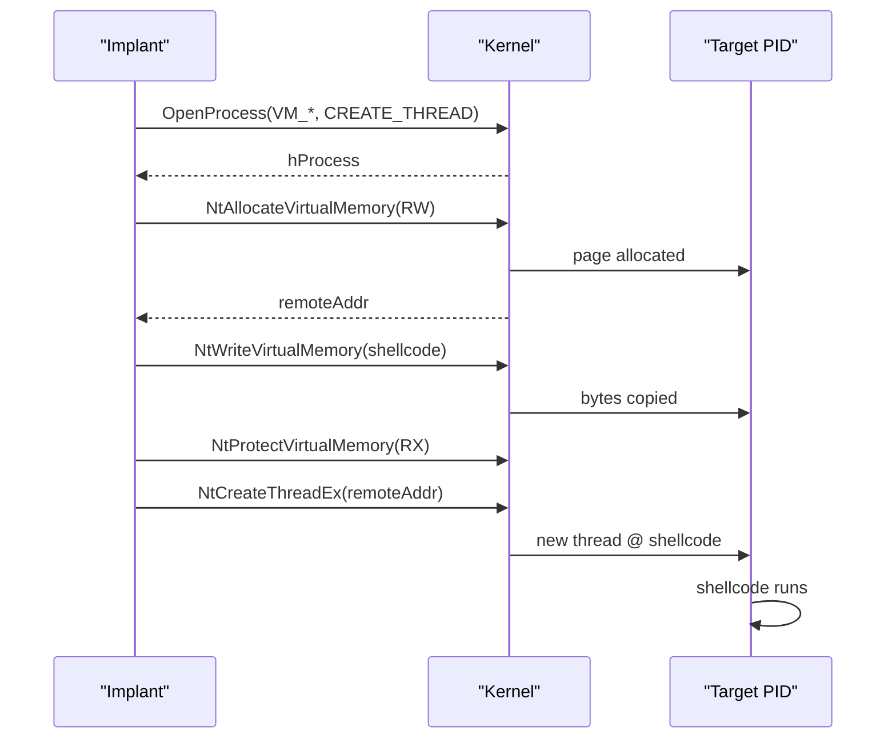

# CreateRemoteThread injection

[← injection index](README.md) · [docs/index](../../index.md)

> **New to maldev injection?** Read the [injection/README.md
> vocabulary callout](README.md#primer--vocabulary) first
> (Self/Local/Remote/Child, Injector, *wsyscall.Caller, APC,
> stealth tier). Every per-method page assumes those terms.

## TL;DR

The classic, reliable, **highly monitored** primitive: open a handle to
the target PID, allocate RW memory, write the shellcode, flip to RX,
spawn a fresh thread at the shellcode address. Works on every Windows
version. Choose this only when stealth is not the priority — it is the
single most-watched injection path in the matrix.

| Trait | Value |
|---|---|
| **Target class** | Remote (existing PID) |
| **Creates a new thread?** | Yes (`NtCreateThreadEx` or `CreateRemoteThread`) |
| **Uses `WriteProcessMemory`?** | Yes (`NtWriteVirtualMemory` under the hood) |
| **Stealth tier** | Low — every API in the chain is hooked by every commercial EDR |
| **Min Windows version** | All supported (Win7+) |
| **Quietest variant** | `wsyscall.MethodIndirect` to bypass userland NTAPI hooks; pair with [`evasion/preset.Stealth`](../evasion/preset.md) for AMSI/ETW too |

When to pick a different method:

- Want to avoid `WriteProcessMemory`? → [Section Mapping](section-mapping.md)
- Want to avoid creating a thread? → [NtQueueApcThreadEx](nt-queue-apc-thread-ex.md), [Kernel Callback Table](kernel-callback-table.md)
- Don't need cross-process? → [Self-injection methods](README.md#per-method-index) (Callback, ThreadPool, EtwpCreateEtwThread)
- Suspended child OK? → [Early Bird APC](early-bird-apc.md), [Thread Hijack](thread-hijack.md)

## Primer

CreateRemoteThread is the textbook process injection. The library opens
a handle to a target PID with the four access rights that matter
(`PROCESS_VM_OPERATION`, `PROCESS_VM_WRITE`, `PROCESS_VM_READ`,
`PROCESS_CREATE_THREAD`), allocates a page of RW memory inside the
target's address space, copies the shellcode in, raises the page to RX,
and asks the kernel to spawn a fresh thread whose start address is the
shellcode pointer.

Every step has been a known-bad pattern for over a decade. Defender,
CrowdStrike, and SentinelOne hook every API in the chain plus the
kernel callback `PsSetCreateThreadNotifyRoutine`. The technique still
ships in this package because it is the **baseline against which every
stealth method measures itself** — and because some legitimate
debugging tools also use it, so a small amount of background noise
exists.

## How it works



Steps:

1. **Open** the target with the four access rights.
2. **Allocate** in the target via `NtAllocateVirtualMemory` (RW —
   never raw RWX, that's an extra signature).
3. **Write** the shellcode with `NtWriteVirtualMemory`.
4. **Re-protect** to RX with `NtProtectVirtualMemory`.
5. **Spawn** with `NtCreateThreadEx` (or `CreateRemoteThread` if the
   caller selected `wsyscall.MethodWinAPI`).

The package fans out steps 2–5 through the configured
[`*wsyscall.Caller`](../syscalls/direct-indirect.md), so the same code
runs through WinAPI, NativeAPI, direct syscalls, or indirect syscalls
depending on EDR posture.

## API → godoc

[`pkg.go.dev/github.com/oioio-space/maldev/inject`](https://pkg.go.dev/github.com/oioio-space/maldev/inject) is the authoritative
reference for every exported symbol. This page teaches the
*concepts*; the godoc is the *specification*.

## Examples

### Simple

```go
cfg := inject.DefaultWindowsConfig(inject.MethodCreateRemoteThread, 1234)
inj, err := inject.NewWindowsInjector(cfg)
if err != nil { return err }
return inj.Inject(shellcode)
```

### Composed (indirect syscalls + caller chain)

Bypass userland hooks before the injection fires:

```go
import (
    "github.com/oioio-space/maldev/inject"
    wsyscall "github.com/oioio-space/maldev/win/syscall"
)

inj, err := inject.Build().
    Method(inject.MethodCreateRemoteThread).
    TargetPID(targetPID).
    IndirectSyscalls().
    Resolver(wsyscall.Chain(wsyscall.NewHellsGate(), wsyscall.NewHalosGate())).
    Create()
if err != nil { return err }
return inj.Inject(shellcode)
```

### Advanced (encrypt + evade + inject + wipe)

```go
import (
    "github.com/oioio-space/maldev/cleanup/memory"
    "github.com/oioio-space/maldev/crypto"
    "github.com/oioio-space/maldev/evasion"
    "github.com/oioio-space/maldev/evasion/preset"
    "github.com/oioio-space/maldev/inject"
    wsyscall "github.com/oioio-space/maldev/win/syscall"
)

caller := wsyscall.New(wsyscall.MethodIndirect,
    wsyscall.Chain(wsyscall.NewHellsGate(), wsyscall.NewHalosGate()))
_ = evasion.ApplyAll(preset.Stealth(), caller)

shellcode, err := crypto.DecryptAESGCM(aesKey, encrypted)
if err != nil { return err }
memory.SecureZero(aesKey)

inj, err := inject.Build().
    Method(inject.MethodCreateRemoteThread).
    TargetPID(targetPID).
    IndirectSyscalls().
    Use(inject.WithXORKey(0x41)).
    Use(inject.WithCPUDelayConfig(inject.CPUDelayConfig{MaxIterations: 10_000_000})).
    Create()
if err != nil { return err }
if err := inj.Inject(shellcode); err != nil { return err }
memory.SecureZero(shellcode)
```

### Complex (Pipeline with custom memory + executor)

When the named methods do not fit, drop down to the [`Pipeline`](README.md#architecture):

```go
mem  := inject.RemoteMemory(hProcess, caller)
exec := inject.CreateRemoteThreadExecutor(hProcess, caller)
p    := inject.NewPipeline(mem, exec)
return p.Inject(shellcode)
```

This separates "where the bytes land" from "how they get triggered" —
swap either side independently to build novel chains.

See `ExampleNewWindowsInjector` and `ExampleBuild` in
[`inject_example_windows_test.go`](../../../inject/inject_example_windows_test.go).

## OPSEC & Detection

| Artefact | Where defenders look |
|---|---|
| `OpenProcess` with `PROCESS_VM_*` + `PROCESS_CREATE_THREAD` from a non-debugger process | Sysmon Event 10 (ProcessAccess), EDR kernel callback `ObCallbackRegister` |
| Cross-process `NtWriteVirtualMemory` | Sysmon does not log this directly; EDR userland hooks + kernel ETW (`Microsoft-Windows-Kernel-Process`) |
| `NtCreateThreadEx` start address outside any module image | EDR `PsSetCreateThreadNotifyRoutine` callback is the canonical detection — flags non-image-backed start addresses |
| Fresh remote thread with no legitimate call stack | Stack-walking telemetry (CrowdStrike, MDE) finds the orphan immediately |
| RWX page in target after `NtProtectVirtualMemory` | Allocation-protect telemetry — the package avoids this by allocating RW first then flipping to RX, but the X-flip itself is logged |

**D3FEND counters:**

- [D3-PSA](https://d3fend.mitre.org/technique/d3f:ProcessSpawnAnalysis/)
  — process-spawn analysis correlates the `OpenProcess` ↔ `CreateThread` pair.
- [D3-EAL](https://d3fend.mitre.org/technique/d3f:ExecutableAllowlisting/)
  — code-integrity policies (WDAC) refuse non-image-backed thread start
  addresses.

**Hardening for the operator:** route all four NT calls through indirect
syscalls (defeats userland hooks), unhook ntdll first
(`evasion/unhook`), and prefer a different technique entirely if the
target enforces ETW-Ti (Threat-Intelligence ETW provider). CRT remains
useful only against light EDR or as a deliberately-loud feint.

## MITRE ATT&CK

| T-ID | Name | Sub-coverage | D3FEND counter |
|---|---|---|---|
| [T1055.001](https://attack.mitre.org/techniques/T1055/001/) | Process Injection: DLL Injection | thread-creation variant of the classic shellcode-injection pattern | D3-PSA |

## Limitations

- **Highly visible.** Treat as a baseline. Use only when EDR is light
  or absent.
- **PROCESS_CREATE_THREAD required** in the access mask. Some hardened
  processes (PPL, anti-malware service) cannot be opened with this
  right.
- **Orphan call stack.** The new thread has no legitimate caller
  history; stack-walking detection trivially flags it.
- **No PPL targets.** Protected Process Light denies cross-process
  thread creation outright. Use a non-PPL target.

## See also

- [Early Bird APC](early-bird-apc.md) — same shape but APC-triggered,
  avoids the `CreateThread` event.
- [Thread Hijack](thread-hijack.md) — redirects an existing thread
  instead of creating one.
- [Section Mapping](section-mapping.md) — same target shape but no
  `WriteProcessMemory`.
- [`evasion/unhook`](../evasion/ntdll-unhooking.md) — pair to defeat
  userland hooks before the injection.
- [`win/syscall`](../syscalls/direct-indirect.md) — the four syscall
  modes available to every method.
