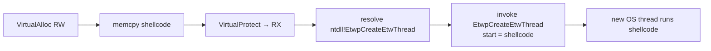

# EtwpCreateEtwThread injection

[← injection index](README.md) · [docs/index](../../index.md)

> **New to maldev injection?** Read the [injection/README.md
> vocabulary callout](README.md#primer--vocabulary) first.

## TL;DR

Self-injection via the **internal** `ntdll!EtwpCreateEtwThread` —
ETW's private thread-creation routine. Allocates RX in the current
process, writes shellcode, calls the routine with the shellcode
address as the start point. Same end result as `NtCreateThreadEx`,
but the underlying call is unexported and rarely hooked. Self-process
only.

| Trait | Value |
|---|---|
| **Target class** | Self (current process) |
| **Creates a new thread?** | Yes — but via an unexported, rarely-hooked routine |
| **Uses `WriteProcessMemory`?** | No (current-process write only) |
| **Stealth tier** | High — the unexported routine sits below most EDRs' inline-hook surface |
| **Dependency** | Resolves via PEB walk — robust to EDR API enumeration but breaks if Microsoft renames the symbol |

When to pick a different method:

- Want zero thread creation? → [Callback execution](callback-execution.md), [Thread Pool](thread-pool.md).
- Need cross-process? → Self-only by definition. See [CreateRemoteThread](create-remote-thread.md), [Section Mapping](section-mapping.md).
- Want a file-backed image-mask for the shellcode? → [Module Stomping](module-stomping.md).

## Primer

ETW (Event Tracing for Windows) maintains its own helper threads for
trace-buffer management. Internally `ntdll` exposes the
`EtwpCreateEtwThread` routine to spawn those helpers. The routine
boils down to `NtCreateThreadEx` with ETW-specific flags and a small
trampoline, but **it is not exported by name** — EDR products that
hook `NtCreateThreadEx` for thread-creation telemetry typically do not
also hook the private ETW routine.

The implant resolves `EtwpCreateEtwThread` by symbol lookup or hashed
PEB walk, allocates an RX page in itself, and calls the routine with
the shellcode address as the start point. A real OS thread starts at
the shellcode — same outcome as `CreateThread`, far quieter on
userland-hook telemetry.

This is **self-process only**. Cross-process work needs a different
primitive.

## How it works



Steps:

1. **Allocate / write / protect** in the current process (RW → RX).
2. **Resolve** `ntdll!EtwpCreateEtwThread` via `GetProcAddress`,
   manual export-table walk, or a [hashed PEB walk](../syscalls/api-hashing.md).
3. **Call** the routine with the shellcode address as the start
   parameter.

The internal routine ends up calling `NtCreateThreadEx` itself; the
kernel's thread-creation telemetry still fires (`PsSetCreateThreadNotifyRoutine`).
What the technique evades is the **userland-hook** layer that EDR
products typically install on the documented `CreateThread` family.

## API → godoc

[`pkg.go.dev/github.com/oioio-space/maldev/inject`](https://pkg.go.dev/github.com/oioio-space/maldev/inject) is the authoritative
reference for every exported symbol. This page teaches the
*concepts*; the godoc is the *specification*.

## Examples

### Simple

```go
import "github.com/oioio-space/maldev/inject"

cfg := inject.DefaultWindowsConfig(inject.MethodEtwpCreateEtwThread, 0)
inj, err := inject.NewWindowsInjector(cfg)
if err != nil { return err }
return inj.Inject(shellcode)
```

### Composed (with SelfInjector for sleep masking)

```go
import (
    "time"

    "github.com/oioio-space/maldev/evasion/sleepmask"
    "github.com/oioio-space/maldev/inject"
)

inj, err := inject.Build().
    Method(inject.MethodEtwpCreateEtwThread).
    IndirectSyscalls().
    Create()
if err != nil { return err }
if err := inj.Inject(shellcode); err != nil { return err }

if self, ok := inj.(inject.SelfInjector); ok {
    if r, ok := self.InjectedRegion(); ok {
        mask := sleepmask.New(sleepmask.Region{Addr: r.Addr, Size: r.Size})
        for {
            mask.Sleep(30 * time.Second)
        }
    }
}
```

### Advanced (decrypt + ETWP inject + sleep mask)

```go
import (
    "time"

    "github.com/oioio-space/maldev/cleanup/memory"
    "github.com/oioio-space/maldev/crypto"
    "github.com/oioio-space/maldev/evasion"
    "github.com/oioio-space/maldev/evasion/preset"
    "github.com/oioio-space/maldev/evasion/sleepmask"
    "github.com/oioio-space/maldev/inject"
)

_ = evasion.ApplyAll(preset.Stealth(), nil)

shellcode, err := crypto.DecryptAESGCM(aesKey, encrypted)
if err != nil { return err }
memory.SecureZero(aesKey)

inj, err := inject.Build().
    Method(inject.MethodEtwpCreateEtwThread).
    IndirectSyscalls().
    Create()
if err != nil { return err }
if err := inj.Inject(shellcode); err != nil { return err }
memory.SecureZero(shellcode)

if self, ok := inj.(inject.SelfInjector); ok {
    if r, ok := self.InjectedRegion(); ok {
        mask := sleepmask.New(sleepmask.Region{Addr: r.Addr, Size: r.Size})
        for {
            mask.Sleep(60 * time.Second)
        }
    }
}
```

### Complex

The `Pipeline` API has no dedicated `EtwpCreateEtwThreadExecutor`;
the named-method path is canonical. To experiment with custom
executors, replicate the resolve-and-call snippet from
[`inject/injector_self_windows.go`](../../../inject/injector_self_windows.go).

## OPSEC & Detection

| Artefact | Where defenders look |
|---|---|
| Userland hooks on `NtCreateThreadEx` / `CreateThread` | **Bypassed** — `EtwpCreateEtwThread` is unexported |
| Kernel `PsSetCreateThreadNotifyRoutine` callback | Still fires — the kernel sees a normal thread creation |
| Stack-walking on the new thread | The start address points into a non-image RX region — same orphan signal as `CreateRemoteThread` |
| `EtwpCreateEtwThread` invocation from a non-ETW caller | Niche EDR rule — most products do not key on it; mature ETW-aware EDRs (CrowdStrike) do |

**D3FEND counters:**

- [D3-PSA](https://d3fend.mitre.org/technique/d3f:ProcessSpawnAnalysis/)
  — kernel callback still surfaces the new thread.
- [D3-PCSV](https://d3fend.mitre.org/technique/d3f:ProcessCodeSegmentVerification/)
  — verifies the start address against image segments.

**Hardening for the operator:** combine with [`evasion/callstack`](../evasion/callstack-spoof.md)
to fake the call site so stack-walking telemetry does not trivially
flag the orphan thread; pair with [`evasion/sleepmask`](../evasion/sleep-mask.md)
to encrypt the RX region between activations.

## MITRE ATT&CK

| T-ID | Name | Sub-coverage | D3FEND counter |
|---|---|---|---|
| [T1055](https://attack.mitre.org/techniques/T1055/) | Process Injection | self-process variant via internal ntdll routine | D3-PSA |

## Limitations

- **Self-process only.** The routine starts a thread in the calling
  process. No PID parameter.
- **Not a kernel-callback bypass.** `PsSetCreateThreadNotifyRoutine`
  still fires. The technique evades userland-hook telemetry only.
- **Undocumented.** `EtwpCreateEtwThread` is internal to ntdll. Future
  Windows builds may rename, relocate, or remove it. The package's
  resolver caches the address; verify after major OS updates.
- **Stack walks still expose orphan threads.** Pair with callstack
  spoofing for thorough coverage.

## See also

- [CreateRemoteThread](create-remote-thread.md) — the documented
  variant.
- [NtQueueApcThreadEx](nt-queue-apc-thread-ex.md) — alternative
  self-process path with no thread creation event at all.
- [`evasion/callstack`](../evasion/callstack-spoof.md) — fake the
  call site of the spawned thread.
- [`evasion/sleepmask`](../evasion/sleep-mask.md) — encrypt the RX
  region during inactive periods.
