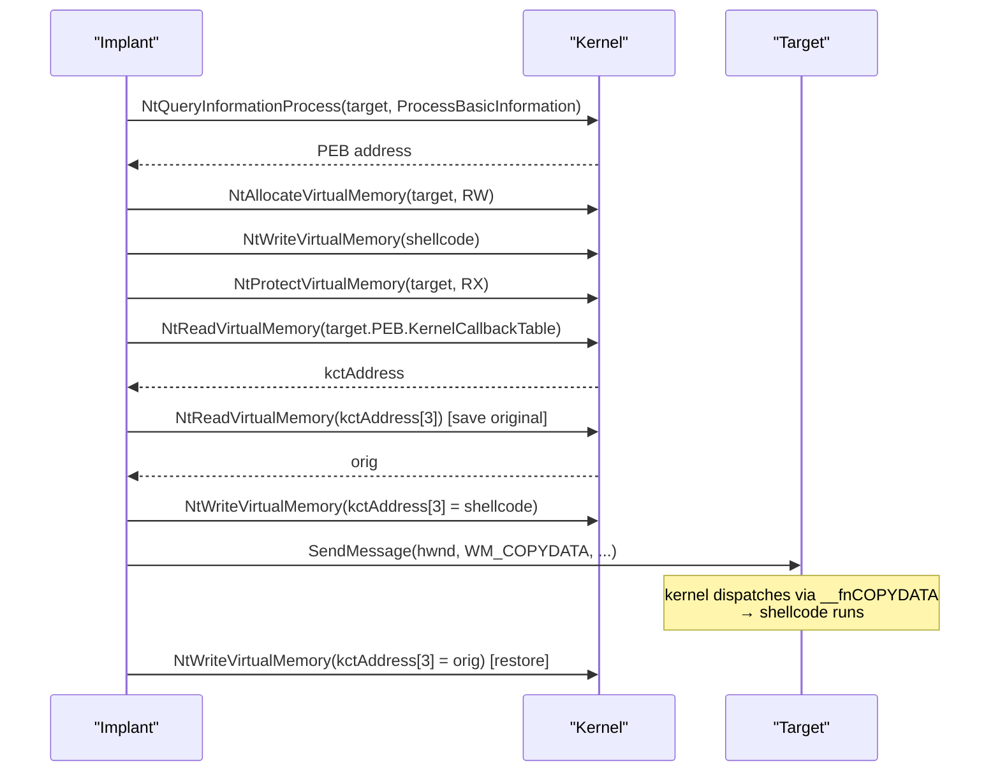

# KernelCallbackTable hijacking

[← injection index](README.md) · [docs/index](../../index.md)

> **New to maldev injection?** Read the [injection/README.md
> vocabulary callout](README.md#primer--vocabulary) first.

## TL;DR

Every Windows process holds a `KernelCallbackTable` pointer in its
PEB — a table of user-mode dispatch routines that the kernel calls
back into for window-message handling. Overwrite the
`__fnCOPYDATA` (index 3) slot in the **target's** table with the
shellcode address, send the target window a `WM_COPYDATA` message,
restore the original slot. Cross-process, no `CreateThread`, no APC.

| Trait | Value |
|---|---|
| **Target class** | Remote (existing PID with at least one window) |
| **Creates a new thread?** | No — kernel reuses the target's existing UI thread |
| **Uses `WriteProcessMemory`?** | Yes (to swap the table slot, ~8 bytes) |
| **Stealth tier** | High — no Create*Thread / Queue*APC / SetContext entries; the WM_COPYDATA send is a normal IPC pattern |
| **Constraint** | Target must have a window (`USER32`-loaded process). Console-only targets can't be hit. |

When to pick a different method:

- Target has no window? → [Section Mapping](section-mapping.md), [NtQueueApcThreadEx](nt-queue-apc-thread-ex.md), or [CreateRemoteThread](create-remote-thread.md).
- Want shellcode placed via image mapping (file-backed mask)? → Pair with [Phantom DLL](phantom-dll.md) for placement, then this for trigger.
- Want fully local (no cross-process)? → [Callback execution](callback-execution.md) abuses the same family of dispatcher callbacks but in the current process.

## Primer

Windows' window-message dispatcher is split between the kernel and
user mode. Certain messages (paint, copy-data, draw-icon, …) require
the kernel to call back into the target process's user-mode code. To
make that work, every process has a `KernelCallbackTable` pointer in
its PEB; the kernel looks up the right callback by index and invokes
it. The table is read-write user-mode memory; nothing prevents another
process with `PROCESS_VM_WRITE` access from mutating an entry.

The implant takes the target's PEB address (via
`NtQueryInformationProcess`), reads the `KernelCallbackTable` pointer,
overwrites the `__fnCOPYDATA` slot (index 3) with the shellcode
address, finds a window owned by the target with `EnumWindows`, sends
it a `WM_COPYDATA` message, and waits for the kernel to dispatch.
The kernel calls the slot — now pointing at the shellcode — as the
target's main UI thread. The implant restores the original pointer
afterwards.

Saif/Hexacorn published the family in 2020; ProjectXeno used a
related variant in the wild. EDR coverage varies — the cross-process
PEB write and the `WM_COPYDATA` send are the only loud syscalls.

## How it works



Steps:

1. Resolve the target's PEB via `NtQueryInformationProcess(ProcessBasicInformation)`.
2. Allocate / write / protect the shellcode in the target.
3. Read `PEB.KernelCallbackTable` to find the table address.
4. Save the current `[3]` slot value.
5. Overwrite `[3]` with the shellcode address.
6. Find a window owned by `pid` (`EnumWindows` filtered by `GetWindowThreadProcessId`).
7. Send `WM_COPYDATA` to that window.
8. The kernel dispatches via the modified slot — shellcode runs.
9. Restore the original `[3]` value.

## API → godoc

[`pkg.go.dev/github.com/oioio-space/maldev/inject`](https://pkg.go.dev/github.com/oioio-space/maldev/inject) is the authoritative
reference for every exported symbol. This page teaches the
*concepts*; the godoc is the *specification*.

## Examples

### Simple

```go
import "github.com/oioio-space/maldev/inject"

if err := inject.KernelCallbackExec(targetPID, shellcode, nil); err != nil {
    return err
}
```

### Composed (indirect syscalls)

```go
import (
    "github.com/oioio-space/maldev/inject"
    wsyscall "github.com/oioio-space/maldev/win/syscall"
)

caller := wsyscall.New(wsyscall.MethodIndirect,
    wsyscall.Chain(wsyscall.NewHellsGate(), wsyscall.NewHalosGate()))
return inject.KernelCallbackExec(targetPID, shellcode, caller)
```

### Advanced (evade + KCT inject)

```go
import (
    "github.com/oioio-space/maldev/evasion"
    "github.com/oioio-space/maldev/evasion/preset"
    "github.com/oioio-space/maldev/inject"
    wsyscall "github.com/oioio-space/maldev/win/syscall"
)

caller := wsyscall.New(wsyscall.MethodIndirect,
    wsyscall.Chain(wsyscall.NewHellsGate(), wsyscall.NewHalosGate()))
_ = evasion.ApplyAll(preset.Stealth(), caller)

return inject.KernelCallbackExec(targetPID, shellcode, caller)
```

### Complex (decrypt + target a UI process + inject + wipe)

```go
import (
    "github.com/oioio-space/maldev/cleanup/memory"
    "github.com/oioio-space/maldev/crypto"
    "github.com/oioio-space/maldev/inject"
    "github.com/oioio-space/maldev/process/enum"
    wsyscall "github.com/oioio-space/maldev/win/syscall"
)

shellcode, err := crypto.DecryptAESGCM(aesKey, encrypted)
if err != nil { return err }
memory.SecureZero(aesKey)

target, err := enum.FindByName("explorer.exe")
if err != nil { return err }

caller := wsyscall.New(wsyscall.MethodIndirect, nil)
if err := inject.KernelCallbackExec(target.PID, shellcode, caller); err != nil {
    return err
}
memory.SecureZero(shellcode)
```

## OPSEC & Detection

| Artefact | Where defenders look |
|---|---|
| Cross-process write into a target's PEB region | Userland EDR hooks on `NtWriteVirtualMemory`; kernel ETW-Ti (`Microsoft-Windows-Threat-Intelligence`) emits `WriteVirtualMemory` events |
| Mutation of `KernelCallbackTable[3]` (`__fnCOPYDATA`) | Behavioural EDR rule (CrowdStrike, MDE) — the slot is rarely modified outside this technique |
| `WM_COPYDATA` sent across process boundaries from an unusual sender | Windows-event-log heuristics; rare standalone signal |
| Synthetic `WM_COPYDATA` to a process whose receiver does not normally accept it | Application-level anomaly (e.g. `notepad.exe` receiving copy-data) |

**D3FEND counters:**

- [D3-PSA](https://d3fend.mitre.org/technique/d3f:ProcessSpawnAnalysis/)
  — flags the cross-process PEB read/write pair.
- [D3-PCSV](https://d3fend.mitre.org/technique/d3f:ProcessCodeSegmentVerification/)
  — verifies callback-table slots against image segments.

**Hardening for the operator:** target a UI-rich process whose
message pump runs continuously (`explorer.exe`, `RuntimeBroker.exe`);
restore the slot before any second message can arrive; pair with
ntdll unhooking so the cross-process Nt calls dodge userland hooks.

## MITRE ATT&CK

| T-ID | Name | Sub-coverage | D3FEND counter |
|---|---|---|---|
| [T1055.001](https://attack.mitre.org/techniques/T1055/001/) | Process Injection: DLL Injection | callback-table variant — no `CreateThread` cross-process | D3-PSA |

## Limitations

- **Target needs a window.** Console-only and service processes have
  no top-level window; `KernelCallbackExec` returns an error.
- **Slot restoration is best-effort.** If the shellcode does not
  return cleanly, the table stays poisoned and the next legitimate
  message dispatch crashes the target. Use a stub that returns
  immediately after detaching the payload.
- **Cross-process write still happens.** `NtWriteVirtualMemory` runs
  twice (allocation + table mutation). EDR-Ti will see it; pair with
  unhooking to defeat userland-hook variants only.
- **No PPL targets.** PPL processes deny cross-process VM operations.

## See also

- [Section Mapping](section-mapping.md) — alternative cross-process
  technique that avoids `WriteProcessMemory` entirely.
- [Phantom DLL](phantom-dll.md) — same target shape with image-backed
  shellcode placement.
- [`evasion/unhook`](../evasion/ntdll-unhooking.md) — ntdll unhooking
  to defeat userland-hook telemetry.
- [Hexacorn, *KernelCallbackTable hijack*, 2020](http://www.hexacorn.com/blog/2020/10/12/kernelcallbacktable-injection-yet-another-thread-less-process-injection-technique/)
  — original public write-up.
- [Check Point Research, *FinFisher exposed*](https://research.checkpoint.com/2020/finfisher-finally-exposed/)
  — in-the-wild use of related primitives.
