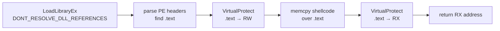

# Module stomping

[← injection index](README.md) · [docs/index](../../index.md)

> **New to maldev injection?** Read the [injection/README.md
> vocabulary callout](README.md#primer--vocabulary) first.

## TL;DR

Load a legitimate System32 DLL with `DONT_RESOLVE_DLL_REFERENCES`,
locate its `.text` section, briefly flip it to RW, overwrite the bytes
with shellcode, flip back to RX. The resulting RX page is **image-backed**
— memory scanners that trust file-backed regions see a legitimate
`msftedit.dll` mapping. Local-only; pair with a callback or thread-pool
trigger to actually run the bytes.

| Trait | Value |
|---|---|
| **Target class** | Local (current process) |
| **Creates a new thread?** | Caller's choice — pair with [Callback execution](callback-execution.md) or [Thread Pool](thread-pool.md) for the trigger |
| **Uses `WriteProcessMemory`?** | No (current-process write only) |
| **Stealth tier** | High — `VirtualQueryEx` reports `MEM_IMAGE` + a real DLL path; only deep `.text` byte-hash checks catch the swap |
| **Sacrifice** | The stomped DLL's exports are gone — load only DLLs the implant doesn't need (e.g., `msftedit.dll` if no rich-edit calls) |

When to pick a different method:

- Need cross-process? → [Phantom DLL](phantom-dll.md) is the same trick remoted.
- Don't need image-backed mask? → [Thread Pool](thread-pool.md), [Callback execution](callback-execution.md), [EtwpCreateEtwThread](etwp-create-etw-thread.md) — simpler when scanners aren't the threat.
- Want both image mask AND remote target? → [Phantom DLL](phantom-dll.md) chained with [Kernel Callback Table](kernel-callback-table.md).

## Primer

Memory scanners commonly trust regions that the OS reports as
file-backed by a known image. The shortcut they take is reasonable —
loading `c:\windows\system32\msftedit.dll` is by definition fine, so
scanning every byte of every loaded DLL would be wasteful. Module
stomping abuses that trust: the implant loads a benign DLL it does
not actually need, walks its PE headers in memory, finds the `.text`
(code) section, and replaces the section's bytes with the shellcode.
The OS still reports the region as `msftedit.dll`'s code segment;
the bytes have changed underneath.

The technique is **placement only**. `ModuleStomp` returns the address
of the new RX region; pair it with a separate execution primitive
([`ExecuteCallback`](callback-execution.md), [`ThreadPoolExec`](thread-pool.md),
fiber, or a manually-fired callback) to dispatch.

## How it works



Steps:

1. **Load** the cover DLL with `LOAD_LIBRARY_AS_IMAGE_RESOURCE |
   DONT_RESOLVE_DLL_REFERENCES`. This maps the file as a `SEC_IMAGE`
   section — the OS treats it like a real load — but skips `DllMain`
   so no real init runs.
2. **Parse** the loaded module's PE headers in memory to locate the
   `.text` section's virtual address and size.
3. **Flip** the `.text` section to `PAGE_READWRITE`.
4. **Overwrite** the existing bytes with the shellcode (zero-pad the
   tail).
5. **Flip back** to `PAGE_EXECUTE_READ`.
6. **Return** the address.

## API → godoc

[`pkg.go.dev/github.com/oioio-space/maldev/inject`](https://pkg.go.dev/github.com/oioio-space/maldev/inject) is the authoritative
reference for every exported symbol. This page teaches the
*concepts*; the godoc is the *specification*.

## Examples

### Simple

```go
addr, err := inject.ModuleStomp("msftedit.dll", shellcode)
if err != nil { return err }
return inject.ExecuteCallback(addr, inject.CallbackEnumWindows)
```

### Composed (stomp + thread pool)

```go
addr, err := inject.ModuleStomp("msftedit.dll", shellcode)
if err != nil { return err }
// Use a callback method that routes through the thread pool.
return inject.ExecuteCallback(addr, inject.CallbackRtlRegisterWait)
```

### Advanced (evade + stomp + callback)

```go
import (
    "github.com/oioio-space/maldev/evasion"
    "github.com/oioio-space/maldev/evasion/preset"
    "github.com/oioio-space/maldev/inject"
)

_ = evasion.ApplyAll(preset.Stealth(), nil)

addr, err := inject.ModuleStomp("dbghelp.dll", shellcode)
if err != nil { return err }
return inject.ExecuteCallback(addr, inject.CallbackCreateTimerQueue)
```

### Complex (decrypt → stomp → trigger → wipe)

```go
import (
    "github.com/oioio-space/maldev/cleanup/memory"
    "github.com/oioio-space/maldev/crypto"
    "github.com/oioio-space/maldev/inject"
)

shellcode, err := crypto.DecryptAESGCM(aesKey, encrypted)
if err != nil { return err }
memory.SecureZero(aesKey)

addr, err := inject.ModuleStomp("msftedit.dll", shellcode)
if err != nil { return err }
memory.SecureZero(shellcode) // bytes already copied into the cover DLL

return inject.ExecuteCallback(addr, inject.CallbackNtNotifyChangeDirectory)
```

## OPSEC & Detection

| Artefact | Where defenders look |
|---|---|
| `VirtualProtect` flip on a loaded image's `.text` | Mid-tier EDR — sysmon does not log this directly, but EDR userland hooks do |
| In-memory `.text` mismatch with the on-disk DLL | Advanced memory scanners diff loaded `.text` against `\\?\GLOBALROOT\Device\HarddiskVolumeShadowCopy*\windows\system32\<dll>` — strong, slow detector |
| Loaded module that the process never imports | EDR module-load telemetry (Sysmon Event 7) — `msftedit.dll` loaded by a CLI tool that does not edit RTF is anomalous |
| Callback target inside a System32 DLL the process never imports | Behavioural rule combining the load + the eventual callback |

**D3FEND counters:**

- [D3-PCSV](https://d3fend.mitre.org/technique/d3f:ProcessCodeSegmentVerification/)
  — text-segment integrity checking is the canonical defeat.
- [D3-EAL](https://d3fend.mitre.org/technique/d3f:ExecutableAllowlisting/)
  — WDAC's Code Integrity engine validates loaded sections.
- [D3-SICA](https://d3fend.mitre.org/technique/d3f:SystemImageChangeAnalysis/)
  — diffs loaded image sections against on-disk.

**Hardening for the operator:** rotate the cover DLL between runs; pick
a DLL whose `.text` is large enough to hold the shellcode comfortably
(extra zero-padding is fine; truncation is not); avoid DLLs whose
absence breaks the stage's own imports.

## MITRE ATT&CK

| T-ID | Name | Sub-coverage | D3FEND counter |
|---|---|---|---|
| [T1055.001](https://attack.mitre.org/techniques/T1055/001/) | Process Injection: DLL Injection | image-backed variant — no separate allocation | D3-PCSV |
| [T1027](https://attack.mitre.org/techniques/T1027/) | Obfuscated Files or Information | placement under a benign image disguises the payload's presence | D3-SICA |

## Limitations

- **Local only.** No cross-process variant. Stomping a module in
  another process would need `WriteProcessMemory` — exactly the
  syscall the technique exists to avoid.
- **Size capped by `.text`.** Big shellcode needs a big cover DLL.
  `msftedit.dll` (~200 KB), `dbghelp.dll`, and `windowscodecs.dll` are
  common picks.
- **Module must not be otherwise needed.** If the rest of the implant
  imports from the cover DLL, the stomp breaks the imports. Pick a
  DLL the binary does not legitimately use.
- **Mapped DLL leaks until process exit.** Add manual `FreeLibrary`
  with care — the OS reference-counts and other implants in the same
  process may have the DLL pinned.
- **Image diffing defeats it.** Defenders that compare loaded `.text`
  with the on-disk DLL find the stomp. The technique trades simple
  signature evasion for a more sophisticated detection class.

## See also

- [Callback execution](callback-execution.md) — primary consumer of
  the stomped address.
- [Thread Pool](thread-pool.md) — alternate trigger primitive.
- [Phantom DLL](phantom-dll.md) — same idea but cross-process and
  using `NtCreateSection`.
- [`evasion/sleepmask`](../evasion/sleep-mask.md) — re-encrypt the
  stomped section between activations.
- [Mark Mo, *Module Stomping*, 2019](https://www.tofile.dev/posts/2020/05/15/dll_hollowing/)
  — community write-up of the original technique.
