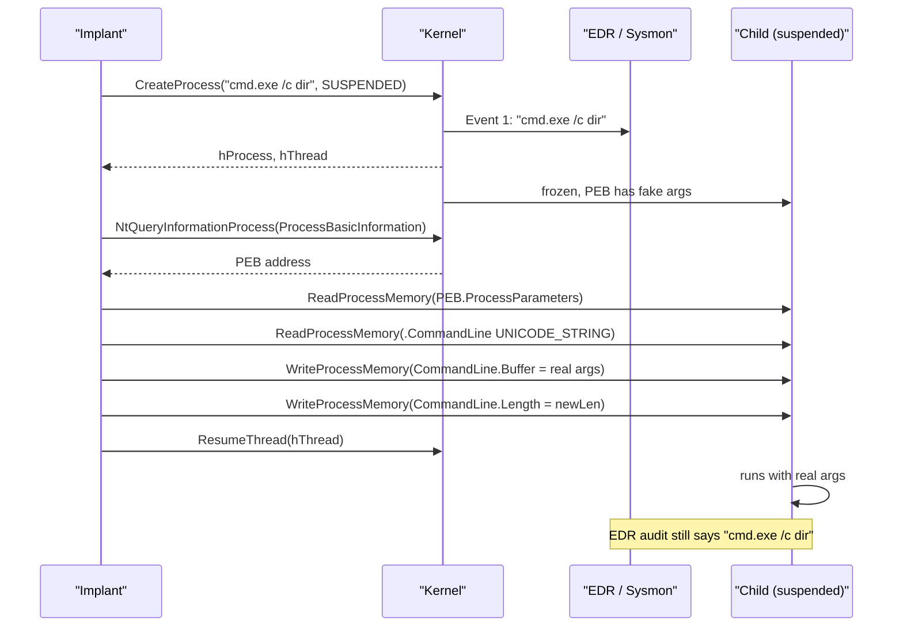

# Process argument spoofing

[← injection index](README.md) · [docs/index](../../index.md)

> **New to maldev injection?** Read the [injection/README.md
> vocabulary callout](README.md#primer--vocabulary) first.

## TL;DR

Spawn a child in `CREATE_SUSPENDED` with **fake** command-line arguments
(what EDR/Sysmon records at process creation), then rewrite the PEB's
`RTL_USER_PROCESS_PARAMETERS.CommandLine` `UNICODE_STRING` to the **real**
arguments before resuming. The process executes with the real args; the
audit trail shows the cover args. Not a shellcode injection on its own
— a creation-time disguise that pairs with the suspended-child injection
techniques.

| Trait | Value |
|---|---|
| **Target class** | Child (suspended) — disguise only, not execution |
| **Creates a new thread?** | n/a — disguise wrapper |
| **Uses `WriteProcessMemory`?** | Yes (~30 bytes — `UNICODE_STRING` header + new args) |
| **Stealth tier** | Medium — fools Sysmon/EDR process-creation logs; ETW `Microsoft-Windows-Kernel-Process` carries the original creation args separately |
| **Composes with** | [Early Bird APC](early-bird-apc.md), [Thread Hijack](thread-hijack.md) — the actual injection techniques on the same suspended child |

When to pick a different method:

- Want PPID disguise instead of arg disguise? → [PPID Spoofing](../evasion/ppid-spoofing.md) — sister technique, different field.
- Don't need a child process at all? → Self / Local / Remote methods (see [injection index](README.md)).
- Want BOTH disguises stacked? → Apply this + PPID Spoofing on the same `CREATE_SUSPENDED` call before any injection.

## Primer

Process-creation telemetry on Windows captures the command-line at the
moment `NtCreateUserProcess` runs. Sysmon Event 1 fires; EDRs snapshot
the args; the kernel callback `PsSetCreateProcessNotifyRoutineEx`
delivers them. Any monitoring tooling that keys on command-line content
sees what the kernel saw at that instant.

Argument spoofing exploits the gap between **creation** and **execution**.
The implant calls `CreateProcessW` with `CREATE_SUSPENDED` and a benign
command line (`cmd.exe /c dir`). The kernel records the benign args. The
implant then locates the suspended child's PEB, walks to
`ProcessParameters → CommandLine` (a `UNICODE_STRING`), and rewrites
its `Buffer` and `Length` with the real args before `ResumeThread`. The
process now executes with the real command line; the kernel's audit
record still says `dir`.

This is a **disguise**, not an injection. It is typically paired with
[`MethodEarlyBirdAPC`](early-bird-apc.md), [`MethodThreadHijack`](thread-hijack.md),
or other suspended-child techniques to make the visible command line of
the sacrificial child blend in.

## How it works



Steps:

1. `CreateProcessW(SUSPENDED, "cmd.exe /c dir")` — kernel records the
   fake args.
2. `NtQueryInformationProcess(ProcessBasicInformation)` — get the
   child's PEB.
3. `ReadProcessMemory` at `PEB+0x20` (x64) for the
   `RTL_USER_PROCESS_PARAMETERS` pointer.
4. `ReadProcessMemory` at `ProcessParameters+0x70` for the
   `CommandLine` `UNICODE_STRING`.
5. Encode the real command line as UTF-16LE; `WriteProcessMemory` into
   `CommandLine.Buffer`; update `CommandLine.Length`.
6. Caller resumes the thread when ready (or hands the suspended child
   off to a paired injection technique).

## API → godoc

[`pkg.go.dev/github.com/oioio-space/maldev/inject`](https://pkg.go.dev/github.com/oioio-space/maldev/inject) is the authoritative
reference for every exported symbol. This page teaches the
*concepts*; the godoc is the *specification*.

## Examples

### Simple

```go
import "github.com/oioio-space/maldev/inject"

pi, err := inject.SpawnWithSpoofedArgs(
    `C:\Windows\System32\cmd.exe`,
    `cmd.exe /c dir C:\                                        `,
    `cmd.exe /c whoami /priv`,
)
if err != nil { return err }
defer windows.CloseHandle(pi.Process)
defer windows.CloseHandle(pi.Thread)

// caller resumes when ready
_, _ = windows.ResumeThread(pi.Thread)
```

### Composed (spoofed args + Early Bird APC into the same child)

The spoofed-arg child is the perfect host for Early Bird APC: the
audit trail says `cmd.exe /c dir`, but the child runs the implant's
shellcode before its own entry point.

```go
pi, err := inject.SpawnWithSpoofedArgs(
    `C:\Windows\System32\cmd.exe`,
    `cmd.exe /c dir C:\                                        `,
    `cmd.exe /c echo benign`,
)
if err != nil { return err }

// Hand the suspended child to the Early Bird path. The package's
// EarlyBirdAPC injector takes a fresh ProcessPath; for an existing
// suspended child, drive the primitives directly:
//   - NtAllocateVirtualMemory(pi.Process, RW)
//   - NtWriteVirtualMemory(shellcode)
//   - NtProtectVirtualMemory(RX)
//   - NtQueueApcThread(pi.Thread, addr)
//   - ResumeThread(pi.Thread)
```

### Advanced (PPID spoof + arg spoof)

Combine with [`process/spoofparent`](../evasion/ppid-spoofing.md) to
also lie about the parent process — the audit trail then shows a
plausible parent + plausible args.

```go
import (
    "github.com/oioio-space/maldev/inject"
    "github.com/oioio-space/maldev/process/spoofparent"
)

token, err := spoofparent.AcquireParentToken("services.exe")
if err != nil { return err }
defer token.Close()

return spoofparent.RunAs(token, func() error {
    pi, err := inject.SpawnWithSpoofedArgs(
        `C:\Windows\System32\cmd.exe`,
        `cmd.exe /c dir C:\                                        `,
        `cmd.exe /c whoami /all`,
    )
    if err != nil { return err }
    _, _ = windows.ResumeThread(pi.Thread)
    return nil
})
```

### Complex (full chain: arg spoof + thread hijack + indirect syscalls)

```go
import (
    "github.com/oioio-space/maldev/evasion"
    "github.com/oioio-space/maldev/evasion/preset"
    "github.com/oioio-space/maldev/inject"
    wsyscall "github.com/oioio-space/maldev/win/syscall"
)

caller := wsyscall.New(wsyscall.MethodIndirect, nil)
_ = evasion.ApplyAll(preset.Stealth(), caller)

pi, err := inject.SpawnWithSpoofedArgs(
    `C:\Windows\System32\cmd.exe`,
    `cmd.exe /c dir C:\                                        `,
    `cmd.exe /c echo benign`,
)
if err != nil { return err }

// Now thread-hijack the spawned child instead of resuming it normally.
// The high-level inject.MethodThreadHijack assumes its own spawn; for
// an existing suspended child, replicate the read CONTEXT → mutate Rip
// → set CONTEXT → resume sequence — see thread-hijack.md.
```

## OPSEC & Detection

| Artefact | Where defenders look |
|---|---|
| Padded command line at creation time | EDR rules sometimes flag long whitespace runs in `cmd.exe` args |
| Cross-process `WriteProcessMemory` into a freshly-spawned child | EDR userland hooks + ETW-Ti `WriteVirtualMemory` |
| `RTL_USER_PROCESS_PARAMETERS.CommandLine` mutation between `CreateProcess` and `ResumeThread` | High-end EDRs (CrowdStrike, MDE, SentinelOne) compare the live PEB at multiple checkpoints — strong signal when fake ≠ real |
| Live `GetCommandLineW()` ≠ EDR-recorded command line | Endpoint scrapers that re-read the PEB after creation catch the lie |

**D3FEND counters:**

- [D3-PSA](https://d3fend.mitre.org/technique/d3f:ProcessSpawnAnalysis/)
  — multi-checkpoint command-line comparison.
- [D3-EAL](https://d3fend.mitre.org/technique/d3f:ExecutableAllowlisting/)
  — WDAC validates execution but does not prevent the spoof itself.

**Hardening for the operator:** keep `fakeArgs` plausible (no obvious
padding patterns); pair with PPID spoofing so the child has both a
plausible parent and plausible args; route the cross-process Nt calls
through indirect syscalls; mind that the high-end EDRs that re-snapshot
the PEB beat this technique.

## MITRE ATT&CK

| T-ID | Name | Sub-coverage | D3FEND counter |
|---|---|---|---|
| [T1564.010](https://attack.mitre.org/techniques/T1564/010/) | Hide Artifacts: Process Argument Spoofing | PEB rewrite between creation and resume | D3-PSA |
| [T1036.005](https://attack.mitre.org/techniques/T1036/005/) | Masquerading: Match Legitimate Name or Location | combine with a legitimate `exePath` for full audit-trail disguise | D3-PSA |

## Limitations

- **`MaximumLength` cap.** The spoofed buffer cannot grow beyond
  what `CreateProcessW` allocated. Pad `fakeArgs` to leave room.
- **Live PEB scrapers defeat it.** EDRs that re-read `PEB.ProcessParameters.CommandLine`
  after process creation see the real args. The technique only fools
  consumers that snapshot at creation time (Sysmon Event 1, basic
  EDR, kernel callback).
- **Not an injection.** `SpawnWithSpoofedArgs` only rewrites the PEB.
  Pair with another technique to actually run shellcode in the child.
- **Cross-process write fires.** `WriteProcessMemory` runs twice
  (CommandLine buffer + length). EDR-Ti will see it.
- **Whitespace padding is fingerprintable.** Some EDR rules look for
  unusually long padding inside command-line strings.

## See also

- [Early Bird APC](early-bird-apc.md) — pair to actually run shellcode
  in the spoofed-args child.
- [Thread Hijack](thread-hijack.md) — alternate trigger for the
  suspended child.
- [`process/spoofparent`](../evasion/ppid-spoofing.md) — pair to
  spoof the parent as well.
- [Adam Chester / xpn, *Process arg spoofing*, 2018](https://blog.xpnsec.com/how-to-argue-like-cobalt-strike/)
  — original public write-up.
