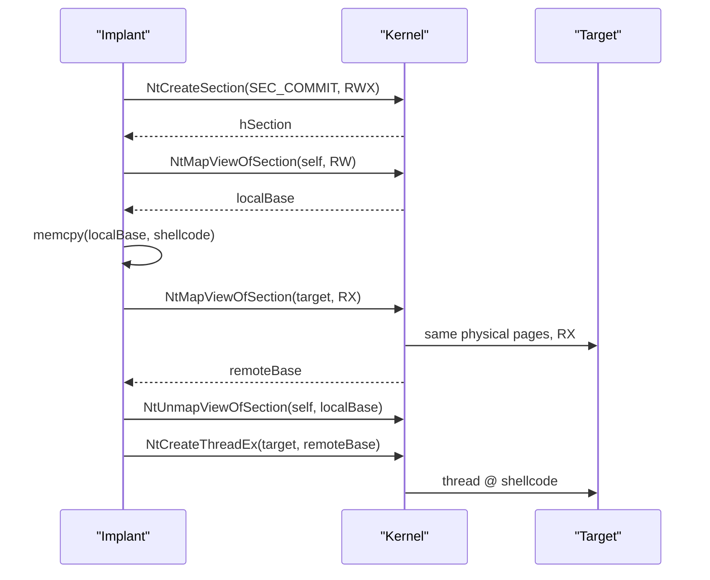

# Section mapping injection

[← injection index](README.md) · [docs/index](../../index.md)

> **New to maldev injection?** Read the [injection/README.md
> vocabulary callout](README.md#primer--vocabulary) first.

## TL;DR

Cross-process injection **without `WriteProcessMemory`**. Create a
shared section, map a writable view in the implant's process, copy the
shellcode locally, then map a read-execute view of the **same** section
in the target. Both views point at the same physical pages, so the
local `memcpy` is instantly visible across the boundary. Trigger via
`NtCreateThreadEx` (or whichever executor the caller chooses).

| Trait | Value |
|---|---|
| **Target class** | Remote (existing PID) |
| **Creates a new thread?** | Yes (caller chooses the executor — typically `NtCreateThreadEx`) |
| **Uses `WriteProcessMemory`?** | **No** — the bypass-WPM is the whole point |
| **Stealth tier** | High — no WPM signal; section-create + map-view is harder to baseline against legitimate IPC |

When to pick a different method:

- Want to avoid creating a thread too? → [Kernel Callback Table](kernel-callback-table.md), [NtQueueApcThreadEx](nt-queue-apc-thread-ex.md).
- Want a file-backed image mapping (looks like a real DLL)? → [Phantom DLL hollowing](phantom-dll.md).
- Don't need cross-process? → [Module Stomping](module-stomping.md) does the section trick locally.

## Primer

`WriteProcessMemory` is one of the loudest cross-process syscalls.
EDRs hook it, ETW-Ti reports it, and a single use is enough to flag
the chain. Section mapping sidesteps it entirely by exploiting Windows'
shared-memory primitive: `NtCreateSection` returns a section object
backed by the page file (or the file system); `NtMapViewOfSection`
projects views of that section into arbitrary processes. Two views
of the same section point at the **same** physical pages — modifying
one updates the other.

The implant maps the section RW into itself, writes shellcode through
the local view, then maps the same section RX into the target. No
cross-process write was issued. The remaining cross-process call is the
final trigger (`NtCreateThreadEx`, or anything else the caller wants).

## How it works



Steps:

1. **`NtCreateSection`** with `SEC_COMMIT | PAGE_EXECUTE_READWRITE`,
   sized to the shellcode.
2. **`NtMapViewOfSection`** into the local process with `PAGE_READWRITE`.
3. **memcpy** the shellcode through the local view.
4. **`NtMapViewOfSection`** into the target with `PAGE_EXECUTE_READ`.
   Both views share physical pages; the data is already there.
5. **`NtUnmapViewOfSection`** locally — no longer needed.
6. **`NtCreateThreadEx`** at `remoteBase` (or any other trigger).

## API → godoc

[`pkg.go.dev/github.com/oioio-space/maldev/inject`](https://pkg.go.dev/github.com/oioio-space/maldev/inject) is the authoritative
reference for every exported symbol. This page teaches the
*concepts*; the godoc is the *specification*.

## Examples

### Simple

```go
import "github.com/oioio-space/maldev/inject"

if err := inject.SectionMapInject(targetPID, shellcode, nil); err != nil {
    return err
}
```

### Composed (indirect syscalls)

```go
import (
    "github.com/oioio-space/maldev/inject"
    wsyscall "github.com/oioio-space/maldev/win/syscall"
)

caller := wsyscall.New(wsyscall.MethodIndirect,
    wsyscall.Chain(wsyscall.NewHellsGate(), wsyscall.NewHalosGate()))
return inject.SectionMapInject(targetPID, shellcode, caller)
```

### Advanced (full evasion stack)

```go
import (
    "github.com/oioio-space/maldev/evasion"
    "github.com/oioio-space/maldev/evasion/preset"
    "github.com/oioio-space/maldev/inject"
    wsyscall "github.com/oioio-space/maldev/win/syscall"
)

caller := wsyscall.New(wsyscall.MethodIndirect,
    wsyscall.Chain(wsyscall.NewHellsGate(), wsyscall.NewHalosGate()))
_ = evasion.ApplyAll(preset.Stealth(), caller)

return inject.SectionMapInject(targetPID, shellcode, caller)
```

### Complex (encrypt + decrypt + section map + wipe)

```go
import (
    "github.com/oioio-space/maldev/cleanup/memory"
    "github.com/oioio-space/maldev/crypto"
    "github.com/oioio-space/maldev/evasion"
    "github.com/oioio-space/maldev/evasion/preset"
    "github.com/oioio-space/maldev/inject"
    wsyscall "github.com/oioio-space/maldev/win/syscall"
)

caller := wsyscall.New(wsyscall.MethodIndirect,
    wsyscall.Chain(wsyscall.NewHellsGate(), wsyscall.NewHalosGate()))
_ = evasion.ApplyAll(preset.Stealth(), caller)

shellcode, err := crypto.DecryptAESGCM(aesKey, encrypted)
if err != nil { return err }
memory.SecureZero(aesKey)

if err := inject.SectionMapInject(targetPID, shellcode, caller); err != nil {
    return err
}
memory.SecureZero(shellcode)
```

## OPSEC & Detection

| Artefact | Where defenders look |
|---|---|
| `NtCreateSection` followed by two `NtMapViewOfSection` to different processes | EDR-Ti correlates the chain — strong signal in modern products |
| Cross-process `NtMapViewOfSection` at all | Sysmon does not log; EDR userland hooks + ETW Threat Intelligence (`Microsoft-Windows-Threat-Intelligence`) emit `MapViewOfSection` events |
| `NtCreateThreadEx` start address inside a non-image RX mapping | `PsSetCreateThreadNotifyRoutine` callback flags non-image-backed start addresses |
| Page-file-backed section with `PAGE_EXECUTE_READWRITE` initial protection | EDR allocation telemetry — RWX sections without an image backing are unusual |

**D3FEND counters:**

- [D3-PSA](https://d3fend.mitre.org/technique/d3f:ProcessSpawnAnalysis/)
  — flags the section + remote-thread chain.
- [D3-PCSV](https://d3fend.mitre.org/technique/d3f:ProcessCodeSegmentVerification/)
  — verifies the start address against image segments.
- [D3-MA](https://d3fend.mitre.org/technique/d3f:MemoryAllocation/)
  — anomaly on cross-process executable mappings.

**Hardening for the operator:** trigger via a callback path on the
remote side (e.g. hijack a thread's APC queue with
[`NtQueueApcThreadEx`](nt-queue-apc-thread-ex.md)) to avoid
`NtCreateThreadEx`; pair with [`evasion/unhook`](../evasion/ntdll-unhooking.md)
to defeat userland hooks on `NtMapViewOfSection`.

## MITRE ATT&CK

| T-ID | Name | Sub-coverage | D3FEND counter |
|---|---|---|---|
| [T1055.001](https://attack.mitre.org/techniques/T1055/001/) | Process Injection: DLL Injection | shared-section variant — no `WriteProcessMemory` | D3-PSA |

## Limitations

- **`NtCreateThreadEx` still fires** at the end of the chain. The
  technique avoids `WriteProcessMemory`, not thread-creation telemetry.
- **No PPL targets.** Cross-process section mapping into a Protected
  Process Light is denied.
- **Initial section protection is RWX.** EDRs that key on
  `PAGE_EXECUTE_READWRITE` allocations flag the creation regardless
  of the eventual `RX`-only target view.
- **Section persists in target.** No automatic cleanup on the remote
  side. The mapped pages stay until the target exits.
- **Caller `nil` falls back to userland-hooked stubs.** Prefer an
  indirect-syscall `Caller` for any non-trivial EDR posture.

## See also

- [CreateRemoteThread](create-remote-thread.md) — same target shape,
  uses `NtWriteVirtualMemory`.
- [Phantom DLL](phantom-dll.md) — section mapping where the section
  is image-backed by a System32 DLL (extra disguise).
- [`win/syscall`](../syscalls/direct-indirect.md) — direct/indirect
  syscall modes.
- [`evasion/unhook`](../evasion/ntdll-unhooking.md) — pair to defeat
  userland hooks on the section APIs.
- [Aleksandra Doniec, *Process Doppelgänging vs section mapping*](https://www.malwarebytes.com/blog/news/2018/01/malware-crypters-the-deceptive-first-layer)
  — comparison of section-based injection variants.
