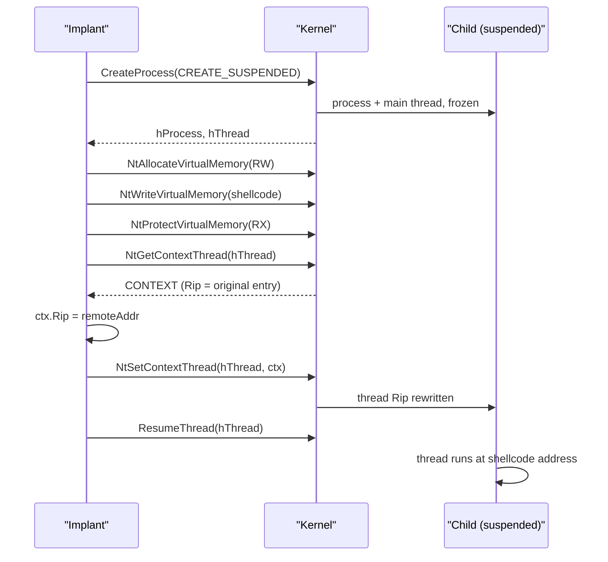

# Thread execution hijacking

[← injection index](README.md) · [docs/index](../../index.md)

> **New to maldev injection?** Read the [injection/README.md
> vocabulary callout](README.md#primer--vocabulary) first.

## TL;DR

Spawn a `CREATE_SUSPENDED` child, allocate + write + protect shellcode
in its address space, then mutate its main thread's saved register
state so `RIP` points at the shellcode before resuming. No new thread,
no APC — the existing thread is **redirected** at the CPU-context
level. Stealth tier: medium; the trade-off is a `NtSetContextThread`
on a non-debugger flow, which EDR specifically watches.

| Trait | Value |
|---|---|
| **Target class** | Child (suspended) |
| **Creates a new thread?** | No — redirects the existing main thread via `NtSetContextThread` |
| **Uses `WriteProcessMemory`?** | Yes (`NtWriteVirtualMemory`) |
| **Stealth tier** | Medium — no `Create*Thread`, no APC; `NtSetContextThread` outside debug context is the EDR signal |
| **Bypasses CreateThread callbacks?** | Yes — same reasoning as Early Bird APC |

When to pick a different method:

- Want APC delivery instead of register mutation? → [Early Bird APC](early-bird-apc.md) — sister technique, same setup, different trigger.
- Want to inject into an existing PID? → Thread Hijack works on any thread you can `OpenProcess(PROCESS_VM_*)` — but the existing thread interrupt is louder than APC.
- Want the spawn itself to look like another process? → Pair with [Process Arg Spoofing](process-arg-spoofing.md).

## Primer

`CreateRemoteThread` creates a new thread; `EarlyBird` queues an APC.
Thread Execution Hijacking does neither — it abuses the fact that
Windows lets a debugger (or anything with `THREAD_GET_CONTEXT |
THREAD_SET_CONTEXT`) pause a thread, read its full register file, edit
the instruction pointer, write the registers back, and resume. The
implant takes the same path: pause → read CONTEXT → write `Rip` to the
shellcode address → write back → `ResumeThread`.

The result is that the sacrificial child's main thread starts running
at the shellcode address instead of the original entry point. No
`Create*Thread*` event ever fires. The trade-off is the
`NtSetContextThread` system call, which is unusual outside debugger
workflows and is itself instrumented by every modern EDR.

The legacy alias `MethodProcessHollowing` points at this technique;
**genuine PE hollowing** (overwriting the child's image with a different
PE) is not implemented in this package.

## How it works



Steps:

1. **Spawn** the sacrificial child suspended.
2. **Allocate / write / protect** the shellcode in the child.
3. **Get** the main thread's CONTEXT (`NtGetContextThread`) — note
   that the kernel returns the saved register file because the thread
   is suspended.
4. **Mutate** `ctx.Rip` (or `Eip` on x86) to the shellcode address.
5. **Set** the modified CONTEXT back (`NtSetContextThread`).
6. **Resume** the thread.

## API → godoc

[`pkg.go.dev/github.com/oioio-space/maldev/inject`](https://pkg.go.dev/github.com/oioio-space/maldev/inject) is the authoritative
reference for every exported symbol. This page teaches the
*concepts*; the godoc is the *specification*.

## Examples

### Simple

```go
cfg := &inject.WindowsConfig{
    Config: inject.Config{
        Method:      inject.MethodThreadHijack,
        ProcessPath: `C:\Windows\System32\notepad.exe`,
    },
}
inj, err := inject.NewWindowsInjector(cfg)
if err != nil { return err }
return inj.Inject(shellcode)
```

### Composed (indirect syscalls, hardened sacrificial parent)

```go
inj, err := inject.Build().
    Method(inject.MethodThreadHijack).
    ProcessPath(`C:\Windows\System32\RuntimeBroker.exe`).
    IndirectSyscalls().
    Create()
if err != nil { return err }
return inj.Inject(shellcode)
```

### Advanced (preset evasion + thread hijack)

```go
import (
    "github.com/oioio-space/maldev/evasion"
    "github.com/oioio-space/maldev/evasion/preset"
    "github.com/oioio-space/maldev/inject"
)

_ = evasion.ApplyAll(preset.Stealth(), nil)

inj, err := inject.Build().
    Method(inject.MethodThreadHijack).
    ProcessPath(`C:\Windows\System32\WerFault.exe`).
    IndirectSyscalls().
    Use(inject.WithXORKey(0xA5)).
    Create()
if err != nil { return err }
return inj.Inject(shellcode)
```

### Complex (Pipeline equivalent)

`Pipeline` does not have a packaged `ThreadHijackExecutor` (it would
need a saved CONTEXT and a thread handle); the named-method path is
the supported one. For experimental setups, replicate the logic in
[`inject/injector_remote_windows.go`](../../../inject/injector_remote_windows.go).

## OPSEC & Detection

| Artefact | Where defenders look |
|---|---|
| `CREATE_SUSPENDED` child of an unusual parent | Sysmon Event 1 (CreationFlags) |
| `NtSetContextThread` on a thread of a freshly-spawned process | EDR-Ti providers, userland hooks. Outside debugger workflows this is a high-fidelity signal |
| Cross-process `NtWriteVirtualMemory` | EDR userland + ETW |
| Modified `Rip` in CONTEXT pointing into a non-image-backed region | EDR memory scanners on the child |
| Process tree mismatch | `notepad.exe` child of a non-`explorer.exe` parent |

**D3FEND counters:**

- [D3-PSA](https://d3fend.mitre.org/technique/d3f:ProcessSpawnAnalysis/)
  — `CREATE_SUSPENDED` + register mutation is the textbook hollowing-family chain.
- [D3-PCSV](https://d3fend.mitre.org/technique/d3f:ProcessCodeSegmentVerification/)
  — verifies thread `Rip` against image segments.

**Hardening for the operator:** route NT calls through indirect
syscalls; pair with PPID spoofing; choose a sacrificial process whose
own initialisation does *not* race the shellcode (avoid heavyweight
binaries that spawn workers immediately).

## MITRE ATT&CK

| T-ID | Name | Sub-coverage | D3FEND counter |
|---|---|---|---|
| [T1055.003](https://attack.mitre.org/techniques/T1055/003/) | Process Injection: Thread Execution Hijacking | suspended-child variant | D3-PSA |

## Limitations

- **x64 only** in the current implementation (`CONTEXT.Rip`). x86
  would need `Eip` and a different `CONTEXT` flags mask.
- **Original entry point never runs.** The sacrificial process never
  reaches its real `main`. If the shellcode does not hand control
  back, the child appears to have started and immediately died — a
  small but non-zero behavioural anomaly.
- **`NtSetContextThread` is high-signal.** EDRs that miss the
  `CREATE_SUSPENDED` flag still catch the context modification.
  Direct/indirect syscalls help against userland hooks but not against
  ETW-Ti.
- **Race-prone for fast spawns.** Some sacrificial binaries
  (`csrss.exe` adjacents, lightly-instrumented processes) finish
  initial setup before `NtGetContextThread` returns. Stick to
  well-behaved utilities.

## See also

- [Early Bird APC](early-bird-apc.md) — same suspended-child shape,
  uses an APC instead of register mutation.
- [CreateRemoteThread](create-remote-thread.md) — the loud baseline.
- [Process Argument Spoofing](process-arg-spoofing.md) — pair to mask
  the child's command line as a benign tool.
- [`process/spoofparent`](../evasion/ppid-spoofing.md) — pair to set a
  realistic parent for the sacrificial child.
- [SafeBreach Labs, *Process Hollowing & Doppelgänging*, 2017](https://www.safebreach.com/blog/2017/12/safebreach-labs-discovers-doppelganging-stealth-injection/)
  — taxonomy of register-mutation injection.
