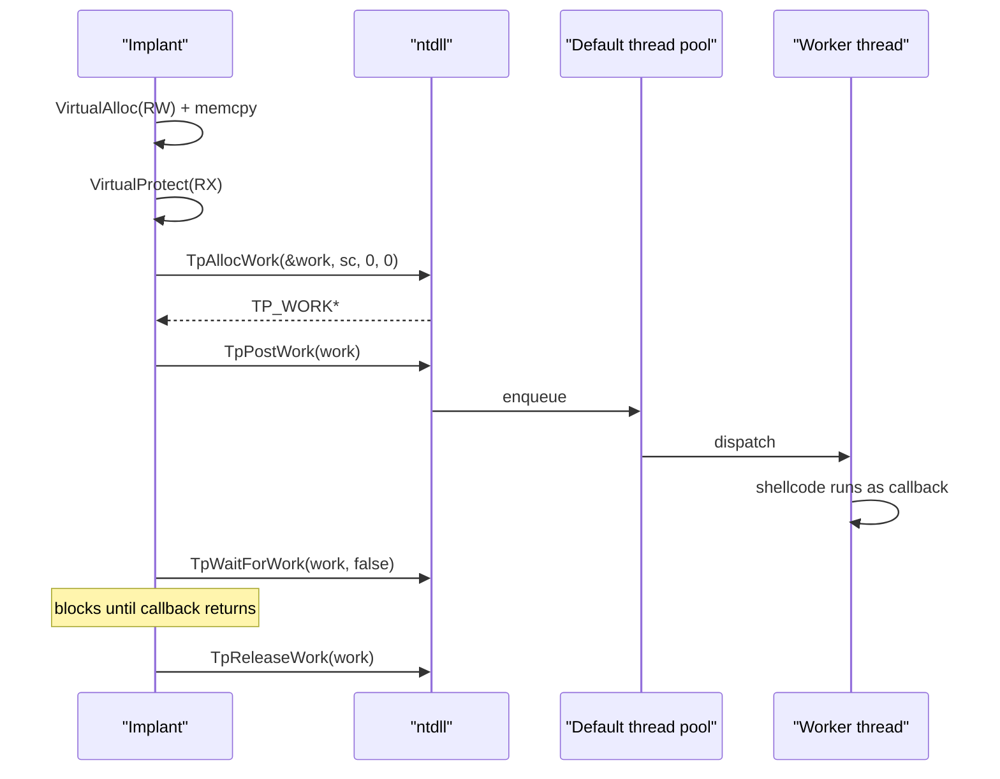

# Thread pool injection

[← injection index](README.md) · [docs/index](../../index.md)

> **New to maldev injection?** Read the [injection/README.md
> vocabulary callout](README.md#primer--vocabulary) first.

## TL;DR

Drop a work item onto the process's default thread pool via the
undocumented `TpAllocWork` / `TpPostWork` / `TpReleaseWork` triplet in
`ntdll`. An idle worker thread that already exists picks the item up
and runs the shellcode as a normal callback. No `CreateThread`, no
`NtCreateThreadEx`, no APC. Local-only.

| Trait | Value |
|---|---|
| **Target class** | Local (current process) |
| **Creates a new thread?** | No — reuses one of the always-running pool workers |
| **Uses `WriteProcessMemory`?** | No — caller pre-allocates RX in their own process |
| **Stealth tier** | High — no Create*Thread / Queue*APC / SetContext call enters EDR's view |
| **CET-affected?** | Pool dispatcher may enforce ENDBR64 on Win11 24H2+. Use [`inject.ThreadPoolExecCET`](#threadpoolexeccet) for auto-wrapping. |

When to pick a different method:

- Want callback-via-existing-API rather than work-queue? → [Callback execution](callback-execution.md).
- Need Self but want explicit thread (not pool)? → [EtwpCreateEtwThread](etwp-create-etw-thread.md).
- Need to inject into a different process? → ThreadPool is Local-only. See [CreateRemoteThread](create-remote-thread.md) / [Section Mapping](section-mapping.md).

## Primer

Every Windows process has a default thread pool — a small ring of
worker threads created by `RtlpInitializeThreadPool` early in process
startup. The pool's purpose is to dispatch arbitrary work items
submitted by `kernel32!QueueUserWorkItem`, `ntdll!TpPostWork`, and the
modern `CreateThreadpoolWork` family. The implant abuses the
**ntdll-private** layer: `TpAllocWork(callback, ctx, env)` builds a
`TP_WORK` object whose callback pointer is the shellcode, `TpPostWork`
pushes it onto the queue, and one of the existing workers dequeues
and dispatches it.

The result is execution on a thread that the implant did not create
and the EDR did not see being created. The same `TP_WORK` object is
the textbook plumbing every well-behaved Windows process uses dozens of
times per second; the only anomaly is the callback target itself.

## How it works



Steps:

1. **Allocate / write / protect** in the current process — RW first,
   then RX.
2. **`TpAllocWork`** — register the shellcode as the callback.
3. **`TpPostWork`** — submit the work item.
4. **Worker dispatch** — an existing pool worker dequeues and calls the
   callback (the shellcode).
5. **`TpWaitForWork`** — block to guarantee completion before
   `TpReleaseWork` frees the object underneath the running callback.
6. **`TpReleaseWork`** — clean up.

## API → godoc

[`pkg.go.dev/github.com/oioio-space/maldev/inject`](https://pkg.go.dev/github.com/oioio-space/maldev/inject) is the authoritative
reference for every exported symbol. This page teaches the
*concepts*; the godoc is the *specification*.

## Examples

### Simple

```go
import "github.com/oioio-space/maldev/inject"

if err := inject.ThreadPoolExec(shellcode); err != nil {
    return err
}
```

### Simple — future-proofed (CET-aware)

```go
// Same code, no per-call decisions. Wraps with cet.Wrap when
// cet.Enforced() flips true on a future Win build; no-op today.
if err := inject.ThreadPoolExecCET(shellcode); err != nil {
    return err
}
```

### Composed (ModuleStomp + manual TpAllocWork)

`ThreadPoolExec` is a one-shot helper. To make the callback target
image-backed, stomp first and call `TpAllocWork` manually — see
[`inject/threadpool_windows.go`](../../../inject/threadpool_windows.go)
for the call shape:

```go
import "github.com/oioio-space/maldev/inject"

addr, err := inject.ModuleStomp("msftedit.dll", shellcode)
if err != nil { return err }
// dispatch via TpAllocWork(addr, ...) — see source for full snippet
return inject.ExecuteCallback(addr, inject.CallbackRtlRegisterWait)
```

### Advanced (chain with evasion preset)

```go
import (
    "github.com/oioio-space/maldev/evasion"
    "github.com/oioio-space/maldev/evasion/preset"
    "github.com/oioio-space/maldev/inject"
)

_ = evasion.ApplyAll(preset.Stealth(), nil)
return inject.ThreadPoolExec(shellcode)
```

### Complex (decrypt + thread-pool + wipe)

```go
import (
    "github.com/oioio-space/maldev/cleanup/memory"
    "github.com/oioio-space/maldev/crypto"
    "github.com/oioio-space/maldev/evasion"
    "github.com/oioio-space/maldev/evasion/preset"
    "github.com/oioio-space/maldev/inject"
)

_ = evasion.ApplyAll(preset.Stealth(), nil)

shellcode, err := crypto.DecryptAESGCM(aesKey, encrypted)
if err != nil { return err }
memory.SecureZero(aesKey)

if err := inject.ThreadPoolExec(shellcode); err != nil { return err }
memory.SecureZero(shellcode)
```

## OPSEC & Detection

| Artefact | Where defenders look |
|---|---|
| `TP_WORK` callback pointer outside any image | EDR memory scanners walk active pool work items (CrowdStrike Falcon Sensor, MDE Live Response) |
| RW → RX flip in current process | `NtProtectVirtualMemory` telemetry — every modern EDR keys on the protection transition |
| Pool worker stack containing addresses outside any module | Stack-walking telemetry on the thread-pool dispatcher |

**D3FEND counters:**

- [D3-PCSV](https://d3fend.mitre.org/technique/d3f:ProcessCodeSegmentVerification/)
  — verifies the callback against image segments.
- [D3-EAL](https://d3fend.mitre.org/technique/d3f:ExecutableAllowlisting/)
  — WDAC blocks RX flips outside images.

**Hardening for the operator:** pair with [`ModuleStomp`](module-stomping.md)
so the callback pointer is image-backed; spread allocations across
multiple smaller pages to reduce signature surface; sleep-mask the
shellcode region between activations
([`evasion/sleepmask`](../evasion/sleep-mask.md)).

## MITRE ATT&CK

| T-ID | Name | Sub-coverage | D3FEND counter |
|---|---|---|---|
| [T1055.001](https://attack.mitre.org/techniques/T1055/001/) | Process Injection: DLL Injection | thread-pool variant — no thread creation | D3-PCSV |

## Limitations

- **Local only.** Targets the current process's pool. There is no
  cross-process variant — the `TP_WORK` object lives in the calling
  process.
- **Synchronous via `TpWaitForWork`.** The helper blocks until the
  callback returns. Long-running shellcode should detach internally
  (spawn a fiber or thread).
- **CET dispatcher is not currently enforced** on the thread-pool
  path (unlike `RtlRegisterWait`, which is). Plain `ThreadPoolExec`
  works as-is. The future-proof `ThreadPoolExecCET` wrapper
  auto-prepends `ENDBR64` via `cet.Wrap` when `cet.Enforced()`
  returns true, so an implant built against this helper survives
  the day Microsoft flips the dispatcher to ENDBR64-required.
  Cost on non-enforced hosts: 4 bytes of shellcode prefix.
- **Region not freed.** The RX page persists until process exit unless
  the implant calls [`cleanup/memory.WipeAndFree`](../cleanup/memory-wipe.md).
- **Undocumented APIs.** `TpAllocWork` / `TpPostWork` /
  `TpReleaseWork` are not in the SDK; future Windows builds may
  rename or relocate them.

## See also

- [Callback execution](callback-execution.md) — the broader family;
  thread pool is the worker-thread variant.
- [Module Stomping](module-stomping.md) — pair to make the callback
  pointer image-backed.
- [`evasion/sleepmask`](../evasion/sleep-mask.md) — mask the RX
  region between dispatches.
- [Modexp, *Calling Conventions in Windows*](https://modexp.wordpress.com/2019/06/09/threadpoolwait/)
  — original public write-up of `TpAllocWork`-based injection.
