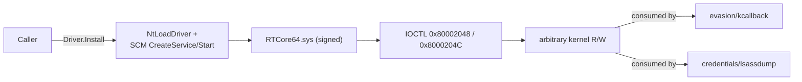

---
---

# Kernel-mode primitives (`kernel/*`)

[← maldev README](../../../README.md) · [docs/index](../../index.md)

The `kernel/*` package tree exposes **userland-callable kernel
read/write primitives** by abusing signed-but-vulnerable third-party
drivers (BYOVD). Userland obtains kernel R/W without loading an
unsigned driver — defeats HVCI on hosts older than the 2021-09
vulnerable-driver block-list update.

> **Where to start (novice path):**
>
> The `kernel/*` packages are foundations consumed by higher-layer
> techniques (LSASS PPL bypass, kernel-callback removal). Most
> operators land here from one of those.
>
> 1. Read [`byovd-rtcore64`](byovd-rtcore64.md) once to understand
>    the BYOVD pattern (load RTCore64.sys, IOCTL for kernel R/W,
>    HVCI block-list cutoff).
> 2. Then go back to your higher-layer use case:
>    - LSASS PPL bypass → [`credentials/lsassdump.Unprotect`](../credentials/lsassdump.md)
>    - Kernel-callback removal → [`evasion/kernel-callback-removal`](../evasion/kernel-callback-removal.md)
> 3. The decision tree below maps every common need to the
>    higher-layer entry point.

## Decision tree

| Operator question | Package / page |
|---|---|
| "I need to wipe a kernel-callback array." | [`evasion/kcallback`](../evasion/kernel-callback-removal.md) feeds on this primitive |
| "I need to dump LSASS bypassing PPL." | [`credentials/lsassdump`](../credentials/lsassdump.md) |
| "I need a signed BYOVD driver to install." | [`kernel/driver/rtcore64`](byovd-rtcore64.md) |

## Per-package pages

- [byovd-rtcore64.md](byovd-rtcore64.md) — RTCore64.sys
  (CVE-2019-16098). Microsoft-attested signed; refused on HVCI hosts
  ≥ 2021-09 vulnerable-driver block-list.

## Common contract

Every concrete BYOVD driver implements three interfaces from the
umbrella package:

- [`kernel/driver.Reader`](https://pkg.go.dev/github.com/oioio-space/maldev/kernel/driver#Reader)
  — `ReadKernel(addr, buf) (int, error)`.
- [`kernel/driver.ReadWriter`](https://pkg.go.dev/github.com/oioio-space/maldev/kernel/driver#ReadWriter)
  — adds `WriteKernel(addr, data)`.
- [`kernel/driver.Lifecycle`](https://pkg.go.dev/github.com/oioio-space/maldev/kernel/driver#Lifecycle)
  — `Install / Uninstall / Loaded`. Idempotent install; best-effort
  uninstall.

Sentinel errors: `ErrNotImplemented`, `ErrNotLoaded`,
`ErrPrivilegeRequired` (caller lacks SeLoadDriverPrivilege).

## MITRE ATT&CK rollup

| ID | Technique | Owners |
|---|---|---|
| T1014 | Rootkit | kernel/driver, kernel/driver/rtcore64 |
| T1543.003 | Create or Modify System Process: Windows Service | service install path |
| T1068 | Exploitation for Privilege Escalation | IOCTL R/W primitive |

## See also

- [`docs/techniques/evasion/kernel-callback-removal.md`](../evasion/kernel-callback-removal.md)
- [`docs/techniques/credentials/lsassdump.md`](../credentials/lsassdump.md)
- [`docs/architecture.md`](../../architecture.md) — layering rules
