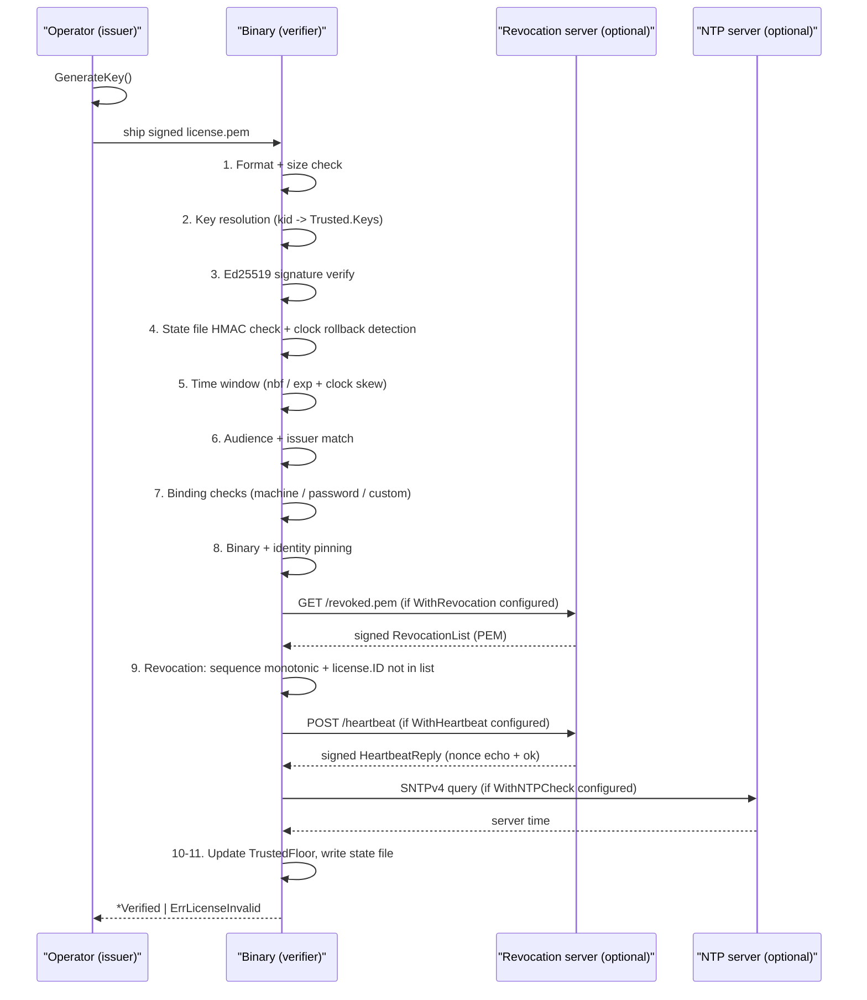

# License framing for authorised tooling

> Defensive primitive that frames which binaries are allowed to run, by whom,
> on which machines, until when, under what bindings. Cryptographically signed;
> offline-verifiable; optional online revocation and heartbeat.

## TL;DR

| Aspect | Value |
|:---|:---|
| Package | `github.com/oioio-space/maldev/license` |
| Role | Defensive — authorisation gate inside research binaries |
| MITRE ATT&CK | N/A (no attack technique exercised) |
| Detection level | N/A (no on-host artefacts emitted) |
| Signing | Ed25519, PEM-armored canonical JSON |
| Bindings | machine ID (list), password (argon2id), custom k/v (extensible) |
| Online checks | Pluggable revocation + heartbeat (both optional) |

## What it does

The `license` package lets an operator issue a signed token that authorises a
specific binary — for a named subject, on a list of machines, behind a
passphrase, until a given date — and verifies that token at runtime inside the
binary. The signed body covers every authorisation field: subject, audience,
expiry, bindings, binary hash, and an optional embedded identity digest. A
single `Verify` call enforces all constraints in a cheap-to-expensive order and
returns an opaque `ErrLicenseInvalid` on any failure.

The package is entirely defensive: it restricts what authorised binaries can do
and who may run them, rather than enabling any offensive technique.

## Vocabulary

| Term | Meaning |
|:---|:---|
| **License** | A signed token that authorises one binary. PEM-armored canonical JSON on disk. |
| **KeyID (kid)** | Short identifier that names the signing key. Enables key rotation without re-issuing all licenses. |
| **Binding** | A constraint embedded in the license. At `Verify` time each binding must have matching caller-provided evidence. |
| **Audience (aud)** | List of binary names the license permits. An empty audience is a wildcard (with a warning). |
| **Trusted** | The map of `kid → ed25519.PublicKey` a verifier accepts. New keys can be added without removing old ones. |
| **RevocationSource** | Pluggable interface (`Fetch(ctx) ([]byte, error)`) delivering signed revocation lists. Builtins: `HTTPSource`, `FileSource`, `EmbedSource`, `MultiSource`. |
| **Identity** | Optional 32-byte build-time blob embedded in the binary via `//go:embed`. Survives `cmd/packer` transformations. |
| **TrustedFloor** | The highest server timestamp ever observed (heartbeat or revocation list). Rejects local clock rollback below this floor. |
| **State file** | HMAC-protected JSON file persisting `TrustedFloor`, `LastSeenLocal`, and the last successful fetch timestamps. HMAC key is derived from the license signature and the host fingerprint. |

## How it works

### Issuing flow

1. The operator calls `GenerateKey()` once per key rotation period and saves
   `MarshalPrivateKey` / `MarshalPublicKey` to disk.
2. `Issue(IssueOptions{...})` builds a `License` struct, canonically marshals
   it (deterministic, sorted-key JSON), signs it as
   `ed25519.Sign(priv, "maldev-license-v1\x00" || canonical(License))`,
   wraps the signed body in a `signedLicense`, and encodes the whole thing as
   a PEM block of type `MALDEV LICENSE`.
3. The resulting `.pem` file is distributed out-of-band to the licensee.

### Verification flow



Each step fails fast and returns the opaque `ErrLicenseInvalid`. The internal
cause (one of 17 enum values) is only emitted to the injected `slog.Logger`,
never to the caller, so an attacker cannot distinguish which constraint failed.

## Usage

### Minimal offline

```go
package main

import (
    "fmt"
    "log"
    "time"

    "github.com/oioio-space/maldev/license"
)

func main() {
    // Operator side: generate key and issue license.
    pub, priv, err := license.GenerateKey()
    if err != nil {
        log.Fatal(err)
    }

    data, err := license.New(priv, "alice@example.com", 6*30*24*time.Hour)
    if err != nil {
        log.Fatal(err)
    }

    // Binary side: verify with the matching public key.
    v, err := license.Verify(data, license.Trusted{
        Keys: map[string]ed25519.PublicKey{"default": pub},
    })
    if err != nil {
        log.Fatal("access denied")
    }
    fmt.Println("licensed to:", v.Subject)
}
```

### Full options issue + verify

```go
package main

import (
    "context"
    "crypto/ed25519"
    "log/slog"
    "os"
    "time"

    "github.com/oioio-space/maldev/license"
    "github.com/oioio-space/maldev/license/hostid"
    "github.com/oioio-space/maldev/license/revoke"
)

func main() {
    // Operator: load private key from disk.
    privPEM, _ := os.ReadFile("issuer-priv.pem")
    priv, _ := license.ParsePrivateKey(privPEM)

    // Operator: load machine fingerprint for the target machine.
    mid, _ := hostid.Local()

    // Operator: build a password binding.
    pwBind, _ := license.BindPassword("s3cr3t-phrase")

    // Operator: issue a constrained license.
    data, _ := license.Issue(license.IssueOptions{
        PrivateKey: priv,
        KeyID:      "k2026-05",
        Subject:    "alice@example.com",
        Issuer:     "maldev-lab-eu",
        Audience:   []string{"rshell", "memscan-server"},
        NotAfter:   time.Now().AddDate(0, 6, 0),
        Bindings: []license.Binding{
            license.BindMachineIDs(string(mid)),
            pwBind,
            license.BindCustom("project", "WRAITH-2026"),
        },
    })
    _ = os.WriteFile("license.pem", data, 0o600)

    // Binary side: load the public key and verify.
    pubPEM, _ := os.ReadFile("issuer-pub.pem")
    pub, kid, _ := license.ParsePublicKey(pubPEM)

    localMID, _ := hostid.Local()

    v, err := license.Verify(data,
        license.Trusted{Keys: map[string]ed25519.PublicKey{kid: pub}},
        license.WithAudience("rshell"),
        license.WithIssuer("maldev-lab-eu"),
        license.WithMachineID(localMID),
        license.WithPassword("s3cr3t-phrase"),
        license.WithCustom("project", "WRAITH-2026"),
        license.WithBinaryPinning(),
        license.WithRevocation(
            revoke.HTTPSource("https://lic.example.test/revoked.pem", nil),
            24*time.Hour,
            "~/.maldev/revoke-cache.pem",
        ),
        license.WithGracePeriod(7*24*time.Hour),
        license.WithStateFile("~/.maldev/license-state.json"),
        license.WithStateHostID(hostid.Local),
        license.WithMaxClockSkew(5*time.Minute),
        license.WithNTPCheck("pool.ntp.org", 10*time.Minute),
        license.WithLogger(slog.Default()),
        license.WithContext(context.Background()),
    )
    if err != nil {
        slog.Error("license check failed", "err", err)
        os.Exit(1)
    }
    _ = v // use v.Subject, v.Payload, v.Warnings, etc.
}
```

### Server-side revocation + heartbeat

```go
package main

import (
    "log/slog"
    "net/http"
    "os"

    "github.com/oioio-space/maldev/license"
    "github.com/oioio-space/maldev/license/server"
)

func main() {
    privPEM, _ := os.ReadFile("issuer-priv.pem")
    priv, _ := license.ParsePrivateKey(privPEM)

    mux := http.NewServeMux()

    // GET /revoked.pem    — serve signed revocation list
    // POST /revoked.pem   — admin: add/remove IDs (Bearer token)
    mux.Handle("/revoked.pem", server.NewRevocationHandler(server.RevocationOptions{
        PrivateKey: priv,
        KeyID:      "k2026-05",
        Store:      server.FileStore("./revoked.json"),
        ValidFor:   7 * 24 * time.Hour,
        AdminToken: os.Getenv("MALDEV_ADMIN"),
        Logger:     slog.Default(),
    }))

    // POST /heartbeat — nonce echo + signed reply
    mux.Handle("/heartbeat", server.NewHeartbeatHandler(server.HeartbeatOptions{
        PrivateKey: priv,
        KeyID:      "k2026-05",
        Store:      server.FileStore("./licenses.json"),
        ValidFor:   1 * time.Hour,
    }))

    _ = http.ListenAndServe(":8080", mux)
}
```

## Non-obvious behaviour

- **Empty audience = wildcard with warning.** A license with no `aud` field
  satisfies any `WithAudience(...)` check, but `Verify` appends a warning in
  `Verified.Warnings`. Production licenses should carry explicit audiences.
- **Password binding is irreversible.** `BindPassword` derives argon2id and
  discards the plaintext. Losing the passphrase means re-issuing the license.
- **Binary pinning AND semantics.** If both `BinarySHA256` and `IdentitySHA256`
  are set, both must match. If neither is set and `WithBinaryPinning()` is
  requested, `Verify` warns but does not reject.
- **State file is optional but required for clock-rollback protection.** Without
  `WithStateFile`, the `TrustedFloor` check is skipped.
- **Grace period governs offline tolerance.** `WithGracePeriod(7*24*time.Hour)`
  allows the binary to run for 7 days if the revocation server is unreachable,
  provided the last successful fetch was within that window.
- **Revocation list sequence is monotonic.** A cache holding a newer sequence
  than the freshly-fetched list causes `Verify` to reject the fetched list as
  a replay attempt.
- **Key rotation does not invalidate old licenses.** Keep old public keys in
  `Trusted.Keys` until all licenses signed under them expire.
- **`ErrLicenseInvalid` is the only exported error.** Use
  `errors.Is(err, license.ErrLicenseInvalid)`. Internal causes are available
  only via the slog logger.

## OPSEC and detection

This package is a defensive control inside an authorised binary. It emits no
network traffic, registry writes, file system artefacts, or ETW events unless
explicitly configured (revocation fetch, heartbeat POST, NTP query, state file
write).

| Action | Artefact | Notes |
|:---|:---|:---|
| `Verify` (offline-only) | None | Pure in-process computation |
| `Verify` with revocation | HTTP GET to configured URL | Indistinguishable from any HTTPS health-check |
| `Verify` with heartbeat | HTTP POST to configured URL | POST body is nonce + license ID |
| `Verify` with NTP | UDP/123 to configured NTP pool | One packet per verify call |
| State file write | File under `~/.maldev/` or operator path | HMAC-protected JSON, no PII |

## MITRE ATT&CK

N/A. This is a defensive primitive. No MITRE ATT&CK technique applies.

## Limitations

**Resists:**

- Ed25519 signature forgery (256-bit security, deterministic, no nonce reuse).
- License field tampering after issuance (signature covers the canonical body).
- Replay across different audiences (`aud` field + `WithAudience` check).
- Cross-binary reuse (audience binding + binary SHA256 pinning).
- Stale-cache substitution (sequence monotonicity + chain hash on revocation list).
- Revocation server downtime beyond grace period (signed `ExpiresAt` + grace window).
- Side-channel leakage of which binding failed (opaque error + constant-time argon2id comparison).
- Brute-force on password binding (argon2id: 64 MiB, 3 passes, 4 threads).
- Clock rollback below the trusted floor (state file `TrustedFloor` + `LastSeenLocal`).
- Algorithm confusion (single algorithm, domain-separated payload `"maldev-license-v1\x00"`).

**Does NOT resist:**

- An attacker patching `Verify` to `return nil` in the binary. Mitigation:
  combine with `cmd/packer` and code-signing (out of scope for this package).
- Full clock rollback on an air-gapped machine that never reaches the online
  checks. `TrustedFloor` only advances on online contact; a machine that was
  always offline retains only local monotonicity.
- Simultaneous modification of the binary and its embedded identity bytes.
  Mitigation: ship the identity digest in the license and pin both.
- Host ID spoofing when the attacker fully controls the OS (can replace
  `MachineGuid`, `/etc/machine-id`, etc.).
- Seat counting (preventing one license from being shared across N machines
  simultaneously). Requires a stateful server (v2 scope).

## API reference

[`pkg.go.dev/github.com/oioio-space/maldev/license`](https://pkg.go.dev/github.com/oioio-space/maldev/license)

## See also

- [Operator workflow](../license/workflow.md) — step-by-step genkey → issue → verify → revoke → rotate
- [Threat model](../license/threat-model.md) — detailed per-threat breakdown
- [`docs/by-role/operator.md`](../by-role/operator.md) — deployment patterns
- [`docs/by-role/researcher.md`](../by-role/researcher.md) — cryptographic design rationale
