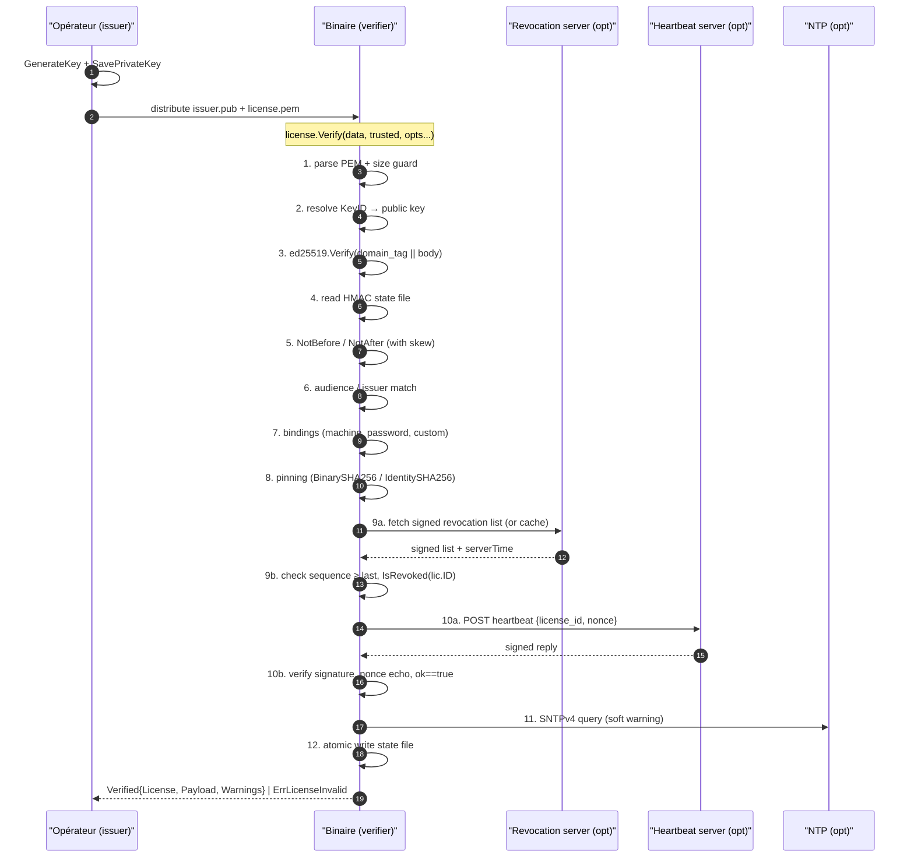

# License framing — primitive défensive

> Cadre cryptographiquement signé qui décide **qui** peut exécuter **quel binaire**, **sur quelles machines**, **avec quels secrets**, **jusqu'à quand**, sous **quelle politique de révocation**.

Hors-ligne par défaut, en-ligne en option. Aucun artefact réseau ou disque
émis côté détection (le binaire n'envoie rien, sauf si l'opérateur active
explicitement `WithRevocation` ou `WithHeartbeat`).

## TL;DR — règles du jeu en une page

| Aspect | Valeur |
|---|---|
| Import path | `github.com/oioio-space/maldev/license` |
| Rôle | Gate d'autorisation **défensive** à l'intérieur des binaires de recherche |
| Signature | Ed25519, déterministe, 64 octets, pas d'algorithm-confusion |
| Format | PEM-armé `MALDEV LICENSE` enveloppant un JSON canonique base64 |
| Bindings | machine (liste), password (argon2id), custom (k/v + extensible) |
| En-ligne | RevocationSource pluggable + heartbeat avec nonce echo (tous optionnels) |
| Pinning | SHA-256 du binaire sur disque + SHA-256 d'une identité embarquée (les deux optionnels) |
| Anti-tamper d'horloge | Plancher signé `trusted_floor` + last-seen monotone, stocké dans un fichier HMAC |
| Erreur publique | `ErrLicenseInvalid` opaque ; la cause précise va dans `slog`, jamais dans `err.Error()` |
| Couches dépendances | Layer 1 — `crypto/ed25519` stdlib + `golang.org/x/crypto/{argon2,hkdf,chacha20poly1305,curve25519}` |
| Tag Go | `v0.157.0+` |

## Vocabulaire

| Terme | Signification |
|---|---|
| **License** | Le token signé qui autorise un binaire. Sérialisé en PEM `MALDEV LICENSE`. |
| **KeyID** (`kid`) | Identifiant texte de la clé qui a signé. Permet la rotation : un binaire peut accepter plusieurs `kid` simultanément. |
| **Issuer** (`iss`) | Texte libre désignant l'autorité émettrice (ex. `"lab-eu"`). Le binaire peut whitelist. |
| **Subject** (`sub`) | À qui la licence est délivrée (email, hostname, nom d'agent…). Libre. |
| **Audience** (`aud`) | Liste des binaires autorisés (ex. `["rshell", "memscan"]`). Vide = wildcard avec warning. |
| **Binding** | Une contrainte signée à l'intérieur de la licence. Trois types builtin (`machine`, `password`, `custom:*`) + extensible via `RegisterVerifier`. |
| **Evidence** | Valeur fournie au moment de `Verify` qui doit matcher un binding (ex. `WithMachineID(...)` apporte l'évidence pour un binding `machine`). |
| **Trusted** | `struct{Keys map[KeyID]ed25519.PublicKey}` que le binaire connaît à la compilation. Contient une ou plusieurs clés acceptées. |
| **RevocationSource** | Interface `Fetch(ctx) ([]byte, error)` — d'où le binaire récupère la liste de révocation signée. Builtins : HTTP, File, Embed, Multi, + custom. |
| **Identity** | 32 octets aléatoires embarqués dans le binaire au build (via `//go:embed`). Survit au `cmd/packer` parce qu'il ne supprime pas les données embarquées. |
| **TrustedFloor** | Le plus grand `server_time` jamais observé via revocation ou heartbeat. Stocké dans le state file. Un `time.Now()` inférieur déclenche `causeClockRollback`. |
| **MaxClockSkew** | Tolérance d'horloge (5 min par défaut) appliquée à `NotBefore`/`NotAfter`/`TrustedFloor`. |
| **GracePeriod** | Combien de temps un binaire reste autorisé sans pouvoir joindre la revocation source ou le heartbeat. 0 = pas de tolérance. |

## Flow de vérification



## Quick start

```go
pub, priv, _ := license.GenerateKey()
data, _ := license.New(priv, "alice@example.com", 24*time.Hour)
v, err := license.Verify(data, license.Trusted{Keys: license.SingleKey("default", pub)})
```

Voir le [cookbook](../license/workflow.md) pour 8 recettes complètes
copier-coller.

---

## Référence des champs

### `type License`

Le corps signé d'une licence. Tous les champs sont couverts par la signature.

| Champ | JSON | Type | Sens | Vide ⇒ |
|---|---|---|---|---|
| `Version` | `v` | `int` | Toujours `1` en v1. | refus (causeBadFormat) |
| `ID` | `id` | `string` | UUIDv4 random au moment de l'émission. Identifie la licence dans les revocation lists. | jamais vide |
| `KeyID` | `kid` | `string` | Identifiant texte de la clé qui a signé. Doit figurer dans `Trusted.Keys`. | refus (causeUnknownKey) |
| `Issuer` | `iss` | `string` | Émetteur. Comparé à `WithIssuer(...)` si l'option est passée. | l'option `WithIssuer` rejette toujours dans ce cas |
| `Subject` | `sub` | `string` | Bénéficiaire (email, agent, …). Libre. Logué et présent dans `Verified.Subject`. | acceptable mais inutile |
| `Audience` | `aud` | `[]string` | Liste des binaires autorisés. Vide = wildcard (warning à `Verify`). | warning |
| `IssuedAt` | `iat` | `time.Time` UTC | Horodatage d'émission. Pas vérifié à `Verify` mais loguable. | non bloquant |
| `NotBefore` | `nbf` | `time.Time` UTC | Avant cette date, refus `causeNotYetValid` (avec `MaxClockSkew`). | jamais "pas encore valide" |
| `NotAfter` | `exp` | `time.Time` UTC | Après cette date, refus `causeExpired`. Zéro = jamais expirer. | jamais expirer |
| `Bindings` | `bnd` | `[]Binding` | Contraintes à matcher avec des évidences à `Verify`. | pas de contraintes spécifiques |
| `Features` | `feat` | `[]string` | Liste d'entitlements signée au niveau racine. Lue via `Verified.HasFeature(name)` sans désérialiser `Payload`. | aucun entitlement |
| `BinarySHA256` | `bin` | `string` (hex) | Hash SHA-256 du fichier `os.Executable()` autorisé. | pas de pinning disque |
| `IdentitySHA256` | `id_sha` | `string` (hex) | Hash SHA-256 de l'identité embarquée via `//go:embed`. Survit au packer. | pas de pinning identité |
| `Payload` | `pld` | `json.RawMessage` | Données libres signées en clair pour usage applicatif. Accessibles via `Verified.Payload`. | aucune métadonnée applicative |
| `SealedPayload` | `spld` | `[]byte` | Payload chiffré par `seal.Seal(recipientPub, ...)`. Signature publique mais contenu lisible seulement avec `recipientPriv`. | pas de scellé |

> **Note règle de pinning** : si **les deux** `BinarySHA256` et `IdentitySHA256` sont définis ET que `WithBinaryPinning()` est passé, **les deux** doivent matcher (AND). Définir un seul des deux ne vérifie que celui-là. Aucun = warning sans refus.

### `type Binding`

| Champ | JSON | Type | Sens |
|---|---|---|---|
| `Type` | `t` | `string` | Une parmi : `"machine"`, `"password"`, `"totp"`, ou `"custom:<name>"` |
| `Value` | `v` | `[]string` | Pour `machine`/`custom:*` : liste de valeurs acceptées (OR-match). Pour `totp` : `[secret_base32]`. Vide pour `password`. |
| `Hash` | `h` | `[]byte` | Pour `password` : hash argon2id du mot de passe. Vide pour les autres types. |
| `Salt` | `s` | `[]byte` | Pour `password` : sel de 16 octets random. Vide pour les autres types. |
| `Params` | `p` | `*BindingParams` | Pour `password` : paramètres argon2id stampés à l'émission (`time`, `memory`, `threads`, `keylen`). Permet de re-tuner sans casser les licences existantes. Nil = défauts du package. |

Les helpers `BindMachineIDs(ids...)`, `BindPassword(p)`, `BindPasswordWithParams(p, params)`, `BindTOTP(secret)`, `BindCustom(name, vals...)` construisent ces bindings correctement.

### `type IssueOptions`

Tous les champs sauf `PrivateKey` et `Subject` sont **optionnels**.

| Champ | Type | Sens | Défaut |
|---|---|---|---|
| `PrivateKey` | `ed25519.PrivateKey` | Clé qui signe. **Requise.** | — |
| `KeyID` | `string` | Identifiant de la clé de signature. | `"default"` |
| `Issuer` | `string` | Émetteur (`iss`). | vide |
| `Subject` | `string` | À qui (`sub`). **Requise.** | — |
| `Audience` | `[]string` | Binaires autorisés. | vide (wildcard) |
| `NotBefore` | `time.Time` | Date d'activation. | maintenant |
| `NotAfter` | `time.Time` | Date d'expiration. | jamais (déconseillé) |
| `Bindings` | `[]Binding` | Contraintes. | aucune |
| `BinarySHA256` | `string` (hex) | Hash binaire requis. | pas de pinning disque |
| `IdentitySHA256` | `string` (hex) | Hash identité requis. | pas de pinning identité |
| `Payload` | `json.RawMessage` | Données applicatives signées en clair. | aucune |
| `SealedPayload` | `[]byte` | Données scellées avec `seal.Seal`. | aucune |

### `type Verified` (retour de `Verify`)

| Champ | Type | Sens |
|---|---|---|
| `License` | embedded | Le corps vérifié, en lecture seule. |
| `Payload` | `[]byte` | Le `Payload` clair (=`v.License.Payload`). |
| `KeyUsed` | `string` | Le `KeyID` qui a effectivement validé (utile en rotation). |
| `Warnings` | `[]string` | Avertissements non bloquants (audience vide, NTP drift, pinning sans champs, etc.). |

### Options `VerifyOption`

Toutes les options sont des fonctions `func(*verifyState)` à passer en variadique à `Verify`. Plusieurs options peuvent se combiner librement.

| Option | Type | Effet |
|---|---|---|
| `WithContext(ctx)` | `context.Context` | Propage timeout/cancel aux appels réseau (revocation, heartbeat, NTP). Défaut : `context.Background()`. |
| `WithClock(c)` | `Clock` | Horloge injectable. Pour tests ou usage avancé. Défaut : horloge système UTC. |
| `WithLogger(l)` | `*slog.Logger` | Logueur pour les causes d'échec. Défaut : `slog.Default()`. |
| `WithMaxClockSkew(d)` | `time.Duration` | Tolérance appliquée à `NotBefore`/`NotAfter`/`TrustedFloor`. Défaut : 5 min. |
| `WithAudience(aud...)` | `...string` | Le binaire déclare son nom. Doit appartenir à `License.Audience`. |
| `WithIssuer(iss)` | `string` | Émetteur attendu. Doit matcher `License.Issuer`. |
| `WithMachineID(id)` | `[]byte` | Évidence pour un binding `machine`. Typiquement `hostid.Local()`. |
| `WithPassword(p)` | `string` | Évidence pour un binding `password`. |
| `WithCustom(name, value)` | `string, string` | Évidence pour un binding `custom:<name>`. |
| `WithBinaryPinning()` | — | Active le check de `BinarySHA256` et/ou `IdentitySHA256` si présents. |
| `WithIdentityBytes(b)` | `[]byte` | Override les bytes d'identité (autrement lus via `identity.Read()`). |
| `WithRevocation(src, refresh, cachePath)` | `RevocationSource, Duration, string` | Active la révocation. Fetch refresh max toutes les `refresh`, cache local signé. |
| `WithGracePeriod(d)` | `time.Duration` | Tolérance offline (revocation + heartbeat). |
| `WithHeartbeat(client, interval)` | `heartbeat.Client, Duration` | Active le heartbeat ; skip si une réponse OK a été obtenue depuis moins de `interval`. |
| `WithStateFile(path)` | `string` | Chemin du state file HMAC pour anti-rollback d'horloge. |
| `WithStateHostID(fn)` | `func() ([]byte, error)` | Source du fingerprint machine pour dériver la clé HMAC du state file. Typiquement `hostid.Local`. |
| `WithNTPCheck(server, maxDrift)` | `string, Duration` | NTP cross-check soft (warning si drift > seuil). |
| `WithNTPCheckStrict(server, maxDrift)` | `string, Duration` | NTP strict : refus si drift > seuil. |

### Sous-packages

| Package | Quand l'utiliser |
|---|---|
| `license` | Surface API principale. `Issue`, `Verify`, `GenerateKey`, options. |
| `license/canonical` | JSON canonique pour signature reproductible. Utilisé en interne, exposé pour usage avancé. |
| `license/hostid` | Fingerprint machine cross-platform (Windows MachineGuid, Linux /etc/machine-id, Darwin IOPlatformUUID). |
| `license/identity` | Identité embarquée 32 octets. Inclure `//go:embed identity.bin` + `identity.Set(bytes)` au boot. |
| `license/identity/cmd/gen-identity` | Outil `go run` qui génère `identity.bin`. Idempotent. |
| `license/revoke` | Types et primitives de revocation list ; sources HTTP/File/Embed/Multi pluggables ; cache local signé. |
| `license/heartbeat` | Client HTTP pour ping serveur ; signature des réponses ; nonce echo. |
| `license/seal` | Sealed payload X25519 + HKDF-SHA256 + XChaCha20-Poly1305. |
| `license/ntp` | SNTPv4 query minimaliste. |
| `license/server` | `http.Handler` builders pour servir révocation + heartbeat ; `FileStore` builtin ; interfaces `RevocationStore`/`LicenseStore` pour persistance custom. |
| `license/internal/fileutil` | Helper `AtomicWrite`, interne uniquement. |

### Erreurs

`ErrLicenseInvalid` est la **seule** erreur publique. Discrimination via `errors.Is(err, ErrLicenseInvalid)`. La cause précise (signature, expired, binding mismatch, etc.) part vers le logueur ; elle est volontairement absente de `err.Error()` pour ne pas guider un attaquant.

Causes internes loguées (non exportées) :
`bad-format`, `bad-signature`, `unknown-key`, `not-yet-valid`, `expired`,
`clock-rollback`, `audience-mismatch`, `issuer-mismatch`,
`binding-machine-mismatch`, `binding-password-mismatch`,
`binding-custom-mismatch`, `binary-hash-mismatch`, `identity-mismatch`,
`revoked`, `revocation-stale`, `heartbeat-failed`, `state-corrupted`.

---

## OPSEC & détection

| Aspect | Comportement |
|---|---|
| Bruit disque | `Verify` lit la licence et (si configuré) écrit le state file HMAC + le cache de révocation. Pas d'autres écritures. |
| Bruit réseau | Aucun par défaut. `WithRevocation` → 1 GET / `refresh`. `WithHeartbeat` → 1 POST / `interval`. `WithNTPCheck` → 1 query UDP. |
| Surface AV/EDR | Le binaire de vérification embarque seulement la stdlib + `x/crypto`. Aucun artefact RWX, aucun syscall direct, aucun import suspect. |
| Logs | Tous les échecs partent dans `slog.Default()` (ou logueur custom via `WithLogger`). Le format est structuré, prêt pour pipeline d'audit. |
| Signature binaire | Le package ne signe pas son propre binaire ; combiner avec `cmd/packer` + Authenticode pour résistance au reverse. |

---

## Limitations

### Résiste à

- Forgerie de signature (Ed25519).
- Modification post-émission (toute la License est couverte par la signature).
- Replay cross-audience (`aud` est signé).
- Réutilisation cross-binaire (`aud` + binary/identity pinning).
- Substitution de revocation list ancienne (sequence monotone + signed expiry + chain hash).
- Brute-force de password binding (argon2id : t=3, m=64MiB, p=4).
- Rollback de l'horloge sous le `TrustedFloor`.
- Algorithm-confusion (un seul algo signé, domain-separated par message type).

### Ne résiste **PAS** à

- Un attaquant qui patche `Verify` dans le binaire pour `return nil`. **Mitigation hors scope** — combiner avec `cmd/packer` + intégrité OS (Authenticode / Sigstore).
- Tamper d'horloge parfait sur une machine totalement offline qui n'a jamais contacté le serveur (= aucun `TrustedFloor` jamais établi).
- Usage offline indéfini au-delà du `GracePeriod` après rotation de clé.
- Modification simultanée du binaire **et** de l'identity embarquée.
- Spoofing de hostid sur une machine que l'attaquant contrôle entièrement.
- Partage de seat (deux machines avec le même hostid + binding password).

Voir [threat-model.md](../license/threat-model.md) pour le détail complet par classe de menace.

---

## Voir aussi

- [Cookbook (8 recettes copier-coller)](../license/workflow.md)
- [Threat model détaillé](../license/threat-model.md)
- [Spec de design](../superpowers/specs/2026-05-20-license-package-design.md) — décisions architecturales et trade-offs explicités.
