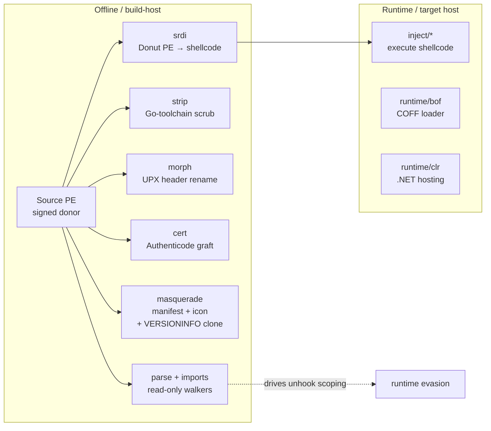

---
---

# PE manipulation

[← maldev README](../../../README.md) · [docs/index](../../index.md)

Pure-Go Portable Executable analysis, sanitisation, identity
cloning, signature grafting, and conversion-to-shellcode. The
package tree is intentionally bottom-up: `pe/parse` and
`pe/imports` are read-only walkers, `pe/strip`, `pe/morph`,
`pe/cert`, `pe/masquerade` are byte-mutators on a `[]byte`, and
`pe/srdi` is the producer of position-independent shellcode that
downstream `inject/` chains consume. Runtime-side BOF and CLR
loaders moved to [`runtime/bof`](../runtime/) and
[`runtime/clr`](../runtime/) respectively.

> **Where to start (novice path):**
> 1. [`masquerade`](masquerade.md) — make your implant LOOK like
>    a known Microsoft binary. Easiest visible win.
> 2. [`certificate-theft`](certificate-theft.md) — graft a real
>    Authenticode signature from the same donor. Pair with #1.
> 3. [`strip-sanitize`](strip-sanitize.md) — scrub the "Made in
>    Go" markers (pclntab + section names) so static analysers
>    don't flag the language.
> 4. [`pe-to-shellcode`](pe-to-shellcode.md) — convert your EXE
>    to position-independent shellcode for any `inject/*` flow.
> 5. [`dll-proxy`](dll-proxy.md), [`morph`](morph.md) — specialised;
>    pick when DLL hijack / UPX cover is the engagement context.
> 6. [`imports`](imports.md), [`pe/parse`](https://pkg.go.dev/github.com/oioio-space/maldev/pe/parse)
>    — read-only walkers; pair with the [`recon/`](../recon/) discovery side.
>
> See also [`catalog-signing`](catalog-signing.md) — research note
> explaining why some Microsoft binaries can't be cloned via
> `cert.Copy` (catalog signing instead of embedded WIN_CERTIFICATE).

## Packages

| Package | Tech page | Detection | One-liner |
|---|---|---|---|
| [`pe/parse`](https://pkg.go.dev/github.com/oioio-space/maldev/pe/parse) | (covered here + doc.go) | very-quiet | Read-only saferwall wrapper: section / export / raw-byte access + Authentihash + ImpHash + Anomalies + RichHeader + Overlay |
| [`pe/imports`](https://pkg.go.dev/github.com/oioio-space/maldev/pe/imports) | [imports.md](imports.md) | very-quiet | Cross-platform import-table enumeration |
| [`pe/strip`](https://pkg.go.dev/github.com/oioio-space/maldev/pe/strip) | [strip-sanitize.md](strip-sanitize.md) | quiet | Go pclntab wipe + section rename + timestamp scrub |
| [`pe/morph`](https://pkg.go.dev/github.com/oioio-space/maldev/pe/morph) | [morph.md](morph.md) | moderate | UPX header signature mutation |
| [`pe/cert`](https://pkg.go.dev/github.com/oioio-space/maldev/pe/cert) | [certificate-theft.md](certificate-theft.md) | quiet | Authenticode security-directory read / copy / strip / write |
| [`pe/masquerade`](https://pkg.go.dev/github.com/oioio-space/maldev/pe/masquerade) | [masquerade.md](masquerade.md) | quiet | manifest + icon + VERSIONINFO clone via `.syso` (preset or programmatic) |
| [`pe/srdi`](https://pkg.go.dev/github.com/oioio-space/maldev/pe/srdi) | [pe-to-shellcode.md](pe-to-shellcode.md) | moderate | PE / .NET / script → Donut shellcode |
| [`pe/dllproxy`](https://pkg.go.dev/github.com/oioio-space/maldev/pe/dllproxy) | [dll-proxy.md](dll-proxy.md) | very-quiet | Pure-Go forwarder DLL emitter for DLL-hijack payloads |
| [`pe/packer`](https://pkg.go.dev/github.com/oioio-space/maldev/pe/packer) | [packer.md](packer.md) | very-quiet (Phase 1a) | Custom packer — encrypt + embed pipeline (Phase 1a; reflective loader stub lands in Phase 1b) |

## Quick decision tree

| You want to… | Use |
|---|---|
| …read every DLL!Function pair from a PE | [`imports.List`](imports.md) |
| …wipe the "Made in Go" markers | [`strip.Sanitize`](strip-sanitize.md) |
| …hide a UPX-packed binary from auto-unpackers | [`morph.UPXMorph`](morph.md) |
| …graft a Microsoft signature onto an unsigned binary | [`cert.Copy`](certificate-theft.md) |
| …make Process Explorer render the implant as svchost | [preset blank-import](masquerade.md) |
| …clone any PE's identity programmatically | [`masquerade.Clone`](masquerade.md) / [`Build`](masquerade.md) |
| …convert a PE / .NET / script to position-independent shellcode | [`srdi.ConvertFile`](pe-to-shellcode.md) |
| …feed shellcode to remote-process injection | [`pe/srdi`](pe-to-shellcode.md) → [`inject`](../injection/README.md) |
| …enumerate sections / exports for tooling | [`pe/parse`](https://pkg.go.dev/github.com/oioio-space/maldev/pe/parse) |
| …emit a forwarder DLL for hijack payloads (no MSVC) | [`dllproxy.Generate`](dll-proxy.md) |

## MITRE ATT&CK

| T-ID | Name | Packages | D3FEND counter |
|---|---|---|---|
| [T1027.002](https://attack.mitre.org/techniques/T1027/002/) | Obfuscated Files or Information: Software Packing | `pe/strip`, `pe/morph`, `pe/parse` | [D3-SEA](https://d3fend.mitre.org/technique/d3f:StaticExecutableAnalysis/), [D3-FCA](https://d3fend.mitre.org/technique/d3f:FileContentAnalysis/) |
| [T1027.005](https://attack.mitre.org/techniques/T1027/005/) | Indicator Removal from Tools | `pe/strip` | [D3-SEA](https://d3fend.mitre.org/technique/d3f:StaticExecutableAnalysis/) |
| [T1036.005](https://attack.mitre.org/techniques/T1036/005/) | Masquerading: Match Legitimate Name or Location | `pe/masquerade` | [D3-EAL](https://d3fend.mitre.org/technique/d3f:ExecutableAllowlisting/), [D3-SEA](https://d3fend.mitre.org/technique/d3f:StaticExecutableAnalysis/) |
| [T1055.001](https://attack.mitre.org/techniques/T1055/001/) | Process Injection: Dynamic-link Library Injection | `pe/srdi` (consumer) | [D3-PA](https://d3fend.mitre.org/technique/d3f:ProcessAnalysis/) |
| [T1106](https://attack.mitre.org/techniques/T1106/) | Native API | `pe/imports` | [D3-SEA](https://d3fend.mitre.org/technique/d3f:StaticExecutableAnalysis/) |
| [T1574.001](https://attack.mitre.org/techniques/T1574/001/) | DLL Search Order Hijacking | `pe/dllproxy` | [D3-PFV](https://d3fend.mitre.org/technique/d3f:ProcessFileVerification/) |
| [T1574.002](https://attack.mitre.org/techniques/T1574/002/) | DLL Side-Loading | `pe/dllproxy` | [D3-PFV](https://d3fend.mitre.org/technique/d3f:ProcessFileVerification/) |
| [T1553.002](https://attack.mitre.org/techniques/T1553/002/) | Subvert Trust Controls: Code Signing | `pe/cert` | [D3-EAL](https://d3fend.mitre.org/technique/d3f:ExecutableAllowlisting/) |
| [T1620](https://attack.mitre.org/techniques/T1620/) | Reflective Code Loading | `pe/srdi` | [D3-FCA](https://d3fend.mitre.org/technique/d3f:FileContentAnalysis/), [D3-PA](https://d3fend.mitre.org/technique/d3f:ProcessAnalysis/) |

## Layered scrub recipe

The full identity scrub for a Go-built implant is a six-step
build-host pipeline. None of the steps is enough alone; together
they survive triage long enough to matter.

1. **Build with [garble](https://github.com/burrowers/garble)** — symbol obfuscation at compile time.
2. **`pe/masquerade.Clone`** — clone svchost / cmd / explorer identity at link time via `.syso`.
3. **`pe/strip.Sanitize`** — wipe pclntab + rename Go sections + scrub timestamp.
4. **UPX pack + `pe/morph.UPXMorph`** — defeat signature-based unpackers.
5. **`pe/cert.Copy`** — graft a Microsoft Authenticode blob.
6. **`cleanup/timestomp.CopyFromFull`** — align MFT timestamps to the donor.

For payload delivery (separate from build):

7. **`pe/srdi.ConvertFile`** — convert the implant or downstream payload to Donut shellcode.
8. **`inject/*`** — deliver the shellcode via any of the documented techniques.

## See also

- [Operator path: build-host pipeline](../../by-role/operator.md) — full scrub recipe.
- [Detection eng path: PE-level artefacts](../../by-role/detection-eng.md).
- [`runtime/bof`](../runtime/) — COFF (BOF) loader; consumes BOF objects produced upstream.
- [`runtime/clr`](../runtime/) — in-process .NET hosting; consumes managed payloads.
- [`inject`](../injection/README.md) — execution surface for `pe/srdi` shellcode.
- [`crypto`](../crypto/README.md) — payload encryption pre-conversion.
- [`hash`](../hash/README.md) — measure SHA-256 vs fuzzy-hash deltas after morph.
- [Catalog signing (research note)](catalog-signing.md) — why
  cmd / notepad / System32 binaries return `ErrNoCertificate`
  from `cert.Read` and how WinTrust resolves their signatures.
