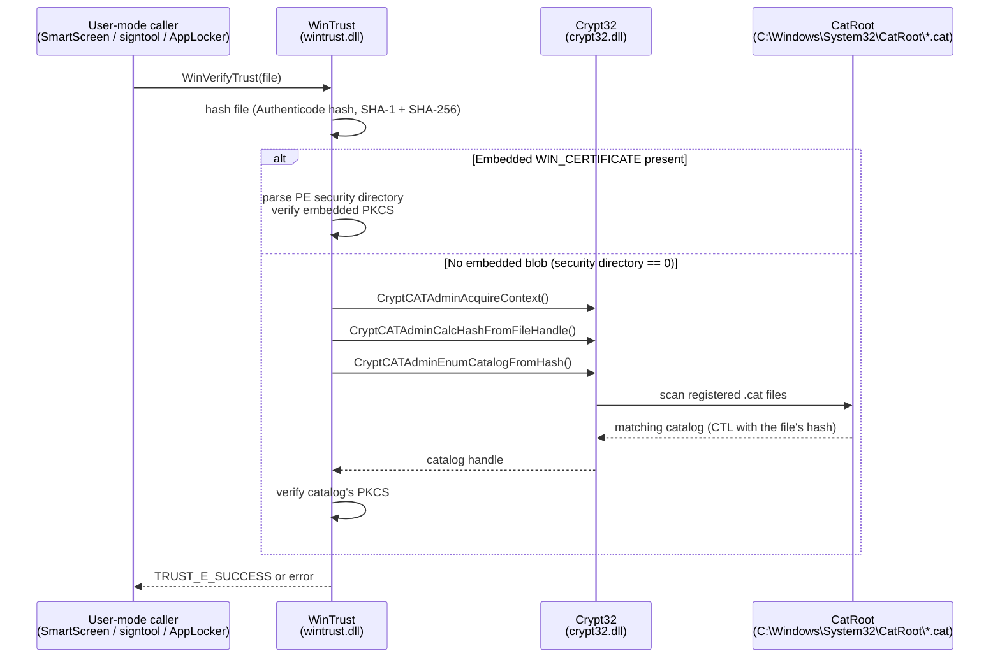

# Windows Security Catalog signing

[← pe index](README.md) · [docs/index](../../index.md)

## TL;DR

Many Microsoft binaries (`cmd.exe`, `notepad.exe`, `calc.exe`,
most of `System32`) have **no embedded `WIN_CERTIFICATE`** in their
PE security directory. `pe/cert.Read` correctly returns
`ErrNoCertificate` for them — and that is not a bug. Their
Authenticode signature lives in a separate `.cat` file under
`C:\Windows\System32\CatRoot`, registered with the kernel's
**WinTrust** subsystem. `signtool verify /pa cmd.exe` returns
"successfully verified" *because* WinTrust queries the catalog,
finds the file's hash, and resolves the catalog's signature.

Operationally:

- Cloning a catalog-signed identity via `cert.Copy` / `donors.LoadBlob`
  is **impossible** — there is no embedded blob to copy.
- The "right" attack on catalog-signed binaries is **catalog
  poisoning** (insert your own signed `.cat` mapping the implant's
  hash) or **catalog hash forging** (collide the implant's
  Authenticode hash with a hash already in a trusted `.cat`).
  Both are out of scope for `pe/cert`.
- For implant masquerading purposes, prefer donors with embedded
  signatures (Edge, OneDrive, Acrobat, Firefox, Office, VS Code,
  Anthropic Claude — all bundled in
  [`pe/masquerade/donors`](https://pkg.go.dev/github.com/oioio-space/maldev/pe/masquerade/donors)).

## Primer — embedded vs catalog signatures

PE Authenticode supports two signature delivery channels:

| | Embedded | Catalog |
|---|---|---|
| Where the signature lives | Inside the PE, in the security directory (offset/size in `IMAGE_DATA_DIRECTORY[4]`). | Outside the PE, in a separate `.cat` file. |
| WIN_CERTIFICATE blob present | Yes. | No — security directory is zero. |
| Verifier path | WinTrust parses the embedded PKCS#7 SignedData over the PE's Authenticode hash. | WinTrust hashes the PE, looks up that hash in every registered catalog, then verifies the catalog's own SignedData. |
| `signtool verify /pa <pe>` | Reports the embedded signer chain. | Reports "Signed by:" the *catalog*'s signer (same Microsoft chain), file path resolves the catalog. |
| Operational consequences | `cert.Read` returns the WIN_CERTIFICATE bytes. Cloneable via `cert.Copy`. | `cert.Read` → `ErrNoCertificate`. Not cloneable into another PE — the binding is hash-based, not blob-based. |

System-shipped Windows binaries default to **catalog** signing
because Microsoft batch-signs hundreds of files in a single
`.cat`, saving signature overhead per binary and centralising
revocation: rotate the catalog signing cert and every file mapped
inside flips authority in one operation. Third-party publishers
(Adobe, Mozilla, Google, Anthropic, custom in-house builds) ship
**embedded** signatures because they don't have a privileged path
to install `.cat` files into `CatRoot`.

## How catalog verification works

Because the lookup is hash-keyed, **any byte change to the PE
breaks the catalog binding**. A cert.Copy operator who grafts
their own embedded blob *over* a catalog-signed file inadvertently
disables the catalog path (the security directory is no longer
zero, so WinTrust takes the embedded branch first) — the original
catalog signature stops verifying.

## Why the bundled donor list excludes catalog-signed binaries

[`donors.All`](https://pkg.go.dev/github.com/oioio-space/maldev/pe/masquerade/donors#pkg-variables)
includes `cmd`, `notepad`, `svchost`, `taskmgr`, `explorer`
because they remain useful for the **masquerade** side
(VERSIONINFO + manifest + icon clone). But
[`donors.AvailableBlobs()`](https://pkg.go.dev/github.com/oioio-space/maldev/pe/masquerade/donors#AvailableBlobs)
omits the catalog-signed ones because the cert-extraction step
returns `ErrNoCertificate` on these donors — there is no
embedded blob to bundle. Operators who want a System32-signed
identity must either:

1. Use the embedded-signature donors (Edge, Office, OneDrive,
   etc. — they're Microsoft Corporation signers too, so the
   subject reads like System32 to most checks).
2. Approach a different attack class (catalog poisoning / hash
   forgery) — out of scope for this library.

## Detection

Catalog-vs-embedded discrimination is trivial for defenders:

| Signal | Meaning |
|---|---|
| `signtool verify /pa /v` shows `Signing Certificate Chain:` and `File is signed in catalog: <path>` | Catalog path. |
| Same call shows `Signing Certificate Chain:` without `File is signed in catalog` | Embedded path. |
| Powershell `(Get-AuthenticodeSignature <pe>).SignatureType` | `Catalog` vs `Authenticode`. |
| File has non-zero IMAGE_DIRECTORY_ENTRY_SECURITY (offset 0x98 in PE32+ optional header data directories) | Embedded. |

A red-team binary that ships with an embedded blob lifted from
a System32 donor will surface as `Authenticode` (not `Catalog`)
in PowerShell — already a deviation from System32 baseline. Pair
with `donors` Edge / Office signers if mimicking real third-party
Microsoft products is the goal.

## OPSEC implications

- **Don't waste time** trying to clone catalog signatures via
  `cert.Copy` — it cannot work by design.
- **Pick donors that match the cosmetic identity**: cloning
  notepad's VERSIONINFO + an Adobe Authenticode signature is
  immediately suspicious to mature triage. Either embrace
  third-party identity (use `donors.LoadBlob("acrobat")` +
  Acrobat's manifest) or accept that System32 masquerade leaves
  the implant unsigned-via-embedded.
- **Catalog poisoning is admin** — any "I'll just install my own
  `.cat`" path requires write access to `CatRoot`, defeating the
  point of using a catalog identity for stealth.

## See also

- [Certificate theft](certificate-theft.md) — the embedded-blob
  side, including `donors.LoadBlob` and `cmd/cert-snapshot`.
- [Masquerade](masquerade.md) — VERSIONINFO + manifest + icon
  cloning (orthogonal to signature handling).
- Microsoft docs: [WinVerifyTrust](https://learn.microsoft.com/en-us/windows/win32/api/wintrust/nf-wintrust-winverifytrust),
  [CryptCATAdminEnumCatalogFromHash](https://learn.microsoft.com/en-us/windows/win32/api/mscat/nf-mscat-cryptcatadminenumcatalogfromhash).
