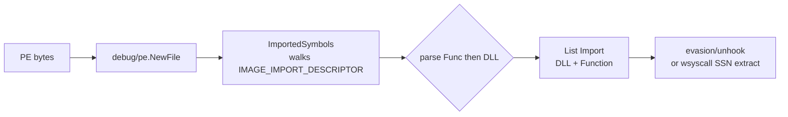

# PE Import Table Analysis

[← pe index](README.md) · [docs/index](../../index.md)

## TL;DR

Walk a PE's `IMAGE_DIRECTORY_ENTRY_IMPORT` and return every
`(DLL, Function)` pair the binary depends on. Pure Go via
`debug/pe` — no `DbgHelp`, no `LoadLibrary`, runs on any host
parsing any PE. Used to scope unhooking passes, build dynamic
API-resolution payloads, and triage unknown binaries.

## Primer

Every Windows EXE or DLL carries a list of the functions it calls
from other DLLs — the import table. Reading it tells you exactly
which kernel or user-mode APIs the binary relies on without
running it. Defenders use this for triage; offensive tooling uses
it to scope unhook passes (only restore the Nt* you actually
call) and to feed downstream syscall-discovery (extract SSNs from
ntdll exports the binary imports).

The package is fully cross-platform — it operates on PE bytes via
the standard library's `debug/pe` parser, so a Linux build host
can introspect a Windows implant without round-tripping through
Wine or signtool.

## How It Works



- Read the PE optional header and locate
  `IMAGE_DIRECTORY_ENTRY_IMPORT`.
- Walk each `IMAGE_IMPORT_DESCRIPTOR`, following
  `OriginalFirstThunk` (or `FirstThunk` if the original is zero)
  to resolve each imported function.
- Handle both by-name and by-ordinal entries.
- Return a flat `[]Import` slice — callers reshape as needed.

## API → godoc

[`pkg.go.dev/github.com/oioio-space/maldev/pe/imports`](https://pkg.go.dev/github.com/oioio-space/maldev/pe/imports) is the authoritative
reference for every exported symbol. This page teaches the
*concepts*; the godoc is the *specification*.

## Examples

### Simple — list every import

```go
import (
    "fmt"

    "github.com/oioio-space/maldev/pe/imports"
)

imps, _ := imports.List(`C:\Windows\System32\notepad.exe`)
for _, imp := range imps {
    fmt.Printf("%s!%s\n", imp.DLL, imp.Function)
}
```

### Composed — filter to ntdll, parse from memory

```go
import (
    "bytes"

    "github.com/oioio-space/maldev/pe/imports"
)

ntImps, _ := imports.ListByDLL(`C:\loader.exe`, "ntdll.dll")
inMem, _ := imports.FromReader(bytes.NewReader(decryptedPE))
```

### Advanced — unhook only what we actually call

Layered with `evasion/unhook` so only the Nt* the loader actually
imports get restored — minimal `.text` write footprint, no
unused-function crumbs for an EDR's integrity checker.

```go
import (
    "os"

    "github.com/oioio-space/maldev/evasion"
    "github.com/oioio-space/maldev/evasion/unhook"
    "github.com/oioio-space/maldev/pe/imports"
    wsyscall "github.com/oioio-space/maldev/win/syscall"
)

self, _ := os.Executable()
ntImps, _ := imports.ListByDLL(self, "ntdll.dll")

caller := wsyscall.New(wsyscall.MethodIndirect, wsyscall.NewTartarus())
defer caller.Close()

techs := make([]evasion.Technique, 0, len(ntImps))
for _, i := range ntImps {
    techs = append(techs, unhook.Classic(i.Function))
}
_ = evasion.ApplyAll(techs, caller)
```

See [`ExampleList`](../../../pe/imports/imports_example_test.go).

## OPSEC & Detection

| Artefact | Where defenders look |
|---|---|
| File-read of a PE | EDR file-access telemetry — but read-only access is exceedingly common; not a useful signal |
| Subsequent unhooking write to ntdll `.text` | Sysmon Event 8 (CreateRemoteThread / ImageWrite); ETW Microsoft-Windows-Threat-Intelligence — the *consumer* of import data, not import parsing itself |
| YARA on the implant binary's IAT | Static rules against unusual ntdll-import sets — large `Nt*` lists imply a syscall-driven loader |

**D3FEND counters:**

- [D3-SEA](https://d3fend.mitre.org/technique/d3f:StaticExecutableAnalysis/)
  — IAT inspection on submitted samples.

**Hardening for the operator:**

- Strip unused imports at link time (`-trimpath`, garble) so the
  IAT only carries what the loader genuinely needs.
- Do the import walk against the on-disk PE before any unhooking;
  parsing is invisible.

## MITRE ATT&CK

| T-ID | Name | Sub-coverage | D3FEND counter |
|---|---|---|---|
| [T1106](https://attack.mitre.org/techniques/T1106/) | Native API | discovery primitive — drives runtime resolution and unhook scoping | [D3-SEA](https://d3fend.mitre.org/technique/d3f:StaticExecutableAnalysis/) |

## Limitations

- **By-ordinal imports** surface as `#<ordinal>` strings; resolving
  ordinals to names requires the target DLL's export table
  (separate operation).
- **Bound imports** are read straight from the descriptor — the
  cached resolved address is the value at *bind time*; current
  IAT may differ.
- **Delay-loaded imports** (DELAYIMPORT directory) are not
  enumerated by this package; use `debug/pe` directly or wait
  for first-use resolution.
- **Manifest-redirected DLLs** show their declared name, not the
  redirect target — useful for IOC matching, not for runtime
  resolution.

## See also

- [`pe/parse`](README.md) — sibling read-only PE walker.
- [`win/syscall`](../syscalls/) — consumes the import list to
  derive SSNs from ntdll.
- [`evasion/unhook`](../evasion/ntdll-unhooking.md) — primary
  consumer for scoped unhooks.
- [Operator path](../../by-role/operator.md).
- [Detection eng path](../../by-role/detection-eng.md).
