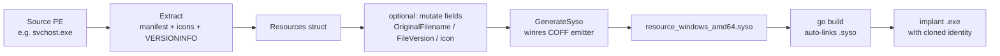

# PE Resource Masquerade

[← pe index](README.md) · [docs/index](../../index.md)

## TL;DR

You want your implant to LOOK like a known Microsoft / Adobe /
Mozilla binary in Task Manager, Process Explorer, and the
Properties → Details dialog. This package lets you embed a
donor's icon, manifest, and version info into your build.

Pick the right mode based on how much customisation you need:

| You want… | Use | Effort | When |
|---|---|---|---|
| Implant to look like one of 13 pre-baked donors (svchost, cmd, msedge, claude, …) | **Preset** — blank-import the right sub-package | One `import _` line | You're fine with stock identities; build is on a host without the donors installed |
| Implant to look like ANY donor PE you have on disk | **`Clone`** | ~5 lines + extracted .syso | You need a specific donor (in-house signed binary, region-specific app) |
| Pick fields field-by-field (CompanyName from one source, icon from another) | **`Extract` + `Build`** + `With*` options | ~15 lines | You're hand-tuning to evade a specific allowlist rule |
| Override a field on top of a preset (e.g., svchost identity but custom Description) | **Preset blank-import + `Build` + `With*`** | One import + ~5 lines | Hybrid case |

⚠ **Limit one preset per binary**: Windows PEs carry exactly one
`RT_MANIFEST` resource. Two blank-imports → duplicate-symbol
linker error. The same constraint applies to `Build` (which
emits a `.syso` that the linker treats identically).

What this DOES achieve:
- Process Explorer / Task Manager show the cloned identity.
- Properties → Details renders donor's CompanyName / Description /
  ProductName / OriginalFilename.
- Naive allowlists keyed on those fields pass.

What this does NOT achieve (need extra layers):
- Authenticode signature is unchanged → `signtool verify` fails.
  Pair with [`pe/cert`](certificate-theft.md).
- `.rdata` strings (`runtime.`, `main.`) + Go-shaped imports
  still betray a Go binary. Pair with [`pe/strip`](strip-sanitize.md).
- File timestamps still scream "just built". Pair with
  [`cleanup/timestomp`](../cleanup/).

## Primer — vocabulary

Four terms recur on this page:

> **`.syso`** — Microsoft-style COFF object file the Go linker
> automatically merges into a binary's `.rsrc` section. `go build`
> looks for `*_windows_amd64.syso` (or `_arm64.syso`, etc.) in
> the imported package directories — no extra build step needed.
> The preset packages and `GenerateSyso` both produce these.
>
> **VERSIONINFO** — the structured binary blob in a PE's resource
> section that drives the Properties → Details dialog: file
> version, product version, CompanyName, FileDescription,
> OriginalFilename, ProductName. Standard Windows tools and
> allowlists read these fields; Process Explorer surfaces them
> in its UI.
>
> **Manifest** — embedded XML declaring the binary's UAC
> requirements (`asInvoker` vs `requireAdministrator`), DPI
> awareness, and supported OS versions. AppLocker publisher
> rules trust this. The preset packages ship two variants per
> identity to cover the two UAC modes.
>
> **Icon set** — `.ico`-style group of icons at multiple sizes
> (16×16, 32×32, 48×48, 256×256). What File Explorer renders
> in the file browser and what shows up in alt-tab.

## How It Works



At build time, `go build` finds every `*_windows_amd64.syso` in
an imported package directory and merges its COFF `.rsrc` section
into the final binary. No external tool is invoked during build.

## Available presets

13 identities × 2 UAC variants = 26 packages. Pick one and
blank-import:

| Identity | Source EXE | Base (asInvoker) | Admin (requireAdministrator) |
|---|---|---|---|
| cmd | `System32\cmd.exe` | `…/preset/cmd` | `…/preset/cmd/admin` |
| svchost | `System32\svchost.exe` | `…/preset/svchost` | `…/preset/svchost/admin` |
| taskmgr | `System32\taskmgr.exe` | `…/preset/taskmgr` | `…/preset/taskmgr/admin` |
| explorer | `Windows\explorer.exe` | `…/preset/explorer` | `…/preset/explorer/admin` |
| notepad | `System32\notepad.exe` | `…/preset/notepad` | `…/preset/notepad/admin` |
| msedge | `Program Files (x86)\Microsoft\Edge\Application\msedge.exe` | `…/preset/msedge` | `…/preset/msedge/admin` |
| onedrive | `LOCALAPPDATA\Microsoft\OneDrive\OneDrive.exe` | `…/preset/onedrive` | `…/preset/onedrive/admin` |
| acrobat | `Program Files\Adobe\Acrobat DC\Acrobat\Acrobat.exe` | `…/preset/acrobat` | `…/preset/acrobat/admin` |
| firefox | `Program Files\Mozilla Firefox\firefox.exe` | `…/preset/firefox` | `…/preset/firefox/admin` |
| excel | `Program Files\Microsoft Office\root\Office16\EXCEL.EXE` | `…/preset/excel` | `…/preset/excel/admin` |
| sevenzip | `Program Files\7-Zip\7zFM.exe` | `…/preset/sevenzip` | `…/preset/sevenzip/admin` |
| vscode | `LOCALAPPDATA\Programs\Microsoft VS Code\Code.exe` | `…/preset/vscode` | `…/preset/vscode/admin` |
| claude | `LOCALAPPDATA\AnthropicClaude\claude.exe` | `…/preset/claude` | `…/preset/claude/admin` |

**Rules:**

1. **At most one** blank-import per final binary. Windows PEs
   carry exactly one `RT_MANIFEST` (ID = 1); two imports yield a
   duplicate-symbol linker error.
2. Pick the UAC variant that matches operational need:
   - **base** (`asInvoker`): no UAC prompt, runs with the
     invoking shell's token — most stealthy.
   - **admin** (`requireAdministrator`): forces the UAC consent
     UI. Only when the cloned identity naturally requires
     elevation (taskmgr, explorer/admin) — a cmd asking for
     admin is suspicious.

## API → godoc

[`pkg.go.dev/github.com/oioio-space/maldev/pe/masquerade`](https://pkg.go.dev/github.com/oioio-space/maldev/pe/masquerade) is the authoritative
reference for every exported symbol. This page teaches the
*concepts*; the godoc is the *specification*.

## Examples

### Quick start — make your implant look like svchost.exe

The shortest path: blank-import a preset package. The Go linker
finds the `.syso` it ships, merges svchost's manifest + icons +
VERSIONINFO into your binary at link time. No code change beyond
the import line; no donor PE needs to exist on the build host.

```go
package main

import (
    // The blank import (`_ "..."`) compiles the package for its
    // side effect — in this case, exposing the bundled .syso to
    // the linker. There is no symbol to call.
    _ "github.com/oioio-space/maldev/pe/masquerade/preset/svchost"
)

func main() {
    // Your normal implant logic. Identity is set at link time.
}
```

After `go build -o mybin.exe`, inspect what changed:

```text
PS> (Get-Item .\mybin.exe).VersionInfo | Format-List

CompanyName      : Microsoft Corporation
FileDescription  : Host Process for Windows Services
OriginalFilename : svchost.exe
ProductName      : Microsoft® Windows® Operating System
FileVersion      : 10.0.22621.3007
```

What just happened:

1. Go's linker scanned the imported `preset/svchost` package's
   directory and found `resource_windows_amd64.syso`.
2. It merged that COFF object's `.rsrc` section into `mybin.exe`.
3. Windows now reads svchost's resources from your binary's PE.

What still betrays you:

- Authenticode signature is missing. `signtool verify` fails.
  Add [`pe/cert.Copy`](certificate-theft.md) for the cosmetic
  signature graft.
- Strings in `.rdata` (`runtime.`, `main.`, your import paths)
  scream "Go binary". Add [`pe/strip`](strip-sanitize.md) to
  scrub them.
- File mtime is "now". Add [`cleanup/timestomp`](../cleanup/)
  to align MFT timestamps with svchost's actual install date.

For the UAC-elevated variant, swap to `preset/svchost/admin`.
For an entirely different identity, see the
[Available presets](#available-presets) table.

### Simple — preset blank-import (one-liner)

For when you don't need the explanation:

```go
import _ "github.com/oioio-space/maldev/pe/masquerade/preset/svchost"
```

### Composed — Clone in a generate step

```go
//go:build ignore
// generator.go — invoked via `go generate`

package main

import "github.com/oioio-space/maldev/pe/masquerade"

func main() {
    _ = masquerade.Clone(
        `C:\Windows\System32\svchost.exe`,
        "resource_windows_amd64.syso",
        masquerade.AMD64,
        masquerade.AsInvoker,
    )
}
```

### Advanced — icon swap with custom VERSIONINFO

Use svchost icons but override every VERSIONINFO field — useful
when an AV cross-checks `OriginalFilename` against the on-disk
filename.

```go
masquerade.Build("resource_windows_amd64.syso", masquerade.AMD64,
    masquerade.WithSourcePE(`C:\Windows\System32\svchost.exe`),
    masquerade.WithExecLevel(masquerade.AsInvoker),
    masquerade.WithVersionInfo(&masquerade.VersionInfo{
        FileDescription:  "Host Process for Windows Services",
        CompanyName:      "Microsoft Corporation",
        ProductName:      "Microsoft® Windows® Operating System",
        OriginalFilename: "svchost.exe",
        FileVersion:      "10.0.22621.3007",
        ProductVersion:   "10.0.22621.3007",
    }),
)
```

### Pipeline — Clone + cert + strip + timestomp

End-to-end identity scrub: clone svchost identity, graft its
Authenticode cert, scrub Go markers, align MFT timestamps.

```go
//go:build ignore

package main

import (
    "log"
    "os"

    "github.com/oioio-space/maldev/cleanup/timestomp"
    "github.com/oioio-space/maldev/pe/cert"
    "github.com/oioio-space/maldev/pe/masquerade"
    "github.com/oioio-space/maldev/pe/strip"
)

func main() {
    const exe = `.\loader.exe`
    const ref = `C:\Windows\System32\svchost.exe`

    // 1. Generate the .syso (run before `go build`).
    if err := masquerade.Clone(ref,
        "resource_windows_amd64.syso",
        masquerade.AMD64,
        masquerade.AsInvoker,
    ); err != nil {
        log.Fatal(err)
    }

    // (assume `go build` produced `loader.exe` here)

    // 2. Strip Go markers.
    raw, _ := os.ReadFile(exe)
    raw = strip.Sanitize(raw)
    _ = os.WriteFile(exe, raw, 0o644)

    // 3. Graft the donor's Authenticode cert.
    _ = cert.Copy(ref, exe)

    // 4. Match MFT timestamps to the donor.
    _ = timestomp.CopyFromFull(ref, exe)
}
```

See [`ExampleClone`](../../../pe/masquerade/masquerade_example_test.go)
+ [`ExampleBuild`](../../../pe/masquerade/masquerade_example_test.go).

## Regenerating presets

```bash
# On a Windows host (read-only access to System32 is enough):
go run ./pe/masquerade/internal/gen
```

The generator is pure Go (uses `tc-hib/winres` as a library) and
does not modify the host filesystem outside this repository.

Regenerate when:

- A Windows update refreshes icons/metadata of a reference exe.
- Adding a new identity (extend the `identities` slice in
  `pe/masquerade/internal/gen/main.go`).
- Adding a new variant (e.g. `highestAvailable`).

## OPSEC & Detection

| Artefact | Where defenders look |
|---|---|
| `Verified: Unsigned` from `sigcheck /a` | Microsoft binaries are always signed; *unsigned* file claiming Microsoft origin is a high-fidelity signal — pair with `pe/cert` |
| Mismatched `OriginalFilename` vs on-disk filename | Mature AV (Defender, MDE) cross-checks; rename the on-disk file to match |
| Defender ML heuristics on Go-binary + Microsoft VERSIONINFO | Atypical combination flagged by some ML pipelines; pair with `pe/strip` |
| `.rdata` strings betraying Go origin (`runtime.`, `main.`, GOROOT paths) | YARA rules; partially mitigated by garble + `pe/strip` |
| Process Explorer's "Verified Signer" column | Shows `(Not verified)` when signature is missing |
| AppLocker / WDAC publisher rules | Strict enforcement validates the cert chain — masquerade alone cannot pass |

**D3FEND counters:**

- [D3-EAL](https://d3fend.mitre.org/technique/d3f:ExecutableAllowlisting/)
  — strict allowlisting cross-checks publisher.
- [D3-SEA](https://d3fend.mitre.org/technique/d3f:StaticExecutableAnalysis/)
  — VERSIONINFO + manifest inspection.
- [D3-PA](https://d3fend.mitre.org/technique/d3f:ProcessAnalysis/)
  — runtime behaviour rarely matches the cloned identity (svchost
  doesn't normally make outbound HTTPS to attacker C2).

**Hardening for the operator:**

- Pair with [`pe/cert`](certificate-theft.md) so signature checks
  no longer fail open.
- Pair with [`pe/strip`](strip-sanitize.md) so Go fingerprints
  don't betray the spoof.
- Match runtime behaviour to the cloned identity: a "svchost"
  beaconing every 60 s is more suspicious than a real svchost.
- Match the on-disk filename to `OriginalFilename` and place
  the binary in a path consistent with the cloned identity
  (`%SystemRoot%\System32\` for Microsoft binaries).

## MITRE ATT&CK

| T-ID | Name | Sub-coverage | D3FEND counter |
|---|---|---|---|
| [T1036.005](https://attack.mitre.org/techniques/T1036/005/) | Masquerading: Match Legitimate Name or Location | full — manifest + icon + VERSIONINFO clone | D3-EAL, D3-SEA, D3-PA |

## Limitations

- **Metadata only.** `.rdata` strings, imports, `.text` are not
  modified — this is shallow masquerading.
- **Signature absent by default.** Pair with `pe/cert` or any
  defender that checks Authenticode catches the spoof.
- **Static identity at build time.** Each binary carries one
  identity; runtime swaps would require image rewriting.
- **Defender ML edge cases.** Some EDRs flag the Go +
  Microsoft-VERSIONINFO combo as anomalous; test against the
  target stack.
- **Manifest restrictions.** Exactly one `RT_MANIFEST` per PE —
  cannot stack two preset imports.

## See also

- [Certificate theft](certificate-theft.md) — pair to defeat
  signature-presence checks.
- [PE strip / sanitize](strip-sanitize.md) — scrub Go markers
  post-link.
- [PE morph](morph.md) — mutate UPX section names if packed.
- [`cleanup/timestomp`](../cleanup/) — match MFT timestamps to
  the cloned identity.
- [`runtime/clr`](../runtime/) — CLR hosting blends naturally
  with `masquerade/svchost`.
- [Operator path](../../by-role/operator.md).
- [Detection eng path](../../by-role/detection-eng.md).

## Credits

- [tc-hib/winres](https://github.com/tc-hib/winres) — pure-Go
  COFF `.rsrc` emitter used by the generator.
