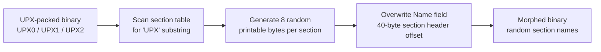

# PE Morphing (UPX section rename)

[← pe index](README.md) · [docs/index](../../index.md)

## TL;DR

Replace UPX section names (`UPX0`, `UPX1`, `UPX2`) with random
bytes so off-the-shelf static unpackers (CFF Explorer, x64dbg's
UPX plugin, IDA's UPX preprocessor) fail to recognise the input.
The runtime UPX stub keeps working because it references offsets,
not the magic. `UPXFix` reverses the morph for debugging.

## Primer

UPX is the most popular executable packer — it compresses
binaries to reduce size. Every UPX-packed binary carries
well-known section names that every antivirus and EDR fingerprint
on contact. `pe/morph` rewrites those names with random non-zero
bytes, breaking the signature-based unpack pipeline while leaving
the runtime behaviour intact.

The morph is a 24-byte change (three 8-byte section name fields).
That is enough to break SHA-256 blocklists entirely, but
similarity-hash scans (ssdeep, TLSH) still pin the variant to its
parent in the ~95th percentile range — the morph is genuinely
shallow, defeating only signature-based static unpacker matching.

## How It Works



The section name field lives at offset 0 of every 40-byte section
header in the section table. The section table itself starts at
`COFF_offset + 20 + SizeOfOptionalHeader`; each header is 40 bytes;
the Name field is the first 8 bytes. `UPXMorph` walks the table,
matches names containing "UPX", and overwrites the 8 bytes in
place. `UPXFix` walks the same table, matches the random bytes
against the expected layout (3 sections, sequential), and
restores the canonical names.

## API → godoc

[`pkg.go.dev/github.com/oioio-space/maldev/pe/morph`](https://pkg.go.dev/github.com/oioio-space/maldev/pe/morph) is the authoritative
reference for every exported symbol. This page teaches the
*concepts*; the godoc is the *specification*.

## Examples

### Simple — morph an existing UPX binary

```go
import (
    "os"

    "github.com/oioio-space/maldev/pe/morph"
)

raw, _ := os.ReadFile("payload.upx.exe")
morphed, _ := morph.UPXMorph(raw)
_ = os.WriteFile("payload.morph.exe", morphed, 0o644)
```

### Composed — restore for debugging

```go
restored, _ := morph.UPXFix(morphed)
// upx -d on restored now succeeds
```

### Advanced — fuzzy-hash before/after

Demonstrate the morph defeats SHA-256 but not similarity hashes:

```go
import (
    "fmt"
    "os"

    "github.com/oioio-space/maldev/hash"
    "github.com/oioio-space/maldev/pe/morph"
)

raw, _ := os.ReadFile("payload.upx.exe")
sha256Before := hash.SHA256(raw)
ssBefore, _ := hash.Ssdeep(raw)
tlBefore, _ := hash.TLSH(raw)

morphed, _ := morph.UPXMorph(raw)

ssAfter, _ := hash.Ssdeep(morphed)
tlAfter, _ := hash.TLSH(morphed)
ssScore, _ := hash.SsdeepCompare(ssBefore, ssAfter)
tlDist, _ := hash.TLSHCompare(tlBefore, tlAfter)

fmt.Printf("SHA-256 same?    %v\n", sha256Before == hash.SHA256(morphed)) // false
fmt.Printf("ssdeep score:    %d / 100\n", ssScore)                        // ~97
fmt.Printf("TLSH distance:   %d\n", tlDist)                               // ~12
```

### Pipeline — build → pack → strip → morph

```go
exec.Command("garble", "-literals", "-tiny", "build", "-o", "step1.exe", "./cmd/implant").Run()
exec.Command("upx", "--best", "-o", "step2.exe", "step1.exe").Run()

raw, _ := os.ReadFile("step2.exe")
raw = strip.Sanitize(raw)
raw, _ = morph.UPXMorph(raw)
_ = os.WriteFile("final.exe", raw, 0o644)
```

See [`ExampleUPXMorph`](../../../pe/morph/morph_example_test.go).

## OPSEC & Detection

| Artefact | Where defenders look |
|---|---|
| `UPX0` / `UPX1` / `UPX2` literal section names | YARA / EDR static rules — defeated by morph |
| Sequential 24KB+ executable sections + decompression stub | Heuristic UPX detection — *not* defeated |
| File entropy ~7.99 bits/byte (compressed payload) | Anti-malware entropy scans — unchanged |
| Runtime: `VirtualAlloc(RWX)` + decompression in-place | Behavioural EDR — outside scope; UPX morph only touches the on-disk file |
| ssdeep / TLSH similarity to a known UPX-packed family member | Fuzzy-hash blocklists — only ~24 bytes change, similarity stays high |

**D3FEND counters:**

- [D3-SEA](https://d3fend.mitre.org/technique/d3f:StaticExecutableAnalysis/)
  — section-table inspection.
- [D3-FCA](https://d3fend.mitre.org/technique/d3f:FileContentAnalysis/)
  — entropy + fuzzy-hash similarity.

**Hardening for the operator:**

- Pair with `pe/strip` (pclntab + section rename) for both Go and
  UPX scrub in a single pass.
- The UPX runtime stub itself is detectable — for higher-effort
  scenarios swap the stub via a custom packer.

## MITRE ATT&CK

| T-ID | Name | Sub-coverage | D3FEND counter |
|---|---|---|---|
| [T1027.002](https://attack.mitre.org/techniques/T1027/002/) | Obfuscated Files or Information: Software Packing | partial — UPX header morph defeats signature-based unpackers; entropy + stub remain | D3-SEA, D3-FCA |

## Limitations

- **UPX-specific.** Only targets UPX section names; other packers
  (Themida, VMProtect, ASPack) are out of scope.
- **Superficial.** The UPX decompression stub is still present
  and recognisable by deep analysis — heuristic detectors win.
- **Entropy unchanged.** High-entropy compressed sections remain
  detectable by entropy scans.
- **Fuzzy hash leak.** ssdeep / TLSH similarity stays in the
  ~95th-percentile range; not safe against family-similarity
  blocklists.
- **Requires valid PE.** Malformed input returns an error; no
  best-effort partial morph.

## See also

- [PE strip / sanitize](strip-sanitize.md) — Go-toolchain scrub
  to pair with morph.
- [`hash`](../hash/README.md) — measure the SHA-256 vs fuzzy-hash
  delta after morph.
- [Operator path](../../by-role/operator.md).
- [Detection eng path](../../by-role/detection-eng.md).
