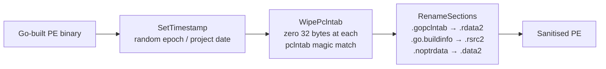

# PE Sanitization (Go-toolchain scrub)

[← pe index](README.md) · [docs/index](../../index.md)

## TL;DR

Wipe the "Made in Go" markers from a Windows PE: pclntab magic
bytes (defeats redress / GoReSym / IDA `go_parser`), Go-specific
section names (`.gopclntab`, `.go.buildinfo`, …), and the
TimeDateStamp. `Sanitize` chains the three primitives with
sensible defaults; individual primitives stay exported so callers
can compose custom pipelines.

## Primer

Go binaries are uniquely identifiable. They ship with a build
timestamp, a `pclntab` structure that tools like IDA's
go_parser, redress, and GoReSym use to reconstruct function
names, and section names like `.gopclntab` that immediately
identify the binary as Go to even the laziest YARA rule.

`pe/strip` removes or rewrites these indicators so static
analysis tooling cannot trivially identify the binary as Go nor
reconstruct its internal structure. Pair with `garble` (Go-symbol
obfuscation at compile time) for a layered scrub: garble handles
the *symbols*, strip handles the *PE-level* fingerprint that
remains after garble emits the binary.

## How It Works



| Primitive | What it touches |
|---|---|
| `SetTimestamp` | `IMAGE_FILE_HEADER.TimeDateStamp` (4 bytes at PE+8) |
| `WipePclntab` | 32 bytes at every `0xFFFFFFF1` (Go 1.20+) / `0xFFFFFFF0` (Go 1.16+) magic match in the binary |
| `RenameSections` | 8-byte `Name` field of every matching section header |

`Sanitize` applies all three with defaults: random recent
timestamp, full pclntab wipe, the canonical `.go*` →
`.{rdata,rsrc,data}2` rename map.

## API → godoc

[`pkg.go.dev/github.com/oioio-space/maldev/pe/strip`](https://pkg.go.dev/github.com/oioio-space/maldev/pe/strip) is the authoritative
reference for every exported symbol. This page teaches the
*concepts*; the godoc is the *specification*.

## Examples

### Simple — quick sanitise

```go
import (
    "os"

    "github.com/oioio-space/maldev/pe/strip"
)

raw, _ := os.ReadFile("implant.exe")
clean := strip.Sanitize(raw)
_ = os.WriteFile("implant_clean.exe", clean, 0o644)
```

### Composed — fixed timestamp + custom renames

```go
import (
    "time"

    "github.com/oioio-space/maldev/pe/strip"
)

raw, _ := os.ReadFile("implant.exe")
raw = strip.SetTimestamp(raw, time.Date(2024, 6, 15, 10, 30, 0, 0, time.UTC))
raw = strip.WipePclntab(raw)
raw = strip.RenameSections(raw, map[string]string{
    ".gopclntab":    ".rdata",
    ".go.buildinfo": ".rsrc",
    ".text":         ".code",
})
```

### Advanced — garble + strip pipeline

```go
import (
    "os"
    "os/exec"

    "github.com/oioio-space/maldev/pe/strip"
)

func buildAndSanitize() {
    _ = exec.Command("garble", "-literals", "-tiny", "build",
        "-ldflags", "-s -w -H windowsgui",
        "-o", "implant-garbled.exe",
        "./cmd/implant",
    ).Run()

    raw, _ := os.ReadFile("implant-garbled.exe")
    raw = strip.Sanitize(raw)
    _ = os.WriteFile("implant-final.exe", raw, 0o644)
}
```

See [`ExampleSanitize`](../../../pe/strip/strip_example_test.go).

## OPSEC & Detection

| Artefact | Where defenders look |
|---|---|
| YARA rule matching `.gopclntab` / `.go.buildinfo` section names | Static scanners; trivially defeated by `RenameSections` |
| YARA rule matching pclntab magic (`FF FF FF F1`) | Static scanners; defeated by `WipePclntab` |
| Build-timestamp pinning to a known Go-toolchain release window | Forensic timeline; defeated by `SetTimestamp` |
| Rich header (Microsoft linker fingerprint) | Not produced by Go's linker — so its *absence* is itself a tell on Windows-only deployments |
| File entropy / Go-binary size signature | Outside this package's scope; pair with UPX / pe/morph |

**D3FEND counters:**

- [D3-SEA](https://d3fend.mitre.org/technique/d3f:StaticExecutableAnalysis/) — IAT, sections, magic bytes.
- [D3-FCA](https://d3fend.mitre.org/technique/d3f:FileContentAnalysis/) — fuzzy-hash + entropy similarity scans still flag.

**Hardening for the operator:**

- Run `Sanitize` *after* garble so Go-symbol obfuscation lands
  before the PE-level scrub.
- Couple with `pe/morph` if the implant is UPX-packed — neither
  alone defeats both static + entropy detection.
- Don't rely on this for behavioural EDR — the binary still
  *acts* like Go runtime (large initial allocations, GC pauses,
  ntdll-heavy IAT).

## MITRE ATT&CK

| T-ID | Name | Sub-coverage | D3FEND counter |
|---|---|---|---|
| [T1027.002](https://attack.mitre.org/techniques/T1027/002/) | Obfuscated Files or Information: Software Packing | partial — header + section-name scrub, no payload encryption | D3-SEA |
| [T1027.005](https://attack.mitre.org/techniques/T1027/005/) | Indicator Removal from Tools | full — pclntab wipe defeats Go-binary-disassembly tools | D3-SEA |

## Limitations

- **Not encryption.** The binary structure is still a valid PE;
  behavioural analysis is unaffected.
- **Partial pclntab.** `WipePclntab` zeros 32 bytes per magic
  match — the rest of the pclntab structure remains, and
  determined analysts can reconstruct portions.
- **Cosmetic section renames.** Renaming `.gopclntab` to
  `.rdata2` does not change its contents; entropy still
  identifies the data inside.
- **Complementary, not standalone.** Pair with garble (symbols),
  pe/morph (UPX), pe/cert (signature) for layered scrub.
- **Malformed PEs may panic.** Functions assume well-formed PE
  input; run on toolchain-emitted binaries only.

## See also

- [PE morphing (UPX section rename)](morph.md) — pair for
  packed-binary scrub.
- [Certificate theft](certificate-theft.md) — clone an
  Authenticode signature post-strip.
- [`crypto`](../crypto/README.md) — payload encryption beyond
  PE-level scrub.
- [`hash`](../hash/README.md) — verify the hash delta after
  sanitisation.
- [Operator path](../../by-role/operator.md).
- [Detection eng path](../../by-role/detection-eng.md).
