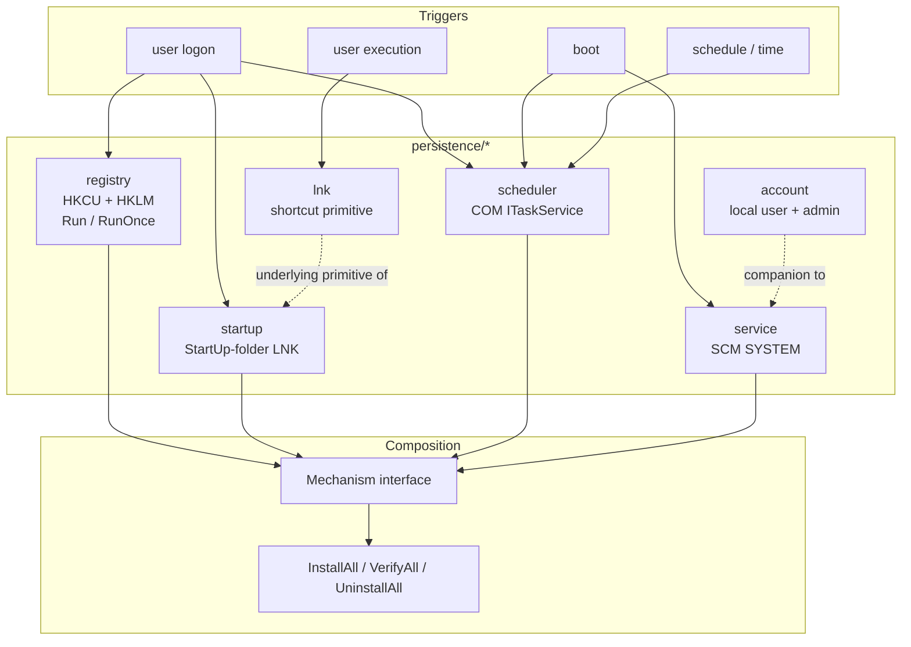

---
---

# Persistence techniques

[← maldev README](../../../README.md) · [docs/index](../../index.md)

The `persistence/*` package tree groups Windows-only mechanisms
that re-launch an implant across reboots and user logons. The
[`Mechanism`](https://pkg.go.dev/github.com/oioio-space/maldev/persistence) interface is the composition
primitive: each sub-package returns a `Mechanism`, and
[`InstallAll`](https://pkg.go.dev/github.com/oioio-space/maldev/persistence) / `VerifyAll` /
`UninstallAll` operate on a flat slice — operators typically
install two or three mechanisms in parallel so failure of any
single one (cleanup sweep, AV remediation, EDR auto-roll-back)
does not lose persistence.



> **Where to start (novice path):**
> 1. [`registry`](registry.md) — HKCU Run key. The classic
>    "implant relaunches at every user logon" mechanism.
>    Smallest footprint, easiest to set up.
> 2. [`startup-folder`](startup-folder.md) — drop a LNK in the
>    Startup folder. Same trigger (user logon), different
>    artefact class — use one or the other based on which
>    surface defenders inventory.
> 3. [`task-scheduler`](task-scheduler.md) — COM ITaskService.
>    Survives when Run keys / startup folder get cleaned by AV
>    remediation. Heavier setup but most resilient.
> 4. [`service`](service.md) — boot-time SYSTEM persistence.
>    Requires admin; pair with [`cleanup/service`](../cleanup/service.md)
>    to hide it from `services.msc`.
> 5. Compose 2-3 mechanisms via `InstallAll` so failure of one
>    doesn't lose persistence. NEVER rely on a single mechanism.

## Packages

| Package | Tech page | Detection | One-liner |
|---|---|---|---|
| [`persistence/registry`](https://pkg.go.dev/github.com/oioio-space/maldev/persistence/registry) | [registry.md](registry.md) | moderate | HKCU + HKLM Run / RunOnce key persistence |
| [`persistence/startup`](https://pkg.go.dev/github.com/oioio-space/maldev/persistence/startup) | [startup-folder.md](startup-folder.md) | moderate | StartUp-folder LNK persistence (user + machine) |
| [`persistence/scheduler`](https://pkg.go.dev/github.com/oioio-space/maldev/persistence/scheduler) | [task-scheduler.md](task-scheduler.md) | moderate | COM-based scheduled tasks; logon / startup / daily / time triggers |
| [`persistence/service`](https://pkg.go.dev/github.com/oioio-space/maldev/persistence/service) | [service.md](service.md) | noisy | Windows service via SCM (SYSTEM-scope) |
| [`persistence/lnk`](https://pkg.go.dev/github.com/oioio-space/maldev/persistence/lnk) | [lnk.md](lnk.md) | quiet | Underlying LNK creation primitive (used by startup, also for T1204.002 user-execution traps) |
| [`persistence/account`](https://pkg.go.dev/github.com/oioio-space/maldev/persistence/account) | [account.md](account.md) | noisy | Local user account add / delete / group membership |

## Quick decision tree

| You want to… | Use |
|---|---|
| …survive a reboot, no admin | [`registry.RunKey(HiveCurrentUser, …)`](registry.md) or [`startup.Shortcut`](startup-folder.md) |
| …survive a reboot, machine-wide | [`registry.RunKey(HiveLocalMachine, …)`](registry.md) or [`startup.InstallMachine`](startup-folder.md) |
| …trigger before user logon (boot / startup) | [`scheduler` with `WithTriggerStartup`](task-scheduler.md) or [`service`](service.md) |
| …schedule recurring callbacks | [`scheduler.Create` with `WithTriggerDaily`](task-scheduler.md) |
| …run as SYSTEM | [`service`](service.md) or [`scheduler` with startup trigger](task-scheduler.md) |
| …compose multiple mechanisms with redundancy | [`persistence.InstallAll`](https://pkg.go.dev/github.com/oioio-space/maldev/persistence) |
| …leave a credential that survives implant removal | [`account.Add` + `SetAdmin`](account.md) (loud) |
| …drop a user-execution trap (Desktop / Quick Launch) | [`lnk.New`](lnk.md) |

## Layered redundancy recipe

The canonical "redundant persistence" pattern installs two
mechanisms with different telemetry profiles. Loss of one
does not lose persistence; the noisier one provides reach,
the quieter one provides resilience.

```go
mechs := []persistence.Mechanism{
    // Loud + reach: SYSTEM-scope service, runs at boot.
    service.Service(&service.Config{
        Name:      "WinUpdate",
        BinPath:   `C:\ProgramData\Microsoft\winupdate.exe`,
        StartType: service.StartAuto,
    }),
    // Quiet + resilience: HKCU Run-key, runs at user logon.
    registry.RunKey(registry.HiveCurrentUser, registry.KeyRun,
        "WinUpdateBackup",
        `C:\ProgramData\Microsoft\winupdate.exe`),
}
errs := persistence.InstallAll(mechs)
```

## MITRE ATT&CK

| T-ID | Name | Packages | D3FEND counter |
|---|---|---|---|
| [T1547.001](https://attack.mitre.org/techniques/T1547/001/) | Boot or Logon Autostart Execution: Registry Run Keys / Startup Folder | `persistence/registry`, `persistence/startup` | [D3-SICA](https://d3fend.mitre.org/technique/d3f:SystemConfigurationDatabaseAnalysis/), [D3-FCA](https://d3fend.mitre.org/technique/d3f:FileContentAnalysis/) |
| [T1547.009](https://attack.mitre.org/techniques/T1547/009/) | Shortcut Modification | `persistence/lnk`, `persistence/startup` | [D3-FCA](https://d3fend.mitre.org/technique/d3f:FileContentAnalysis/) |
| [T1053.005](https://attack.mitre.org/techniques/T1053/005/) | Scheduled Task/Job: Scheduled Task | `persistence/scheduler` | [D3-SCA](https://d3fend.mitre.org/technique/d3f:ScheduledJobAnalysis/) |
| [T1543.003](https://attack.mitre.org/techniques/T1543/003/) | Create or Modify System Process: Windows Service | `persistence/service` | [D3-PSA](https://d3fend.mitre.org/technique/d3f:ProcessSpawnAnalysis/), [D3-SICA](https://d3fend.mitre.org/technique/d3f:SystemConfigurationDatabaseAnalysis/) |
| [T1136.001](https://attack.mitre.org/techniques/T1136/001/) | Create Account: Local Account | `persistence/account` | [D3-LAM](https://d3fend.mitre.org/technique/d3f:LocalAccountMonitoring/) |
| [T1098](https://attack.mitre.org/techniques/T1098/) | Account Manipulation | `persistence/account` (group changes) | [D3-UAP](https://d3fend.mitre.org/technique/d3f:UserAccountPermissions/) |
| [T1204.002](https://attack.mitre.org/techniques/T1204/002/) | User Execution: Malicious File | `persistence/lnk` (Desktop / Quick Launch traps) | [D3-FCA](https://d3fend.mitre.org/technique/d3f:FileContentAnalysis/) |

## See also

- [Operator path: persistence selection](../../by-role/operator.md)
- [Detection eng path: persistence telemetry](../../by-role/detection-eng.md)
- [`pe/masquerade`](../pe/masquerade.md) — clone svchost
  identity for the persisted binary.
- [`pe/cert`](../pe/certificate-theft.md) — graft Authenticode
  signature.
- [`cleanup`](../cleanup/README.md) — remove persistence
  artefacts at op end.
- [`privesc`](../privesc/README.md) — pair to obtain the admin /
  SYSTEM tokens HKLM-scope and SCM persistence require.
