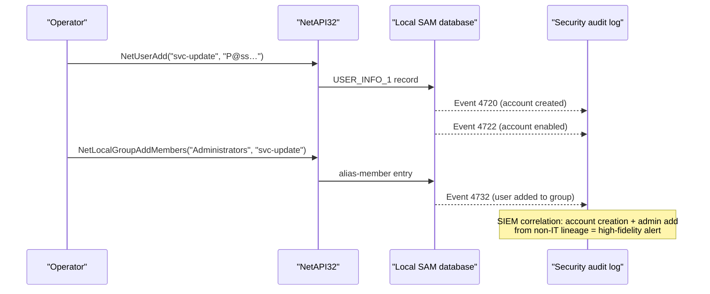

# Local account creation

[← persistence index](README.md) · [docs/index](../../index.md)

## TL;DR

Create a backdoor local user account that survives reboots,
password rotations on other accounts, and full implant removal.
Add the account to `Administrators` (SID-500 group) for full
local control.

| You want to… | Use | Telemetry |
|---|---|---|
| Add a backup admin account | [`Add`](#add) + [`AddToGroup`](#addtogroup) `"Administrators"` | Security 4720 (account created) + 4732 (group add) |
| Modify password / properties | [`SetInfo`](#setinfo) | Security 4724 (password reset) |
| Delete an account (cleanup) | [`Delete`](#delete) | Security 4726 |
| List accounts (recon) | [`Enum`](#enum) | Read-only — no Security log entry |

What this DOES achieve:

- Independent credential — survives any cleanup that doesn't
  enumerate all local users.
- Member of `Administrators` = full local control without
  needing to maintain implant access.
- Standard NetAPI32 calls — no `net user` child-process
  signal.

What this does NOT achieve:

- **Loudest persistence option in this tree** — every action
  emits Security events that mature SIEMs cluster on.
- **Easily inventoried** — `net user` / `Get-LocalUser` lists
  every account on the machine. Defenders running periodic
  user audits notice the new account immediately.
- **Doesn't bypass admin requirement** — `NetUserAdd` needs
  Administrator. For non-admin alternatives see
  [`persistence/registry`](registry.md) (HKCU) or
  [`persistence/startup-folder`](startup-folder.md).
- **Domain-joined hosts**: local accounts only. Domain account
  creation is a different attack class entirely (DC access,
  domain admin, Kerberos manipulation — see
  [`credentials/goldenticket`](../credentials/goldenticket.md)).

## Primer

Creating a local account gives the operator a credential that
survives reboots, password rotations on other accounts, and
implant removal. Adding the account to `Administrators` (the
SID-500 group) gives full local control. The trade-off is
volume: SAM events are universally audited and any half-decent
SIEM rule fires on a local-admin add from a non-IT context.

The package wraps the canonical `Net*` Win32 admin APIs — same
surface that `net user`, Computer Management MMC, and PowerShell's
`New-LocalUser` use. There is no stealthier API for local-account
manipulation; the loudness is inherent to the technique.

## How It Works



The package's `Add` posts a `USER_INFO_1` (level 1: name +
password + privilege + home-dir + comment + flags +
script-path) so the account is created enabled and password-set
in a single call. `SetAdmin` is `NetLocalGroupAddMembers` against
the well-known `Administrators` alias.

## API → godoc

[`pkg.go.dev/github.com/oioio-space/maldev/persistence/account`](https://pkg.go.dev/github.com/oioio-space/maldev/persistence/account) is the authoritative
reference for every exported symbol. This page teaches the
*concepts*; the godoc is the *specification*.

## Examples

### Simple — add a service-looking account

```go
import "github.com/oioio-space/maldev/persistence/account"

_ = user.Add("svc-update", "P@ssw0rd!2024")
defer user.Delete("svc-update")
```

### Composed — add admin + group cleanup

```go
if !user.IsAdmin() {
    return fmt.Errorf("requires local admin")
}
_ = user.Add("svc-update", "P@ssw0rd!2024")
_ = user.SetAdmin("svc-update")

// Tear down on uninstall
defer func() {
    _ = user.RevokeAdmin("svc-update")
    _ = user.Delete("svc-update")
}()
```

### Advanced — pair with service persistence

Run the implant as the new account so the service uses its
credential at every restart — credential persistence + autostart
in one composite mechanism.

```go
import (
    "github.com/oioio-space/maldev/persistence"
    "github.com/oioio-space/maldev/persistence/account"
    "github.com/oioio-space/maldev/persistence/service"
)

_ = user.Add("svc-update", "P@ssw0rd!2024")
_ = user.SetAdmin("svc-update")

mechanisms := []persistence.Mechanism{
    service.Service(&service.Config{
        Name:      "WinUpdate",
        BinPath:   `C:\ProgramData\Microsoft\winupdate.exe`,
        StartType: service.StartAuto,
        // The service runs as LocalSystem by default; specifying
        // svc-update would route through SCM ChangeServiceConfig
        // and require LogonAsAService.
    }),
}
_ = persistence.InstallAll(mechanisms)
```

See [`ExampleAdd`](../../../persistence/account/account_example_test.go).

## OPSEC & Detection

| Artefact | Where defenders look |
|---|---|
| Security 4720 (user created) | Universal audit; SIEM rule: 4720 from non-IT-OU = high-fidelity alert |
| Security 4722 (user enabled) | Pairs with 4720 in baseline rules |
| Security 4732 (member added to group) | Especially for Administrators / Backup Operators / Remote Desktop Users SIDs |
| Security 4724 (password reset by another account) | `SetPassword` on a non-self account |
| `NetUserAdd` API call from a non-IT process | EDR API telemetry (Defender ATP, MDE) |
| `Net1.exe` / `dsadd.exe` lineage absence | Direct API use bypasses child-process telemetry but emits the same audit events |

**D3FEND counters:**

- [D3-LAM](https://d3fend.mitre.org/technique/d3f:LocalAccountMonitoring/)
  — local SAM event auditing.
- [D3-UAP](https://d3fend.mitre.org/technique/d3f:UserAccountPermissions/)
  — group-membership change detection.

**Hardening for the operator:**

- Pick a name that mimics service accounts (`svc-*`,
  `WindowsUpdate`, `defender-cu`) — naive correlation against
  user-named accounts misses these.
- Don't immediately add to Administrators on creation — split
  the actions across hours or use a Backup Operators / Remote
  Desktop Users membership instead, which raises lower-priority
  alerts.
- Pair with [`cleanup`](../cleanup/README.md) to delete the
  account at op end — long-lived dormant accounts attract
  proactive review.
- Avoid this technique entirely if the target has Just-In-Time
  admin (Microsoft LAPS, Azure PIM); event 4720 there is
  effectively a tripwire.

## MITRE ATT&CK

| T-ID | Name | Sub-coverage | D3FEND counter |
|---|---|---|---|
| [T1136.001](https://attack.mitre.org/techniques/T1136/001/) | Create Account: Local Account | full | D3-LAM |
| [T1098](https://attack.mitre.org/techniques/T1098/) | Account Manipulation | partial — group-membership add/remove via `AddToGroup` / `SetAdmin` | D3-UAP |

## Limitations

- **Admin required for most operations.** `Add`, `Delete`,
  `SetAdmin`, `SetPassword` (against another account) need
  local administrator. `IsAdmin` lets the caller check before
  attempting.
- **Domain-joined hosts.** Group Policy can disable local
  account creation entirely (`DenyAddingLocalAccounts`); the
  call returns `ERROR_INVALID_PARAMETER`.
- **Audit cannot be suppressed from user mode.** SAM events
  fire pre-authorization; only kernel-level tampering
  (out-of-scope) silences them.
- **No domain-account support.** This package wraps
  `NetUserAdd` against the local SAM only. Domain accounts
  require LDAP / `NetUserAdd` to a DC — separate concern.

## See also

- [`persistence/service`](service.md) — pair to run the
  implant under the new account.
- [`credentials`](../credentials/README.md) — alternative
  credential acquisition with lower noise.
- [`privesc`](../privesc/README.md) — pair to obtain admin for the
  initial Add.
- [`cleanup`](../cleanup/README.md) — remove the account at
  operation end.
- [Operator path](../../by-role/operator.md).
- [Detection eng path](../../by-role/detection-eng.md).
