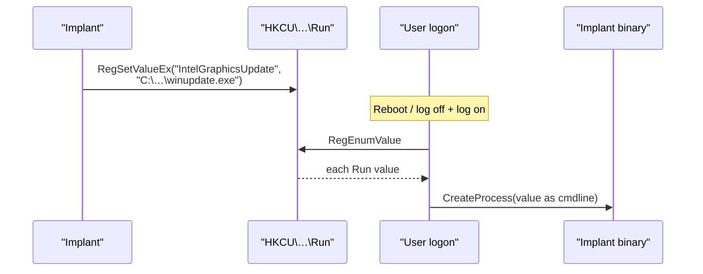

# Registry Run / RunOnce persistence

[← persistence index](README.md) · [docs/index](../../index.md)

## TL;DR

Survive reboots by writing the implant's path to a Run/RunOnce
registry key. Windows launches the value at every user logon.

| You want… | Use | Hive | Admin? | Persistence |
|---|---|---|---|---|
| Per-user, no admin | `Hive=HKCU, RunOnce=false` | `HKCU\Software\Microsoft\Windows\CurrentVersion\Run` | No | Reboot-persistent |
| Per-machine, all users | `Hive=HKLM, RunOnce=false` | `HKLM\…\Run` | Yes | Reboot-persistent |
| One-shot bootstrap (delete after first run) | `RunOnce=true` | `…\RunOnce` | (depends on hive) | Self-deletes after firing |

What this DOES achieve:

- Trivial install — single `RegSetValueEx` on a known-key path.
- HKCU path needs zero elevation — works from any user-token
  implant.
- Composes with other mechanisms via [`persistence.Mechanism`](https://pkg.go.dev/github.com/oioio-space/maldev/persistence)
  + `InstallAll` so cleanup of one doesn't lose persistence
  if you installed redundantly.

What this does NOT achieve:

- **Among the loudest persistence options** — Run/RunOnce is
  the most-monitored persistence path on every EDR. AutoRuns,
  Sysmon EID 13, every "persistence audit" PowerShell script
  finds it first.
- **HKCU = per-user only** — fires only when THIS user logs on.
  Not for "any user logs in" coverage.
- **String-only** — no obfuscation; the implant's path is
  plaintext in the registry. Pair with [`pe/masquerade`](../pe/masquerade.md)
  to make the path look benign (`%SystemRoot%\System32\svchost.exe`).
- **No retry on failure** — if the implant crashes, Windows
  doesn't restart it. For auto-restart, use
  [`persistence/service`](service.md) (LocalSystem +
  restart-on-failure).

## Primer

Windows reads four registry keys at logon and launches every
value as a process command-line. This is one of the oldest and
most documented persistence techniques — and one of the most
monitored. Its appeal is the trivial install (single
`RegSetValueEx`) and the no-admin HKCU path: even a
limited-token implant can self-restart after every reboot.

`Run` keys persist across reboots; `RunOnce` keys self-delete
after firing once — useful for first-boot bootstrappers that
hand off to a more durable mechanism and then vanish.

## How It Works



Registry paths:

| Hive | Key | Behaviour | Admin? |
|---|---|---|---|
| HKCU | `Software\Microsoft\Windows\CurrentVersion\Run` | persistent, per-user | no |
| HKCU | `Software\Microsoft\Windows\CurrentVersion\RunOnce` | one-shot, per-user | no |
| HKLM | `Software\Microsoft\Windows\CurrentVersion\Run` | persistent, machine-wide | yes |
| HKLM | `Software\Microsoft\Windows\CurrentVersion\RunOnce` | one-shot, machine-wide | yes |

`RunOnce` self-cleanup happens after launch *succeeds* — values
where the binary is missing or fails to launch stay in the
registry, which is itself a forensic tell.

## API → godoc

[`pkg.go.dev/github.com/oioio-space/maldev/persistence/registry`](https://pkg.go.dev/github.com/oioio-space/maldev/persistence/registry) is the authoritative
reference for every exported symbol. This page teaches the
*concepts*; the godoc is the *specification*.

## Examples

### Simple — HKCU install + remove

```go
import "github.com/oioio-space/maldev/persistence/registry"

_ = registry.Set(registry.HiveCurrentUser, registry.KeyRun,
    "IntelGraphicsUpdate", `C:\Users\Public\winupdate.exe`)
defer registry.Delete(registry.HiveCurrentUser, registry.KeyRun,
    "IntelGraphicsUpdate")
```

### Composed — Mechanism + idempotent install

```go
m := registry.RunKey(registry.HiveCurrentUser, registry.KeyRun,
    "IntelGraphicsUpdate", `C:\Users\Public\winupdate.exe`)

if exists, _ := registry.Exists(registry.HiveCurrentUser,
    registry.KeyRun, "IntelGraphicsUpdate"); !exists {
    _ = m.Install()
}
```

### Advanced — hive selection + RunOnce bootstrap

Pick HKLM when the implant has admin, otherwise fall back to
HKCU; pair with a `RunOnce` bootstrap that hands off to a
service.

```go
import (
    "github.com/oioio-space/maldev/persistence/registry"
    "github.com/oioio-space/maldev/win/privilege"
)

const (
    name    = "IntelGraphicsCompat"
    payload = `C:\Users\Public\Intel\stage1.exe`
)

hive := registry.HiveCurrentUser
if admin, elevated, _ := privilege.IsAdmin(); admin && elevated {
    hive = registry.HiveLocalMachine
}

if exists, _ := registry.Exists(hive, registry.KeyRun, name); exists {
    return
}
_ = registry.Set(hive, registry.KeyRun, name, payload)
_ = registry.Set(hive, registry.KeyRunOnce, name+"_bootstrap",
    payload+" --bootstrap")
```

See [`ExampleSet`](../../../persistence/registry/registry_example_test.go)
+ [`ExampleRunKeyMechanism`](../../../persistence/registry/registry_example_test.go).

## OPSEC & Detection

| Artefact | Where defenders look |
|---|---|
| Sysmon Event 13 (registry value set) under `…\Run` | High-fidelity rule on every mature EDR; HKCU\…\Run draws less default coverage than HKLM\…\Run |
| `autoruns.exe` Run-key listing | Sysinternals Autoruns is universal IR triage |
| Defender ASR rule "Block credential stealing" doesn't apply, but ASR "Block persistence through WMI event subscription" detects siblings | EDR rule library |
| Value name keyed against known IOC list (`payload`, `update`, `svchost`) | Naive YARA-style rules on registry value contents |
| Binary path under user-writable directories (`%TEMP%`, `%APPDATA%\Local\Temp`) | Defender heuristic — legitimate Run values target installed-software paths |
| `RegEnumValue` / `RegOpenKeyEx` from non-explorer.exe | EDR API telemetry; rare unless tooling explicitly polls Run keys |

**D3FEND counters:**

- [D3-SICA](https://d3fend.mitre.org/technique/d3f:SystemConfigurationDatabaseAnalysis/)
  — registry change auditing.
- [D3-SEA](https://d3fend.mitre.org/technique/d3f:StaticExecutableAnalysis/)
  — Run-key value content inspection.

**Hardening for the operator:**

- Prefer HKCU when current-user scope is sufficient — lower
  default coverage and no admin prompt.
- Pick value names that mimic real Run-key values (Adobe
  Updater, Intel Graphics, Microsoft OneDrive) — pair the
  binary path with a name + path that match.
- Drop the binary in `%PROGRAMDATA%\Microsoft\…\` rather than
  `%TEMP%`.
- Pair with another mechanism via `persistence.InstallAll` so
  loss of the Run key (`autoruns.exe -e -accepteula -c` cleanup)
  does not lose persistence.
- For one-shot bootstrappers, use `RunOnce` so the registry
  evidence vanishes on first boot.

## MITRE ATT&CK

| T-ID | Name | Sub-coverage | D3FEND counter |
|---|---|---|---|
| [T1547.001](https://attack.mitre.org/techniques/T1547/001/) | Boot or Logon Autostart Execution: Registry Run Keys / Startup Folder | full — Run / RunOnce both supported | D3-SICA, D3-SEA |

## Limitations

- **Logon trigger only.** Run keys fire at *user logon*, not at
  boot. For pre-logon execution use
  [`persistence/service`](service.md) or
  [`persistence/scheduler`](task-scheduler.md) with a `Boot` /
  `Startup` trigger.
- **HKLM admin requirement.** Without admin the operator is
  HKCU-only.
- **No CWD control.** Windows launches Run-key values via
  `CreateProcess` with the user's profile as CWD; binaries
  that depend on a specific CWD must encode it via `cd /d`
  in the value or read it from a config.
- **Value-name collision.** Two implants writing to the same
  value name cause silent overwrite — pick distinctive names.
- **Visible to standard tooling.** `regedit`, `reg query`,
  PowerShell `Get-ItemProperty`, and `autoruns.exe` all
  surface Run-key values. No way to hide a Run-key entry from
  a thorough triage.

## See also

- [`persistence/startup`](startup-folder.md) — sibling logon
  trigger via StartUp folder.
- [`persistence/scheduler`](task-scheduler.md) — sibling
  with broader trigger options (boot, daily, time).
- [`persistence/service`](service.md) — sibling SYSTEM-scope
  persistence with pre-logon boot trigger.
- [`win/privilege`](../syscalls/) — `IsAdmin` for hive
  selection.
- [`crypto`](../crypto/README.md) — encrypt the on-disk
  payload.
- [`cleanup/timestomp`](../cleanup/) — match the binary's
  file timestamps to a trusted neighbour.
- [Operator path](../../by-role/operator.md).
- [Detection eng path](../../by-role/detection-eng.md).
