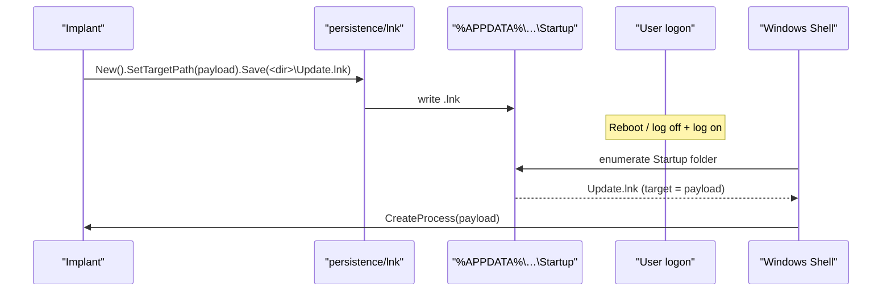

# StartUp folder persistence

[← persistence index](README.md) · [docs/index](../../index.md)

## TL;DR

Drop a `.lnk` shortcut into the StartUp folder. Windows Shell
launches every shortcut it finds at user logon.

| Scope | Folder | Admin? | When |
|---|---|---|---|
| Per-user | `%APPDATA%\Microsoft\Windows\Start Menu\Programs\StartUp` | No | This user's logon only |
| All users | `%PROGRAMDATA%\Microsoft\Windows\Start Menu\Programs\StartUp` | Yes | Every user's logon |

What this DOES achieve:

- No admin for user-scope — works from any user-token implant.
- File-based artifact survives certain registry-only cleanup
  scripts.
- Composes with [`persistence/registry`](registry.md) via
  `InstallAll` for redundant persistence.

What this does NOT achieve:

- **Highly monitored** — every EDR / autoruns scanner / user
  experiencing suspicious behaviour checks StartUp folders
  first. Sysmon EID 11 (FileCreate) catches the .lnk drop.
- **`.lnk` content is easily inspectable** — `Get-Item`
  expands the target path; defenders see your binary path.
  Pair with [`pe/masquerade`](../pe/masquerade.md) so the
  target name looks benign.
- **No retry on failure** — if your binary crashes, Windows
  doesn't restart it.
- **Doesn't survive cleanup that targets file-based persistence** —
  any "clear StartUp" sweep deletes you. For lower-visibility
  triggers, see [`persistence/task-scheduler`](task-scheduler.md).

## Primer

The StartUp folder is the GUI-era equivalent of Run keys.
Windows Shell scans two well-known directories at logon and
launches every shortcut it finds:

- **User**: `%APPDATA%\Microsoft\Windows\Start Menu\Programs\Startup`
- **Machine**: `C:\ProgramData\Microsoft\Windows\Start Menu\Programs\StartUp`

Once-popular as an "easy" persistence path, it's now well-known
to defensive tooling — but the user folder still sees less
default scrutiny than HKLM\…\Run on most stacks. The package
wraps [`persistence/lnk`](lnk.md) (LNK creation primitive) with
the right paths and a `Mechanism` adapter.

## How It Works



Per-user paths can be discovered via `SHGetKnownFolderPath` /
`%APPDATA%`; the package's `UserDir` / `MachineDir` helpers
encapsulate that.

## API → godoc

[`pkg.go.dev/github.com/oioio-space/maldev/persistence/startup`](https://pkg.go.dev/github.com/oioio-space/maldev/persistence/startup) is the authoritative
reference for every exported symbol. This page teaches the
*concepts*; the godoc is the *specification*.

## Examples

### Simple — user-scope drop

```go
import "github.com/oioio-space/maldev/persistence/startup"

_ = startup.Install("WindowsUpdate",
    `C:\Users\Public\winupdate.exe`,
    "--silent")
defer startup.Remove("WindowsUpdate")
```

### Composed — Mechanism + idempotency

```go
m := startup.Shortcut("WindowsUpdate",
    `C:\Users\Public\winupdate.exe`, "")
if !startup.Exists("WindowsUpdate") {
    _ = m.Install()
}
```

### Advanced — machine-wide install + timestomp

Drop the launcher in the machine folder so the implant runs at
*every* user's logon, then timestomp the resulting LNK so it
blends with surrounding Microsoft files.

```go
import (
    "os"
    "path/filepath"

    "github.com/oioio-space/maldev/cleanup/timestomp"
    "github.com/oioio-space/maldev/persistence/startup"
)

const target = `C:\ProgramData\Microsoft\winupdate.exe`

if err := startup.InstallMachine("WindowsUpdate", target, ""); err != nil {
    panic(err)
}

machineDir, _ := startup.MachineDir()
lnkPath := filepath.Join(machineDir, "WindowsUpdate.lnk")

ref, _ := os.Stat(`C:\Windows\System32\svchost.exe`)
t := ref.ModTime()
_ = timestomp.SetFull(lnkPath, t, t, t)
```

### Pipeline — startup + registry redundancy

Pair a Run-key with the StartUp shortcut so removing one does
not lose persistence.

```go
import (
    "github.com/oioio-space/maldev/persistence"
    "github.com/oioio-space/maldev/persistence/registry"
    "github.com/oioio-space/maldev/persistence/startup"
)

const target = `C:\Users\Public\winupdate.exe`

mechs := []persistence.Mechanism{
    startup.Shortcut("WindowsUpdate", target, ""),
    registry.RunKey(registry.HiveCurrentUser, registry.KeyRun,
        "WindowsUpdateBackup", target),
}
_ = persistence.InstallAll(mechs)
```

See [`ExampleShortcut`](../../../persistence/startup/startup_example_test.go).

## OPSEC & Detection

| Artefact | Where defenders look |
|---|---|
| File creation under `%APPDATA%\…\Startup` | Path-scoped EDR rules — high-fidelity even for benign-looking LNKs |
| File creation under `%PROGRAMDATA%\…\StartUp` | Same, with admin involvement adding to the signal |
| `autoruns.exe -lcuser` / `-l` listing | Sysinternals Autoruns surfaces both folders |
| LNK pointing at user-writable / temp paths | Defender heuristic |
| LNK with mismatched icon vs target binary | EDR rule cross-checks `IconLocation` vs `TargetPath` |
| Implant binary lacking signature + Microsoft VERSIONINFO | Pair with [`pe/masquerade`](../pe/masquerade.md) + [`pe/cert`](../pe/certificate-theft.md) |

**D3FEND counters:**

- [D3-FCA](https://d3fend.mitre.org/technique/d3f:FileContentAnalysis/)
  — LNK header inspection.
- [D3-SEA](https://d3fend.mitre.org/technique/d3f:StaticExecutableAnalysis/)
  — target-binary review.

**Hardening for the operator:**

- Prefer the user folder unless machine-wide is required —
  lower default coverage.
- Match icon + display name to a plausible identity (Notes,
  Update, OneDrive).
- Pair with [`cleanup/timestomp`](../cleanup/) so the LNK's
  MFT timestamps blend with surrounding Microsoft artefacts.
- Pair with [`persistence/registry`](registry.md) for
  redundancy via `persistence.InstallAll`.
- Avoid this technique when the target stack runs strict ASR
  rules ("Block executable content from email client and
  webmail" applies to LNKs delivered via that channel).

## MITRE ATT&CK

| T-ID | Name | Sub-coverage | D3FEND counter |
|---|---|---|---|
| [T1547.001](https://attack.mitre.org/techniques/T1547/001/) | Boot or Logon Autostart Execution: Startup Folder | full — user + machine | D3-FCA |
| [T1547.009](https://attack.mitre.org/techniques/T1547/009/) | Shortcut Modification | partial — LNK creation primitive (delegated to `persistence/lnk`) | D3-FCA |

## Limitations

- **Logon-only trigger.** Like Run keys, fires at user logon
  — not at boot.
- **One LNK per name.** Re-installing under the same name
  overwrites the existing shortcut without warning.
- **Windows-only.** No cross-platform stub.
- **Visible to standard triage.** Both folders are universal
  IR triage targets.
- **No service-account context.** LNKs run in the logging-in
  user's session — for SYSTEM-scope persistence use
  [`persistence/service`](service.md).

## See also

- [`persistence/lnk`](lnk.md) — underlying LNK creation
  primitive.
- [`persistence/registry`](registry.md) — sibling logon
  trigger; pair for redundancy.
- [`persistence/scheduler`](task-scheduler.md) — sibling with
  pre-logon (boot / startup) triggers.
- [`pe/masquerade`](../pe/masquerade.md) — clone identity for
  the launched binary.
- [`cleanup/timestomp`](../cleanup/) — align LNK timestamps.
- [Operator path](../../by-role/operator.md).
- [Detection eng path](../../by-role/detection-eng.md).
