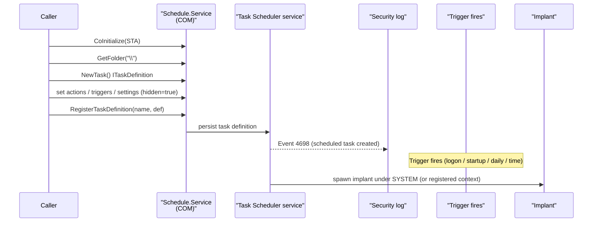

# Scheduled task persistence

[← persistence index](README.md) · [docs/index](../../index.md)

## TL;DR

Create scheduled tasks via the COM `ITaskService` API — no
`schtasks.exe` child process (which is itself a loud signal).
Most flexible trigger surface in the persistence tree.

| Trigger | When it fires | Admin required? |
|---|---|---|
| `Logon` | At any user logon | No (per-user task) |
| `Startup` | At system boot | Yes |
| `Daily` | Once per day at HH:MM | No (per-user) |
| `Time` | One-shot at specified time | No (per-user) |
| `Hidden=true` | Task invisible in Task Scheduler GUI | n/a (orthogonal flag) |

What this DOES achieve:

- COM call (`CoCreateInstance(CLSID_TaskScheduler)`) — no
  child-process spawn (`schtasks.exe` is a flagged signal).
- Trigger flexibility beyond Run/Startup: schedule, idle, log
  events, custom XML.
- `Hidden=true` flag removes from default Task Scheduler view
  (still in `\Microsoft\Windows` if defenders look).

What this does NOT achieve:

- **Event 4698 (task created)** still fires regardless of COM
  vs `schtasks.exe`. Defenders watching Security log see
  every task.
- **Hidden=true is cosmetic** — `Get-ScheduledTask` and
  `schtasks /Query /V` show hidden tasks too. Only the GUI
  filters.
- **Per-user tasks live in HKCU\…\Schedule\TaskCache** —
  defenders enumerating user-scope autoruns find them.
- **For SYSTEM-trust tasks**, an alternative is
  [`persistence/service`](service.md) — louder install
  (Event 7045) but more familiar to operators reading
  defender alerts.

## Primer

The Task Scheduler is the most flexible Windows persistence
mechanism. Triggers go beyond logon (Run keys, StartUp folder)
and boot (services): tasks can fire on a schedule, on idle, on
session lock/unlock, on event-log entries, on system events.

Most operators use `schtasks.exe` to register tasks — which
spawns a visible child process under the implant's lineage.
This package skips `schtasks.exe` entirely by talking to the
`Schedule.Service` COM object directly via go-ole. The audit
event (4698) still fires regardless of registration path; the
process-creation telemetry vanishes.

## How It Works



Triggers supported by this package:

| Constructor | Trigger |
|---|---|
| `WithTriggerLogon()` | Any user logon |
| `WithTriggerStartup()` | Boot — runs as SYSTEM by default |
| `WithTriggerDaily(intervalDays)` | Every N days |
| `WithTriggerTime(t)` | One-shot at `t` |

Task names must start with `\` — `\TaskName` for the root
folder, `\Folder\TaskName` for sub-folders.

## API → godoc

[`pkg.go.dev/github.com/oioio-space/maldev/persistence/scheduler`](https://pkg.go.dev/github.com/oioio-space/maldev/persistence/scheduler) is the authoritative
reference for every exported symbol. This page teaches the
*concepts*; the godoc is the *specification*.

## Examples

### Simple — logon trigger, hidden

```go
import "github.com/oioio-space/maldev/persistence/scheduler"

_ = scheduler.Create(`\IntelGraphicsRefresh`,
    scheduler.WithAction(`C:\ProgramData\Microsoft\winupdate.exe`),
    scheduler.WithTriggerLogon(),
    scheduler.WithHidden(),
)
defer scheduler.Delete(`\IntelGraphicsRefresh`)
```

### Composed — Mechanism + boot trigger

```go
m := scheduler.ScheduledTask(`\Microsoft\Windows\WinUpdate\Refresh`,
    scheduler.WithAction(`C:\ProgramData\Microsoft\winupdate.exe`),
    scheduler.WithTriggerStartup(),
    scheduler.WithHidden(),
)
_ = m.Install() // runs as SYSTEM at boot — admin required
```

### Advanced — daily + one-shot on the same task chain

```go
import "time"

// Daily refresh: every day at the implant's chosen interval.
_ = scheduler.Create(`\IntelGraphicsRefresh`,
    scheduler.WithAction(`C:\ProgramData\Microsoft\winupdate.exe`),
    scheduler.WithTriggerDaily(1),
    scheduler.WithHidden(),
)

// One-shot recovery at a specific time (e.g. fire-and-forget
// 2 hours from now to retry a failed C2 callback).
recovery := time.Now().Add(2 * time.Hour)
_ = scheduler.Create(`\IntelGraphicsRefreshRecovery`,
    scheduler.WithAction(`C:\ProgramData\Microsoft\winupdate.exe`,
        "--recovery"),
    scheduler.WithTriggerTime(recovery),
    scheduler.WithHidden(),
)
```

### Pipeline — task + Run-key dual persistence

```go
import (
    "github.com/oioio-space/maldev/persistence"
    "github.com/oioio-space/maldev/persistence/registry"
    "github.com/oioio-space/maldev/persistence/scheduler"
)

const bin = `C:\ProgramData\Microsoft\winupdate.exe`

mechs := []persistence.Mechanism{
    scheduler.ScheduledTask(`\Microsoft\Windows\WinUpdate\Refresh`,
        scheduler.WithAction(bin),
        scheduler.WithTriggerStartup(),
        scheduler.WithHidden()),
    registry.RunKey(registry.HiveCurrentUser, registry.KeyRun,
        "WinUpdateBackup", bin),
}
_ = persistence.InstallAll(mechs)
```

See [`ExampleCreate`](../../../persistence/scheduler/scheduler_example_test.go).

## OPSEC & Detection

| Artefact | Where defenders look |
|---|---|
| Security Event 4698 (scheduled task created) | Universal audit; SIEM rules correlate against task-name patterns and binary paths |
| Microsoft-Windows-TaskScheduler/Operational ETW provider | Per-task creation events |
| `schtasks /query` / `Get-ScheduledTask` listing | Operator review; `Hidden` flag requires "Show Hidden" toggle in `taskschd.msc` but `schtasks /query /xml` shows everything |
| Task XML stored at `%SystemRoot%\System32\Tasks\<path>\<name>` | File-creation telemetry on the XML drop |
| Task-name patterns mimicking Microsoft (`\Microsoft\Windows\…`) | EDR rules flag custom tasks under the `\Microsoft\Windows\` prefix because legitimate Microsoft tasks ship via WIM, not runtime registration |
| `schtasks.exe` child process | **Absent here** — COM path bypasses Sysmon Event 1 / child-process EDR rules |
| `Hidden` task with non-Microsoft author | Defender heuristic flags hidden tasks created by non-Microsoft processes |

**D3FEND counters:**

- [D3-SCA](https://d3fend.mitre.org/technique/d3f:ScheduledJobAnalysis/)
  — task-creation event auditing.
- [D3-SICA](https://d3fend.mitre.org/technique/d3f:SystemConfigurationDatabaseAnalysis/)
  — task XML monitoring on disk.

**Hardening for the operator:**

- Match the task path + name to a plausible Microsoft idiom
  (`\Microsoft\Windows\<Component>\<Task>`) — but be aware
  some EDRs flag non-Microsoft authors at exactly that path
  prefix.
- Use `WithHidden()` to keep the task out of casual
  `taskschd.msc` browsing, but don't rely on it as a stealth
  primitive — `schtasks /query /xml` and `Get-ScheduledTask`
  still surface it.
- Prefer `WithTriggerStartup` over `WithTriggerLogon` for
  pre-logon callbacks; the SYSTEM context is broader and the
  task fires before the user is logged in.
- Pair with [`pe/masquerade`](../pe/masquerade.md) for binary
  identity match.
- Avoid hosts with strict task-creation auditing
  (Microsoft-Windows-TaskScheduler/Operational forwarded to
  enterprise SIEM).

## MITRE ATT&CK

| T-ID | Name | Sub-coverage | D3FEND counter |
|---|---|---|---|
| [T1053.005](https://attack.mitre.org/techniques/T1053/005/) | Scheduled Task/Job: Scheduled Task | full — COM-based registration, all common triggers | D3-SCA, D3-SICA |

## Limitations

- **Audit cannot be skipped.** Event 4698 fires at registration
  regardless of how the task is created.
- **Trigger options trimmed.** This package supports the
  common triggers (logon, startup, daily, one-shot time).
  Other COM triggers (idle, session lock/unlock, event-log
  match) are not exposed — extend `options` to add.
- **Startup/logon triggers require admin.** Boot/startup tasks
  registered without admin are silently downgraded to "any
  user logon" or rejected.
- **Hidden flag is cosmetic.** `taskschd.msc` hides the task
  from default view; every other tooling surfaces it.
- **No principal override.** Tasks run as the registered
  user (or SYSTEM for startup/boot). Specifying a different
  principal (`RunAs`) requires the password and is out of
  scope for this package.

## See also

- [`persistence/service`](service.md) — sibling SYSTEM-scope
  persistence with stronger SCM telemetry.
- [`persistence/registry`](registry.md) — sibling logon-only
  persistence with lighter audit.
- [`pe/masquerade`](../pe/masquerade.md) — match binary
  identity to the cloned trigger lineage.
- [`cleanup`](../cleanup/README.md) — remove the task post-op.
- [Operator path](../../by-role/operator.md).
- [Detection eng path](../../by-role/detection-eng.md).
