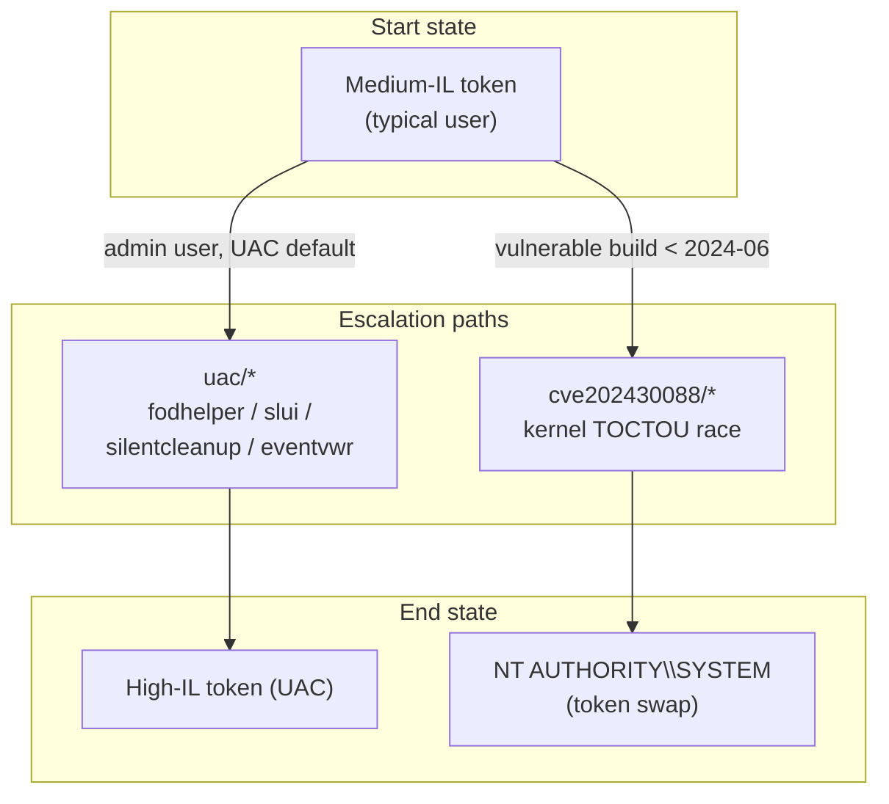

---
---

# Privilege escalation (`privesc/*`)

[← maldev README](../../../README.md) · [docs/index](../../index.md)

The `privesc/*` package tree groups primitives that take a
non-elevated user token and produce SYSTEM-context execution.



> **Where to start (novice path):**
> 1. Are you Medium-IL admin user? → [`uac`](uac.md). UAC bypass
>    methods (FODHelper / SLUI / SilentCleanup / EventVwr) silently
>    elevate to High-IL without a prompt. Pick by build window.
> 2. Need full SYSTEM, not just High-IL? → check the host build
>    via [`win/version`](../win/version.md); if pre-June-2024
>    Windows 10/11, [`cve202430088`](cve202430088.md). Otherwise
>    you need a different exploit (out of scope here).
> 3. Already SYSTEM, want TrustedInstaller? →
>    [`win/impersonate.RunAsTrustedInstaller`](../tokens/impersonation.md).
> 4. The decision tree below covers every common state /
>    target permutation.

## Decision tree

| State / question | Path |
|---|---|
| "User is admin, UAC is default-notify, just need elevation." | [`privesc/uac`](uac.md) — pick the bypass that survives the build |
| "Need SYSTEM, host build < June 2024 patch." | [`privesc/cve202430088`](cve202430088.md) |
| "Already SYSTEM, need TrustedInstaller." | [`win/impersonate.RunAsTrustedInstaller`](../tokens/impersonation.md) |
| "Already admin, need elevation without UAC bypass." | [`win/privilege.ShellExecuteRunAs`](../tokens/privilege-escalation.md) (visible UAC prompt) |

## Per-package pages

- [uac.md](uac.md) — four bypass primitives (FODHelper, SLUI,
  SilentCleanup, EventVwr) with build-window tables.
- [cve202430088.md](cve202430088.md) — CVE-2024-30088 kernel TOCTOU
  race with pre-flight version probe and BSOD-risk caveat.

## Pre-flight pattern

```go
import (
    "github.com/oioio-space/maldev/win/version"
    "github.com/oioio-space/maldev/win/privilege"
)

admin, elevated, _ := privilege.IsAdmin()
switch {
case elevated:
    // already there
case admin && !elevated:
    // UAC bypass
case !admin:
    // CVE path or credential capture
}

if info, _ := version.CVE202430088(); info.Vulnerable {
    // kernel race available
}
```

## MITRE ATT&CK rollup

| ID | Technique | Owners |
|---|---|---|
| T1548.002 | Bypass User Account Control | privesc/uac |
| T1068 | Exploitation for Privilege Escalation | privesc/cve202430088 |
| T1134.001 | Token Impersonation/Theft | privesc/cve202430088 (token swap) |

## See also

- [`docs/techniques/tokens/`](../tokens/) — token-level primitives
- [`docs/techniques/win/version.md`](../win/version.md) — pre-flight version + UBR probe
- [`docs/techniques/tokens/`](../tokens/README.md) — Layer-1 token primitives that gate every privesc path
