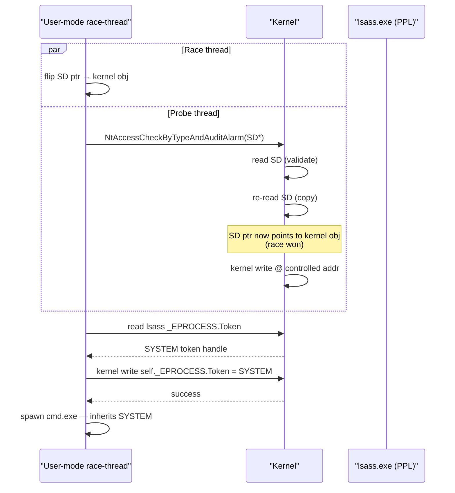

# CVE-2024-30088 — kernel TOCTOU → SYSTEM

[← privesc techniques](README.md) · [docs/index](../../index.md)

## TL;DR

`cve202430088.Run(ctx)` exploits a Windows kernel TOCTOU race in
`AuthzBasepCopyoutInternalSecurityAttributes` to swap the calling
thread's primary token with `lsass.exe`'s SYSTEM token. CVSS 7.0,
patched June 2024 (KB5039211). **Use only in authorised
engagements** — the race is non-deterministic and may BSOD on misfire.

> [!WARNING]
> Race exploits crash kernels when they misfire. The exploit retries
> until success or context cancellation. Do not run on hosts where a
> reboot is unacceptable. Always pre-flight with
> `version.CVE202430088()` to confirm the host is in the vulnerable
> build window.

## Primer

`AuthzBasepCopyoutInternalSecurityAttributes` is invoked by
`NtAccessCheckByTypeAndAuditAlarm` when the caller queries a
SECURITY_DESCRIPTOR they own. The kernel reads the descriptor,
validates it, and then re-reads to copy. Between the two reads the
attacker swaps the descriptor pointer to a kernel object — the
second read lands inside kernel space and the kernel happily writes
the operator-controlled bytes to the new target.

The write primitive is pivoted into a token swap:

1. Locate `lsass.exe`'s `_EPROCESS` and read its `Token`.
2. Use the kernel write to overwrite `_EPROCESS.Token` of the
   calling process with the SYSTEM token.
3. Subsequent thread spawns inherit SYSTEM — the elevation is
   permanent for the process lifetime.

Discovery: k0shl (Angelboy) — DEVCORE. CWE-367.

## Affected versions

| OS | Vulnerable until | Patched in |
|---|---|---|
| Windows 10 1507 → 22H2 | June 2024 patch | KB5039211 family |
| Windows 11 21H2 → 23H2 | June 2024 patch | KB5039239 / KB5039212 |
| Windows Server 2016 / 2019 / 2022 / 2022 23H2 | June 2024 patch | KB504xxxx family |

`version.CVE202430088()` returns the precise vulnerable/patched
state including the UBR cut-off.

## How it works



Implementation:

1. `Run` resolves the kernel symbols it needs via
   [`win/version`](../win/version.md) gated lookup tables (offsets
   to `_EPROCESS.Token`, `Pcb.ImageFileName`).
2. Spawns the race thread that flips the descriptor pointer in a
   tight loop.
3. Spawns the probe thread that calls
   `NtAccessCheckByTypeAndAuditAlarm` repeatedly.
4. Once a write lands the exploit reads `lsass.Token` and overwrites
   `self.Token`.
5. By default, spawns `cmd.exe` as the post-elevation command. Use
   [`RunWithExec`](#runwithexec) to override.

## API → godoc

[`pkg.go.dev/github.com/oioio-space/maldev/privesc/cve202430088`](https://pkg.go.dev/github.com/oioio-space/maldev/privesc/cve202430088) is the authoritative
reference for every exported symbol. This page teaches the
*concepts*; the godoc is the *specification*.

## Examples

### Simple — pre-flight then run

```go
import (
    "context"
    "github.com/oioio-space/maldev/privesc/cve202430088"
    "github.com/oioio-space/maldev/win/version"
)

if info, _ := version.CVE202430088(); !info.Vulnerable {
    return errors.New("host patched")
}
res, err := cve202430088.Run(context.Background())
if err != nil {
    return err
}
defer res.Spawned.Wait()
```

### Composed — custom payload spawn

```go
cfg := cve202430088.Config{
    Exec:    `C:\Users\Public\impl.exe`,
    Args:    []string{"--once", "--quiet"},
    Timeout: 60 * time.Second,
}
res, err := cve202430088.RunWithExec(context.Background(), cfg)
if err != nil {
    return err
}
log.Printf("elevated in %s, payload PID %d", res.Duration, res.Spawned.Process.Pid)
```

### Advanced — fall-through chain

```go
admin, elevated, _ := privilege.IsAdmin()
if elevated {
    return nil // already there
}
if admin {
    if err := uac.FODHelper(payload); err == nil {
        return nil
    }
    // UAC bypass blocked → fall through to kernel exploit
}
if info, _ := version.CVE202430088(); info.Vulnerable {
    _, err := cve202430088.Run(ctx)
    return err
}
return errors.New("no escalation path available")
```

## OPSEC & Detection

| Vector | Visibility | Mitigation |
|---|---|---|
| Tight `NtAccessCheckByTypeAndAuditAlarm` loop | ETW Microsoft-Windows-Threat-Intelligence | Throttle race thread; accept lower success rate |
| `_EPROCESS.Token` swap detected by snapshot diffing | EDR kernel callbacks (PsSetCreateProcessNotifyRoutineEx) | None — the swap is the goal |
| BSOD on misfire | Crash dump + 0x7E / 0x50 stop code | Pre-flight version check; abort on hardened hosts |
| Post-elev cmd.exe | Process tree (your PID parent of cmd.exe SYSTEM) | Use `RunWithExec` for in-process payload spawn |

This primitive is in vendor signature databases as of mid-2024.
Defender + ESET + Sentinel detect the race window via ETW. Best
deployed on hosts you have already determined are unmonitored.

## MITRE ATT&CK

- **T1068 (Exploitation for Privilege Escalation)** — kernel TOCTOU
- **T1134.001 (Token Impersonation/Theft)** — `_EPROCESS.Token` swap

## Limitations

- Race is non-deterministic. Default 30s timeout — increase via
  `Config.Timeout` for hardened hosts where the race window is
  shorter.
- May BSOD on misfire (kernel write to invalid address). The
  exploit guards against the most common misfires but cannot rule
  them out.
- Requires `SeChangeNotifyPrivilege` (granted to all users) and
  Windows 10 1507+ — not Win7/8.
- Patched hosts (post-June 2024) return `ErrPatched` from
  pre-flight.

## See also

- [`win/version`](../win/version.md) — `CVE202430088()` pre-flight
- [`privesc/uac`](uac.md) — non-kernel route when UAC is in play
- [`win/token`](../tokens/token-theft.md) — companion token primitives
