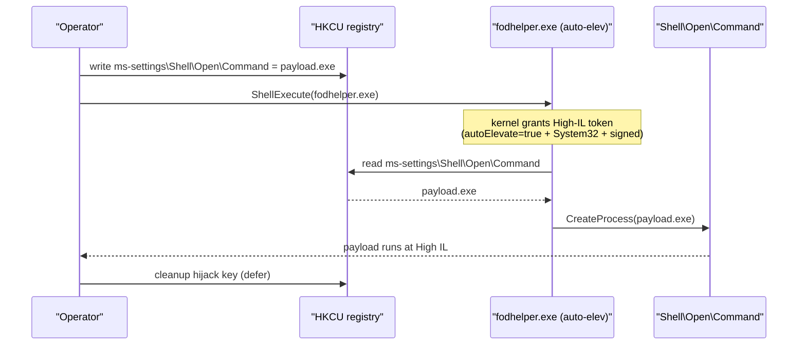

# UAC bypasses

[← privesc techniques](README.md) · [docs/index](../../index.md)

## TL;DR

Five primitives that hijack auto-elevating Windows binaries to spawn
an elevated process **without a consent prompt** when the calling
user is already in Administrators and UAC is at the "Default" level
(the OS shipping default).

| Primitive | Hijack target | Surface | Build cut-off |
|---|---|---|---|
| `uac.FODHelper(path)` | `fodhelper.exe` ms-settings\CurVer | HKCU registry | Win10 1709 → 24H2 (working as of 22H2 — vendors patch periodically) |
| `uac.SLUI(path)` | `slui.exe` exefile shell\open | HKCU registry | Win7+ |
| `uac.SilentCleanup(path)` | SilentCleanup task `windir` env | HKCU env | Win8+ |
| `uac.EventVwr(path)` | `eventvwr.exe` mscfile shell\open | HKCU registry | Win7 → 17134 |
| `uac.EventVwrLogon(...)` | `EventVwr` + alt-creds | HKCU registry + Secondary Logon | as `EventVwr` |

> [!IMPORTANT]
> All five hijack auto-elevation behaviour, so they require:
> 1. Caller already runs as a member of **Administrators** (UAC
>    downgrades elevation under "Default" but does not exist when
>    the user is not admin).
> 2. UAC level is **not "Always notify"** — that level cannot be
>    silenced.

## Primer

UAC's "Default" mode auto-elevates a small set of trusted system
binaries (those with `autoElevate=true` in their manifest *and*
located under `System32`). When such a binary launches it inherits
the user's full admin token without prompting. If that binary then
reads a registry key or environment variable from `HKCU` (or
`HKEY_CURRENT_USER` evaluated under the original user's context)
and uses it as a command path, an attacker can pre-stage that
path to point at their payload.

Each technique exploits one such delegation:

- **fodhelper.exe** reads `HKCU\Software\Classes\ms-settings\Shell\Open\Command`
  before falling back to HKLM.
- **slui.exe** reads `HKCU\Software\Classes\exefile\shell\open\command`.
- **SilentCleanup task** runs as elevated and resolves `%windir%`
  from the per-user environment.
- **eventvwr.exe** reads `HKCU\Software\Classes\mscfile\shell\open\command`.

## How it works



Common implementation skeleton (all 4 follow the same shape):

1. Open / create the hijack key under `HKCU`.
2. Set the default value to the operator's `path`.
3. Possibly set `DelegateExecute` to empty (FODHelper-style).
4. `ShellExecuteW` the auto-elevating binary.
5. Wait briefly for the spawn (Sleep ~1s — the auto-elev binary
   is a fast-cleanup target).
6. Delete the hijack key.

## API → godoc

[`pkg.go.dev/github.com/oioio-space/maldev/privesc/uac`](https://pkg.go.dev/github.com/oioio-space/maldev/privesc/uac) is the authoritative
reference for every exported symbol. This page teaches the
*concepts*; the godoc is the *specification*.

## Examples

### Simple — FODHelper

```go
if err := uac.FODHelper(`C:\Users\Public\impl.exe`); err != nil {
    return err
}
// Sleep enough for fodhelper.exe to read+launch before cleanup.
time.Sleep(2 * time.Second)
```

### Composed — pre-flight then choose

```go
import (
    "github.com/oioio-space/maldev/privesc/uac"
    "github.com/oioio-space/maldev/win/privilege"
    "github.com/oioio-space/maldev/win/version"
)

admin, elevated, _ := privilege.IsAdmin()
if elevated || !admin {
    return errors.New("not a UAC scenario")
}
v := version.Current()
switch {
case version.AtLeast(version.WINDOWS_10_22H2):
    return uac.FODHelper(payload)
case v.BuildNumber >= 7600 && v.BuildNumber < 17134:
    return uac.EventVwr(payload)
default:
    return uac.SilentCleanup(payload)
}
```

### Advanced — chain into ImpersonateThread

After the bypass spawns an elevated child, the *child* can call
[`win/impersonate.GetSystem`](../tokens/impersonation.md) for the
Medium-IL → SYSTEM jump (winlogon.exe token clone). End-to-end:
Medium → High via UAC → SYSTEM via SeDebugPrivilege.

## OPSEC & Detection

| Vector | Visibility | Mitigation |
|---|---|---|
| HKCU registry write | Sysmon ID 13 / 14 | Use `Software\Classes\<random>` key only when needed; clean fast |
| Auto-elev process tree | Sysmon ID 1 + parent-child rule | Inject into `explorer.exe` first to break the lineage |
| Hijacked binary parent of cmd | Microsoft-Windows-Security 4688 | Same as above |
| Build-windowed primitives | Vendor signatures recognise the hijack key paths | Choose primitive per `win/version` |

`fodhelper.exe → cmd.exe` is a textbook EDR rule. Real engagements
inject the elevated payload into a long-lived child (e.g.,
[`process/herpaderping`](../process/herpaderping.md)) rather than
spawning `cmd.exe` directly.

## MITRE ATT&CK

- **T1548.002 (Bypass User Account Control)**

## Limitations

- All five fail under "Always notify" UAC.
- All five fail when the user is not admin.
- HKCU key paths and DelegateExecute behaviour have shifted across
  builds. `EventVwr` is dead from Win10 17134+.
- The hijack window is narrow but non-zero — defenders snapshotting
  HKCU during incident response will see the leftover key.

## See also

- [`win/privilege`](../tokens/privilege-escalation.md) — IsAdmin / ExecAs
- [`win/version`](../win/version.md) — build gating
- [`process/herpaderping`](../process/herpaderping.md) — disposable elevated host process
- [`privesc/cve202430088`](cve202430088.md) — kernel route to SYSTEM (no UAC dependency)
