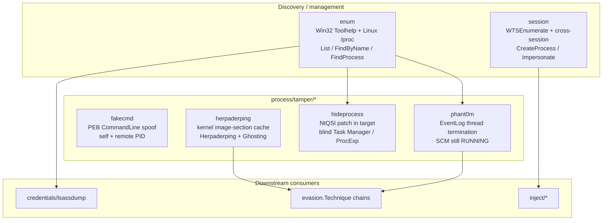

---
---

# Process techniques

[← maldev README](../../../README.md) · [docs/index](../../index.md)

The `process/*` package tree groups two concerns:

1. **Discovery / management** (`enum`, `session`) — cross-platform
   process listing and Windows session / token enumeration.
2. **Tampering** (`tamper/fakecmd`, `tamper/herpaderping`,
   `tamper/hideprocess`, `tamper/phant0m`) — Windows-only
   primitives that lie about, hide, or silence parts of the
   running-process picture.

> **Where to start (novice path):**
> 1. [`enum`](enum.md) — list processes / find by name. Foundation
>    every other operation builds on (need a PID before you do
>    anything to it).
> 2. [`session`](session.md) — Windows session/token enumeration.
>    Pair with `enum` when targeting cross-session work
>    (Run-as-User, interactive desktop access).
> 3. [`tamper/fakecmd`](fakecmd.md) — disguise YOUR command line
>    in PEB. Pairs with [`evasion/ppid-spoofing`](../evasion/ppid-spoofing.md)
>    for the parent disguise.
> 4. [`tamper/hideprocess`](hideprocess.md) — hide YOUR process
>    from Task Manager / ProcExp by patching their `NtQuerySystemInformation`.
> 5. [`tamper/herpaderping`](herpaderping.md), [`tamper/phant0m`](phant0m.md)
>    — specialised; pick when defender configuration warrants
>    (kernel image-section cache abuse vs EventLog silencing).

## Packages

| Package | Tech page | Detection | One-liner |
|---|---|---|---|
| [`process/enum`](https://pkg.go.dev/github.com/oioio-space/maldev/process/enum) | [enum.md](enum.md) | quiet | Cross-platform process list / find-by-name (Windows + Linux) |
| [`process/session`](https://pkg.go.dev/github.com/oioio-space/maldev/process/session) | [session.md](session.md) | moderate | Windows session enum + cross-session CreateProcess / Impersonate |
| [`process/tamper/fakecmd`](https://pkg.go.dev/github.com/oioio-space/maldev/process/tamper/fakecmd) | [fakecmd.md](fakecmd.md) | quiet | PEB CommandLine spoof (self + remote PID) |
| [`process/tamper/herpaderping`](https://pkg.go.dev/github.com/oioio-space/maldev/process/tamper/herpaderping) | [herpaderping.md](herpaderping.md) | moderate | Kernel image-section cache exploit (Herpaderping + Ghosting) |
| [`process/tamper/hideprocess`](https://pkg.go.dev/github.com/oioio-space/maldev/process/tamper/hideprocess) | [hideprocess.md](hideprocess.md) | moderate | Patch NtQSI in target → blind Task Manager / ProcExp |
| [`process/tamper/phant0m`](https://pkg.go.dev/github.com/oioio-space/maldev/process/tamper/phant0m) | [phant0m.md](phant0m.md) | noisy | Terminate EventLog worker threads; SCM still shows RUNNING |

## Quick decision tree

| You want to… | Use |
|---|---|
| …find a process by name (cross-platform) | [`enum.FindByName`](enum.md) |
| …enumerate Windows sessions / users | [`session.Active`](session.md) |
| …spawn under another user's token | [`session.CreateProcessOnActiveSessions`](session.md) |
| …run a callback under another user's identity briefly | [`session.ImpersonateThreadOnActiveSession`](session.md) |
| …spoof your process's command-line in user-mode triage | [`fakecmd.Spoof`](fakecmd.md) |
| …spawn a process whose disk image lies | [`herpaderping.Run` (`ModeHerpaderping` or `ModeGhosting`)](herpaderping.md) |
| …blind a single analyst tool's process listing | [`hideprocess.PatchProcessMonitor`](hideprocess.md) |
| …silence the Windows Event Log without `sc stop` | [`phant0m.Kill`](phant0m.md) |

## MITRE ATT&CK

| T-ID | Name | Packages | D3FEND counter |
|---|---|---|---|
| [T1057](https://attack.mitre.org/techniques/T1057/) | Process Discovery | `process/enum`, `process/session` | [D3-PA](https://d3fend.mitre.org/technique/d3f:ProcessAnalysis/) |
| [T1134.001](https://attack.mitre.org/techniques/T1134/001/) | Access Token Manipulation: Token Impersonation/Theft | `process/session` | [D3-USA](https://d3fend.mitre.org/technique/d3f:UserSessionAnalysis/) |
| [T1134.002](https://attack.mitre.org/techniques/T1134/002/) | Access Token Manipulation: Create Process with Token | `process/session` | [D3-PSA](https://d3fend.mitre.org/technique/d3f:ProcessSpawnAnalysis/) |
| [T1036.005](https://attack.mitre.org/techniques/T1036/005/) | Masquerading: Match Legitimate Name or Location | `process/tamper/fakecmd` | [D3-PSA](https://d3fend.mitre.org/technique/d3f:ProcessSpawnAnalysis/) |
| [T1055.013](https://attack.mitre.org/techniques/T1055/013/) | Process Doppelgänging | `process/tamper/herpaderping` | [D3-PSA](https://d3fend.mitre.org/technique/d3f:ProcessSpawnAnalysis/), [D3-FCA](https://d3fend.mitre.org/technique/d3f:FileContentAnalysis/) |
| [T1027.005](https://attack.mitre.org/techniques/T1027/005/) | Indicator Removal from Tools | `process/tamper/hideprocess`, `process/tamper/herpaderping` | [D3-SCA](https://d3fend.mitre.org/technique/d3f:SystemCallAnalysis/) |
| [T1564.001](https://attack.mitre.org/techniques/T1564/001/) | Hide Artifacts: Hidden Process | `process/tamper/hideprocess` | [D3-RAPA](https://d3fend.mitre.org/technique/d3f:RemoteAccessProcedureAnalysis/) |
| [T1562.002](https://attack.mitre.org/techniques/T1562/002/) | Impair Defenses: Disable Windows Event Logging | `process/tamper/phant0m` | [D3-RAPA](https://d3fend.mitre.org/technique/d3f:RemoteAccessProcedureAnalysis/), [D3-PA](https://d3fend.mitre.org/technique/d3f:ProcessAnalysis/) |

## Layered cover recipe

A typical "look like svchost while running implant work" stack:

1. **Spawn** via [`herpaderping`](herpaderping.md) so the
   on-disk image lies (or is gone, with `ModeGhosting`).
2. **PEB CommandLine** via [`fakecmd.Spoof`](fakecmd.md) so
   user-mode triage shows `svchost.exe -k netsvcs`.
3. **Identity** at link time via
   [`pe/masquerade/preset/svchost`](../pe/masquerade.md) so
   VERSIONINFO + manifest + icon all match.
4. **Authenticode** via
   [`pe/cert.Copy`](../pe/certificate-theft.md) so file-property
   dialogs see a Microsoft signature.
5. **Triage tools** via [`hideprocess`](hideprocess.md) so the
   first user opening Task Manager sees nothing.
6. **Logs** via [`phant0m.Kill`](phant0m.md) so EventLog
   doesn't capture lateral activity.

Each step has its own detection profile; layered, the bar
rises significantly.

## See also

- [Operator path: process tampering](../../by-role/operator.md)
- [Detection eng path: process telemetry](../../by-role/detection-eng.md)
- [`pe/masquerade`](../pe/masquerade.md) — link-time identity clone.
- [`pe/cert`](../pe/certificate-theft.md) — Authenticode graft.
- [`evasion/etw`](../evasion/etw-patching.md) — pair with
  phant0m for full logging silence.
- [`credentials/lsassdump`](../credentials/lsassdump.md) — primary
  consumer of `process/enum`.
- [`inject`](../injection/README.md) — alternative to
  `process/tamper/herpaderping` for in-process delivery.
