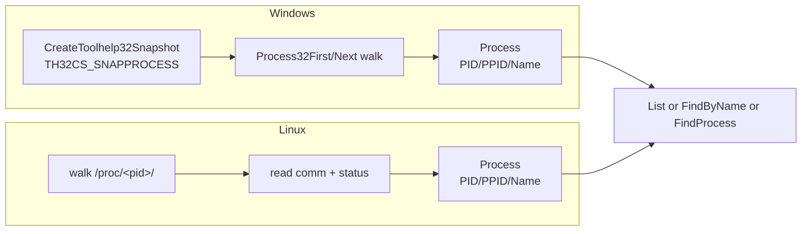

# Process enumeration

[← process index](README.md) · [docs/index](../../index.md)

## TL;DR

List or find running processes by name across Windows + Linux.
Pure Go on top of `CreateToolhelp32Snapshot` / `/proc`. Used by
`credentials/lsassdump` to find lsass, by `process/tamper/phant0m`
to find the EventLog svchost, and by every "find this process by
name" workflow that doesn't want a Windows-specific dependency.

## Primer

Process enumeration is the "hello world" of post-exploitation
discovery. Every implant eventually wants to find lsass.exe,
explorer.exe, the EventLog svchost, the user's browser. The
package wraps the platform's standard listing API and surfaces
the same `Process` struct shape on both OSes.

The technique itself is universally invisible — every Task
Manager, every `ps`, every container runtime calls these
APIs. EDRs do not flag the enumeration; they correlate it
against subsequent suspicious actions (lsass open, token
theft, process hollowing).

## How It Works



The `comm` file on Linux carries the truncated 16-byte process
name; for the full executable path use `process/session.ImagePath`
(Windows-only) or read `/proc/<pid>/exe`.

## API → godoc

[`pkg.go.dev/github.com/oioio-space/maldev/process/enum`](https://pkg.go.dev/github.com/oioio-space/maldev/process/enum) is the authoritative
reference for every exported symbol. This page teaches the
*concepts*; the godoc is the *specification*.

## Examples

### Simple — list everything

```go
import "github.com/oioio-space/maldev/process/enum"

procs, _ := enum.List()
for _, p := range procs {
    fmt.Printf("%5d %5d %s\n", p.PID, p.PPID, p.Name)
}
```

### Composed — find lsass + open it

```go
import (
    "github.com/oioio-space/maldev/credentials/lsassdump"
    "github.com/oioio-space/maldev/process/enum"
    wsyscall "github.com/oioio-space/maldev/win/syscall"
)

procs, _ := enum.FindByName("lsass.exe")
if len(procs) == 0 {
    return
}
caller := wsyscall.New(wsyscall.MethodIndirect, nil)
h, err := lsassdump.OpenLSASS(caller)
defer lsassdump.CloseLSASS(h)
```

### Advanced — predicate-based search

Find a child of explorer.exe that runs from a user-writable path
— typical pattern for finding an injection target.

```go
explPID := uint32(0)
procs, _ := enum.FindByName("explorer.exe")
if len(procs) > 0 {
    explPID = procs[0].PID
}
target, _ := enum.FindProcess(func(name string, pid, ppid uint32) bool {
    return ppid == explPID && strings.HasSuffix(name, ".exe")
})
```

See [`ExampleFindByName`](../../../process/enum/enum_example_test.go)
+ [`ExampleList`](../../../process/enum/enum_example_test.go).

## OPSEC & Detection

| Artefact | Where defenders look |
|---|---|
| `CreateToolhelp32Snapshot(TH32CS_SNAPPROCESS)` calls | Universal API — every Task Manager, AV, EDR uses it. Not a useful signal. |
| Sustained polling of process list | Behavioural EDR may flag a process that calls `Process32Next` thousands of times per second |
| Enumeration immediately followed by `OpenProcess(lsass, VM_READ)` | EDR rule correlation — credential dumping pattern |
| `/proc` walks from non-shell processes | Linux EDR rules; rare unless the implant polls aggressively |

**D3FEND counters:**

- [D3-PA](https://d3fend.mitre.org/technique/d3f:ProcessAnalysis/)
  — behavioural correlation of enumeration + subsequent
  open/inject calls.

**Hardening for the operator:**

- Enumerate once, cache, reuse — sustained polling stands out.
- Scope `FindProcess` predicates tightly so the package
  short-circuits on the first match (avoid full snapshot walks
  when you only need one PID).
- Pair with `process/session.Active` instead of full enum when
  you only need logged-in interactive sessions.

## MITRE ATT&CK

| T-ID | Name | Sub-coverage | D3FEND counter |
|---|---|---|---|
| [T1057](https://attack.mitre.org/techniques/T1057/) | Process Discovery | full — name + predicate search across Windows + Linux | D3-PA |

## Limitations

- **`Process32Next` race conditions.** Processes can exit
  between snapshot and read; Windows handles this gracefully
  but `FindProcess` may miss a process that existed at the
  start of the walk.
- **No image-path resolution.** `Process` carries name only.
  For full path use `process/session.ImagePath` (Windows) or
  read `/proc/<pid>/exe` (Linux).
- **No command-line.** PEB-based command-line surfacing is
  out of scope; use a separate ETW / WMI query when the
  command line matters.
- **Linux `comm` is truncated.** 15 chars + nul. Process names
  longer than that need `/proc/<pid>/cmdline[0]`.

## See also

- [`process/session`](session.md) — Windows-specific session +
  threads + modules + image-path enumeration.
- [`credentials/lsassdump`](../credentials/lsassdump.md) —
  primary consumer (find lsass).
- [`process/tamper/phant0m`](phant0m.md) — consumer (find
  EventLog svchost).
- [Operator path](../../by-role/operator.md).
- [Detection eng path](../../by-role/detection-eng.md).
