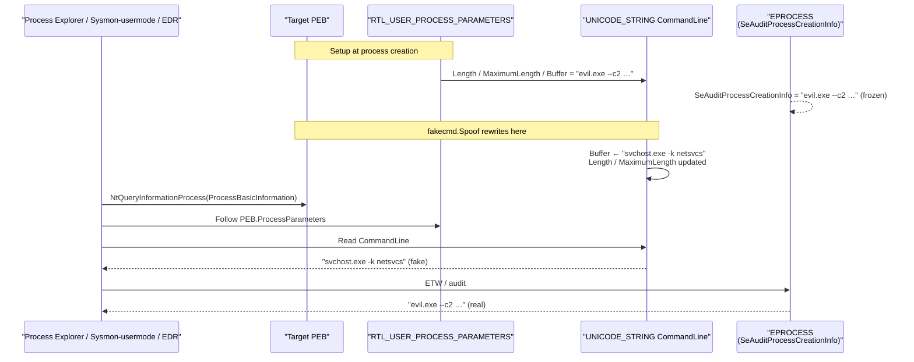

# PEB CommandLine spoof (FakeCmd)

[← process index](README.md) · [docs/index](../../index.md)

## TL;DR

Overwrite the current process's PEB `CommandLine` `UNICODE_STRING`
so process-listing tools (Task Manager, Process Explorer, `wmic`,
`Get-Process`) display a fake command-line. Self (`Spoof`) or
remote (`SpoofPID`). Kernel `EPROCESS` retains the real value so
ETW-side telemetry is not fooled.

## Primer

When a defender lists processes (Task Manager, Process Explorer,
`Get-Process | Select CommandLine`, Sysmon Event ID 1), the
command-line shown is read out of the *target process's PEB*,
not from a separate kernel record. The kernel keeps a frozen
copy in `EPROCESS.SeAuditProcessCreationInfo` captured at
process creation that user-mode cannot rewrite.

`fakecmd` overwrites the user-mode PEB field so every user-mode
reader sees a benign command-line — a beaconing implant
launched as `C:\evil.exe --c2 1.2.3.4` can present itself as
`C:\Windows\System32\svchost.exe -k netsvcs`.

This fools user-mode triage; kernel-sourced telemetry (Sysmon
ProcessCreate via ETW-Ti, `PsSetCreateProcessNotifyRoutineEx`,
Defender's MsSense, MDE) still sees the original. Pair with
[`pe/masquerade`](../pe/masquerade.md) to also clone the binary's
embedded VERSIONINFO so user-mode triage of the on-disk file
matches.

## How It Works



Layout: `PEB.ProcessParameters` (offset `+0x20` x64) →
`RTL_USER_PROCESS_PARAMETERS` → `CommandLine` `UNICODE_STRING`
at `RUPP+0x70`. Overwrite `Length`, `MaximumLength`, and
`Buffer` with the new UTF-16 string.

Self vs remote:

- `Spoof` rewrites the current process's own PEB — no privilege
  needed, instant.
- `SpoofPID` rewrites another process's PEB via
  `OpenProcess(VM_READ|VM_WRITE|VM_OPERATION|QUERY_INFORMATION)`
  + `NtQueryInformationProcess` + `NtAllocateVirtualMemory` +
  `WriteProcessMemory`. Typically requires SeDebugPrivilege.

## API → godoc

[`pkg.go.dev/github.com/oioio-space/maldev/process/tamper/fakecmd`](https://pkg.go.dev/github.com/oioio-space/maldev/process/tamper/fakecmd) is the authoritative
reference for every exported symbol. This page teaches the
*concepts*; the godoc is the *specification*.

## Examples

### Simple — self spoof

```go
import "github.com/oioio-space/maldev/process/tamper/fakecmd"

if err := fakecmd.Spoof(`C:\Windows\System32\svchost.exe -k netsvcs`, nil); err != nil {
    return
}
defer fakecmd.Restore()
```

### Composed — indirect syscall

```go
import (
    "github.com/oioio-space/maldev/process/tamper/fakecmd"
    wsyscall "github.com/oioio-space/maldev/win/syscall"
)

caller := wsyscall.New(wsyscall.MethodIndirect, wsyscall.NewHellsGate())
_ = fakecmd.Spoof(`C:\Windows\System32\svchost.exe -k netsvcs`, caller)
defer fakecmd.Restore()
```

### Advanced — PPID-spoof + child PEB rewrite

Pair PPID spoofing with PEB rewrite so user-mode triage sees
`explorer.exe → svchost.exe -k netsvcs -p -s Schedule` instead
of `cmd.exe → implant.exe --c2 …`.

```go
import (
    "os"
    "os/exec"

    "github.com/oioio-space/maldev/c2/shell"
    "github.com/oioio-space/maldev/process/tamper/fakecmd"
)

if os.Getenv("RESPAWNED") == "" {
    sp := shell.NewPPIDSpooferWithTargets([]string{"explorer.exe"})
    _ = sp.FindTargetProcess()
    attr, h, _ := sp.SysProcAttr()
    cmd := exec.Command(os.Args[0])
    cmd.Env = append(os.Environ(), "RESPAWNED=1")
    cmd.SysProcAttr = attr
    _ = cmd.Start()
    _ = h
    return
}

_ = fakecmd.Spoof(
    `C:\Windows\System32\svchost.exe -k netsvcs -p -s Schedule`,
    nil,
)
defer fakecmd.Restore()
runBeacon()
```

See [`ExampleSpoof`](../../../process/tamper/fakecmd/fakecmd_example_test.go).

## OPSEC & Detection

| Artefact | Where defenders look |
|---|---|
| User-mode PEB CommandLine | Spoofed; user-mode triage sees fake |
| Kernel `EPROCESS.SeAuditProcessCreationInfo` | **Real** — Sysmon Event 1 (kernel ETW) sees the original |
| Sysmon ProcessCreate event | Built from kernel ETW, not user-mode PEB → real value |
| `wmic process` queries | User-mode → fake |
| `tasklist /v` | User-mode → fake |
| Process Hacker / Process Explorer | User-mode → fake |
| Defender for Endpoint MsSense alerts | Kernel ETW-Ti → real |

**D3FEND counters:**

- [D3-PSA](https://d3fend.mitre.org/technique/d3f:ProcessSpawnAnalysis/)
  — kernel ETW-based lineage / command-line capture is unaffected.
- [D3-SEA](https://d3fend.mitre.org/technique/d3f:StaticExecutableAnalysis/)
  — pair with `pe/masquerade` to also fool the on-disk PE
  static-info reader.

**Hardening for the operator:**

- Pair with [`pe/masquerade`](../pe/masquerade.md) for binary
  identity match.
- Pair with PPID spoofing (`c2/shell.PPIDSpoofer`) so the
  process tree also looks plausible.
- Defer `Restore()` if the process is long-running — cached
  PEB reads after dump-and-revive can otherwise expose the
  fake.
- Don't rely on this against EDRs whose ProcessCreate
  telemetry is sourced from kernel ETW (most modern stacks).

## MITRE ATT&CK

| T-ID | Name | Sub-coverage | D3FEND counter |
|---|---|---|---|
| [T1036.005](https://attack.mitre.org/techniques/T1036/005/) | Masquerading: Match Legitimate Name or Location | partial — user-mode CommandLine only | D3-PSA |
| [T1564](https://attack.mitre.org/techniques/T1564/) | Hide Artifacts | generic | D3-SEA |

## Limitations

- **User-mode only.** Kernel ETW-Ti, Sysmon Event 1,
  `PsSetCreateProcessNotifyRoutineEx` all see the real value.
- **Cached reads.** Tools that cached the original CommandLine
  before spoofing display the original until they refresh.
- **No image-path spoof.** Spoof rewrites CommandLine, not
  `ImagePathName`. Pair with `pe/masquerade` for binary
  metadata cloning.
- **Remote spoof requires SeDebugPrivilege.** `SpoofPID` opens
  the target with `VM_WRITE` + `VM_OPERATION`.

## See also

- [`pe/masquerade`](../pe/masquerade.md) — pair to clone
  embedded VERSIONINFO + manifest.
- [`process/tamper/hideprocess`](hideprocess.md) — sibling
  user-mode tampering surface.
- [`win/syscall`](../syscalls/) — direct/indirect syscall
  caller routing.
- [Operator path](../../by-role/operator.md).
- [Detection eng path](../../by-role/detection-eng.md).
