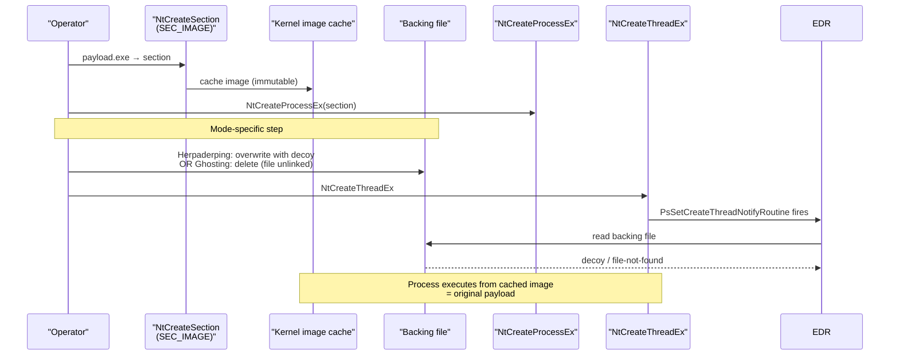

# Process Herpaderping & Ghosting

[← process index](README.md) · [docs/index](../../index.md)

## TL;DR

Exploit the kernel image-section cache so the running process
executes one PE while the file on disk reads as another (or
doesn't exist). `ModeHerpaderping` overwrites the backing file
with a decoy after the section is mapped; `ModeGhosting` deletes
the file before the process is created. EDR file-based
inspection sees the decoy / fails open. Win11 26100+ blocks
both modes (`STATUS_NOT_SUPPORTED`).

## Primer

When Windows creates a process from a PE file, the kernel maps
the image into an immutable **section object** and caches it.
The cache survives after the file handle closes — and can
survive after the file itself is overwritten or deleted. The
running process executes the cached image; downstream readers
that go back to the file see whatever's there now.

This package exploits that gap. The payload is mapped → the
file is replaced with a decoy → the thread is created. EDR /
AV security callbacks fire at thread creation (`PsSetCreateThreadNotifyRoutine`)
and file-read inside the callback returns the decoy, not the
original payload.

Two variants:

- **Herpaderping** (jxy-s, 2020) — overwrite the file with a
  decoy after mapping. Decoy can be a real signed PE (svchost,
  notepad) or random bytes.
- **Ghosting** (Gabriel Landau, 2021) — create a delete-pending
  file, map as `SEC_IMAGE`, close the handle to let the
  delete complete. The file *never exists* at the moment of
  thread creation.

Win11 24H2 / 25H2 (build ≥ 26100) blocks both modes —
`NtCreateProcessEx` returns `STATUS_NOT_SUPPORTED` on a section
backed by a tampered or deleted file. The package treats every
build ≥ 26100 as blocked out of caution; operators with
verified-working 26100 builds can drop the test skip locally.

## How It Works



The on-disk decoy can be a signed system binary so authenticode
verification at the EDR-callback time succeeds against the wrong
PE.

## API → godoc

[`pkg.go.dev/github.com/oioio-space/maldev/process/tamper/herpaderping`](https://pkg.go.dev/github.com/oioio-space/maldev/process/tamper/herpaderping) is the authoritative
reference for every exported symbol. This page teaches the
*concepts*; the godoc is the *specification*.

## Examples

### Simple — Herpaderping with svchost decoy

```go
import "github.com/oioio-space/maldev/process/tamper/herpaderping"

_ = herpaderping.Run(herpaderping.Config{
    PayloadPath: "implant.exe",
    TargetPath:  `C:\Windows\Temp\legit.exe`,
    DecoyPath:   `C:\Windows\System32\svchost.exe`,
})
```

### Composed — Ghosting (recommended for win10/11 ≤ 22H2)

No on-disk artefact at thread-creation time.

```go
_ = herpaderping.Run(herpaderping.Config{
    Mode:        herpaderping.ModeGhosting,
    PayloadPath: "implant.exe",
    TargetPath:  `C:\Windows\Temp\nohost.exe`,
})
```

### Advanced — composed with AMSI patch

Pair the spawn with an in-process AMSI bypass via the
`evasion.Technique` chain.

```go
import (
    "github.com/oioio-space/maldev/evasion"
    "github.com/oioio-space/maldev/evasion/amsi"
    "github.com/oioio-space/maldev/process/tamper/herpaderping"
)

techs := []evasion.Technique{
    amsi.ScanBufferPatch(),
    herpaderping.Technique(herpaderping.Config{
        PayloadPath: "implant.exe",
        TargetPath:  `C:\Temp\legit.exe`,
        DecoyPath:   `C:\Windows\System32\svchost.exe`,
    }),
}
_ = evasion.ApplyAll(techs, nil)
```

### Auto-temp + random decoy

When the operator doesn't have a specific decoy in mind:

```go
_ = herpaderping.Run(herpaderping.Config{
    PayloadPath: "implant.exe",
    // TargetPath auto via os.CreateTemp
    // DecoyPath omitted — target overwritten with random bytes
})
```

See [`ExampleRun`](../../../process/tamper/herpaderping/herpaderping_example_test.go)
+ [`ExampleRun_ghosting`](../../../process/tamper/herpaderping/herpaderping_example_test.go).

## OPSEC & Detection

| Artefact | Where defenders look |
|---|---|
| Sysmon Event ID 25 (ProcessTampering) | Primary detection — kernel detects mapped-image vs file mismatch |
| `NtCreateSection(SEC_IMAGE)` followed by `WriteFile` on same handle before `NtCreateThreadEx` | Advanced EDR rule (Elastic, CrowdStrike) |
| Process whose authenticode resolves to decoy but memory layout is a different PE | Mature EDR (Defender for Endpoint) cross-validation |
| `Mode=Ghosting`: file delete-pending then closed before NtCreateProcessEx | ProcessTampering is the primary signal — 26100+ kernel rejects |
| Process whose `PEB.ProcessParameters.ImagePathName` points at a path that vanishes / contains decoy | Live-system triage |

**D3FEND counters:**

- [D3-PSA](https://d3fend.mitre.org/technique/d3f:ProcessSpawnAnalysis/)
  — Sysmon Event 25 + lineage.
- [D3-FCA](https://d3fend.mitre.org/technique/d3f:FileContentAnalysis/)
  — disk-vs-memory image divergence.

**Hardening for the operator:**

- Verify the target build before running — `26100+` returns
  `STATUS_NOT_SUPPORTED` for both modes.
- For `ModeHerpaderping`, pick a signed donor decoy whose
  identity matches a plausible "what runs at this path" story.
- For `ModeGhosting`, the lack of an on-disk artefact at
  thread-creation is a stronger primitive — but Sysmon Event
  25 fires equally.
- Pair with [`pe/strip`](../pe/strip-sanitize.md) on the
  payload so memory analysis at runtime doesn't immediately
  reveal Go-toolchain markers.
- Avoid hosts running EDRs that ship Sysmon Event 25
  by default (Defender for Endpoint, Elastic, S1).

## MITRE ATT&CK

| T-ID | Name | Sub-coverage | D3FEND counter |
|---|---|---|---|
| [T1055.013](https://attack.mitre.org/techniques/T1055/013/) | Process Doppelgänging | partial — same family of section-cache exploits | D3-PSA, D3-FCA |
| [T1055](https://attack.mitre.org/techniques/T1055/) | Process Injection | full — defense evasion via process tampering | D3-PSA |
| [T1027.005](https://attack.mitre.org/techniques/T1027/005/) | Indicator Removal from Tools | partial — file-on-disk decoy defeats authenticode-of-disk-image | D3-FCA |

## Limitations

- **Win11 26100+ blocked.** Both modes return `STATUS_NOT_SUPPORTED`
  on Win11 24H2 / 25H2.
- **File-write requirement (Herpaderping).** Target path must
  be writable; read-only media or files locked by another
  process can't be overwritten.
- **`PEB.ProcessParameters.ImagePathName`.** Points at the
  target file, which now contains the decoy / is gone — live
  triage that reads the PE *via the path* sees the decoy /
  fails. In-memory PE reconstruction (Volatility, dumpit)
  still recovers the original.
- **Win10 minimum.** `NtCreateProcessEx` semantics differ on
  older versions.
- **No 32-bit support.** x64 only.

## References

- jxy-s — original Herpaderping research:
  https://jxy-s.github.io/herpaderping/
- Gabriel Landau — Process Ghosting:
  https://www.elastic.co/blog/process-ghosting-a-new-executable-image-tampering-attack
- hasherezade (Jan 2025) — Ghosting on early-26100 builds.

## See also

- [`inject`](../injection/README.md) — alternative for in-process
  payload delivery (no fresh process).
- [`process/tamper/fakecmd`](fakecmd.md) — pair to spoof the
  spawned process's PEB CommandLine.
- [`pe/strip`](../pe/strip-sanitize.md) — scrub the payload
  before mapping.
- [`evasion/amsi`](../evasion/amsi-bypass.md) — pair via
  `evasion.Technique` chain for in-process AMSI bypass.
- [Operator path](../../by-role/operator.md).
- [Detection eng path](../../by-role/detection-eng.md).
