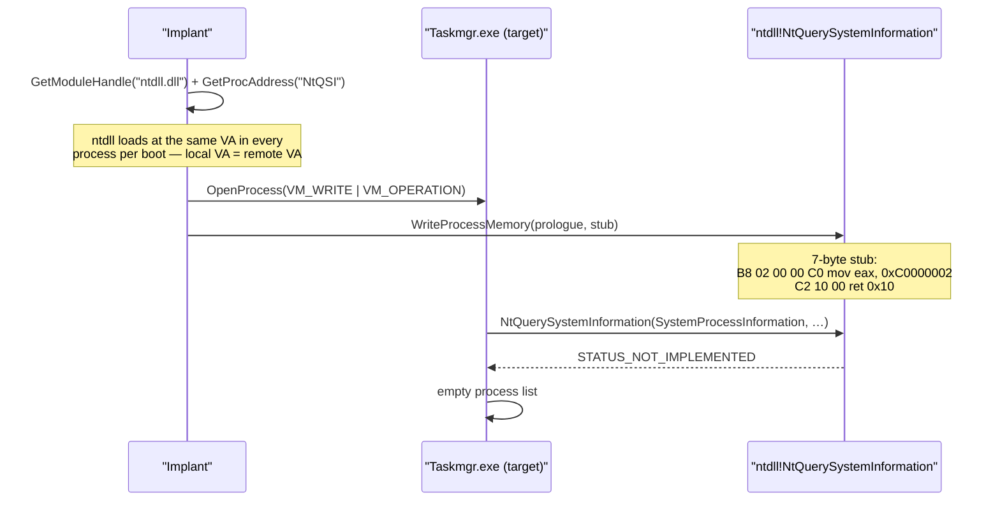

# Hide processes from Task Manager (NtQSI patch)

[← process index](README.md) · [docs/index](../../index.md)

## TL;DR

Patch `NtQuerySystemInformation` in a target process so it
returns `STATUS_NOT_IMPLEMENTED`. The target's process listing
becomes empty — Task Manager, Process Explorer, ProcessHacker,
`Get-Process` running inside that process all show nothing.
Other processes (EDR agents, kernel telemetry) are unaffected.

## Primer

Process-listing tools all ultimately call
`NtQuerySystemInformation(SystemProcessInformation, …)` to ask
the kernel for the running-process snapshot. `hideprocess`
doesn't hide processes from the *kernel* — it goes into a
specific user-mode tool's address space and patches that
tool's `NtQuerySystemInformation` prologue so the syscall
never happens. The function returns `STATUS_NOT_IMPLEMENTED`
immediately; the tool sees an empty list.

This is *blinding the analyst's tool*, not hiding the target.
Defenders running an EDR agent that does its own enumeration
from a separate, un-patched process see everything normally;
kernel-sourced telemetry (Sysmon, Microsoft-Windows-Threat-Intelligence
ETW, MsSense) is unaffected.

## How It Works



Why it works:

- On Win 8+, `ntdll.dll` is loaded at the same VA in every
  process per boot (base randomised once via
  `KUSER_SHARED_DATA`), so the implant resolves
  `NtQuerySystemInformation` locally and the VA is identical
  in the target.
- The stub returns `0xC0000002` = `STATUS_NOT_IMPLEMENTED`.
  The caller's error path typically falls back to an empty
  result set.
- Only the patched process is affected — kernel telemetry
  doesn't go through user-mode `NtQuerySystemInformation`.

### Coverage matrix

| Enumeration path | Tool examples | Bottoms out in | Covered by |
|---|---|---|---|
| `NtQuerySystemInformation(SystemProcessInformation)` | Task Manager (default), `tasklist.exe`, ProcessHacker default view, Sysinternals `pslist`, native PEB walks | `ntdll!NtQuerySystemInformation` → SSDT | `PatchProcessMonitor` |
| `EnumProcesses` (psapi) | Older `tasklist /v`, anti-malware product enumeration, many .NET `Process.GetProcesses()` paths | `kernel32!K32EnumProcesses` (psapi forwarder) → `NtQuerySystemInformation` | `PatchEnumProcesses` |
| Toolhelp32 (`CreateToolhelp32Snapshot` + `Process32{First,Next}W`) | Many open-source enumerators, debug tooling, classic VB/Delphi apps | `kernel32!Process32FirstW` / `Process32NextW` → `NtQuerySystemInformation` | `PatchToolhelp` |
| WMI `SELECT * FROM Win32_Process` | `Get-WmiObject`, `Get-CimInstance`, COM clients | `wmiprvse.exe` (separate process) → `cimwin32!QueryProcesses` → `NtQuerySystemInformation` | **Not covered** — requires a separate injection into `wmiprvse.exe`. See Limitations. |
| Kernel-source enumeration | EDR drivers, Sysmon Event ID 1, ETW Threat-Intelligence | kernel `PsQuerySystemInformation` directly, or `Pcw*` performance counters | **Not covered** — user-mode patch is invisible to ring-0. |

The bottom two rows aren't accidents — they are fundamental
boundaries. `PatchAll` covers everything that flows through
the user-mode ntdll surface in the patched process; anything
that crosses into another process or into the kernel is out
of reach by design.

## API → godoc

[`pkg.go.dev/github.com/oioio-space/maldev/process/tamper/hideprocess`](https://pkg.go.dev/github.com/oioio-space/maldev/process/tamper/hideprocess) is the authoritative
reference for every exported symbol. This page teaches the
*concepts*; the godoc is the *specification*.

## Examples

### Simple — blind a known PID

```go
import "github.com/oioio-space/maldev/process/tamper/hideprocess"

const taskmgrPID = 1234
_ = hideprocess.PatchProcessMonitor(taskmgrPID, nil)
```

### Composed — sweep by name

Blind every running analyst tool found via
[`process/enum`](enum.md).

```go
import (
    "github.com/oioio-space/maldev/process/enum"
    "github.com/oioio-space/maldev/process/tamper/hideprocess"
)

procs, _ := enum.List()
for _, p := range procs {
    switch p.Name {
    case "Taskmgr.exe", "procexp.exe", "procexp64.exe", "ProcessHacker.exe":
        _ = hideprocess.PatchProcessMonitor(int(p.PID), nil)
    }
}
```

### Advanced — watch + auto-blind on launch

Poll for analyst-tool launches and patch each one as it
appears. Useful as a long-running implant component on a
multi-user host.

```go
import (
    "time"

    "github.com/oioio-space/maldev/process/enum"
    "github.com/oioio-space/maldev/process/tamper/hideprocess"
)

func watch() {
    targets := map[string]bool{
        "Taskmgr.exe":      true,
        "procexp.exe":      true,
        "procexp64.exe":    true,
        "ProcessHacker.exe": true,
    }
    blinded := map[uint32]bool{}
    for {
        procs, err := enum.List()
        if err == nil {
            for _, p := range procs {
                if !targets[p.Name] || blinded[p.PID] {
                    continue
                }
                if err := hideprocess.PatchProcessMonitor(int(p.PID), nil); err == nil {
                    blinded[p.PID] = true
                }
            }
        }
        time.Sleep(1 * time.Second)
    }
}
```

See [`ExamplePatchProcessMonitor`](../../../process/tamper/hideprocess/hideprocess_example_test.go).

## OPSEC & Detection

| Artefact | Where defenders look |
|---|---|
| `WriteProcessMemory` against ntdll `.text` of an analyst tool | EDR cross-process write telemetry — high-fidelity if the tool is monitored |
| `OpenProcess(VM_WRITE)` against `Taskmgr.exe` / `procexp.exe` | Sysmon Event 10 (ProcessAccess) with VM_WRITE access mask |
| `.text` integrity check on ntdll inside the target | Some EDRs hash the prologue periodically — stub bytes diverge from canonical |
| Behavioural correlation: EDR sees activity, Task Manager doesn't | Mature SOC tells, but only with proactive hunt |
| Kernel telemetry unaffected | EDR sees normal process activity from its own un-patched process |

**D3FEND counters:**

- [D3-RAPA](https://d3fend.mitre.org/technique/d3f:RemoteAccessProcedureAnalysis/)
  — cross-process write telemetry.
- [D3-SCA](https://d3fend.mitre.org/technique/d3f:SystemCallAnalysis/)
  — kernel-side enumeration is unaffected.

**Hardening for the operator:**

- Use indirect syscalls via `wsyscall.Caller` so the cross-process
  write doesn't go through hooked `WriteProcessMemory`.
- Patch all candidate tools at once; selective patching leaves
  some tooling fully functional.
- The patch does not persist across the target's process
  restart — pair with a watch loop that re-patches on relaunch.
- Don't use this on hosts where EDRs hash ntdll periodically
  (Microsoft Defender does not by default; Elastic / S1 / CS
  vary).

## MITRE ATT&CK

| T-ID | Name | Sub-coverage | D3FEND counter |
|---|---|---|---|
| [T1564.001](https://attack.mitre.org/techniques/T1564/001/) | Hide Artifacts: Hidden Process | full — user-mode tooling blinded | D3-RAPA |
| [T1027.005](https://attack.mitre.org/techniques/T1027/005/) | Indicator Removal from Tools | partial — neutralises local triage tools | D3-SCA |

## Limitations

- **User-mode only.** Kernel-sourced enumeration sees
  everything.
- **Per-process patch.** Patches are not persistent across
  target restart; tool relaunch returns to clean ntdll.
- **Other processes unaffected.** EDR agents in their own
  process see the full process list normally.
- **Requires `PROCESS_VM_WRITE`.** SeDebugPrivilege or
  ownership of the target.
- **`.text` integrity check defeats this.** Rare in
  production EDRs but trivially detectable when present.
- **WMI `Win32_Process` not covered.** Clients querying
  `SELECT * FROM Win32_Process` route through the WMI provider
  host (`wmiprvse.exe`) which loads `cimwin32.dll`. Patching
  that path requires injecting into a different process from
  the one running the patches; out of scope for the in-process
  tamper API. Block `wmiprvse.exe` enumeration externally
  (firewall / DACL on the WMI namespace) if WMI is in scope.
- **`PatchAll` covers the three Win32 enumeration paths most
  defenders use** (NtQuerySystemInformation, K32EnumProcesses,
  Toolhelp32). Other ntdll exports that re-implement
  enumeration (e.g., `NtQuerySystemInformationEx` introduced
  in Win10 RS5) are not patched; verify against your target
  monitoring stack.

## See also

- [`process/enum`](enum.md) — discovery of patch targets.
- [`process/tamper/fakecmd`](fakecmd.md) — sibling user-mode
  tampering surface.
- [`evasion/unhook`](../evasion/ntdll-unhooking.md) — sibling
  ntdll patching surface (in this case to *un*-patch).
- [`win/syscall`](../syscalls/) — indirect syscall caller for
  the cross-process write.
- [Operator path](../../by-role/operator.md).
- [Detection eng path](../../by-role/detection-eng.md).
