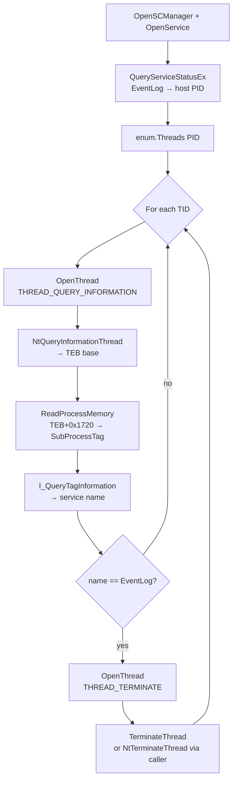

# Phant0m — EventLog thread termination

[← process index](README.md) · [docs/index](../../index.md)

## TL;DR

Terminate the worker threads of the Windows EventLog service
inside its hosting `svchost.exe`. The service stays "Running"
in SCM (no `4697` "service stopped" event), but no new entries
are written. Per-thread service-tag validation
(`I_QueryTagInformation`) ensures only EventLog threads die —
co-hosted services in the same svchost survive. Requires
`SeDebugPrivilege`. Loud once a defender notices the gap.

## Primer

Windows logs almost everything an investigator wants — logons,
service installs, scheduled tasks, PowerShell ScriptBlock,
Sysmon events — into the Windows Event Log. The naive way to
silence it (`sc stop EventLog`) is itself logged: SCM emits a
"service stopped" event before the kill takes effect.

Phant0m goes around it. The EventLog service is a set of
worker threads inside a shared `svchost.exe` host. Identify
that host, find the threads tagged as EventLog workers, and
terminate them individually with `TerminateThread`. SCM still
reports `RUNNING`; the *process* is alive; only the workers
are dead. Subsequent `ReportEvent` / `EvtReportEvent` calls
queue but never persist.

This technique is loud once detected — defenders watching for
EventLog gaps trip on the silence — but the kill itself
generates no service-stop signal.

## How It Works



Service-tag validation uses `I_QueryTagInformation` (advapi32),
an undocumented-but-stable API used by Task Manager to show
service names per thread. The SubProcessTag is a 32-bit value
stored at offset `0x1720` in the x64 TEB. If the API is
absent (very old systems), the package falls back to
terminating every thread in the EventLog PID.

## API → godoc

[`pkg.go.dev/github.com/oioio-space/maldev/process/tamper/phant0m`](https://pkg.go.dev/github.com/oioio-space/maldev/process/tamper/phant0m) is the authoritative
reference for every exported symbol. This page teaches the
*concepts*; the godoc is the *specification*.

## Examples

### Simple — direct kill

```go
import "github.com/oioio-space/maldev/process/tamper/phant0m"

if err := phant0m.Kill(nil); err != nil {
    return
}
```

### Composed — indirect syscall

```go
import (
    "github.com/oioio-space/maldev/process/tamper/phant0m"
    wsyscall "github.com/oioio-space/maldev/win/syscall"
)

caller := wsyscall.New(wsyscall.MethodIndirect, wsyscall.NewHellsGate())
_ = phant0m.Kill(caller)
```

### Advanced — token theft + Heartbeat ticker

Steal a SYSTEM token to obtain `SeDebugPrivilege`, silence the
event log, then re-kill on a built-in ticker so SCM/WMI
re-spawns of the EventLog workers don't undo the kill.

```go
import (
    "context"
    "log"
    "time"

    "github.com/oioio-space/maldev/process/tamper/phant0m"
    wsyscall "github.com/oioio-space/maldev/win/syscall"
    "github.com/oioio-space/maldev/win/token"
)

tok, _ := token.StealByName("lsass.exe")
defer tok.Close()
_ = tok.EnablePrivilege("SeDebugPrivilege")

caller := wsyscall.New(wsyscall.MethodIndirect, wsyscall.NewHellsGate())

ctx, cancel := context.WithCancel(context.Background())
defer cancel() // stop the heartbeat at scope exit

go func() {
    if err := phant0m.Heartbeat(ctx, 5*time.Second, caller); err != nil &&
        !errors.Is(err, context.Canceled) {
        log.Printf("phant0m heartbeat: %v", err)
    }
}()

// ... noisy work runs here, EventLog stays silent ...
```

`Heartbeat` returns the first `Kill` error synchronously, so the
goroutine bails immediately if the initial silencing fails. After
that, transient `Kill` errors are silently retried — only the
context cancellation surfaces as a final return.

See [`ExampleKill`](../../../process/tamper/phant0m/phant0m_example_test.go).

## OPSEC & Detection

| Artefact | Where defenders look |
|---|---|
| `OpenThread(THREAD_TERMINATE)` against svchost.exe | Sysmon Event 10 (ProcessAccess) — high-fidelity rule when target is svchost hosting EventLog |
| `TerminateThread` / `NtTerminateThread` from non-svchost lineage | EDR API telemetry — Defender, MDE, S1 ship this |
| EventLog gap | SOC heartbeat / SIEM correlation: "no events from host X for N minutes" |
| EventLog service status `RUNNING` with zero live threads | Sysmon Event 8 (CreateRemoteThread inverse) — defender can poll thread count |
| SACL auditing on svchost.exe | Enterprise SOC may enable; logs the THREAD_TERMINATE open |
| Subsequent log writes failing silently | Defender for Endpoint MsSense detects |

**D3FEND counters:**

- [D3-RAPA](https://d3fend.mitre.org/technique/d3f:RemoteAccessProcedureAnalysis/)
  — cross-process thread-termination telemetry.
- [D3-PA](https://d3fend.mitre.org/technique/d3f:ProcessAnalysis/)
  — service-host thread-count anomaly.

**Hardening for the operator:**

- Use indirect syscalls via `wsyscall.Caller` so the
  thread-termination doesn't go through hooked WinAPI.
- Re-kill on a ticker — SCM may restart the workers on
  heartbeat checks.
- Pair with [`evasion/etw`](../evasion/etw-patching.md) to
  also blind ETW providers; phant0m only kills the EventLog
  service, not ETW consumers.
- Don't use this on hosts where EventLog forwarding is
  enterprise-monitored — the gap is itself the detection.
- The `I_QueryTagInformation` fallback (kill all threads in
  PID) breaks co-hosted services — only an issue on hosts
  where multiple non-EventLog services share that svchost
  group.

## MITRE ATT&CK

| T-ID | Name | Sub-coverage | D3FEND counter |
|---|---|---|---|
| [T1562.002](https://attack.mitre.org/techniques/T1562/002/) | Impair Defenses: Disable Windows Event Logging | full — service-stop-free silencing | D3-RAPA, D3-PA |

## Limitations

- **Loud on detection.** EventLog gaps are themselves a
  high-fidelity signal in mature SOCs.
- **`SeDebugPrivilege` required.** Implies SYSTEM or elevated
  admin context.
- **x64 only.** TEB offset `0x1720` is x64-specific.
- **SCM heartbeat re-spawns workers.** Use `Heartbeat(ctx,
  interval, caller)` to ticker-kill the workers as fast as SCM
  re-spawns them. The first Kill is synchronous (returns its
  error); subsequent Kills run on the ticker until ctx
  cancellation. Without the heartbeat, the silence window
  collapses within seconds.
- **Per-thread fallback.** Without `I_QueryTagInformation`,
  the package terminates every thread in the EventLog PID —
  breaks co-hosted services.
- **No persistence.** Reboot restores the EventLog service
  with fresh threads. Pair with persistence to re-arm.

## See also

- [`evasion/etw`](../evasion/etw-patching.md) — sibling
  ETW silencing surface (per-process).
- [`win/token`](../syscalls/) — token theft for
  `SeDebugPrivilege`.
- [`win/syscall`](../syscalls/) — indirect syscall caller for
  `NtTerminateThread`.
- [`process/enum`](enum.md) — sibling discovery helper.
- [Operator path](../../by-role/operator.md).
- [Detection eng path](../../by-role/detection-eng.md).
